# vLLM 数据并行架构详解

> AsyncLLM: OpenAI 兼容 API 服务器的完整调用链与管理体系

---

## 目录

- [1. 架构概览](#1-架构概览)
- [2. 完整调用链](#2-完整调用链)
  - [2.1 六层架构图](#21-六层架构图)
  - [2.2 调用流程详解](#22-调用流程详解)
  - [2.3 调用流程精华版](#23-调用流程精华版)
  - [2.4 Ray 模式架构](#24-ray-模式架构)
- [3. 核心模块详解](#3-核心模块详解)
- [4. 多 DP 架构流程](#4-多-dp-架构流程)
- [5. 关键代码位置](#5-关键代码位置)
- [6. 总结](#6-总结)

---

## 1. 架构概览

vLLM 的 **AsyncLLM** 是专为 OpenAI 兼容 API 服务器设计的异步推理引擎，支持**流式输出**和**弹性扩展**。数据并行（Data Parallel, DP）架构采用**多进程 + 协调器**的模式，每个 DP rank 运行在独立的进程中，通过中央协调器进行状态同步和负载均衡。

### AsyncLLM 核心特性

| 特性 | 说明 |
|------|------|
| **异步流式输出** | `AsyncGenerator[RequestOutput]` 实现 OpenAI 兼容的 SSE 流式 API |
| **弹性扩展** | `scale_elastic_ep()` 支持运行时动态调整 DP 数量 |
| **多实例支持** | `client_count` + `client_index` 支持多个 API 服务器实例 |
| **暂停/恢复** | 支持模型权重更新时的暂停/恢复机制 |
| **后台输出处理** | `output_handler` 持续拉取输出并推送到请求队列 |

### 架构设计原则

| 原则 | 说明 |
|------|------|
| **独立进程** | 每个 DP rank 运行在独立的 Python 进程中 |
| **独立内存** | 每个 DP 有独立的 Scheduler、Executor 和 KVCache |
| **集中协调** | DPCoordinator 负责状态同步和负载均衡决策 |
| **底层通信** | PyTorch DP Process Group 处理 all-reduce 等通信原语 |
| **异步架构** | 基于 asyncio 的非阻塞 I/O，支持高并发场景 |

---

## 2. 完整调用链

### 2.1 六层架构图

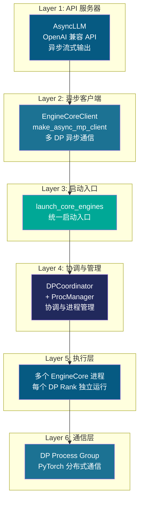

### 2.2 调用流程详解

```
┌─────────────────────────────────────────────────────────────────────────┐
│                          用户 API 请求                                  │
│                    (OpenAI 兼容接口 / 流式输出)                          │
└────────────────────────────┬────────────────────────────────────────────┘
                             │
                             ▼
┌─────────────────────────────────────────────────────────────────────────┐
│  1️⃣ AsyncLLM                                                         │
│  • 位置: vllm/v1/engine/async_llm.py (54-867行)                       │
│  • 职责: OpenAI 兼容 API 服务器，异步流式输出                           │
│  • 核心方法:                                                          │
│      - generate(): AsyncGenerator[RequestOutput] - 流式生成           │
│      - encode(): AsyncGenerator[PoolingRequestOutput] - 编码           │
│      - add_request(): 添加请求到异步队列                               │
│      - abort(): 中止请求                                              │
│      - scale_elastic_ep(): 弹性扩展 DP 数量                          │
│  • 初始化: 创建 EngineCoreClient (异步多进程客户端)                    │
│      self.engine_core = EngineCoreClient.make_async_mp_client(...)     │
│  • 背景任务: output_handler 持续拉取输出并推送到请求队列               │
└────────────────────────────┬────────────────────────────────────────────┘
                             │
                             ▼
┌─────────────────────────────────────────────────────────────────────────┐
│  2️⃣ EngineCoreClient (make_async_mp_client)                            │
│  • 位置: vllm/v1/engine/core_client.py (98-121行)                       │
│  • 职责: 异步客户端抽象，负责与多个 EngineCore 通信                      │
│  • 根据配置选择客户端类型:                                             │
│      if dp_size > 1:                                                   │
│          if external_lb:                                              │
│              return DPAsyncMPClient(...)  # 外部负载均衡               │
│          else:                                                         │
│              return DPLBAsyncMPClient(...) # 内置负载均衡               │
│      else:                                                             │
│          return AsyncMPClient(...)      # 单 DP 客户端                  │
│  • 异步方法: add_request_async(), abort_requests_async() 等            │
└────────────────────────────┬────────────────────────────────────────────┘
                             │
                             ▼
┌─────────────────────────────────────────────────────────────────────────┐
│  3️⃣ launch_core_engines()                                             │
│  • 位置: vllm/v1/engine/utils.py (759-912行)                           │
│  • 职责: 统一的启动入口，根据配置启动相应的管理模块                     │
│  • 决策逻辑:                                                           │
│      if dp_size > 1:                                                   │
│          coordinator = DPCoordinator(parallel_config)                  │
│          if use_ray:                                                   │
│              manager = CoreEngineActorManager(...)                     │
│          else:                                                         │
│              manager = CoreEngineProcManager(...)                      │
└────────────────────────────┬────────────────────────────────────────────┘
                             │
              ┌──────────────┴──────────────┐
              ▼                             ▼
┌─────────────────────────┐     ┌──────────────────────────┐
│  4️⃣ DPCoordinator       │     │  4️⃣ CoreEngineProcManager │
│  • coordinator.py       │     │  • utils.py (81-227行)   │
│  • 统计收集             │     │  • 创建 DP 进程          │
│  • Wave 状态管理        │     │  • 进程生命周期管理      │
│  • 负载均衡信息发布     │     │  • 握手协调              │
└──────────┬──────────────┘     └─────────────┬────────────┘
           │                                  │
           └──────────────┬───────────────────┘
                          │
                          ▼
┌─────────────────────────────────────────────────────────────────────────┐
│  5️⃣ EngineCore 核心引擎                                               │
│  • 位置: vllm/v1/engine/core.py (76-586行)                             │
│  • 每个 DP Rank 独立运行:                                               │
│      - EngineCoreProc (DP=1)                                           │
│      - DPEngineCoreProc (DP>1, 多进程模式)                             │
│      - DPEngineCoreActor (DP>1, Ray Actor 模式)                        │
│  • 核心组件: Scheduler, Executor, KVCacheManager                       │
│  • 主循环: run_busy_loop() 持续调度和执行                               │
└────────────────────────────┬────────────────────────────────────────────┘
                             │
                             ▼
┌─────────────────────────────────────────────────────────────────────────┐
│  5.1️⃣ Scheduler 调度器                                                │
│  • 位置: vllm/v1/core/sched/scheduler.py (59-800行)                    │
│  • 职责: 请求调度、资源分配、优先级管理                                  │
│  • 核心方法:                                                          │
│      - schedule(): 主调度方法，生成 SchedulerOutput                    │
│      - add_request(): 添加新请求到等待队列                             │
│      - update_from_output(): 根据模型输出更新请求状态                  │
│  • 输出: SchedulerOutput (包含新请求、缓存请求、抢占请求等)            │
│                                                                           │
│  ┌───────────────────────────────────────────────────────────────────┐  │
│  │ Scheduler 核心组件:                                              │  │
│  │ • RequestQueue: 等待队列 (支持多种调度策略)                      │  │
│  │ • KVCacheManager: KV 缓存块管理                                   │  │
│  │ • EncoderCacheManager: 编码器缓存管理                             │  │
│  │ • KVConnector: 跨节点 KV 传输 (可选)                              │  │
│  │ • EventPublisher: KV 事件发布 (可选)                              │  │
│  └───────────────────────────────────────────────────────────────────┘  │
│                                                                           │
│  调度策略:                                                                │
│  • fcfs (First-Come-First-Served): 先到先服务                           │
│  • priority: 基于优先级调度                                              │
│  • constant_priority: 常量优先级调度                                     │
└────────────────────────────┬────────────────────────────────────────────┘
                             │
                             ▼
┌─────────────────────────────────────────────────────────────────────────┐
│  5.2️⃣ Executor 执行器                                                   │
│  • 位置: vllm/v1/executor/abstract.py (35-200行)                        │
│  • 实现: MultiprocExecutor / RayDistributedExecutor / UniProcExecutor   │
│  • 职责: 管理 Worker 进程，执行模型推理                                    │
│  • 核心方法:                                                             │
│      - execute_model(): 执行模型前向传播                                  │
│      - collective_rpc(): 在所有 Worker 上执行 RPC                         │
│      - initialize_from_config(): 初始化 KV Cache                         │
│                                                                         │
│  ┌───────────────────────────────────────────────────────────────────┐  │
│  │ Executor 管理的 Workers:                                         │  │
│  │ • Worker (worker_base.py): Worker 基类                            │  │
│  │   └─ GPUWorker: GPU Worker 实现                                   │  │
│  │      └─ GPUModelRunner: 模型执行核心                              │  │
│  └───────────────────────────────────────────────────────────────────┘  │
└────────────────────────────┬────────────────────────────────────────────┘
                             │
                             ▼
┌─────────────────────────────────────────────────────────────────────────┐
│  5.3️⃣ GPUModelRunner 模型运行器                                          │
│  • 位置: vllm/v1/worker/gpu/model_runner.py (67-1000行)                  │
│  • 职责: 执行模型前向传播、采样、CUDA Graph 优化                            │
│  • 核心方法:                                                             │
│      - execute_model(): 执行模型推理                                     │
│      - prepare_inputs(): 准备模型输入                                    │
│      - sample(): 采样生成 token                                          │
│      - load_model(): 加载模型权重                                        │
│                                                                           │
│  ┌───────────────────────────────────────────────────────────────────┐  │
│  │ GPUModelRunner 核心组件:                                          │  │
│  │ • InputBuffers: 输入数据缓冲 (input_ids, positions, seq_lens)    │  │
│  │ • RequestState: 请求状态管理                                       │  │
│  │ • BlockTables: KV Cache 块表管理                                   │  │
│  │ • Sampler: 采样器 (greedy, beam, sampling)                        │  │
│  │ • CudaGraphManager: CUDA Graph 管理                               │  │
│  │ • AttentionBackend: 注意力后端 (FA2, FA3, FlashInfer, etc.)      │  │
│  │ • Speculator: 推测解码模型 (可选)                                 │  │
│  └───────────────────────────────────────────────────────────────────┘  │
│                                                                           │
│  执行流程:                                                                │
│  1. prepare_inputs(): 准备 input_ids, positions, attn_metadata         │
│  2. model_forward(): 模型前向传播获取 hidden_states                      │
│  3. sample(): 从 hidden_states 采样生成 token                           │
│  4. return ModelRunnerOutput: 返回采样结果                               │
└────────────────────────────┬────────────────────────────────────────────┘
                             │
                             ▼
┌─────────────────────────────────────────────────────────────────────────┐
│  6️⃣ DP Process Group                                                  │
│  • PyTorch 分布式通信组                                                │
│  • 通信原语: all-reduce, broadcast 等                                  │
│  • 同步点: _has_global_unfinished_reqs() 每32步同步一次                │
│  • 位置: parallel_config.stateless_init_dp_group()                     │
└─────────────────────────────────────────────────────────────────────────┘
```

#### 模块间数据流

```
┌─────────────────────────────────────────────────────────────────────────┐
│  EngineCore 执行循环 (run_busy_loop)                                    │
│                                                                         │
│  while True:                                                            │
│      ┌────────────────────────────────────────────────────────────┐     │
│      │ 1. Scheduler.schedule()                                   │     │
│      │    输入: Request (新增请求) + running (运行中请求)         │     │
│      │    处理:                                                    │     │
│      │      - 从 waiting 队列选择请求                              │     │
│      │      - 分配 KV Cache 块                                   │     │
│      │      - 检查是否需要抢占 (preemption)                       │     │
│      │      - 支持 chunked prefill (分块预填充)                   │     │
│      │    输出: SchedulerOutput                                     │     │
│      │      ├─ scheduled_new_reqs: 新调度的请求                    │     │
│      │      ├─ scheduled_cached_reqs: 已缓存的请求                 │     │
│      │      ├─ num_scheduled_tokens: 每个请求的 token 数          │     │
│      │      └─ preempted_req_ids: 被抢占的请求 ID                  │     │
│      └────────────────────────────────────────────────────────────┘     │
│                              │                                          │
│                              ▼                                          │
│      ┌────────────────────────────────────────────────────────────┐     │
│      │ 2. Executor.execute_model(scheduler_output)                │     │
│      │    输入: SchedulerOutput                                    │     │
│      │    处理:                                                    │     │
│      │      - 调用 Worker.execute_model()                         │     │
│      │      - Worker 调用 GPUModelRunner.execute_model()         │     │
│      │    输出: ModelRunnerOutput                                  │     │
│      │      ├─ sampled_token_ids: 采样 token IDs                  │     │
│      │      ├─ logprobs: token 概率对数                           │     │
│      │      └─ spec_decode_tokens: 推测解码 token (可选)          │     │
│      └────────────────────────────────────────────────────────────┘     │
│                              │                                          │
│                              ▼                                          │
│      ┌────────────────────────────────────────────────────────────┐     │
│      │ 3. Scheduler.update_from_output(model_runner_output)       │     │
│      │    输入: ModelRunnerOutput                                  │     │
│      │    处理:                                                    │     │
│      │      - 更新请求状态 (RUNNING / FINISHED)                    │     │
│      │      - 释放已完成请求的 KV Cache                            │     │
│      │      - 检查停止条件 (max_tokens, stop_strings)              │     │
│      │      - 生成 EngineCoreOutputs                               │     │
│      │    输出: EngineCoreOutputs                                   │     │
│      │      ├─ outputs: 请求输出列表                               │     │
│      │      └─ scheduler_stats: 调度统计信息                      │     │
│      └────────────────────────────────────────────────────────────┘     │
│                              │                                          │
│                              ▼                                          │
│      ┌────────────────────────────────────────────────────────────┐     │
│      │ 4. output_queue.put(engine_core_outputs)                   │     │
│      │    将输出推送到队列，供 AsyncLLM 拉取                       │     │
│      └────────────────────────────────────────────────────────────┘     │
└─────────────────────────────────────────────────────────────────────────┘
```

#### Scheduler 详细说明

**文件**: `vllm/v1/core/sched/scheduler.py`

**核心职责**:

| 职责 | 说明 |
|------|------|
| **请求调度** | 从等待队列选择请求进行调度 |
| **资源分配** | 为请求分配 KV Cache 块 |
| **抢占管理** | 当资源不足时抢占低优先级请求 |
| **Chunked Prefill** | 支持长请求的分块预填充 |
| **Prefix Cache** | 自动利用前缀缓存优化 |

**调度流程**:

```
schedule() 主调度方法:
┌─────────────────────────────────────────────────────────────┐
│ 1. 获取 token 预算                                          │
│    token_budget = max_num_batched_tokens - num_cached_tokens │
│                                                             │
│ 2. 从等待队列选择请求                                        │
│    while waiting and token_budget > 0:                      │
│        request = waiting.peek_request()                     │
│                                                             │
│ 3. 尝试分配 KV Cache                                        │
│    new_blocks = kv_cache_manager.allocate_slots(...)        │
│    if new_blocks is None:                                   │
│        # 资源不足，检查是否需要抢占                          │
│        if can_preempt():                                    │
│            preempt_request(running[-1])                     │
│        else:                                                │
│            break  # 无法调度更多请求                         │
│                                                             │
│ 4. 支持 Chunked Prefill                                     │
│    if enable_chunked_prefill:                               │
│        num_new_tokens = min(num_tokens, token_budget)       │
│    else:                                                    │
│        num_new_tokens = num_tokens  # 必须全部调度          │
│                                                             │
│ 5. 生成 SchedulerOutput                                     │
│    return SchedulerOutput(                                  │
│        scheduled_new_reqs=new_reqs_data,                   │
│        scheduled_cached_reqs=cached_reqs_data,              │
│        num_scheduled_tokens=num_scheduled_tokens,           │
│        preempted_req_ids=preempted_req_ids,                 │
│        finished_req_ids=finished_req_ids,                   │
│    )                                                       │
└─────────────────────────────────────────────────────────────┘
```

**SchedulerOutput 数据结构**:

```python
@dataclass
class SchedulerOutput:
    # 新调度的请求数据
    scheduled_new_reqs: list[NewRequestData]

    # 已缓存的请求数据
    scheduled_cached_reqs: CachedRequestData

    # 每个请求的 token 数量
    num_scheduled_tokens: dict[str, int]

    # 总 token 数量
    total_num_scheduled_tokens: int

    # 被抢占的请求 ID
    preempted_req_ids: set[str]

    # 已完成的请求 ID
    finished_req_ids: set[str]
```

#### ModelRunner 详细说明

**文件**: `vllm/v1/worker/gpu/model_runner.py`

**核心职责**:

| 职责 | 说明 |
|------|------|
| **模型加载** | 加载模型权重、初始化 KV Cache |
| **输入准备** | 准备 input_ids, positions, attention metadata |
| **模型执行** | 执行模型前向传播获取 hidden states |
| **采样** | 从 hidden states 采样生成 token |
| **CUDA Graph** | 管理 CUDA Graph 优化 |

**执行流程**:

```
execute_model(scheduler_output) 主执行方法:
┌─────────────────────────────────────────────────────────────┐
│ 1. 检查是否有 token 需要处理                                │
│    if total_num_scheduled_tokens == 0:                     │
│        return EMPTY_MODEL_RUNNER_OUTPUT                    │
│                                                             │
│ 2. 准备输入数据                                            │
│    input_batch = prepare_inputs(scheduler_output)           │
│    ├─ input_ids: 输入 token IDs                           │
│    ├─ positions: 位置编码                                  │
│    ├─ seq_lens: 序列长度                                   │
│    ├─ attn_metadata: 注意力元数据                          │
│    └─ logits_indices: 需要采样的位置                        │
│                                                             │
│ 3. 准备采样元数据                                          │
│    sampling_metadata = make_sampling_metadata(...)          │
│                                                             │
│ 4. 执行模型前向传播                                        │
│    hidden_states = model_forward(                           │
│        input_ids, positions, attn_metadata                 │
│    )                                                       │
│                                                             │
│ 5. 采样生成 token                                          │
│    sampler_output = sample(                                 │
│        hidden_states, sampling_metadata, logits_indices    │
│    )                                                       │
│                                                             │
│ 6. 返回结果                                                │
│    return ModelRunnerOutput(                               │
│        sampled_token_ids,                                  │
│        logprobs=sampler_output.logprobs,                   │
│        spec_decode_tokens=...,                             │
│    )                                                       │
└─────────────────────────────────────────────────────────────┘
```

**ModelRunnerOutput 数据结构**:

```python
@dataclass
class ModelRunnerOutput:
    # 采样 token IDs: [num_reqs]
    sampled_token_ids: torch.Tensor

    # 采样的 token: [num_reqs]
    sampled_tokens: list[str]

    # Logprobs: [num_reqs, top_k]
    logprobs: LogprobsTensors | None

    # 推测解码相关
    spec_decode_tokens: DraftTokenIds | None

    # 是否已完成
    completed_requests: torch.Tensor | None
```

#### 模块关系总结

```
┌─────────────────────────────────────────────────────────────────────────┐
│  EngineCore 模块关系图                                                   │
│                                                                         │
│  ┌──────────────┐         ┌──────────────┐         ┌──────────────┐     │
│  │  Scheduler   │────────▶│  Executor    │────────▶│ ModelRunner  │     │
│  │              │ Output  │              │ RPC     │ • Preprocess │     │     
│  │ • Request    │         │ • Workers    │         │ • Model      │     │
│  │ • KVCache    │◀─────── │ • CollectRPC │◀────────│ • PostProcess│     │
│  │ • Encoder    │ Update  │ • Profiler   │ Output  │ • CUDA Graph │     │
│  └──────────────┘         └──────────────┘         └──────────────┘     │
│         │                        │                        │             │
│         │                        │                        │             │
│         ▼                        ▼                        ▼             │
│  ┌─────────────────────────────────────────────────────────────────┐    │
│  │                    KV Cache Manager                             │    │
│  │  • 管理 GPU/CPU 内存中的 KV Cache 块                             │    │
│  │  • 支持前缀缓存、自动回收                                         │    │
│  └─────────────────────────────────────────────────────────────────┘    │
│                                                                         │
│  数据流向:                                                               │
│  SchedulerOutput (调度决策)                                              │
│       ▼                                                                 │
│  Executor.execute_model() (执行模型)                                     │
│       ▼                                                                 │
│  ModelRunnerOutput (采样结果)                                            │
│       ▼                                                                 │
│  Scheduler.update_from_output() (更新状态)                               │
│       ▼                                                                 │
│  EngineCoreOutputs (最终输出)                                            │
└─────────────────────────────────────────────────────────────────────────┘
```

#### AsyncLLM 流式输出流程

```
┌─────────────────────────────────────────────────────────────────────────┐
│  API Server 调用: AsyncLLM.generate()                                   │
│                                                                         │
│  async def generate(prompt, params, request_id) -> AsyncGenerator:      │
│      1. await self.add_request(request_id, prompt, params)              │
│      2. while not finished:                                             │
│             out = await q.get()  # 从输出队列获取结果                     │
│             yield out  # 流式返回给客户端                                 │
│                                                                         │
│  背景: output_handler 任务持续运行                                        │
│      while True:                                                        │
│          outputs = await engine_core.get_output_async()                 │
│          output_processor.process_outputs(outputs)                      │
│          # RequestOutput 被推送到对应请求的队列                           │
└─────────────────────────────────────────────────────────────────────────┘
```

### 2.3 调用流程精华版

快速理解 AsyncLLM DP 架构的完整调用链与核心模块：

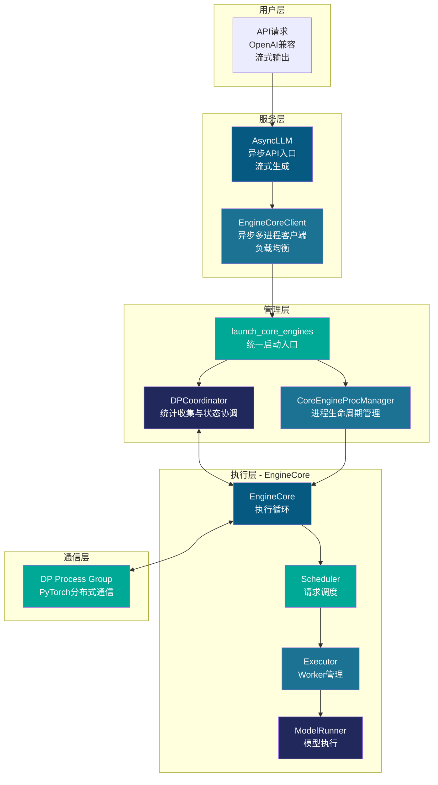

#### 核心模块一览表

| 层级 | 模块 | 核心职责 | 关键动作 |
|------|------|---------|---------|
| **服务层** | **AsyncLLM** | OpenAI 兼容 API 服务器 | 异步流式输出 → 弹性扩展 → 暂停/恢复 |
| **服务层** | **EngineCoreClient** | 异步客户端抽象 | 选择 DP 策略 → 与多个 EngineCore 异步通信 |
| **管理层** | **launch_core_engines** | 启动入口 | 根据 DP 配置 → 创建 Coordinator 和 Manager |
| **管理层** | **DPCoordinator** | 协调器 | 收集统计 → 管理 Wave 状态 → 发布负载信息 |
| **管理层** | **CoreEngineProcManager** | 进程管理器 | 启动 N 个 DP 进程 → 等待握手 → 管理生命周期 |
| **执行层** | **EngineCore** | 执行引擎核心 | run_busy_loop() 持续调度和执行 |
| **执行层** | **Scheduler** | 调度器 | 请求调度 → KV 分配 → 抢占管理 → Chunked Prefill |
| **执行层** | **Executor** | 执行器 | 管理 Workers → RPC 调用 → KV Cache 初始化 |
| **执行层** | **ModelRunner** | 模型运行器 | 准备输入 → 模型前向 → 采样生成 → CUDA Graph |
| **通信层** | **DP Process Group** | 通信层 | all-reduce 同步 → 每 32 步检查全局状态 |

#### EngineCore 执行循环

```
┌─────────────────────────────────────────────────────────────────────────┐
│  EngineCore.run_busy_loop() - 持续执行循环                              │
│                                                                         │
│  while True:                                                            │
│      ┌────────────────────────────────────────────────────────────┐     │
│      │ Step 1: Scheduler.schedule()                                │     │
│      │   输入: Request (新增) + running (运行中)                    │     │
│      │   处理: 从等待队列选择 → 分配 KV Cache → 检查抢占           │     │
│      │   输出: SchedulerOutput                                      │     │
│      │         ├─ scheduled_new_reqs: 新调度请求                    │     │
│      │         ├─ scheduled_cached_reqs: 缓存请求                   │     │
│      │         ├─ num_scheduled_tokens: token 数量                  │     │
│      │         └─ preempted_req_ids: 被抢占请求                     │     │
│      └────────────────────────────────────────────────────────────┘     │
│                              │                                          │
│                              ▼                                          │
│      ┌────────────────────────────────────────────────────────────┐     │
│      │ Step 2: Executor.execute_model(output)                     │     │
│      │   输入: SchedulerOutput                                      │     │
│      │   处理: collective_rpc() → Worker.execute_model()          │     │
│      │   输出: ModelRunnerOutput                                    │     │
│      │         ├─ sampled_token_ids: 采样结果                      │     │
│      │         ├─ logprobs: token 概率                             │     │
│      │         └─ spec_decode_tokens: 推测解码 (可选)               │     │
│      └────────────────────────────────────────────────────────────┘     │
│                              │                                          │
│                              ▼                                          │
│      ┌────────────────────────────────────────────────────────────┐     │
│      │ Step 3: Scheduler.update_from_output(output)               │     │
│      │   输入: ModelRunnerOutput                                    │     │
│      │   处理: 更新状态 → 检查完成条件 → 释放 KV Cache              │     │
│      │   输出: EngineCoreOutputs                                   │     │
│      │         ├─ outputs: 请求输出列表                            │     │
│      │         └─ scheduler_stats: 调度统计                        │     │
│      └────────────────────────────────────────────────────────────┘     │
│                              │                                          │
│                              ▼                                          │
│      ┌────────────────────────────────────────────────────────────┐     │
│      │ Step 4: output_queue.put(outputs)                         │     │
│      │   将输出推送到队列，供 AsyncLLM 拉取                       │     │
│      └────────────────────────────────────────────────────────────┘     │
└─────────────────────────────────────────────────────────────────────────┘
```

#### 完整调用链简图

```
API 请求 (OpenAI 兼容)
    │
    ▼
┌─────────────────────────────────────────────────────────────┐
│  AsyncLLM → EngineCoreClient (make_async_mp_client)         │
│  (异步流式)    (异步多进程客户端 + 负载均衡)                    │
└────────────────────────┬────────────────────────────────────┘
                         │
        ┌────────────────┴────────────────┐
        ▼                                 ▼
┌──────────────────┐            ┌──────────────────────┐
│ DPCoordinator    │            │ ProcManager          │
│ • 统计收集        │            │ • 启动 DP 进程       │
│ • Wave 管理       │◄──────────►│ • 进程生命周期       │
│ • 负载均衡        │            │ • 握手协调           │
└──────────────────┘            └──────────┬───────────┘
                                            │
                         ┌──────────────────┼──────────────────┐
                         ▼                  ▼                  ▼
                    ┌──────────┐        ┌──────────┐        ┌──────────┐
                    │ DP Rank 0│        │ DP Rank 1│  ...  │ DP Rank N│
                    │EngineCore│        │EngineCore│        │EngineCore│
                    │   │      │        │   │      │        │   │      │
                    │   ▼      │        │   ▼      │        │   ▼      │
                    │ Scheduler│        │ Scheduler│        │ Scheduler│
                    │   │      │        │   │      │        │   │      │
                    │   ▼      │        │   ▼      │        │   ▼      │
                    │ Executor │        │ Executor │        │ Executor │
                    │   │      │        │   │      │        │   │      │
                    │   ▼      │        │   ▼      │        │   ▼      │
                    │ModelRunner│       │ModelRunner│       │ModelRunner│
                    │   │      │        │   │      │        │   │      │
                    │   ▼      │        │   ▼      │        │   ▼      │
                    │ ┌─────────────────────────────────────────┐ │
                    │ │ 1. prepare_inputs()                      │ │
                    │ │    ├─ InputBuffers: input_ids, positions │ │
                    │ │    ├─ RequestState: seq_lens, computed   │ │
                    │ │    └─ BlockTables: slot_mappings       │ │
                    │ │    ▼                                     │ │
                    │ │ 2. CUDAGraph (可选)                      │ │
                    │ │    ├─ FULL: 完整 CUDA Graph              │ │
                    │ │    ├─ PIECEWISE: 分段 CUDA Graph         │ │
                    │ │    └─ NONE: Eager Mode                   │ │
                    │ │    ▼                                     │ │
                    │ │ 3. model_forward()                       │ │
                    │ │    ├─ Attention (FA2/FA3/FlashInfer)    │ │
                    │ │    └─ hidden_states: [num_tokens, dim]  │ │
                    │ │    ▼                                     │ │
                    │ │ 4. sample()                              │ │
                    │ │    ├─ logits = hidden_states[indices]   │ │
                    │ │    ├─ temperature, top_k, top_p          │ │
                    │ │    └─ token_id = categorical_sample()  │ │
                    │ │    ▼                                     │ │
                    │ │ 5. ModelRunnerOutput                     │ │
                    │ │    ├─ sampled_token_ids: [num_reqs]      │ │
                    │ │    ├─ logprobs: [num_reqs, top_k]        │ │
                    │ │    └─ spec_decode_tokens (可选)          │ │
                    │ └─────────────────────────────────────────┘ │
                    └──┼───────┘        └──┼───────┘        └──┼───────┘
                         │                   │                  │
                         └───────────────────┼──────────────────┘
                                             │
                        ┌────────────────────┴────────────────────┐
                        │  DP Process Group (PyTorch Distributed) │
                        │  • all-reduce 同步                       │
                        │  • 每 32 步检查全局状态                   │
                        └─────────────────────────────────────────┘
```

#### ModelRunner 内部数据流

```
┌─────────────────────────────────────────────────────────────────────────┐
│  ModelRunner.execute_model() 执行流程详解                               │
│                                                                         │
│  ┌───────────────────────────────────────────────────────────────────┐  │
│  │ 输入: SchedulerOutput                                               │  │
│  │   ├─ scheduled_new_reqs: 新请求                                    │  │
│  │   ├─ scheduled_cached_reqs: 缓存请求                                │  │
│  │   └─ num_scheduled_tokens: 每个 request 的 token 数               │  │
│  └───────────────────────────────────────────────────────────────────┘  │
│                              │                                          │
│                              ▼                                          │
│  ┌───────────────────────────────────────────────────────────────────┐  │
│  │ Step 1: prepare_inputs(scheduler_output)                          │  │
│  │   ├─ 计算 query_start_loc: [0, t1, t1+t2, ...]                    │  │
│  │   ├─ 准备 input_ids: 合并 prefill 和 decode tokens               │  │
│  │   ├─ 准备 positions: 每个 token 的位置编码                        │  │
│  │   ├─ 准备 seq_lens: 每个请求的序列长度                            │  │
│  │   ├─ 构建 attn_metadata: 注意力元数据                             │  │
│  │   │   ├─ slot_mappings: KV Cache slot 映射                       │  │
│  │   │   └─ block_tables: 物理块表                                   │  │
│  │   └─ 返回: InputBatch                                             │  │
│  └───────────────────────────────────────────────────────────────────┘  │
│                              │                                          │
│                              ▼                                          │
│  ┌───────────────────────────────────────────────────────────────────┐  │
│  │ Step 2: CUDAGraph (优化)                                           │  │
│  │   ├─ get_cudagraph_size(): 检查是否可使用 CUDA Graph              │  │
│  │   ├─ FULL: 完整 CUDA Graph (token 数匹配)                       │  │
│  │   ├─ PIECEWISE: 分段 CUDA Graph (部分匹配)                      │  │
│  │   └─ NONE: Eager Mode (不使用 CUDA Graph)                        │  │
│  └───────────────────────────────────────────────────────────────────┘  │
│                              │                                          │
│                              ▼                                          │
│  ┌───────────────────────────────────────────────────────────────────┐  │
│  │ Step 3: model_forward(input_batch)                                │  │
│  │   ├─ Input Embedding: token_ids → embeddings                     │  │
│  │   ├─ Attention Layer:                                             │  │
│  │   │   ├─ QKV Projection                                          │  │
│  │   │   ├─ Attention (FA2/FA3/FlashInfer)                          │  │
│  │   │   └─ Attention Output                                        │  │
│  │   ├─ FFN Layer: Feed-Forward Network                              │  │
│  │   └─ 返回: hidden_states: [num_tokens, hidden_dim]               │  │
│  └───────────────────────────────────────────────────────────────────┘  │
│                              │                                          │
│                              ▼                                          │
│  ┌───────────────────────────────────────────────────────────────────┐  │
│  │ Step 4: sample(hidden_states, sampling_metadata)                  │  │
│  │   ├─ logits = hidden_states[logits_indices]                      │  │
│  │   ├─ logits = logits / temperature                                │  │
│  │   ├─ top_k 过滤: 保留前 k 个概率                                 │  │
│  │   ├─ top_p 过滤: 保留累积概率 >= p 的 tokens                     │  │
│  │   ├─ probs = softmax(logits)                                      │  │
│  │   ├─ token_id = categorical_sample(probs)                        │  │
│  │   └─ 返回: SamplerOutput                                          │  │
│  └───────────────────────────────────────────────────────────────────┘  │
│                              │                                          │
│                              ▼                                          │
│  ┌───────────────────────────────────────────────────────────────────┐  │
│  │ 输出: ModelRunnerOutput                                            │  │
│  │   ├─ sampled_token_ids: [num_reqs]                              │  │
│  │   ├─ sampled_tokens: ["hello", "world", ...]                     │  │
│  │   ├─ logprobs: [num_reqs, top_k]                                 │  │
│  │   └─ spec_decode_tokens: DraftTokenIds (可选)                    │  │
│  └───────────────────────────────────────────────────────────────────┘  │
└─────────────────────────────────────────────────────────────────────────┘
```

#### 关键数据结构流转

```
┌─────────────────────────────────────────────────────────────────────────┐
│  SchedulerOutput → InputBatch → ModelRunnerOutput                     │
│                                                                         │
│  SchedulerOutput                                                       │
│  ├─ scheduled_new_reqs: [{req_id, block_ids, ...}]                  │
│  └─ num_scheduled_tokens: {req_id: num_tokens}                       │
│         │                                                              │
│         ▼                                                              │
│  InputBatch                                                            │
│  ├─ input_ids: [token1, token2, ..., tokenN]                         │
│  ├─ positions: [0, 1, ..., seq_len-1]                                │
│  ├─ seq_lens: [len1, len2, ..., lenM]                                │
│  ├─ attn_metadata: {slot_mappings, block_tables}                     │
│  └─ logits_indices: [idx1, idx2, ..., idxM]                          │
│         │                                                              │
│         ▼                                                              │
│  Model Forward (CUDA Graph / Eager)                                   │
│         │                                                              │
│         ▼                                                              │
│  hidden_states: [num_tokens, hidden_dim]                             │
│         │                                                              │
│         ▼                                                              │
│  Sample (temperature, top_k, top_p)                                   │
│         │                                                              │
│         ▼                                                              │
│  ModelRunnerOutput                                                     │
│  ├─ sampled_token_ids: [id1, id2, ..., idM]                         │
│  ├─ logprobs: [[p1_1, p1_2, ...], [p2_1, p2_2, ...], ...]           │
│  └─ spec_decode_tokens: (可选)                                        │
└─────────────────────────────────────────────────────────────────────────┘
```

#### 关键设计理念

| 设计理念 | 实现方式 | 优势 |
|---------|---------|------|
| **异步优先** | 基于 asyncio 的非阻塞 I/O | 高并发、低延迟 |
| **流式输出** | AsyncGenerator[RequestOutput] | 实时响应、OpenAI 兼容 |
| **独立进程** | 每个 DP rank 一个独立进程 | 故障隔离、资源隔离 |
| **集中协调** | 独立的 DPCoordinator 进程 | 统一状态管理、负载均衡 |
| **三级调度** | Scheduler → Executor → ModelRunner | 职责分离、易于扩展 |
| **弹性扩展** | scale_elastic_ep() 运行时调整 DP | 动态扩缩容、按需伸缩 |
| **分层通信** | ZMQ (控制) + PyTorch (数据) | 高效、可靠 |

#### Scheduler-Executor-ModelRunner 三层架构

```
┌─────────────────────────────────────────────────────────────────────────┐
│  三层执行架构                                                            │
│                                                                         │
│  ┌───────────────────────────────────────────────────────────────────┐  │
│  │  Layer 1: Scheduler (调度层)                                      │  │
│  │  • 职责: 请求调度、资源分配、抢占管理                               │  │
│  │  • 输入: Request (新增) + running (运行中)                         │  │
│  │  • 输出: SchedulerOutput (调度决策)                                │  │
│  │  • 核心算法: 优先级队列 + KV 分配 + 抢占策略                        │  │
│  └────────────────────────────────┬──────────────────────────────────┘  │
│                                   │ SchedulerOutput                   │
│                                   ▼                                   │
│  ┌───────────────────────────────────────────────────────────────────┐  │
│  │  Layer 2: Executor (执行层)                                      │  │
│  │  • 职责: Worker 管理、RPC 调用、KV Cache 初始化                    │  │
│  │  • 输入: SchedulerOutput                                          │  │
│  │  • 输出: ModelRunnerOutput (采样结果)                              │  │
│  │  • 核心操作: collective_rpc() → Worker.execute_model()             │  │
│  └────────────────────────────────┬──────────────────────────────────┘  │
│                                   │ ModelRunnerOutput                  │
│                                   ▼                                   │
│  ┌───────────────────────────────────────────────────────────────────┐  │
│  │  Layer 3: ModelRunner (推理层)                                    │  │
│  │  • 职责: 输入准备、模型执行、采样生成                              │  │
│  │  • 输入: SchedulerOutput                                          │  │
│  │  • 输出: ModelRunnerOutput (token IDs + logprobs)                  │  │
│  │  • 核心操作: prepare_inputs() → model_forward() → sample()         │  │
│  └───────────────────────────────────────────────────────────────────┘  │
│                                                                         │
│  数据流转:                                                               │
│    Request → SchedulerOutput → ModelRunnerOutput → RequestOutput       │
└─────────────────────────────────────────────────────────────────────────┘
```

#### 关键设计理念

| 设计理念 | 实现方式 | 优势 |
|---------|---------|------|
| **异步优先** | 基于 asyncio 的非阻塞 I/O | 高并发、低延迟 |
| **流式输出** | AsyncGenerator[RequestOutput] | 实时响应、OpenAI 兼容 |
| **独立进程** | 每个 DP rank 一个独立进程 | 故障隔离、资源隔离 |
| **集中协调** | 独立的 DPCoordinator 进程 | 统一状态管理、负载均衡 |
| **弹性扩展** | scale_elastic_ep() 运行时调整 DP | 动态扩缩容、按需伸缩 |
| **分层通信** | ZMQ (控制) + PyTorch (数据) | 高效、可靠 |

---

## 2.4 AFD Attention Service - Attention 服务完整调用流程

AFD (Attention-FFN Disaggregation) 将 Transformer 的 Attention 和 FFN 计算分离到不同的服务上运行。本节介绍 Attention Service 的完整调用流程，从用户 API 请求到 Attention 计算再到与 FFN Service 的交互。

### 完整调用流程

```
┌─────────────────────────────────────────────────────────────────────────┐
│                          用户 API 请求                                  │
│                    (OpenAI 兼容接口 / 流式输出)                          │
└────────────────────────────┬────────────────────────────────────────────┘
                             │
                             ▼
┌─────────────────────────────────────────────────────────────────────────┐
│  1️⃣ AsyncLLM (Attention Service 端)                                   │
│  • 位置: vllm/v1/engine/async_llm.py (54-867行)                       │
│  • 职责: OpenAI 兼容 API 服务器，异步流式输出                           │
│  • 核心方法:                                                          │
│      - generate(): AsyncGenerator[RequestOutput] - 流式生成           │
│      - add_request(): 添加请求到异步队列                               │
│      - abort(): 中止请求                                              │
│  • 初始化: 创建 EngineCoreClient (异步多进程客户端)                    │
│      self.engine_core = EngineCoreClient.make_async_mp_client(...)     │
│  • 背景任务: output_handler 持续拉取输出并推送到请求队列               │
│  • AFD 特定配置:                                                       │
│      afd_config.afd_role = "attention"                                 │
└────────────────────────────┬────────────────────────────────────────────┘
                             │
                             ▼
┌─────────────────────────────────────────────────────────────────────────┐
│  2️⃣ EngineCoreClient (Attention Service 端)                            │
│  • 位置: vllm/v1/engine/core_client.py (98-121行)                       │
│  • 职责: 异步客户端抽象，负责与 Attention Service 的 EngineCore 通信     │
│  • 根据配置选择客户端类型:                                             │
│      if dp_size > 1:                                                   │
│          if external_lb:                                              │
│              return DPAsyncMPClient(...)  # 外部负载均衡               │
│          else:                                                         │
│              return DPLBAsyncMPClient(...) # 内置负载均衡               │
│      else:                                                             │
│          return AsyncMPClient(...)      # 单 DP 客户端                  │
│  • 异步方法: add_request_async(), abort_requests_async() 等            │
└────────────────────────────┬────────────────────────────────────────────┘
                             │
                             ▼
┌─────────────────────────────────────────────────────────────────────────┐
│  3️⃣ launch_core_engines() (Attention Service 端)                      │
│  • 位置: vllm/v1/engine/utils.py (759-912行)                           │
│  • 职责: 启动 Attention Service 的 EngineCore 进程                     │
│  • 决策逻辑:                                                           │
│      if dp_size > 1:                                                   │
│          coordinator = DPCoordinator(parallel_config)                  │
│          if use_ray:                                                   │
│              manager = CoreEngineActorManager(...)                     │
│          else:                                                         │
│              manager = CoreEngineProcManager(...)                      │
│  • AFD 特定配置传递:                                                   │
│      vllm_config.afd_config.afd_role = "attention"                     │
└────────────────────────────┬────────────────────────────────────────────┘
                             │
              ┌──────────────┴──────────────┐
              ▼                             ▼
┌─────────────────────────┐     ┌──────────────────────────┐
│  4️⃣ DPCoordinator       │     │  4️⃣ CoreEngineProcManager │
│  • coordinator.py       │     │  • utils.py (81-227行)   │
│  • 统计收集             │     │  • 创建 DP 进程          │
│  • Wave 状态管理        │     │  • 进程生命周期管理      │
│  • 负载均衡信息发布     │     │  • 握手协调              │
└──────────┬──────────────┘     └─────────────┬────────────┘
           │                                  │
           └──────────────┬───────────────────┘
                          │
                          ▼
┌─────────────────────────────────────────────────────────────────────────┐
│  5️⃣ EngineCore (Attention Service 端)                                  │
│  • 位置: vllm/v1/engine/core.py (76-586行)                             │
│  • 每个 DP Rank 独立运行:                                               │
│      - EngineCoreProc (DP=1)                                           │
│      - DPEngineCoreProc (DP>1, 多进程模式)                             │
│      - DPEngineCoreActor (DP>1, Ray Actor 模式)                        │
│  • 核心组件: Scheduler, Executor, KVCacheManager                       │
│  • 主循环: run_busy_loop() 持续调度和执行                               │
│  • AFD 特定: afd_config.afd_role = "attention"                         │
└────────────────────────────┬────────────────────────────────────────────┘
                             │
                             ▼
┌─────────────────────────────────────────────────────────────────────────┐
│  5.1️⃣ Scheduler (Attention Service 端)                                │
│  • 位置: vllm/v1/core/sched/scheduler.py (59-800行)                    │
│  • 职责: 请求调度、资源分配、优先级管理                                  │
│  • 核心方法:                                                          │
│      - schedule(): 主调度方法，生成 SchedulerOutput                    │
│      - add_request(): 添加新请求到等待队列                             │
│      - update_from_output(): 根据模型输出更新请求状态                  │
│  • 输出: SchedulerOutput (包含新请求、缓存请求、抢占请求等)            │
│                                                                           │
│  ┌───────────────────────────────────────────────────────────────────┐  │
│  │ Scheduler 核心组件:                                              │  │
│  │ • RequestQueue: 等待队列 (支持多种调度策略)                      │  │
│  │ • KVCacheManager: KV 缓存块管理                                   │  │
│  │ • EncoderCacheManager: 编码器缓存管理                             │  │
│  │ • KVConnector: 跨节点 KV 传输 (可选)                              │  │
│  └───────────────────────────────────────────────────────────────────┘  │
└────────────────────────────┬────────────────────────────────────────────┘
                             │
                             ▼
┌─────────────────────────────────────────────────────────────────────────┐
│  5.2️⃣ Executor (Attention Service 端)                                 │
│  • 位置: vllm/v1/executor/abstract.py (35-200行)                        │
│  • 实现: MultiprocExecutor / RayDistributedExecutor / UniProcExecutor   │
│  • 职责: 管理 Worker 进程，执行 Attention 模型推理                       │
│  • 核心方法:                                                             │
│      - execute_model(): 执行模型前向传播                                  │
│      - collective_rpc(): 在所有 Worker 上执行 RPC                         │
│      - initialize_from_config(): 初始化 KV Cache                         │
│                                                                         │
│  ┌───────────────────────────────────────────────────────────────────┐  │
│  │ Executor 管理的 Workers (Attention Service):                     │  │
│  │ • Worker (worker_base.py): Worker 基类                            │  │
│  │   └─ GPUWorker: GPU Worker 实现                                   │  │
│  │      └─ GPUModelRunner: Attention 模型执行核心                    │  │
│  │         └─ AFDConnector: AFD 通信连接器                          │  │
│  └───────────────────────────────────────────────────────────────────┘  │
└────────────────────────────┬────────────────────────────────────────────┘
                             │
                             ▼
┌─────────────────────────────────────────────────────────────────────────┐
│  5.3️⃣ GPUModelRunner (Attention Service 端)                            │
│  • 位置: vllm/v1/worker/gpu/model_runner.py (67-1000行)                  │
│  • 职责: 执行 Attention 计算、Expert 选择、与 FFN Service 通信             │
│  • 核心方法:                                                             │
│      - execute_model(): 执行模型推理                                     │
│      - prepare_inputs(): 准备模型输入                                    │
│      - model_forward(): 执行 Attention 前向传播                           │
│      - sample(): 采样生成 token                                          │
│      - compute_attn_output(): 计算 Attention 输出 (MoE)                 │
│                                                                           │
│  ┌───────────────────────────────────────────────────────────────────┐  │
│  │ GPUModelRunner 核心组件 (Attention Service):                    │  │
│  │ • InputBuffers: 输入数据缓冲 (input_ids, positions, seq_lens)    │  │
│  │ • RequestState: 请求状态管理                                       │  │
│  │ • BlockTables: KV Cache 块表管理                                   │  │
│  │ • AttentionBackend: 注意力后端 (FA2, FA3, FlashInfer, etc.)      │  │
│  │ • AFDConnector: AFD 通信连接器 (第 40, 556-567 行)               │  │
│  └───────────────────────────────────────────────────────────────────┘  │
│                                                                           │
│  执行流程:                                                                │
│  1. prepare_inputs(): 准备 input_ids, positions, attn_metadata         │
│  2. model_forward(): 执行 Attention 计算                                  │
│  3. compute_attn_output(): 计算 Attention 输出和 Expert 选择             │
│  4. send_attn_output(): 发送到 FFN Service                               │
│  5. recv_ffn_output(): 接收 FFN Service 返回                             │
│  6. sample(): 从 hidden_states 采样生成 token                           │
│  7. return ModelRunnerOutput: 返回采样结果                               │
└────────────────────────────┬────────────────────────────────────────────┘
                             │
                             ▼
┌─────────────────────────────────────────────────────────────────────────┐
│  6️⃣ AFD Connector - Attention 到 FFN 通信                              │
│  • 位置: vllm/distributed/afd_transfer/afd_connector/                    │
│  • 职责: 负责 Attention Service 和 FFN Service 之间的通信                 │
│  • 核心方法:                                                             │
│      - send_attn_output(): 发送 Attention 输出到 FFN Service            │
│      - recv_ffn_output(): 接收 FFN Service 返回                         │
│      - init_afd_connector(): 初始化连接器                                │
│  • 连接器类型:                                                           │
│      - DummyConnector: 虚拟连接器 (单机测试)                             │
│      - P2PConnector: 点对点连接器 (NPU/NPU 通信)                        │
│      - M2NConnector: M 到 N 连接器 (多对多通信)                         │
└────────────────────────────┬────────────────────────────────────────────┘
                             │
                             ▼
┌─────────────────────────────────────────────────────────────────────────┐
│  7️⃣ FFN Service (独立进程/服务)                                         │
│  • 启动方式: python -m vllm.entrypoints.afd_ffn_server                  │
│  • 位置: vllm/entrypoints/afd_ffn_server.py                             │
│  • AFD 特定配置: afd_config.afd_role = "ffn"                            │
│  • 详见第 2.5 节 AFD FFN Service 完整调用流程                           │
└─────────────────────────────────────────────────────────────────────────┘
```

### 2.4.1 Attention Service 调用流程精华版

本节提供 Attention Service 的简化调用链，强调模块间关系而非内部实现细节。

#### 完整调用链简图

```
用户 API 请求 (OpenAI 兼容)
    │
    ▼
┌─────────────────────────────────────────────────────────────┐
│  AsyncLLM → EngineCoreClient (make_async_mp_client)         │
│  (异步流式)    (异步多进程客户端 + 负载均衡)                    │
│  AFD 配置: afd_role = "attention"                            │
└────────────────────────┬────────────────────────────────────┘
                         │
        ┌────────────────┴────────────────┐
        ▼                                 ▼
┌──────────────────┐            ┌──────────────────────┐
│ DPCoordinator    │            │ ProcManager          │
│ • 统计收集        │            │ • 启动 DP 进程       │
│ • Wave 管理       │◄───── ────►│ • 进程生命周期       │
│ • 负载均衡        │            │ • 握手协调           │
└──────────────────┘            └──────────┬───────────┘
                                            │
                         ┌──────────────────┼──────────────────┐
                         ▼                  ▼                  ▼
                    ┌──────────┐        ┌──────────┐        ┌──────────┐
                    │ DP Rank 0│        │ DP Rank 1│  ...   │ DP Rank N│
                    │EngineCore│        │EngineCore│        │EngineCore│
                    │   │      │        │   │      │        │   │      │
                    │   ▼      │        │   ▼      │        │   ▼      │
                    │ Scheduler│        │ Scheduler│        │ Scheduler│
                    │   │      │        │   │      │        │   │      │
                    │   ▼      │        │   ▼      │        │   ▼      │
                    │ Executor │        │ Executor │        │ Executor │
                    │   │      │        │   │      │        │   │      │
                    │   ▼      │        │   ▼      │        │   ▼      │
                    │ModelRunner│       │ModelRunner│       │ModelRunner│
                    │(Attention)│       │(Attention)│       │(Attention)│
                    └────┼──────┘       └────┼──────┘       └───┼───────┘
                         │                   │                  │
                         └───────────────────┼──────────────────┘
                                             │
                                             ▼
                         ┌──────────────────────────────────┐
                         │  GPUModelRunner 核心流程         │
                         │  ┌────────────────────────────┐   │
                         │  │ 1. prepare_inputs()         │   │
                         │  │    ├─ InputBuffers         │   │
                         │  │    └─ RequestState        │   │
                         │  │         ▼                  │   │
                         │  │ 2. model_forward()         │   │
                         │  │    ├─ Attention 计算       │   │
                         │  │    └─ hidden_states       │   │
                         │  │         ▼                  │   │
                         │  │ 3. Expert Selection (MoE) │   │
                         │  │    ├─ Router              │   │
                         │  │    ├─ TopK 选择           │   │
                         │  │    └─ topk_ids/weights    │   │
                         │  │         ▼                  │   │
                         │  │ 4. send_attn_output()     │   │
                         │  │    (发送到 FFN Service)    │   │
                         │  └────────────────────────────┘   │
                         └──────────────────────────────────┘
                                             │
                                             ▼
                         ┌────────────────────────────────────┐
                         │  AFD Connector (与 FFN Service)      │
                         │  ┌────────────────────────────────┐ │
                         │  │ send_attn_output()           │ │
                         │  │   • hidden_states           │ │
                         │  │   • topk_ids, topk_weights   │ │
                         │  │   • router_logits          │ │
                         │  │   • metadata               │ │
                         │  │         ▼                  │ │
                         │  │ 网络通信                     │ │
                         │  │   • HCCL/P2P               │ │
                         │  │   • Gloo (metadata)       │ │
                         │  │         ▼                  │ │
                         │  │ recv_ffn_output()         │ │
                         │  │   (接收 FFN 结果)          │ │
                         │  └────────────────────────────────┘ │
                         └────────────────────────────────────┘
                                             │
                                             ▼
                         ┌────────────────────────────────────┐
                         │  5. sample()                       │
                         │     ├─ logits                    │
                         │     ├─ temperature, top_k, top_p   │
                         │     └─ token_id                 │
                         └────────────────────────────────────┘
```

#### 与 FFN Service 交互简图

```
┌─────────────────────────────────────────────────────────────────────────┐
│                    Attention Service ↔ FFN Service 交互                      │
│                                                                         │
│  Attention Service                              FFN Service               │
│  ┌──────────────────┐                    ┌──────────────────────┐    │
│  │ GPUModelRunner   │                    │ GPUFFNModelRunner   │    │
│  │  │               │                    │  │                   │    │
│  │  ▼               │  send_attn_output()  │  ▼                   │    │
│  │ Attention        │ ─────────────────►│ recv_attn_output()   │    │
│  │ + Expert Select  │                    │ Expert Dispatch       │    │
│  │                  │                    │  │                   │    │
│  │  ▼               │                    │  ▼                   │    │
│  │ hidden_states    │                    │ MoE Computation       │    │
│  │ + topk_info      │                    │  │                   │    │
│  │                  │                    │  ▼                   │    │
│  └──┼───────────────┘                    │ ffn_output           │    │
│     │                                   │    │                   │    │
│     ▼                                   │    └──┼───────────────┘    │
│  AFDConnector                                │       │               │
│     │                                   │       │               │
│     ▼                                   │       ▼               │
│  ┌───────────────────────────────────────────────────────────────┐  │
│  │                    网络通信层                             │  │
│  │  • HCCL: 张量数据传输 (hidden_states, topk_weights)          │  │
│  │  • 自定义算子: cam_a2e/m2n_send                              │  │
│  │  • Gloo: 元数据传输 (metadata)                                │  │
│  └───────────────────────────────────────────────────────────────┘  │
│     │                                   │       │               │
│     ▼                                   │       ▼               │
│  AFDConnector (FFN侧)                      │  AFDConnector         │
│     │                                   │       │               │
│     ▼                                   │       ▼               │
│  recv_attn_output()                      │  send_ffn_output()    │
│     │                                   │       │               │
│     ▼                                   │       ▼               │
│  Expert Dispatch                         │  持续循环监听        │
│     │                                   │       │               │
│     ▼                                   │       ▼               │
│  MoE FFN 计算                             │                     │
│     │                                   │       │               │
│     ▼                                   │       │               │
│  send_ffn_output()───────────────────────► recv_ffn_output()    │
│                                                                         │
│  【关键】Attention Service 在 FFN 计算期间可以继续处理其他请求          │
└─────────────────────────────────────────────────────────────────────────┘
```

#### 三层架构概览

```
┌─────────────────────────────────────────────────────────────────────────┐
│                    AFD Attention Service 三层架构                        │
│                                                                         │
│  ┌───────────────────────────────────────────────────────────────────┐  │
│  │ 第 1 层: 服务管理层                                                 │  │
│  │  ┌──────────────┐        ┌──────────────┐        ┌──────────────┐  │  │
│  │  │ AsyncLLM     │        │EngineCore    │        │ DPCoordinator│  │  │
│  │  │              │──RPC ─►│              │──stat─►│              │  │  │
│  │  │ (OpenAI API) │        │ (执行引擎)    │        │ (负载均衡)    │  │  │
│  │  └──────────────┘        └──────────────┘        └──────────────┘  │  │
│  └───────────────────────────────────────────────────────────────────┘  │
│                                │                                          │
│                                ▼                                          │
│  ┌───────────────────────────────────────────────────────────────────┐  │
│  │ 第 2 层: 调度执行层                                                  │  │
│  │  ┌──────────────┐        ┌──────────────┐        ┌──────────────┐  │  │
│  │  │ Scheduler    │        │ Executor     │        │ModelRunner   │  │  │
│  │  │              │─ req ─►│              │──RPC ─►│              │  │  │
│  │  │ (请求调度)    │        │ (Worker 管理) │       │(Attention)   │  │  │
│  │  └──────────────┘        └──────────────┘        └──────────────┘  │  │
│  └───────────────────────────────────────────────────────────────────┘  │
│                                │                                          │
│                                ▼                                          │
│  ┌───────────────────────────────────────────────────────────────────┐  │
│  │ 第 3 层: 计算通信层                                                  │  │
│  │  ┌────────────────────────────────────────────────────────────────┐ │  │
│  │  │ GPUModelRunner Attention 计算                              │ │  │
│  │  │   ├─ prepare_inputs()                                        │ │  │
│  │  │   ├─ model_forward() (Attention + Expert Selection)          │ │  │
│  │  │   ├─ send_attn_output()                                     │ │  │
│  │  │   └─ recv_ffn_output()                                     │ │  │
│  │  └────────────────────────────────────────────────────────────────┘ │  │
│  │                          │                                       │  │
│  │                          ▼                                       │  │
│  │  ┌────────────────────────────────────────────────────────────────┐ │  │
│  │  │ AFDConnector 通信层                                         │  │  │
│  │  │   ├─ send_attn_output(): Attention → FFN                      │  │  │
│  │  │   ├─ recv_ffn_output(): FFN → Attention                      │  │  │
│  │  │   └─ 网络: HCCL + Gloo                                      │  │  │
│  │  └────────────────────────────────────────────────────────────────┘ │  │
│  └───────────────────────────────────────────────────────────────────┘  │
└─────────────────────────────────────────────────────────────────────────┘
```

#### 核心组件职责

| 组件 | 职责 | AFD 特定 |
|------|------|---------|
| **AsyncLLM** | OpenAI 兼容 API 服务器 | afd_role = "attention" |
| **EngineCoreClient** | 异步客户端抽象 | 支持 DP 负载均衡 |
| **EngineCore** | 执行引擎核心 | Attention 模式正常运行 |
| **Scheduler** | 请求调度、KV 分配 | 处理 AFD 请求 |
| **Executor** | Worker 管理 | 管理 GPUWorker |
| **GPUModelRunner** | Attention 计算 + AFD 通信 | AFDConnector 发送/接收 |
| **AFDConnector** | Attention ↔ FFN 通信 | send/recv 方法 |

---

### Attention Service 架构概览

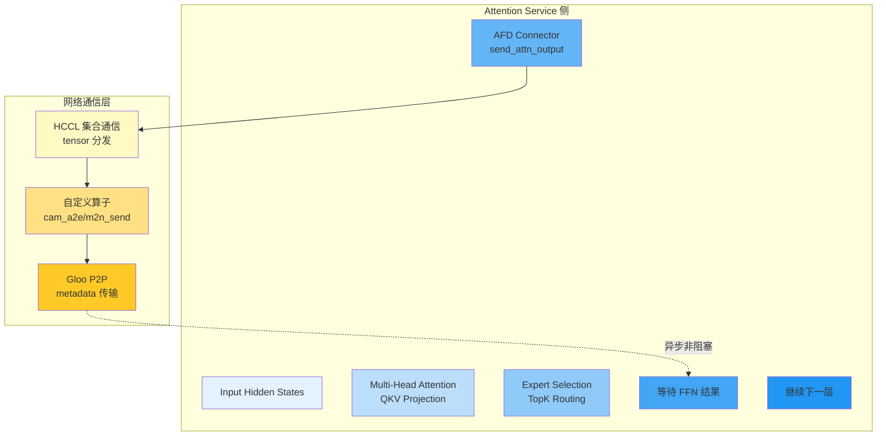

### 核心职责

| 职责 | 说明 |
|------|------|
| **Attention 计算** | 执行 Multi-Head Attention，生成 QKV 投影 |
| **Expert 选择** | MoE 模型的 TopK 路由选择 |
| **数据发送** | 通过 AFDConnector 发送 hidden_states 到 FFN 服务 |
| **结果接收** | 接收 FFN 计算结果并继续下一层 |
| **元数据管理** | 构建并发送 AFD metadata (layer_idx, stage_idx 等) |

### 调用流程详解

```
┌─────────────────────────────────────────────────────────────────────────┐
│  Attention Service 执行流程                                                │
│                                                                         │
│  ┌───────────────────────────────────────────────────────────────────┐  │
│  │ 输入: SchedulerOutput + cached hidden_states                       │  │
│  │   ├─ input_ids: [num_tokens]                                    │  │
│  │   ├─ positions: [num_tokens]                                   │  │
│  │   ├─ seq_lens: [num_reqs]                                      │  │
│  │   └─ attn_metadata: attention 元数据                            │  │
│  └───────────────────────────────────────────────────────────────────┘  │
│                              │                                          │
│                              ▼                                          │
│  ┌───────────────────────────────────────────────────────────────────┐  │
│  │ Step 1: model_forward() - Attention 计算                           │  │
│  │   ├─ Input Embedding: token_ids → embeddings                     │  │
│  │   ├─ Attention Layer:                                            │  │
│  │   │   ├─ QKV Projection: [num_tokens, 3, head_dim]             │  │
│  │   │   ├─ Attention (FA2/FA3/FlashInfer)                         │  │
│   │   │   └─ Attention Output                                      │  │
│  │   └─ 残差连接: residual + attention_output                       │  │
│  │   返回: hidden_states: [num_tokens, hidden_dim]                  │  │
│  └───────────────────────────────────────────────────────────────────┘  │
│                              │                                          │
│                              ▼                                          │
│  ┌───────────────────────────────────────────────────────────────────┐  │
│  │ Step 2: Expert Selection (MoE 模型)                                │  │
│  │   ├─ Router: 计算每个 Expert 的得分                              │  │
│  │   ├─ TopK: 选择得分最高的 K 个 Expert                            │  │
│  │   ├─ topk_ids: [num_tokens, top_k] - Expert ID                       │  │
│   │   └─ topk_weights: [num_tokens, top_k] - Expert 权重              │  │
│  └───────────────────────────────────────────────────────────────────┘  │
│                              │                                          │
│                              ▼                                          │
│  ┌───────────────────────────────────────────────────────────────────┐  │
│  │ Step 3: 构建 AFD Metadata                                          │  │
│  │   metadata = AFDConnectorMetadata.create_attention_metadata(       │  │
│  │       layer_idx=layer.layer_idx,                                  │  │
│  │       stage_idx=afd_stage_idx,                                   │  │
│  │       seq_len=hidden_states.shape[0],                            │  │
│  │       dtype=hidden_states.dtype,                                  │  │
│  │       num_ubatches=num_ubatches,                                 │  │
│  │   )                                                              │  │
│  └───────────────────────────────────────────────────────────────────┘  │
│                              │                                          │
│                              ▼                                          │
│  ┌───────────────────────────────────────────────────────────────────┐  │
│  │ Step 4: send_attn_output() - 发送到 FFN 服务                      │  │
│  │   [hidden_states, send_handle] = afd_connector.send_attn_output(  │  │
│  │       hidden_states=current_hidden,                              │  │
│  │       metadata=metadata,                                         │  │
│  │       topk_weights=topk_weights,                                 │  │
│  │       topk_ids=topk_ids,                                         │  │
│  │       router_logits=router_logits,                               │  │
│  │   )                                                              │  │
│  │   • 非阻塞发送: 立即返回 handle                                │  │
│  │   • metadata.connector_data.handle = send_handle                 │  │
│  └───────────────────────────────────────────────────────────────────┘  │
│                              │                                          │
│                              ▼                                          │
│  ┌───────────────────────────────────────────────────────────────────┐  │
│  │ Step 5: recv_ffn_output() - 接收 FFN 结果                        │  │
│  │   recv_hidden_states = afd_connector.recv_ffn_output(            │  │
│  │       hidden_states=hidden_states,                              │  │
│  │       metadata=afd_metadata                                       │  │
│  │   )                                                              │  │
│  │   • 阻塞等待: 等待 FFN 服务返回                                 │  │
│  │   • 返回: hidden_states: [num_tokens, hidden_dim]                │  │
│  └───────────────────────────────────────────────────────────────────┘  │
│                              │                                          │
│                              ▼                                          │
│  ┌───────────────────────────────────────────────────────────────────┐  │
│  │ Step 6: 继续下一层或采样                                           │  │
│  │   if not last_layer:                                            │  │
│  │       继续下一层 Attention + FFN                                │  │
│  │   else:                                                          │  │
│  │       进入采样流程                                               │  │
│  └───────────────────────────────────────────────────────────────────┘  │
└─────────────────────────────────────────────────────────────────────────┘
```

### AFDConnector 接口

**文件**: `vllm/distributed/afd_transfer/afd_connector/base.py`

| 方法 | 方向 | 描述 |
|------|------|------|
| `send_attn_output()` | Attention → FFN | 发送 Attention 输出到 FFN 服务 |
| `recv_ffn_output()` | FFN → Attention | 接收 FFN 计算结果 |
| `recv_attn_output()` | FFN ← Attention | FFN 服务接收 Attention 输出 |
| `send_ffn_output()` | FFN → Attention | FFN 服务发送计算结果回 Attention |

### 关键文件位置

| 文件 | 行号 | 类/函数 | 描述 |
|------|------|---------|------|
| `vllm/v1/worker/gpu_model_runner.py` | 40, 556-567 | `AFDConnectorFactory.create_connector()` | 创建 AFD 连接器 |
| `vllm/v1/worker/gpu_model_runner.py` | 2944-2974 | `_build_afd_metadata()` | 构建 AFD 元数据 |
| `vllm/distributed/afd_transfer/afd_connector/base.py` | 85-102 | `send_attn_output()` | 发送 Attention 输出 |
| `vllm/distributed/afd_transfer/afd_connector/base.py` | 105-119 | `recv_ffn_output()` | 接收 FFN 结果 |
| `vllm/distributed/afd_transfer/afd_connector/p2p_connector.py` | 全文件 | `NPUP2PAFDConnector` | P2P 连接器实现 |
| `vllm/distributed/afd_transfer/afd_connector/m2n_connector.py` | 全文件 | `M2NAFDConnector` | M2N 连接器实现 |
| `vllm/model_executor/models/deepseek_v2.py` | 1652-1693 | AFD 调用示例 | DeepSeek V2 中的 AFD 调用 |

### 数据流交互

```
┌─────────────────────────────────────────────────────────────────────────┐
│  AFD Attention Service 与 FFN Service 数据交互                             │
│                                                                         │
│  Attention Service (GPUModelRunner)                                  │
│  ├─ 1. compute_attn_output()                                         │
│  │   输出: hidden_states, residual, topk_weights, topk_ids           │
│  │                                                                  │
│  ├─ 2. send_attn_output()                                           │
│  │   发送: current_hidden, topk_weights, topk_ids, router_logits      │
│  │   接收: send_handle (非阻塞)                                      │
│  │                                                                  │
│  ├─ 3. 继续处理其他请求 (非阻塞)                                     │
│  │   • 可以开始处理下一个 iteration                                 │
│  │   • 或处理其他请求的 Attention                                   │
│  │                                                                  │
│  ├─ 4. recv_ffn_output()                                           │
│  │   接收: recv_hidden_states                                       │
│  │   阻塞: 等待 FFN 服务返回 (同步模式)                             │
│  │   或: 异步回调 (异步模式)                                        │
│  │                                                                  │
│  └─ 5. 继续下一层                                                   │
│      更新 hidden_states → 下一层 Attention + FFN                       │
└─────────────────────────────────────────────────────────────────────────┘
```

---

## 2.5 AFD FFN Service - FFN 服务完整调用流程

AFD FFN Service 是一个独立的服务进程，专门负责 FFN (前馈神经网络) 计算。它接收来自 Attention Service 的 hidden_states 和 Expert 信息，执行 MoE FFN 计算并返回结果。

### 完整调用流程

```
┌─────────────────────────────────────────────────────────────────────────┐
│  启动命令: python -m vllm.entrypoints.afd_ffn_server /path/to/model   │
│             --tensor-parallel-size 8                                   │
│             --afd-config '{"afd_connector": "p2pconnector",           │
│                          "afd_role": "ffn"}'                           │
└────────────────────────────┬────────────────────────────────────────────┘
                             │
                             ▼
┌─────────────────────────────────────────────────────────────────────────┐
│  1️⃣ AFDFFNServer 主类                                                 │
│  • 位置: vllm/entrypoints/afd_ffn_server.py (26-67行)                  │
│  • 职责: FFN Service 的启动入口和管理                                   │
│  • 核心方法:                                                          │
│      - __init__(): 初始化 vllm_config                                  │
│      - start(): 启动 FFN 服务                                         │
│      - _run_server_loop(): 运行服务主循环                               │
│  • AFD 特定配置:                                                       │
│      afd_config.afd_role = "ffn"                                       │
│      afd_config.num_ffn_servers: FFN 服务数量                          │
│      afd_config.afd_port: 通信端口                                     │
└────────────────────────────┬────────────────────────────────────────────┘
                             │
                             ▼
┌─────────────────────────────────────────────────────────────────────────┐
│  2️⃣ 创建 Executor                                                      │
│  • 位置: vllm/v1/executor/abstract.py (35-200行)                        │
│  • 职责: 管理 FFN Worker 进程                                          │
│  • 实现类型: MultiprocExecutor / RayDistributedExecutor                │
│  • 初始化流程:                                                         │
│      executor_class = Executor.get_class(vllm_config)                  │
│      model_executor = executor_class(vllm_config=vllm_config)          │
│  • 注意: FFN Service 不创建 EngineCore，直接管理 Worker                │
└────────────────────────────┬────────────────────────────────────────────┘
                             │
                             ▼
┌─────────────────────────────────────────────────────────────────────────┐
│  3️⃣ collective_rpc("start_ffn_server_loop")                            │
│  • 职责: 通知所有 Worker 启动 FFN 服务循环                               │
│  • 位置: vllm/v1/executor/abstract.py                                   │
│  • 实现: 通过 RPC 调用所有 Worker 的 start_ffn_server_loop() 方法       │
│  • 返回: 所有 Worker 进入服务循环后返回                                 │
└────────────────────────────┬────────────────────────────────────────────┘
                             │
                             ▼
┌─────────────────────────────────────────────────────────────────────────┐
│  4️⃣ GPUFFNModelRunner (FFN Service 端)                                 │
│  • 位置: vllm/v1/worker/gpu_ffn_model_runner.py (33-451行)              │
│  • 职责: 执行 FFN 计算、管理 CUDA Graph、与 Attention Service 通信        │
│  • 核心方法:                                                             │
│      - execute_model(): FFN 服务主循环                                   │
│      - _execute_with_cuda_graph(): CUDA Graph 模式执行                  │
│      - _execute_eager_mode(): Eager 模式执行                            │
│      - capture_model(): 捕获 CUDA Graph                                 │
│  • AFD 特定配置: afd_config.is_ffn_server = True                        │
│                                                                           │
│  ┌───────────────────────────────────────────────────────────────────┐  │
│  │ GPUFFNModelRunner 核心组件 (FFN Service):                        │  │
│  │ • AFDConnector: AFD 通信连接器 (第 82-84 行)                     │  │
│  │ • Model: FFN 模型 (compute_ffn_output)                            │  │
│  │ • CUDAGraphManager: CUDA Graph 管理                               │  │
│  │ • Profiler: 性能监控 (torch.profiler)                             │  │
│  └───────────────────────────────────────────────────────────────────┘  │
│                                                                           │
│  执行流程:                                                                │
│  1. recv_attn_output(): 接收 Attention Service 数据                     │
│  2. _find_cuda_graph(): 查找可用的 CUDA Graph                           │
│  3. _execute_with_cuda_graph() 或 _execute_eager_mode(): FFN 计算        │
│  4. send_ffn_output(): 发送结果回 Attention Service                      │
│  5. _counter += 1: 更新计数器                                           │
│  6. 循环继续: 等待下一个请求                                            │
└────────────────────────────┬────────────────────────────────────────────┘
                             │
                             ▼
┌─────────────────────────────────────────────────────────────────────────┐
│  5️⃣ AFD Connector - FFN 到 Attention 通信                               │
│  • 位置: vllm/distributed/afd_transfer/afd_connector/                    │
│  • 职责: 负责 FFN Service 和 Attention Service 之间的通信                │
│  • 核心方法:                                                             │
│      - recv_attn_output(): 接收 Attention Service 数据                  │
│      - send_ffn_output(): 发送 FFN 计算结果回 Attention Service        │
│      - init_afd_connector(): 初始化连接器                                │
│  • 连接器类型:                                                           │
│      - DummyConnector: 虚拟连接器 (单机测试)                             │
│      - P2PConnector: 点对点连接器 (NPU/NPU 通信)                        │
│      - M2NConnector: M 到 N 连接器 (多对多通信)                         │
└────────────────────────────┬────────────────────────────────────────────┘
                             │
                             ▼
┌─────────────────────────────────────────────────────────────────────────┐
│  6️⃣ 主循环等待                                                          │
│  • 位置: afd_ffn_server.py (50-66行)                                    │
│  • 实现方式: threading.Event().wait()                                  │
│  • 阻塞等待: 直到收到 KeyboardInterrupt 或异常                          │
│  • 清理流程: collective_rpc("stop_ffn_server_loop")                     │
└─────────────────────────────────────────────────────────────────────────┘
```

### 2.5.1 AFD FFN Service 启动流程详解

本节深入分析 AFD FFN Service 的两种启动方式和完整流程。

#### 两种启动方式

FFN Service 有两种启动方式，核心逻辑相同但入口不同：

| 方式                    | 启动入口                                        | 描述                           | 使用场景                     |
| --------------------- | ------------------------------------------- | ---------------------------- | ------------------------ |
| **方式一：独立进程**          | `python -m vllm.entrypoints.afd_ffn_server` | 不创建 EngineCore，直接创建 Executor | 独立部署 FFN 服务              |
| **方式二：EngineCore 包装** | `EngineCoreProc.run_engine_core()`          | 通过 EngineCore 包装，复用握手机制      | 与 Attention Service 统一管理 |

**关键代码判断点** (`core.py:107-108`):
```python
self.afd_config = vllm_config.afd_config
if self.afd_config and self.afd_config.afd_role == "ffn":
    return  # 提前返回，跳过 Scheduler、KV Cache 等初始化
```

**两种方式的最终执行点相同** (`core.py:885-900` 或 `core.py:1263-1278`):
```python
def run_busy_loop(self):
    if self.afd_config and self.afd_config.afd_role == "ffn":
        # 启动 FFN 服务循环
        self.model_executor.collective_rpc("start_ffn_server_loop")

        # 主线程阻塞等待
        shutdown_event = threading.Event()
        shutdown_event.wait()
```

---

#### 方式一：独立进程启动 (afd_ffn_server.py)

```
┌─────────────────────────────────────────────────────────────────────────┐
│  方式一启动命令:                                                         │
│  python -m vllm.entrypoints.afd_ffn_server /path/to/model \           │
│             --tensor-parallel-size 8 \                                 │
│             --afd-config '{"afd_connector": "p2pconnector",           │
│                          "afd_role": "ffn"}'                           │
└────────────────────────────┬────────────────────────────────────────────┘
                             │
                             ▼
┌─────────────────────────────────────────────────────────────────────────┐
│  Step 1: 命令行解析与配置创建                                           │
│  ┌───────────────────────────────────────────────────────────────────┐  │
│  │ main() 函数 - afd_ffn_server.py:69-78                             │  │
│  │   parser = FlexibleArgumentParser()                              │  │
│  │   parser.add_argument("model", type=str)                          │  │
│  │   args = AsyncEngineArgs.add_cli_args(parser)                     │  │
│  │   args = parser.parse_args()                                      │  │
│  │                                                                  │  │
│  │   server = AFDFFNServer(args)  # 创建服务实例                      │  │
│  │   server.start()                   # 启动服务                      │  │
│  └───────────────────────────────────────────────────────────────────┘  │
│                              │                                          │
│                              ▼                                          │
│  ┌───────────────────────────────────────────────────────────────────┐  │
│  │ Step 2: AFDFFNServer.__init__() - afd_ffn_server.py:29-32        │  │
│  │   def __init__(self, args: Any):                                  │  │
│  │       engine_args = AsyncEngineArgs.from_cli_args(args)           │  │
│  │       self.vllm_config = engine_args.create_engine_config()       │  │
│  │                                                                  │  │
│  │   创建内容:                                                        │  │
│  │   • VllmConfig (包含所有配置信息)                                  │  │
│  │   • ModelConfig (模型配置)                                         │  │
│  │   • ParallelConfig (并行配置: TP, PP, DP)                          │  │
│  │   • AFDConfig (AFD 特定配置)                                       │  │
│  │     - afd_role = "ffn"                                             │  │
│  │     - afd_connector = "p2pconnector" (或 "dummy")                  │  │
│  │     - afd_port = 1239                                              │  │
│  │     - num_afd_stages = 3                                           │  │
│  └───────────────────────────────────────────────────────────────────┘  │
│                              │                                          │
│                              ▼                                          │
│  ┌───────────────────────────────────────────────────────────────────┐  │
│  │ Step 3: AFDFFNServer.start() - afd_ffn_server.py:34-48           │  │
│  │   def start(self) -> None:                                        │  │
│  │       from vllm.v1.executor.abstract import Executor              │  │
│  │                                                                  │  │
│  │       # 3.1 获取 Executor 类                                       │  │
│  │       executor_class = Executor.get_class(self.vllm_config)      │  │
│  │                                                                  │  │
│  │       # 3.2 创建 Executor 实例                                      │  │
│  │       self.model_executor = executor_class(                       │  │
│  │           vllm_config=self.vllm_config                             │  │
│  │       )                                                            │  │
│  │                                                                  │  │
│  │       # 3.3 启动服务循环                                           │  │
│  │       self._run_server_loop()                                     │  │
│  └───────────────────────────────────────────────────────────────────┘  │
│                              │                                          │
│                              ▼                                          │
│  ┌───────────────────────────────────────────────────────────────────┐  │
│  │ Step 4: Executor.get_class() - 选择 Executor 类型                │  │
│  │   根据 vllm_config 选择合适的 Executor 实现:                       │  │
│  │                                                                  │  │
│  │   if use_ray:                                                     │  │
│  │       return RayDistributedExecutor  # Ray Actor 模式              │  │
│  │   else:                                                           │  │
│  │       return MultiprocExecutor         # 多进程模式 (默认)          │  │
│  │                                                                  │  │
│  │   FFN Service 通常使用 MultiprocExecutor                          │  │
│  └───────────────────────────────────────────────────────────────────┘  │
│                              │                                          │
│                              ▼                                          │
│  ┌───────────────────────────────────────────────────────────────────┐  │
│  │ Step 5: MultiprocExecutor.__init__() - multiproc_executor.py     │  │
│  │   def __init__(self, vllm_config: VllmConfig):                    │  │
│  │       super().__init__(vllm_config)                               │  │
│  │       self._init_executor()  # 调用初始化方法                      │  │
│  └───────────────────────────────────────────────────────────────────┘  │
│                              │                                          │
│                              ▼                                          │
│  ┌───────────────────────────────────────────────────────────────────┐  │
│  │ Step 6: MultiprocExecutor._init_executor() - 详细流程             │  │
│  │   multiproc_executor.py:99-218                                   │  │
│  │                                                                  │  │
│  │   # 6.1 设置通信环境                                               │  │
│  │   distributed_init_method = get_distributed_init_method(         │  │
│  │       get_loopback_ip(), get_open_port()                          │  │
│  │   )                                                              │  │
│  │                                                                  │  │
│  │   # 6.2 创建 RPC 广播消息队列                                       │  │
│  │   self.rpc_broadcast_mq = MessageQueue(                          │  │
│  │       world_size, local_world_size, ...                            │  │
│  │   )                                                              │  │
│  │                                                                  │  │
│  │   # 6.3 创建 Worker 进程                                           │  │
│  │   for local_rank in range(local_world_size):                      │  │
│  │       worker = WorkerProc.make_worker_process(                    │  │
│  │           vllm_config=self.vllm_config,                            │  │
│  │           local_rank=local_rank,                                   │  │
│  │           rank=global_rank,                                        │  │
│  │           distributed_init_method=distributed_init_method,        │  │
│  │           input_shm_handle=scheduler_output_handle,                │  │
│  │           shared_worker_lock=shared_worker_lock,                   │  │
│  │       )                                                            │  │
│  │       unready_workers.append(worker)                              │  │
│  │                                                                  │  │
│  │   # 6.4 等待所有 Worker 准备就绪                                     │  │
│  │   self.workers = WorkerProc.wait_for_ready(unready_workers)       │  │
│  │                                                                  │  │
│  │   # 6.5 启动 Worker 健康监控线程                                     │  │
│  │   if self.monitor_workers:                                        │  │
│  │       self.start_worker_monitor()                                  │  │
│  └───────────────────────────────────────────────────────────────────┘  │
│                              │                                          │
│                              ▼                                          │
│  ┌───────────────────────────────────────────────────────────────────┐  │
│  │ Step 7: Worker 进程初始化 (GPUWorker)                              │  │
│  │   worker_base.py / gpu_worker.py                                   │  │
│  │                                                                  │  │
│  │   # 每个 Worker 进程独立运行:                                       │  │
│  │   def run_worker(...):                                             │  │
│  │       # 7.1 初始化设备                                              │  │
│  │       init_device(self.vllm_config)                               │  │
│  │                                                                  │  │
│  │       # 7.2 创建 ModelRunner                                        │  │
│  │       if afd_config.is_ffn_server:                                 │  │
│  │           self.model_runner = GPUFFNModelRunner(                   │  │
│  │               vllm_config, device                                  │  │
│  │           )                                                        │  │
│  │       else:                                                        │  │
│  │           self.model_runner = GPUModelRunner(...)                  │  │
│  │                                                                  │  │
│  │       # 7.3 加载模型权重                                            │  │
│  │       self.model_runner.load_model()                               │  │
│  │                                                                  │  │
│  │       # 7.4 进入 Worker 主循环                                      │  │
│  │       self._run_worker_loop()                                      │  │
│  └───────────────────────────────────────────────────────────────────┘  │
│                              │                                          │
│                              ▼                                          │
│  ┌───────────────────────────────────────────────────────────────────┐  │
│  │ Step 8: _run_server_loop() - 启动 FFN 服务循环                     │  │
│  │   afd_ffn_server.py:50-66                                        │  │
│  │                                                                  │  │
│  │   def _run_server_loop(self) -> None:                             │  │
│  │       # 8.1 通知所有 Worker 启动 FFN 服务循环                          │  │
│  │       self.model_executor.collective_rpc(                          │  │
│  │           "start_ffn_server_loop"                                  │  │
│  │       )                                                            │  │
│  │                                                                  │  │
│  │       # 8.2 主线程进入阻塞等待                                        │  │
│  │       shutdown_event = threading.Event()                           │  │
│  │       shutdown_event.wait()  # 无限期阻塞                           │  │
│  │                                                                  │  │
│  │       # 8.3 收到 KeyboardInterrupt 后清理                            │  │
│  │       except KeyboardInterrupt:                                    │  │
│  │           self.model_executor.collective_rpc(                      │  │
│  │               "stop_ffn_server_loop"                               │  │
│  │           )                                                        │  │
│  └───────────────────────────────────────────────────────────────────┘  │
│                              │                                          │
│                              ▼                                          │
│  ┌───────────────────────────────────────────────────────────────────┐  │
│  │ Step 9: collective_rpc("start_ffn_server_loop")                   │  │
│  │   multiproc_executor.py:290-362                                   │  │
│  │                                                                  │  │
│  │   def collective_rpc(self, method: str, ...):                      │  │
│  │       # 9.1 将 RPC 请求放入消息队列                                   │  │
│  │       self.rpc_broadcast_mq.enqueue((                              │  │
│  │           "start_ffn_server_loop", args, kwargs, output_rank       │  │
│  │       ))                                                           │  │
│  │                                                                  │  │
│  │       # 9.2 等待所有 Worker 响应                                     │  │
│  │       for mq in self.response_mqs:                                 │  │
│  │           status, result = mq.dequeue(timeout=...)                  │  │
│  │           responses.append(result)                                  │  │
│  │                                                                  │  │
│  │       return responses                                             │  │
│  └───────────────────────────────────────────────────────────────────┘  │
│                              │                                          │
│                              ▼                                          │
│  ┌───────────────────────────────────────────────────────────────────┐  │
│  │ Step 10: GPUWorker.start_ffn_server_loop()                        │  │
│  │   gpu_worker.py:692-729                                          │  │
│  │                                                                  │  │
│  │   def start_ffn_server_loop(self) -> None:                        │  │
│  │       # 10.1 检查是否为 FFN 服务器                                   │  │
│  │       if not self.vllm_config.afd_config.is_ffn_server:           │  │
│  │           return                                                   │  │
│  │                                                                  │  │
│  │       # 10.2 捕获 CUDA Graph                                        │  │
│  │       self.model_runner.capture_model()                            │  │
│  │                                                                  │  │
│  │       # 10.3 初始化 AFD 连接器                                       │  │
│  │       self.model_runner.initialize_afd_connector()                 │  │
│  │                                                                  │  │
│  │       # 10.4 创建 FFN 工作线程                                       │  │
│  │       self._ffn_shutdown_event = threading.Event()                 │  │
│  │                                                                  │  │
│  │       def ffn_worker_loop():                                       │  │
│  │           torch.cuda.set_device(self.device)                       │  │
│  │           while not self._ffn_shutdown_event.is_set():             │  │
│  │               self.model_runner.execute_model(None)                 │  │
│  │                                                                  │  │
│  │       self._ffn_thread = threading.Thread(                         │  │
│  │           target=ffn_worker_loop, daemon=True                      │  │
│  │       )                                                            │  │
│  │       self._ffn_thread.start()                                     │  │
│  └───────────────────────────────────────────────────────────────────┘  │
│                              │                                          │
│                              ▼                                          │
│  ┌───────────────────────────────────────────────────────────────────┐  │
│  │ Step 11: GPUFFNModelRunner.execute_model() - FFN 主循环             │  │
│  │   gpu_ffn_model_runner.py:124-177                                 │  │
│  │                                                                  │  │
│  │   @torch.inference_mode()                                          │  │
│  │   def execute_model(self, scheduler_output=None):                  │  │
│  │       # 11.1 接收 Attention Service 数据                             │  │
│  │       hidden_states, recv_metadata = self.connector.recv_attn_output()│  │
│  │                                                                  │  │
│  │       # 11.2 等待异步操作完成                                        │  │
│  │       if recv_metadata.recv_handle_list:                            │  │
│  │           for work in recv_metadata.recv_handle_list:               │  │
│  │               work.wait()                                          │  │
│  │                                                                  │  │
│  │       # 11.3 执行 FFN 计算                                          │  │
│  │       cuda_graph_info = self._find_cuda_graph(...)                 │  │
│  │       if cuda_graph_info:                                          │  │
│  │           rank_ffn_output = self._execute_with_cuda_graph(...)      │  │
│  │       else:                                                        │  │
│  │           rank_ffn_output = self._execute_eager_mode(...)           │  │
│  │                                                                  │  │
│  │       # 11.4 发送结果回 Attention Service                            │  │
│  │       self.connector.send_ffn_output(rank_ffn_output, recv_metadata)│  │
│  │                                                                  │  │
│  │       # 11.5 更新计数器                                             │  │
│  │       self._counter += 1                                           │  │
│  │       if self._counter == num_layers * num_afd_stages:             │  │
│  │           self._counter = 0                                         │  │
│  └───────────────────────────────────────────────────────────────────┘  │
│                              │                                          │
│                              ▼                                          │
│  ┌───────────────────────────────────────────────────────────────────┐  │
│  │ Step 12: 主线程阻塞等待 - 服务持续运行                              │  │
│  │   afd_ffn_server.py:58-59                                         │  │
│  │                                                                  │  │
│  │   shutdown_event = threading.Event()                              │  │
│  │   shutdown_event.wait()  # 阻塞主线程                              │  │
│  │                                                                  │  │
│  │   此时:                                                            │  │
│  │   • 主线程阻塞在 shutdown_event.wait()                             │  │
│  │   • 每个 Worker 中的 _ffn_thread 持续运行                           │  │
│  │   • 每个 Worker 的 GPUFFNModelRunner 持续监听请求                    │  │
│  │   • 整个系统处于就绪状态，等待 Attention Service 请求                │  │
│  └───────────────────────────────────────────────────────────────────┘  │
└─────────────────────────────────────────────────────────────────────────┘
```

#### 关键代码位置总结

| 阶段 | 文件 | 行号 | 描述 |
|------|------|------|------|
| **启动入口** | `afd_ffn_server.py` | 69-91 | main() 函数，命令行解析 |
| **服务初始化** | `afd_ffn_server.py` | 29-32 | AFDFFNServer.__init__() |
| **Executor 创建** | `afd_ffn_server.py` | 34-48 | AFDFFNServer.start() |
| **Executor 类型选择** | `abstract.py` | get_class() | Executor.get_class() |
| **Worker 创建** | `multiproc_executor.py` | 99-218 | _init_executor() |
| **Worker 进程** | `gpu_worker.py` | 全文件 | GPUWorker 初始化 |
| **FFN 服务循环** | `gpu_worker.py` | 692-729 | start_ffn_server_loop() |
| **FFN 模型运行器** | `gpu_ffn_model_runner.py` | 124-177 | execute_model() |
| **RPC 通信** | `multiproc_executor.py` | 290-362 | collective_rpc() |
| **主循环等待** | `afd_ffn_server.py` | 50-66 | _run_server_loop() |

#### 线程/进程模型

```
┌─────────────────────────────────────────────────────────────────────────┐
│  AFD FFN Service 线程/进程模型                                            │
│                                                                         │
│  主进程 (afd_ffn_server.py)                                             │
│  ├─ main() 线程                                                         │
│  │   └─ shutdown_event.wait() [阻塞等待]                               │
│  │                                                                        │
│  ├─ MultiprocExecutor 管理线程                                          │
│  │   └─ monitor_workers() [健康监控]                                    │
│  │                                                                        │
│  └─ Worker 进程 (多个，根据 tensor_parallel_size)                        │
│      │                                                                   │
│      ├─ Worker 进程 0 (rank=0)                                          │
│      │   ├─ 主线程                                                      │
│      │   │   └─ _run_worker_loop() [RPC 消息处理]                       │
│      │   └─ _ffn_thread (daemon=True)                                   │
│      │       └─ ffn_worker_loop() [FFN 计算循环]                        │
│      │           └─ execute_model() → recv_attn_output()               │
│      │                                                                    │
│      ├─ Worker 进程 1 (rank=1)                                          │
│      │   └─ [同上结构]                                                   │
│      │                                                                    │
│      └─ Worker 进程 N (rank=N)                                          │
│          └─ [同上结构]                                                   │
│                                                                         │
│  通信方式:                                                                │
│  • 主进程 ↔ Worker: MessageQueue (RPC 调用)                              │
│  • Attention Service ↔ FFN Service: AFDConnector (P2P/HCCL)           │
└─────────────────────────────────────────────────────────────────────────┘
```

#### 启动时序图

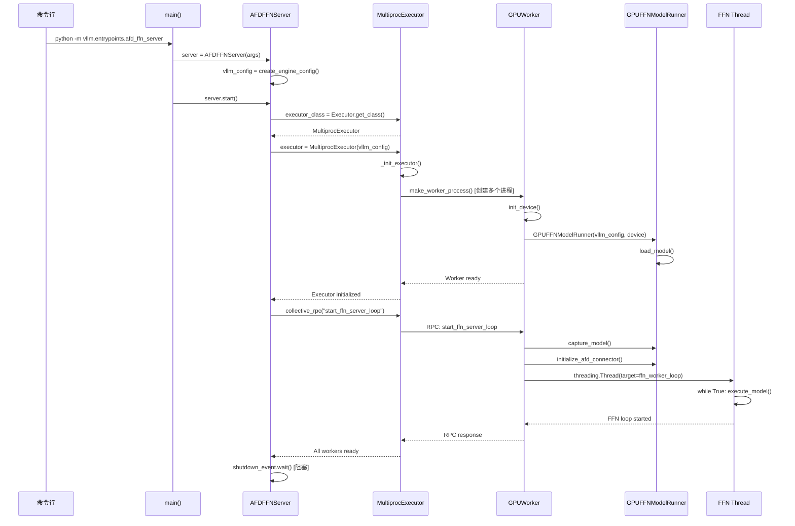

---

#### 方式二：EngineCore 包装启动 (core.py)

当 FFN Service 通过 Attention Service 的管理框架启动时，会使用 EngineCore 包装的方式。这种方式复用了 EngineCore 的握手机制和进程管理。

```
┌─────────────────────────────────────────────────────────────────────────┐
│  方式二启动流程 (通过 EngineCore)                                       │
│                                                                         │
│  启动入口: EngineCoreProc.run_engine_core()                             │
│  • 位置: vllm/v1/engine/core.py:828-877                                │
│  • 调用方式: Process(target=run_engine_core, args=(...))               │
└────────────────────────────┬────────────────────────────────────────────┘
                             │
                             ▼
┌─────────────────────────────────────────────────────────────────────────┐
│  Step 1: run_engine_core() 入口函数                                     │
│  ┌───────────────────────────────────────────────────────────────────┐  │
│  │ static run_engine_core(*args, dp_rank: int = 0, **kwargs)        │  │
│  │   core.py:828-877                                                │  │
│  │                                                                  │  │
│  │   # 设置进程标题和日志                                              │  │
│  │   set_process_title("EngineCore", f"DP{dp_rank}")                 │  │
│  │   decorate_logs()                                                 │  │
│  │                                                                  │  │
│  │   # 创建 EngineCoreProc 或 DPEngineCoreProc                        │  │
│  │   if parallel_config.data_parallel_size > 1:                      │  │
│  │       engine_core = DPEngineCoreProc(*args, **kwargs)            │  │
│  │   else:                                                           │  │
│  │       engine_core = EngineCoreProc(*args, **kwargs)              │  │
│  │                                                                  │  │
│  │   # 运行主循环                                                      │  │
│  │   engine_core.run_busy_loop()                                     │  │
│  └───────────────────────────────────────────────────────────────────┘  │
│                              │                                          │
│                              ▼                                          │
│  ┌───────────────────────────────────────────────────────────────────┐  │
│  │ Step 2: EngineCoreProc.__init__() - core.py:593-682              │  │
│  │                                                                  │  │
│  │   # 2.1 创建输入/输出队列                                           │  │
│  │   self.input_queue = queue.Queue()                                │  │
│  │   self.output_queue = queue.Queue()                              │  │
│  │                                                                  │  │
│  │   # 2.2 执行握手协议 (与 front-end 进程)                            │  │
│  │   with self._perform_handshakes(...) as addresses:                │  │
│  │       # HELLO 消息交换                                             │  │
│  │       # 接收初始化消息 (包含 ZMQ 地址)                              │  │
│  │       # 发送 READY 消息                                            │  │
│  │                                                                  │  │
│  │   # 2.3 初始化数据并行环境                                          │  │
│  │   self._init_data_parallel(vllm_config)                           │  │
│  │                                                                  │  │
│  │   # 2.4 创建输入/输出处理线程                                        │  │
│  │   input_thread = threading.Thread(target=process_input_sockets)    │  │
│  │   output_thread = threading.Thread(target=process_output_sockets)  │  │
│  │   input_thread.start()                                            │  │
│  │   output_thread.start()                                           │  │
│  │                                                                  │  │
│  │   # 2.5 调用父类 __init__                                           │  │
│  │   super().__init__(vllm_config, executor_class, log_stats, ...)   │  │
│  └───────────────────────────────────────────────────────────────────┘  │
│                              │                                          │
│                              ▼                                          │
│  ┌───────────────────────────────────────────────────────────────────┐  │
│  │ Step 3: EngineCore.__init__() - core.py:79-221                    │  │
│  │                                                                  │  │
│  │   # 3.1 创建 Executor                                               │  │
│  │   self.model_executor = executor_class(vllm_config)              │  │
│  │                                                                  │  │
│  │   # 3.2 【关键】检查是否为 FFN 服务器                               │  │
│  │   self.afd_config = vllm_config.afd_config                         │  │
│  │   if self.afd_config and self.afd_config.afd_role == "ffn":       │  │
│  │       return  # ⚠️ 提前返回，跳过后续初始化                         │  │
│  │                                                                  │  │
│  │   # 以下内容在 FFN 模式下会被跳过:                                  │  │
│  │   # - KV Cache 初始化                                               │  │
│  │   # - Scheduler 初始化                                              │  │
│  │   # - Batch Queue 初始化                                            │  │
│  │   # - Structured Output Manager 初始化                                │  │
│  └───────────────────────────────────────────────────────────────────┘  │
│                              │                                          │
│                              ▼                                          │
│  ┌───────────────────────────────────────────────────────────────────┐  │
│  │ Step 4: EngineCoreProc.run_busy_loop() - core.py:882-907         │  │
│  │                                                                  │  │
│  │   def run_busy_loop(self):                                          │  │
│  │       # 4.1 【关键】检查是否为 FFN 服务器模式                          │  │
│  │       if self.afd_config and self.afd_config.afd_role == "ffn":   │  │
│  │           logger.info("AFD FFN Server started...")                 │  │
│  │                                                                  │  │
│  │           # 4.2 启动 FFN 服务循环                                    │  │
│  │           self.model_executor.collective_rpc(                      │  │
│  │               "start_ffn_server_loop"                              │  │
│  │           )                                                          │  │
│  │                                                                  │  │
│  │           # 4.3 主线程阻塞等待                                        │  │
│  │           shutdown_event = threading.Event()                       │  │
│  │           shutdown_event.wait()                                     │  │
│  │                                                                  │  │
│  │           return  # 结束，不进入下面的主循环                          │  │
│  │                                                                  │  │
│  │       # 4.4 以下是 Attention 模式的主循环 (FFN 模式不执行)            │  │
│  │       while True:                                                    │  │
│  │           self._process_input_queue()  # 处理输入请求                │  │
│  │           self._process_engine_step()    # 执行引擎步骤              │  │
│  └───────────────────────────────────────────────────────────────────┘  │
│                              │                                          │
│                              ▼                                          │
│  ┌───────────────────────────────────────────────────────────────────┐  │
│  │ Step 5: Worker.start_ffn_server_loop() - gpu_worker.py:692-729    │  │
│  │   (后续流程与方式一相同)                                            │  │
│  │                                                                  │  │
│  │   # 5.1 捕获 CUDA Graph                                            │  │
│  │   self.model_runner.capture_model()                                │  │
│  │                                                                  │  │
│  │   # 5.2 初始化 AFD 连接器                                           │  │
│  │   self.model_runner.initialize_afd_connector()                     │  │
│  │                                                                  │  │
│  │   # 5.3 创建并启动 FFN 工作线程                                     │  │
│  │   self._ffn_thread = threading.Thread(target=ffn_worker_loop)     │  │
│  │   self._ffn_thread.start()                                        │  │
│  └───────────────────────────────────────────────────────────────────┘  │
└─────────────────────────────────────────────────────────────────────────┘
```

#### 两种方式对比总结

| 阶段 | 方式一 (独立进程) | 方式二 (EngineCore 包装) |
|------|-------------------|----------------------|
| **启动命令** | `python -m vllm.entrypoints.afd_ffn_server` | 通过 Attention Service 管理框架启动 |
| **入口文件** | `afd_ffn_server.py` | `core.py` 的 `run_engine_core()` |
| **创建 EngineCore** | ❌ 否 | ✅ 是 (`EngineCoreProc`/`DPEngineCoreProc`) |
| **握手协议** | ❌ 无 | ✅ 有 (ZMQ HELLO/READY 握手) |
| **输入/输出队列** | ❌ 无 | ✅ 有 (ZMQ socket + Queue) |
| **输入/输出线程** | ❌ 无 | ✅ 有 (process_input_sockets/process_output_sockets) |
| **Executor 创建** | ✅ 直接创建 | ✅ 通过 EngineCore 创建 |
| **FFN 服务循环** | ✅ `collective_rpc("start_ffn_server_loop")` | ✅ `collective_rpc("start_ffn_server_loop")` |
| **主线程等待** | ✅ `threading.Event().wait()` | ✅ `threading.Event().wait()` |
| **与 Attention Service 通信** | ✅ AFDConnector | ✅ AFDConnector |

**代码关键路径对比**:

```
方式一: afd_ffn_server.py
  └─ main()
      └─ AFDFFNServer()
          └─ start()
              └─ MultiprocExecutor(vllm_config)
                  └─ collective_rpc("start_ffn_server_loop")

方式二: core.py
  └─ run_engine_core()
      └─ EngineCoreProc.__init__()
          ├─ _perform_handshakes()  [ZMQ 握手]
          ├─ process_input_sockets thread
          ├─ process_output_sockets thread
          └─ EngineCore.__init__()
              └─ if afd_role == "ffn": return  [提前返回]
      └─ run_busy_loop()
          └─ if afd_role == "ffn":
              └─ collective_rpc("start_ffn_server_loop")
```
---

### 2.5.2 FFN Service 调用流程精华版

本节提供 FFN Service 两种启动方式的简化调用链，强调模块间关系而非内部实现细节。

#### 方式一：独立进程启动 (精华版)

```
命令行启动
python -m vllm.entrypoints.afd_ffn_server \
    --tensor-parallel-size 8 \
    --afd-config '{"afd_role": "ffn"}'
    │
    ▼
┌─────────────────────────────────────────────────────────────┐
│  AFDFFNServer (afd_ffn_server.py)                           │
│  • 创建 VllmConfig                                          │
│  • 启动服务循环                                              │
└────────────────────────┬────────────────────────────────────┘
                         │
                         ▼
┌─────────────────────────────────────────────────────────────┐
│  MultiprocExecutor (v1/executor/multiproc_executor.py)     │
│  • 创建 Worker 进程 (TP 个)                                  │
│  • 管理 Worker 生命周期                                       │
└────────────────────────┬────────────────────────────────────┘
                         │
        ┌────────────────┴────────────────┐
        ▼                                 ▼
┌──────────────────┐            ┌──────────────────┐
│   TP Rank 0      │            │   TP Rank 1      │
│  GPUWorker       │  ...       │  GPUWorker       │
│  │               │            │  │               │
│  ▼               │            │  ▼               │
│ GPUFFNModelRunner│            │ GPUFFNModelRunner│
│  │               │            │  │               │
│  ▼               │            │  ▼               │
│ AFDConnector     │            │ AFDConnector     │
└──────────────────┘            └──────────────────┘
        │                                 │
        └────────────────┬────────────────┘
                         ▼
        ┌──────────────────────────────────┐
        │  FFN 服务循环 (每个 Worker)       │
        │  ┌────────────────────────────┐   │
        │  │ recv_attn_output()         │   │
        │  │   (接收 Attention 数据)     │   │
        │  │         ▼                  │   │
        │  │ _execute_eager_mode()      │   │
        │  │   或                       │   │
        │  │ _execute_with_cuda_graph() │   │
        │  │   (FFN 计算)               │   │
        │  │         ▼                  │   │
        │  │ send_ffn_output()         │   │
        │  │   (返回 Attention 结果)     │   │
        │  └────────────────────────────┘   │
        │                                 │
        │  [持续循环，监听 Attention 请求]   │
        └──────────────────────────────────┘
```

#### 方式二：EngineCore 包装启动 (精华版)

```
系统启动 (通过 Attention Service 管理框架)
    │
    ▼
┌─────────────────────────────────────────────────────────────┐
│  Process.start(target=run_engine_core)                       │
│  (多进程启动)                                                  │
└────────────────────────┬────────────────────────────────────┘
                         │
                         ▼
┌─────────────────────────────────────────────────────────────┐
│  EngineCoreProc (core.py)                                     │
│  ┌─────────────────────────────────────────────────────────┐ │
│  │ 1. ZMQ 握手 (与 Front-end)                                │ │
│  │    HELLO → 初始化消息 → READY                             │ │
│  │                                                          │ │
│  │ 2. 启动 I/O 线程                                          │ │
│  │    • process_input_sockets thread                        │ │
│  │    • process_output_sockets thread                       │ │
│  │                                                          │ │
│  │ 3. 初始化 DP 环境                                         │ │
│  │    • stateless_init_dp_group()                           │ │
│  └─────────────────────────────────────────────────────────┘ │
│                          │                                      │
│                          ▼                                      │
│  ┌─────────────────────────────────────────────────────────┐ │
│  │ EngineCore.__init__                                      │ │
│  │   ├─ 创建 Executor                                         │ │
│  │   └─ 【关键】if afd_role == "ffn": return               │ │
│  │       (跳过 Scheduler、KV Cache 初始化)                    │ │
│  └─────────────────────────────────────────────────────────┘ │
└────────────────────────┬────────────────────────────────────┘
                         │
                         ▼
┌─────────────────────────────────────────────────────────────┐
│  run_busy_loop()                                             │
│  ┌─────────────────────────────────────────────────────────┐ │
│  │ 【关键】if afd_role == "ffn":                           │ │
│  │   ├─ collective_rpc("start_ffn_server_loop")            │ │
│  │   └─ threading.Event().wait()  [阻塞]                    │ │
│  │                                                          │ │
│  │ (Attention 模式下的主循环被跳过)                          │ │
│  └─────────────────────────────────────────────────────────┘ │
└────────────────────────┬────────────────────────────────────┘
                         │
                         ▼
              (后续流程与方式一相同)
        ┌──────────────────────────────────┐
        │  MultiprocExecutor              │
        │  • Worker 进程                   │
        │  • GPUFFNModelRunner             │
        │  • AFDConnector                  │
        │  • FFN 服务循环                   │
        └──────────────────────────────────┘
```

#### 两种方式启动对比简图

```
┌─────────────────────────────────────────────────────────────────────────┐
│                           启动方式对比                                    │
│                                                                         │
│  方式一：独立进程                              方式二：EngineCore 包装    │
│                                                                         │
│  ┌──────────────┐                          ┌──────────────┐          │
│  │ afd_ffn_server│                          │ run_engine_  │          │
│  │     .py      │                          │    core()    │          │
│  └──────┬───────┘                          └──────┬───────┘          │
│         │                                          │                   │
│         ▼                                          ▼                   │
│  ┌──────────────┐                          ┌──────────────┐          │
│  │AFDFFNServer  │                          │EngineCoreProc│          │
│  │              │                          │(含 ZMQ 握手) │          │
│  └──────┬───────┘                          └──────┬───────┘          │
│         │                                          │                   │
│         ▼                                          ▼                   │
│  ┌──────────────┐                          ┌──────────────┐          │
│  │MultiprocExec. │                          │EngineCore    │          │
│  │              │                          │(提前返回)    │          │
│  └──────┬───────┘                          └──────┬───────┘          │
│         │                                          │                   │
│         ▼                                          ▼                   │
│  ┌──────────────┐                          ┌──────────────┐          │
│  │   Worker     │◄────────────────────────►│   Worker     │          │
│  │(GPUFFNModel) │                          │(GPUFFNModel) │          │
│  └──────┬───────┘                          └──────────────┘          │
│         │                                                              │
│         ▼                                                              │
│  ┌─────────────────────────────────────────────────────────────────┐  │
│  │                      FFN 服务循环                                   │  │
│  │  recv_attn_output → FFN 计算 → send_ffn_output (持续监听)       │  │
│  └─────────────────────────────────────────────────────────────────┘  │
│                                                                         │
│  特点：简单直接                          特点：统一管理                │
│        独立部署                                与 Attention 共同管理        │
└─────────────────────────────────────────────────────────────────────────┘
```

#### 核心差异总结

| 特性 | 方式一：独立进程 | 方式二：EngineCore 包装 |
|------|---------------|----------------------|
| **启动复杂度** | 简单 | 复杂 (含握手) |
| **依赖组件** | 仅 Executor | EngineCore + Executor |
| **通信机制** | 仅 AFDConnector | ZMQ + AFDConnector |
| **适用场景** | 独立 FFN 服务 | 统一集群部署 |
| **进程管理** | 手动管理 | EngineCore 管理 |
| **监控集成** | 需自建 | 复用 EngineCore 监控 |

#### FFN 三层架构概览

```
┌─────────────────────────────────────────────────────────────────────────┐
│                    AFD FFN Service 三层架构                            │
│                                                                         │
│  ┌───────────────────────────────────────────────────────────────────┐  │
│  │ 第 1 层: 服务管理层 (仅方式二)                                          │  │
│  │  ┌──────────────┐        ┌──────────────┐        ┌──────────────┐  │  │
│  │  │run_engine_core│        │EngineCoreProc│        │ ZMQ Handshake│  │  │
│  │  │              │──►      │              │◄─────►│              │  │  │
│  │  │ (进程启动)    │        │(包装层)      │        │ (与Front-end)  │  │  │
│  │  └──────────────┘        └──────┬───────┘        └──────────────┘  │  │
│  │                                      │  (方式一无此层)            │  │  │
│  │  ┌──────────────────────────────────────────────────────────────┐  │  │
│  │  │ AFDFFNServer (方式一)                                       │  │  │
│  │  │ • 创建 VllmConfig                                           │  │  │
│  │  │ • 启动服务循环                                               │  │  │
│  │  └──────────────────────────────────────────────────────────────┘  │  │
│  └───────────────────────────────────────────────────────────────────┘  │
│                                │                                          │
│                                ▼                                          │
│  ┌───────────────────────────────────────────────────────────────────┐  │
│  │ 第 2 层: 执行管理层                                                  │  │
│  │  ┌────────────────────────────────────────────────────────────────┐ │  │
│  │  │ MultiprocExecutor                                            │ │  │
│  │  │   ├─ 创建 Worker 进程 (TP 个)                                 │ │  │
│  │  │   ├─ Worker 进程生命周期管理                                  │ │  │
│  │  │   └─ collective_rpc() 通信                                   │ │  │
│  │  └────────────────────────────────────────────────────────────────┘ │  │
│  └───────────────────────────────────────────────────────────────────┘  │
│                                │                                          │
│                                ▼                                          │
│  ┌───────────────────────────────────────────────────────────────────┐  │
│  │ 第 3 层: 计算服务层                                                  │  │
│  │  ┌────────────────────────────────────────────────────────────────┐ │  │
│  │  │ GPUWorker (每个 TP Rank)                                     │ │  │
│  │  │   ├─ init_device()                                            │ │  │
│  │  │   └─ 主循环: process_input_sockets ◄─► RPC 处理          │ │  │
│  │  └────────────────────────────────────────────────────────────────┘ │  │
│  │                          │                                       │  │
│  │  │                          ▼                                       │  │
│  │  │ ┌────────────────────────────────────────────────────────────────┐ │  │
│  │  │ GPUFFNModelRunner (FFN 专用)                                 │ │  │
│  │  │   ├─ capture_model() (CUDA Graph 捕获)                       │  │  │
│  │  │   ├─ initialize_afd_connector() (初始化连接)                 │ │  │  │
│  │  │   ├─ execute_model() (FFN 服务主循环)                         │  │  │
│  │  │   │   ├─ recv_attn_output() (接收 Attention 数据)           │  │  │
│  │  │   │   ├─ _execute_eager_mode() 或                              │  │  │
│  │  │   │   │ _execute_with_cuda_graph() (FFN 计算)             │  │  │
│  │  │   │   └─ send_ffn_output() (返回结果)                       │  │  │  │
│  │  │   └─ _ffn_thread (daemon 线程，持续监听)                    │ │  │
│  │  └────────────────────────────────────────────────────────────────┘ │  │
│  │                          │                                       │  │  │
│  │  │                          ▼                                       │  │  │
│  │  │ ┌────────────────────────────────────────────────────────────────┐ │  │
│  │  │ AFDConnector 通信层                                            │ │  │ │
│  │  │   ├─ recv_attn_output(): 接收 Attention 数据                     │ │  │ │
│  │  │   ├─ send_ffn_output(): 发送 FFN 结果回 Attention              │ │  │ │
│  │  │   └─ 网络: HCCL/P2P (张量) + Gloo (元数据)                │ │  │ │
│  │  └────────────────────────────────────────────────────────────────┘ │  │
│  └───────────────────────────────────────────────────────────────────┘  │
│                                                                         │
│  【关键差异】                                                            │
│  • 方式一: AFDFFNServer → MultiprocExecutor → Worker                     │
│  • 方式二: EngineCoreProc → MultiprocExecutor → Worker (含 ZMQ 层)      │
│  • 两者在第 3 层完全相同                                              │
└─────────────────────────────────────────────────────────────────────────┘
```

---

### FFN Service 架构概览

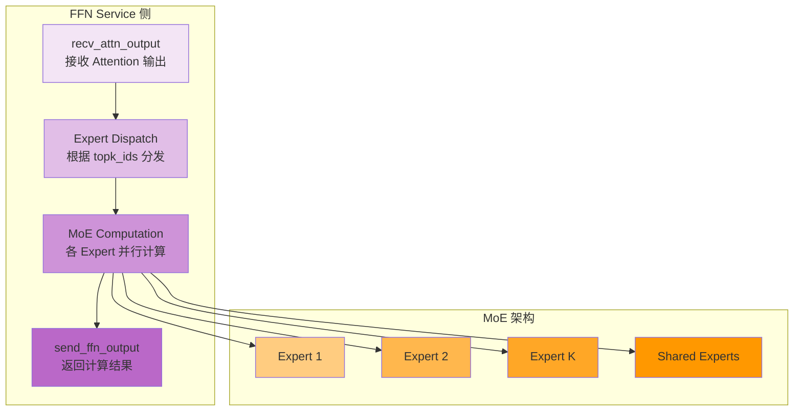

#### 三层架构概览

FFN Service 有两种启动方式，它们的架构层次不同：

---

##### 方式一：独立进程启动架构

```
┌─────────────────────────────────────────────────────────────────────────┐
│               AFD FFN Service 三层架构 (独立进程启动)                     │
│                                                                         │
│  启动命令: python -m vllm.entrypoints.afd_ffn_server <model> \          │
│            --tensor-parallel-size 8 --afd-config '{"afd_role": "ffn"}' │
│                                                                         │
│  ┌───────────────────────────────────────────────────────────────────┐  │
│  │ 第 1 层: 服务管理层                                                 │  │
│  │  ┌─────────────────────────────────────────────────────────────┐   │  │
│  │  │ AFDFFNServer (afd_ffn_server.py)                          │   │  │
│  │  │                                                             │   │  │
│  │  │  职责:                                                       │   │  │
│  │  │  • 创建 VllmConfig                                         │   │  │
│  │  │  • 创建 Executor 实例                                       │   │  │
│  │  │  • 调用 collective_rpc("start_ffn_server_loop")            │   │  │
│  │  │  • 适用于独立的 FFN Service 部署                            │   │  │
│  │  └─────────────────────────────────────────────────────────────┘   │  │
│  └───────────────────────────────────────────────────────────────────┘  │
│                                │                                          │
│                                ▼                                          │
│  ┌───────────────────────────────────────────────────────────────────┐  │
│  │ 第 2 层: 执行层                                                     │  │
│  │  ┌─────────────────────────────────────────────────────────────┐   │  │
│  │  │ MultiprocExecutor (或其他 Executor)                        │   │  │
│  │  │                                                             │   │  │
│  │  │  创建流程:                                                   │   │  │
│  │  │  1. Executor.get_class(vllm_config)                        │   │  │
│  │  │     • 根据 distributed_executor_backend 配置选择 Executor:   │   │  │
│  │  │       - "mp" (默认) → MultiprocExecutor                    │   │  │
│  │  │       - "ray" → RayDistributedExecutor                     │   │  │
│  │  │       - "uni" → UniProcExecutor                            │   │  │
│  │  │       - "external_launcher" → ExecutorWithExternalLauncher │   │  │
│  │  │                                                             │   │  │
│  │  │  2. executor_class(vllm_config=vllm_config)                │   │  │
│  │  │     • 创建 Executor 实例                                     │   │  │
│  │  │     • 调用 _init_executor() 初始化                          │   │  │
│  │  │                                                             │   │  │
│  │  │  3. MultiprocExecutor._init_executor()                     │   │  │
│  │  │     • world_size = tp_size × pp_size × pcp_size             │   │  │
│  │  │     • FFN Service 通常只用 TP，所以 world_size = tp_size     │   │  │
│  │  │     • 创建 world_size 个 Worker 进程 (即 EP Worker 数量)     │   │  │
│  │  │     • 初始化 TP Process Group (用于 EP 通信)                │   │  │
│  │  │     • 设置进程间通信 (Pipe, MessageQueue)                   │   │  │
│  │  │                                                             │   │  │
│  │  │  职责:                                                       │   │  │
│  │  │  • 创建并管理 EP Worker 进程 (数量 = tp_size)                │   │  │
│  │  │  • 实现 collective_rpc() 与 Worker 通信                     │   │  │
│  │  │  • 监控 Worker 健康状态                                     │   │  │
│  │  │                                                             │   │  │
│  │  │  【EP (Expert Parallel) 原理】                                │   │  │
│  │  │  • EP 通过 TP 实现：每个 TP Rank 处理不同的 Expert 子集      │   │  │
│  │  │  • enable_expert_parallel=True 时启用 EP                    │   │  │
│  │  │  • TP world_size = EP worker 数量                           │   │  │
│  │  │  • tensor_model_parallel_all_gather() 收集所有 EP 输出       │   │  │
│  │  └─────────────────────────────────────────────────────────────┘   │  │
│  └───────────────────────────────────────────────────────────────────┘  │
│                                │                                          │
│                                ▼                                          │
│  ┌───────────────────────────────────────────────────────────────────┐  │
│  │ 第 3 层: 计算通信层                                                  │  │
│  │  ┌────────────────────────────────────────────────────────────┐    │  │
│  │  │ GPUWorker (每个 TP Rank)                                   │    │  │
│  │  │   ├─ start_ffn_server_loop()                               │    │  │
│  │  │   │   ├─ capture_model()                                   │    │  │
│  │  │   │   ├─ initialize_afd_connector()                        │    │  │
│  │  │   │   └─ 启动 ffn_worker_loop 线程                          │    │  │
│  │  │   └─ 创建 GPUFFNModelRunner                                │    │  │
│  │  └────────────────────────────────────────────────────────────┘    │  │
│  │                          │                                       │  │
│  │                          ▼                                       │  │
│  │  ┌────────────────────────────────────────────────────────────┐    │  │
│  │  │ GPUFFNModelRunner (核心计算单元)                           │    │  │
│  │  │   ├─ recv_attn_output(): 接收 Attention 数据              │    │  │
│  │  │   ├─ _execute_eager_mode(): Eager 模式执行                 │    │  │
│  │  │   ├─ _execute_with_cuda_graph(): CUDA Graph 执行           │    │  │
│  │  │   ├─ Expert Dispatch: 根据 topk_ids 分发到各 Expert        │    │  │
│  │  │   ├─ MoE Computation: 各 Expert 并行计算                   │    │  │
│  │  │   └─ send_ffn_output(): 发送结果回 Attention Service       │    │  │
│  │  └────────────────────────────────────────────────────────────┘    │  │
│  │                          │                                       │  │
│  │                          ▼                                       │  │
│  │  ┌────────────────────────────────────────────────────────────┐    │  │
│  │  │ AFDConnector 通信层                                        │    │  │
│  │  │   ├─ init_afd_connector(): 初始化连接                      │    │  │
│  │  │   ├─ recv_attn_output(): 接收来自 Attention 的数据         │    │  │
│  │  │   ├─ send_ffn_output(): 发送 FFN 结果到 Attention          │    │  │
│  │  │   └─ 网络: HCCL + Gloo (与 Attention Service P2P 通信)     │    │  │
│  │  └────────────────────────────────────────────────────────────┘    │  │
│  └───────────────────────────────────────────────────────────────────┘  │
└─────────────────────────────────────────────────────────────────────────┘
```

---

##### 方式二：EngineCore 包装启动架构

```
┌─────────────────────────────────────────────────────────────────────────┐
│            AFD FFN Service 三层架构 (EngineCore 包装启动)                │
│                                                                         │
│  启动方式: 通过 Attention Service 管理框架启动                           │
│                                                                         │
│  ┌───────────────────────────────────────────────────────────────────┐  │
│  │ 第 1 层: 服务管理层                                                 │  │
│  │  ┌─────────────────────────────────────────────────────────────┐   │  │
│  │  │ EngineCoreProc (core.py)                                   │   │  │
│  │  │                                                             │   │  │
│  │  │  职责:                                                       │   │  │
│  │  │  1. ZMQ 握手 (与 Front-end)                                 │   │  │
│  │  │     • HELLO → 初始化消息 → READY                            │   │  │
│  │  │                                                             │   │  │
│  │  │  2. 启动 I/O 线程                                            │   │  │
│  │  │     • process_input_sockets thread                          │   │  │
│  │  │     • process_output_sockets thread                         │   │  │
│  │  │                                                             │   │  │
│  │  │  3. 初始化 DP 环境                                           │   │  │
│  │  │     • stateless_init_dp_group()                             │   │  │
│  │  │                                                             │   │  │
│  │  │  4. 创建 EngineCore                                         │   │  │
│  │  │     • 【关键】if afd_role == "ffn": return                  │   │  │
│  │  │     • 跳过 Scheduler、KV Cache 初始化                        │   │  │
│  │  │                                                             │   │  │
│  │  │  5. run_busy_loop()                                        │   │  │
│  │  │     • 【关键】if afd_role == "ffn":                        │   │  │
│  │  │     • collective_rpc("start_ffn_server_loop")              │   │  │
│  │  │     • threading.Event().wait() [阻塞]                       │   │  │
│  │  │                                                             │   │  │
│  │  │  【特点】                                                    │   │  │
│  │  │  • 复用 EngineCore 的握手机制和进程管理                     │   │  │
│  │  │  • 适用于统一管理的场景                                      │   │  │
│  │  └─────────────────────────────────────────────────────────────┘   │  │
│  └───────────────────────────────────────────────────────────────────┘  │
│                                │                                          │
│                                ▼                                          │
│  ┌───────────────────────────────────────────────────────────────────┐  │
│  │ 第 2 层: 执行层                                                     │  │
│  │  ┌─────────────────────────────────────────────────────────────┐   │  │
│  │  │ MultiprocExecutor (通过 EngineCore 创建)                    │   │  │
│  │  │                                                             │   │  │
│  │  │  职责:                                                       │   │  │
│  │  │  • 创建 TP 个 Worker 进程                                    │   │  │
│  │  │  • 管理 Worker 生命周期                                     │   │  │
│  │  │  • 实现 collective_rpc() 与 Worker 通信                     │   │  │
│  │  │                                                             │   │  │
│  │  │  【TP 并行】                                                  │   │  │
│  │  │  • 每个 TP Rank 独立运行 FFN 计算                            │   │  │
│  │  │  • 通过 TP Process Group 同步                               │   │  │
│  │  └─────────────────────────────────────────────────────────────┘   │  │
│  └───────────────────────────────────────────────────────────────────┘  │
│                                │                                          │
│                                ▼                                          │
│  ┌───────────────────────────────────────────────────────────────────┐  │
│  │ 第 3 层: 计算通信层 (与方式一相同)                                   │  │
│  │  ┌────────────────────────────────────────────────────────────┐    │  │
│  │  │ GPUWorker (每个 TP Rank)                                   │    │  │
│  │  │   ├─ start_ffn_server_loop()                               │    │  │
│  │  │   │   ├─ capture_model()                                   │    │  │
│  │  │   │   ├─ initialize_afd_connector()                        │    │  │
│  │  │   │   └─ 启动 ffn_worker_loop 线程                          │    │  │
│  │  │   └─ 创建 GPUFFNModelRunner                                │    │  │
│  │  └────────────────────────────────────────────────────────────┘    │  │
│  │                          │                                       │  │
│  │                          ▼                                       │  │
│  │  ┌────────────────────────────────────────────────────────────┐    │  │
│  │  │ GPUFFNModelRunner (核心计算单元)                           │    │  │
│  │  │   ├─ recv_attn_output(): 接收 Attention 数据              │    │  │
│  │  │   ├─ _execute_eager_mode(): Eager 模式执行                 │    │  │
│  │  │   ├─ _execute_with_cuda_graph(): CUDA Graph 执行           │    │  │
│  │  │   ├─ Expert Dispatch: 根据 topk_ids 分发到各 Expert        │    │  │
│  │  │   ├─ MoE Computation: 各 Expert 并行计算                   │    │  │
│  │  │   └─ send_ffn_output(): 发送结果回 Attention Service       │    │  │
│  │  └────────────────────────────────────────────────────────────┘    │  │
│  │                          │                                       │  │
│  │                          ▼                                       │  │
│  │  ┌────────────────────────────────────────────────────────────┐    │  │
│  │  │ AFDConnector 通信层                                        │    │  │
│  │  │   ├─ init_afd_connector(): 初始化连接                      │    │  │
│  │  │   ├─ recv_attn_output(): 接收来自 Attention 的数据         │    │  │
│  │  │   ├─ send_ffn_output(): 发送 FFN 结果到 Attention          │    │  │
│  │  │   └─ 网络: HCCL + Gloo (与 Attention Service P2P 通信)     │    │  │
│  │  └────────────────────────────────────────────────────────────┘    │  │
│  └───────────────────────────────────────────────────────────────────┘  │
└─────────────────────────────────────────────────────────────────────────┘
```

---

##### 两种启动方式对比

| 对比维度 | 方式一: 独立进程启动 | 方式二: EngineCore 包装 |
|---------|---------------------|------------------------|
| **启动入口** | `afd_ffn_server.py` | `run_engine_core()` |
| **第 1 层组件** | AFDFFNServer | EngineCoreProc |
| **ZMQ 握手** | ❌ 无 | ✅ 有 (与 Front-end) |
| **DP 环境初始化** | ❌ 无 | ✅ stateless_init_dp_group() |
| **I/O 线程** | ❌ 无 | ✅ input/output sockets threads |
| **Scheduler 初始化** | ❌ 无 | ❌ 跳过 (afd_role=="ffn") |
| **KV Cache 初始化** | ❌ 无 | ❌ 跳过 (afd_role=="ffn") |
| **第 2、3 层** | ✅ 完全相同 | ✅ 完全相同 |
| **适用场景** | 独立部署 FFN Service | 统一管理、与 Attention Service 协同启动 |

**核心差异**：两种启动方式仅在第 1 层不同，第 2、3 层完全相同。方式一更简洁，方式二复用了 EngineCore 的管理框架。

#### 核心组件职责

| 组件 | 职责 | AFD 特定 |
|------|------|----------|
| **AFDFFNServer** | 独立进程启动入口 | 创建 VllmConfig，直接创建 Executor，启动服务循环 |
| **EngineCoreProc** | 包装启动模式 | ZMQ 握手，DP 环境初始化，跳过 Scheduler/KVCache |
| **MultiprocExecutor** | Worker 进程管理 | 创建 TP 个 GPUWorker 进程 |
| **GPUWorker** | Worker 实现 | start_ffn_server_loop() 启动 FFN 服务循环 |
| **GPUFFNModelRunner** | FFN 模型执行器 | MoE FFN 计算，CUDA Graph 优化，与 Attention Service 通信 |
| **AFDConnector** | 通信层 | 与 Attention Service 的 P2P 通信 |

### 执行流程详解

```
┌─────────────────────────────────────────────────────────────────────────┐
│  FFN Service 执行流程                                                      │
│                                                                         │
│  ┌───────────────────────────────────────────────────────────────────┐  │
│  │ 主循环: execute_model() - 持续监听并处理 FFN 请求                  │  │
│  │   while True:                                                      │  │
│  │       1. profiler.step() - 性能监控                                │  │
│  │       2. recv_attn_output() - 接收 Attention 输出                   │  │
│  │       3. execute_ffn() - 执行 FFN 计算                            │  │
│  │       4. send_ffn_output() - 发送结果回 Attention               │  │
│  │       5. _counter += 1 - 更新计数器                               │  │
│  └───────────────────────────────────────────────────────────────────┘  │
│                              │                                          │
│                              ▼                                          │
│  ┌───────────────────────────────────────────────────────────────────┐  │
│  │ Step 1: recv_attn_output() - 接收 Attention 输出                     │  │
│  │   hidden_states, recv_metadata = self.connector.recv_attn_output()│  │
│  │   • hidden_states: [num_tokens, hidden_dim]                       │  │
│  │   • recv_metadata.layer_idx: 当前层索引                            │  │
│  │   • recv_metadata.stage_idx: 当前 stage 索引                      │  │
│  │   • recv_metadata.recv_handle_list: 等待 handle (异步)          │  │
│  └───────────────────────────────────────────────────────────────────┘  │
│                              │                                          │
│                              ▼                                          │
│  ┌───────────────────────────────────────────────────────────────────┐  │
│  │ Step 2: 等待异步操作 (可选)                                          │  │
│  │   if recv_metadata.recv_handle_list is not None:                │  │
│  │       for work in recv_metadata.recv_handle_list:                 │  │
│  │           work.wait()  # 等待异步操作完成                            │  │
│  └───────────────────────────────────────────────────────────────────┘  │
│                              │                                          │
│                              ▼                                          │
│  ┌───────────────────────────────────────────────────────────────────┐  │
│  │ Step 3: CUDA Graph 查找                                                │  │
│  │   cuda_graph_info = self._find_cuda_graph(                        │  │
│  │       current_layer_idx, num_tokens                                │  │
│  │   )                                                              │  │
│  │   if cuda_graph_info is not None:                                │  │
│  │       使用 CUDA Graph 执行 (优化)                                 │  │
│  │   else:                                                          │  │
│  │       使用 eager mode 执行                                        │  │
│  └───────────────────────────────────────────────────────────────────┘  │
│                              │                                          │
│                              ▼                                          │
│  ┌───────────────────────────────────────────────────────────────────┐  │
│  │ Step 4: FFN 计算 (Eager 或 CUDA Graph)                               │  │
│  │   rank_ffn_output = self._execute_eager_mode(                       │  │
│  │       hidden_states, current_layer_idx                             │  │
│  │   ) 或                                                           │  │
│  │   rank_ffn_output = self._execute_with_cuda_graph(                 │  │
│  │       hidden_states, cuda_graph_info                             │  │  │  │  │
│  │   )                                                              │  │
│  │   • Expert Dispatch: 根据 topk_ids 分发到各 Expert                 │  │
│  │   • MoE Computation: 各 Expert 并行计算                            │  │  │
│  │   • Result Assembly: 汇总各 Expert 输出                            │  │
│  └───────────────────────────────────────────────────────────────────┘  │
│                              │                                          │
│                              ▼                                          │
│  ┌───────────────────────────────────────────────────────────────────┐  │
│  │ Step 5: send_ffn_output() - 发送结果回 Attention                   │  │
│  │   self.connector.send_ffn_output(                                   │  │
│  │       rank_ffn_output, recv_metadata                              │  │
│  │   )                                                              │  │
│  │   • 发送: rank_ffn_output: [num_tokens, hidden_dim]               │  │
│  │   • metadata: 包含 layer_idx, stage_idx 等                        │  │
│  └───────────────────────────────────────────────────────────────────┘  │
│                              │                                          │
│                              ▼                                          │
│  ┌───────────────────────────────────────────────────────────────────┐  │
│  │ Step 6: 循环计数器重置                                               │  │
│  │   self._counter += 1                                              │  │
│  │   if self._counter == num_layers * num_afd_stages:               │  │
│  │       self._counter = 0  # 重置计数器                              │  │
│  └───────────────────────────────────────────────────────────────────┘  │
└─────────────────────────────────────────────────────────────────────────┘
```

### MoE 计算流程

```
┌─────────────────────────────────────────────────────────────────────────┐
│  MoE FFN 计算流程                                                          │
│                                                                         │
│  输入: hidden_states: [num_tokens, hidden_dim]                           │
│        topk_ids: [num_tokens, top_k]                                   │
│        topk_weights: [num_tokens, top_k]                               │
│                                                                         │
│  ┌───────────────────────────────────────────────────────────────────┐  │
│  │ Expert Dispatch (Expert 分发)                                      │  │
│  │   for token_idx in range(num_tokens):                              │  │
│  │       for expert_idx in range(top_k):                             │  │
│  │           expert_id = topk_ids[token_idx, expert_idx]               │  │
│  │           expert_input = hidden_states[token_idx]                 │  │
│  │           dispatch_to_expert(expert_id, expert_input)            │  │
│  └───────────────────────────────────────────────────────────────────┘  │
│                              │                                          │
│                              ▼                                          │
│  ┌───────────────────────────────────────────────────────────────────┐  │
│  │ Parallel Expert Computation (Expert 并行计算)                       │  │
│  │   Expert 1: FFN(hidden_states_expert_1) → output_1                   │  │
│  │   Expert 2: FFN(hidden_states_expert_2) → output_2                   │  │
│  │   ...                                                            │  │
│  │   Expert K: FFN(hidden_states_expert_K) → output_K                   │  │
│  │   Shared Experts: FFN(shared_hidden_states) → shared_output       │  │
│  └───────────────────────────────────────────────────────────────────┘  │
│                              │                                          │
│                              ▼                                          │
│  ┌───────────────────────────────────────────────────────────────────┐  │
│  │ Result Assembly (结果汇总)                                         │  │
│  │   for token_idx in range(num_tokens):                              │  │
│  │       token_output = weighted_sum(                                 │  │
│  │           output_1[token_idx] * topk_weights[token_idx, 0],        │  │
│  │           output_2[token_idx] * topk_weights[token_idx, 1],        │  │
│  │           ...                                                        │  │
│  │           output_K[token_idx] * topk_weights[token_idx, K-1],       │  │
│  │       )                                                           │  │
│  │   final_output[token_idx] = token_output + residual              │  │
│  │   return final_output                                              │  │
│  └───────────────────────────────────────────────────────────────────┘  │
└─────────────────────────────────────────────────────────────────────────┘
```

### 关键文件位置

| 文件 | 行号 | 类/函数 | 描述 |
|------|------|---------|------|
| `vllm/v1/worker/gpu_ffn_model_runner.py` | 33-177 | `GPUFFNModelRunner` | FFN 模型运行器主类 |
| `vllm/v1/worker/gpu_ffn_model_runner.py` | 124-177 | `execute_model()` | FFN 执行主循环 |
| `vllm/v1/worker/gpu_ffn_model_runner.py` | 179-260 | `_execute_with_cuda_graph()` | CUDA Graph 执行 |
| `vllm/v1/worker/gpu_ffn_model_runner.py` | 262-320 | `_execute_eager_mode()` | Eager 模式执行 |
| `vllm/vllm/distributed/afd_transfer/afd_connector/base.py` | 122-139 | `recv_attn_output()` | 接收 Attention 输出 |
| `vllm/vllm/distributed/afd_transfer/afd_connector/base.py` | 141-175 | `send_ffn_output()` | 发送 FFN 结果 |

### AFD Service 对比

| 特性 | Attention Service | FFN Service |
|------|-------------------|-------------|
| **角色** | `afd_role='attention'` | `afd_role='ffn'` |
| **ModelRunner** | `GPUModelRunner` | `GPUFFNModelRunner` |
| **核心操作** | Attention + Expert Selection | MoE FFN 计算 |
| **发送方法** | `send_attn_output()` | `send_ffn_output()` |
| **接收方法** | `recv_ffn_output()` | `recv_attn_output()` |
| **输出** | `ModelRunnerOutput` | None (通过连接器返回) |
| **启动入口** | `afd_ffn_server.py` | `afd_ffn_server.py` (分离角色) |

### 端到端数据流

```
┌─────────────────────────────────────────────────────────────────────────┐
│  AFD 端到端数据流: Attention Service ↔ FFN Service                          │
│                                                                         │
│  1. Attention Service 完成 Attention 计算                                │
│     ├─ hidden_states: [num_tokens, hidden_dim]                          │
│     ├─ topk_ids: [num_tokens, top_k]                                   │
│     └─ topk_weights: [num_tokens, top_k]                               │
│                                │                                          │
│                                ▼                                          │
│  2. send_attn_output() → 网络通信 → recv_attn_output()                     │
│     ├─ metadata.layer_idx: 当前层索引                                  │
│     ├─ metadata.stage_idx: 当前 stage 索引                               │
│     ├─ metadata.seq_len: 序列长度                                      │
│     └─ metadata.connector_data.handle: 异步 handle (可选)              │
│                                │                                          │
│                                ▼                                          │
│  3. FFN Service 接收数据并分发到 Experts                                  │
│     ├─ 根据 topk_ids 分发 hidden_states 到各 Expert                     │
│     ├─ Expert 1 处理: FFN(hidden_states_expert_1)                       │
│     ├─ Expert 2 处理: FFN(hidden_states_expert_2)                       │
│     └─ ... Expert K 处理: FFN(hidden_states_expert_K)                      │
│                                │                                          │
│                                ▼                                          │
│  4. send_ffn_output() → 网络通信 → recv_ffn_output()                      │
│     rank_ffn_output: [num_tokens, hidden_dim]                            │
│                                │                                          │
│                                ▼                                          │
│  5. Attention Service 接收结果并继续                                     │
│     hidden_states = recv_hidden_states                                │
│     继续下一层或进入采样流程                                               │
└─────────────────────────────────────────────────────────────────────────┘
```

---

## 2.6 Ray 模式架构

vLLM 支持 **Ray Actor** 模式进行数据并行部署，与多进程模式相比具有更强的分布式能力和弹性扩展能力。

### Ray 模式 vs 多进程模式

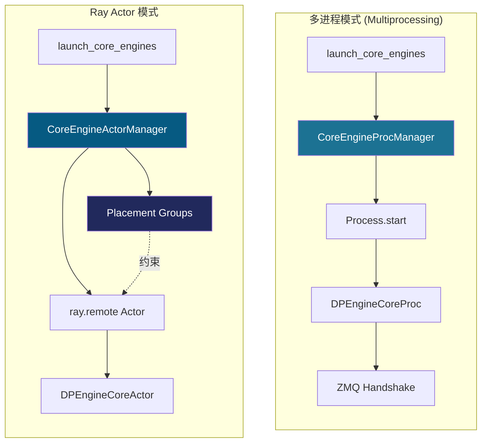

### 对比表

| 特性 | 多进程模式 | Ray Actor 模式 |
|------|-----------|---------------|
| **管理器** | `CoreEngineProcManager` | `CoreEngineActorManager` |
| **执行单元** | `multiprocessing.Process` | `ray.remote(DPEngineCoreActor)` |
| **跨节点部署** | ❌ 不支持 | ✅ 支持 |
| **弹性扩缩容** | ❌ 不支持 | ✅ 支持 (`scale_up_elastic_ep`) |
| **资源管理** | 手动设置 CUDA_VISIBLE_DEVICES | Placement Groups 自动分配 |
| **握手机制** | ZMQ socket 握手 | 无需握手，地址已知 |
| **故障恢复** | 进程崩溃需重启 | Ray 自动重启 Actor |
| **文件位置** | utils.py:81-227 | utils.py:228-756 |

### Ray 模式核心组件

#### 2.4.1 CoreEngineActorManager

**文件**: `vllm/v1/engine/utils.py` (228-756行)

**职责**:
| 功能 | 描述 |
|------|------|
| **Actor 创建** | 使用 `ray.remote(DPEngineCoreActor)` 创建分布式 Actor |
| **Placement Group 管理** | 创建和管理 Placement Groups 用于资源分配 |
| **跨节点部署** | 支持本地和远程 Actor 的混合部署 |
| **弹性扩缩容** | `scale_up_elastic_ep()` 运行时增加 DP 数量 |

**初始化流程**:
```python
class CoreEngineActorManager:
    def __init__(
        self,
        vllm_config: VllmConfig,
        addresses: EngineZmqAddresses,
        executor_class: type[Executor],
        log_stats: bool,
        placement_groups: list["PlacementGroup"] | None = None,
        local_dp_ranks: list[int] | None = None,
    ):
        # 1. 初始化 Ray
        ray.init()

        # 2. 创建 Placement Groups
        if placement_groups is None:
            placement_groups, local_dp_ranks = (
                self.create_dp_placement_groups(vllm_config)
            )

        # 3. 为每个 DP rank 创建 Actor
        for index, local_index, pg in zip(
            range(dp_size), local_dp_ranks, placement_groups
        ):
            actor = (
                ray.remote(DPEngineCoreActor)
                .options(
                    scheduling_strategy=PlacementGroupSchedulingStrategy(
                        placement_group=pg,
                        placement_group_bundle_index=world_size,
                    ),
                    runtime_env=runtime_env,
                )
                .remote(
                    vllm_config=dp_vllm_config,
                    executor_class=executor_class,
                    log_stats=log_stats,
                    local_client=local_client,
                    addresses=addresses,
                    dp_rank=index,
                    local_dp_rank=local_index,
                )
            )
```

#### 2.4.2 Placement Groups 策略

Ray 模式支持三种 Placement Group 打包策略：

| 策略 | 说明 | 适用场景 |
|------|------|---------|
| **strict** | 每个 DP rank 的所有 GPU 在同一节点 | 单机多卡或均匀分布的多机 |
| **fill** | 尽可能填满每个节点的资源 | 资源利用率优先 |
| **span** | 单个 DP rank 跨多个节点 | 超大规模模型 |

**示例**: 8 卡模型，DP=4，2 节点

```
strict 策略:
┌─────────────┐  ┌─────────────┐
│  Node 0     │  │  Node 1     │
│ DP0: [0,1]  │  │ DP1: [0,1]  │
│ DP2: [2,3]  │  │ DP3: [2,3]  │
└─────────────┘  └─────────────┘

fill 策略 (假设每节点 4 卡):
┌─────────────┐  ┌─────────────┐
│  Node 0     │  │  Node 1     │
│ DP0: [0,1]  │  │ DP1: [0,1]  │
│ DP1: [2,3]  │  │ DP2: [2,3]  │
└─────────────┘  └─────────────┘

span 策略 (跨节点):
┌─────────────┐  ┌─────────────┐
│  Node 0     │  │  Node 1     │
│ DP0: [0,1,2,3] ←────→ [0,1,2,3] │
└─────────────┘  └─────────────┘
```

#### 2.4.3 DPEngineCoreActor

**文件**: `vllm/v1/engine/core.py` (1385-1493行)

**继承关系**:
```
EngineCore (基础引擎核心)
└── EngineCoreProc (ZMQ 包装器)
    └── DPEngineCoreProc (DP 扩展)
        └── DPEngineCoreActor (Ray Actor 版本)
```

**关键差异**:

| 特性 | DPEngineCoreProc | DPEngineCoreActor |
|------|-----------------|-------------------|
| **创建方式** | `Process(target=run_engine_core)` | `ray.remote(DPEngineCoreActor)` |
| **设备设置** | 进程创建时设置 CUDA_VISIBLE_DEVICES | Actor __init__ 中设置 |
| **握手** | ZMQ socket 实际握手 | 简化为 yield addresses |
| **初始化等待** | Process join | `ray.get(actor.wait_for_init.remote())` |

**Ray 特有处理**:
```python
class DPEngineCoreActor(DPEngineCoreProc):
    def __init__(self, vllm_config, local_client, addresses, ...):
        # CUDA_VISIBLE_DEVICES 在 Ray 中的特殊处理
        self._set_visible_devices(vllm_config, local_dp_rank)
        super().__init__(vllm_config, local_client, "", ...)

    def _set_cuda_visible_devices(self, vllm_config, local_dp_rank, device_control_env_var):
        # 计算并设置可见设备
        value = get_device_indices(
            device_control_env_var, local_dp_rank, world_size
        )
        os.environ[device_control_env_var] = value

    @contextmanager
    def _perform_handshakes(self, handshake_address, identity, ...):
        # Ray 模式无需实际握手
        yield self.addresses

    def wait_for_init(self):
        # 空方法，ray.get() 保证 __init__ 完成
        pass
```

### Ray 模式启动流程

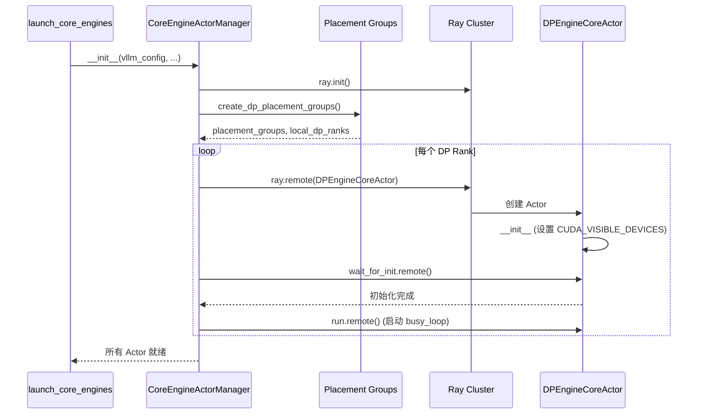

### 弹性扩缩容

Ray 模式支持运行时动态增加 DP 数量：

```python
def scale_up_elastic_ep(
    self, cur_vllm_config: VllmConfig, new_data_parallel_size: int
) -> None:
    """运行时增加 DP 数量"""
    # 1. 计算需要新增的 DP 数量
    num_pg_to_create = new_data_parallel_size - old_dp_size

    # 2. 为新 DP 创建 Placement Groups
    new_placement_groups, new_local_dp_ranks = (
        self.add_dp_placement_groups(old_vllm_config, new_data_parallel_size)
    )

    # 3. 创建新的 Actor
    for pg, local_dp_rank in zip(new_placement_groups, new_local_dp_ranks):
        new_actor = ray.remote(DPEngineCoreActor).options(...).remote(...)
        self.remote_engine_actors.append(new_actor)
        self.run_refs.append(new_actor.run.remote())
```

### 环境变量配置

```bash
# Ray DP 打包策略
export VLLM_RAY_DP_PACK_STRATEGY=strict  # strict | fill | span

# 弹性扩容
export VLLM_ELASTIC_EP_SCALE_UP_LAUNCH=1
```

### 关键代码位置

| 文件 | 行号 | 类/函数 | 描述 |
|------|------|---------|------|
| `vllm/v1/engine/utils.py` | 228-756 | `CoreEngineActorManager` | Ray Actor 管理器 |
| `vllm/v1/engine/utils.py` | 348-529 | `create_dp_placement_groups()` | 创建 Placement Groups |
| `vllm/v1/engine/utils.py` | 531-616 | `add_dp_placement_groups()` | 弹性扩容添加 PG |
| `vllm/v1/engine/utils.py` | 618-756 | `scale_up_elastic_ep()` | 弹性扩容实现 |
| `vllm/v1/engine/core.py` | 1385-1493 | `DPEngineCoreActor` | Ray Actor 包装器 |
| `vllm/v1/engine/core.py` | 1425-1452 | `_set_cuda_visible_devices()` | 设备设置 |

### Ray 模式优势

| 优势 | 说明 |
|------|------|
| **跨节点部署** | 支持多机分布式部署 |
| **弹性扩缩容** | 运行时动态调整 DP 数量 |
| **自动容错** | Ray 自动重启失败的 Actor |
| **资源调度** | Placement Groups 自动分配资源 |
| **简化握手** | 无需 ZMQ 握手，地址已知 |
| **统一管理** | Ray 提供统一的集群管理 |

---

## 3. 核心模块详解

### 3.1 DPCoordinator - DP 协调器

**文件**: `vllm/v1/engine/coordinator.py` (22-378行)

**职责**:
| 功能 | 描述 |
|------|------|
| 📊 **统计收集** | 收集每个 DP engine 的队列长度、请求数量 |
| 🔄 **Wave 状态管理** | 跟踪请求 wave 编号，协调运行/暂停状态 |
| 📡 **消息广播** | 发送 START_DP_WAVE 消息唤醒 engines |
| ⚖️ **负载均衡** | 发布统计信息供前端做负载决策 |

**架构位置**:
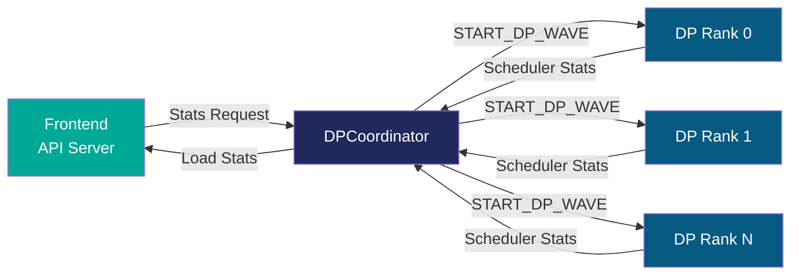

**关键方法**:
```python
class DPCoordinator:
    def __init__(self, parallel_config: ParallelConfig):
        # 创建独立的协调器进程
        self.proc = multiprocessing.Process(
            target=DPCoordinatorProc.run_coordinator,
            ...
        )

    def process_input_socket(self, ...):
        # 处理来自 engines 的统计信息
        if scheduler_stats:
            stats[0] = scheduler_stats.num_waiting_reqs
            stats[1] = scheduler_stats.num_running_reqs

        # 处理 wave 完成通知
        if wave_complete is not None:
            current_wave = wave + 1
            engines_running = False
```

### 3.2 Engine Manager - 进程/Actor 管理器

#### 3.2.1 CoreEngineProcManager - 多进程管理器

**文件**: `vllm/v1/engine/utils.py` (81-227行)

**职责**: 创建和管理多个 EngineCore 进程

| 方法 | 功能 |
|------|------|
| `__init__()` | 初始化，启动多个进程 |
| `wait_until_ready()` | 等待所有进程完成握手 |
| `get_output_addrs()` | 获取输出地址 |
| `close()` | 关闭所有进程 |

#### 3.2.2 CoreEngineActorManager - Ray Actor 管理器

**文件**: `vllm/v1/engine/utils.py` (228-756行)

**职责**: 使用 Ray 创建和管理分布式 Actor

| 方法 | 功能 |
|------|------|
| `__init__()` | 初始化 Ray，创建 Placement Groups 和 Actors |
| `create_dp_placement_groups()` | 创建资源分配的 Placement Groups |
| `add_dp_placement_groups()` | 弹性扩容时添加新的 Placement Groups |
| `scale_up_elastic_ep()` | 运行时增加 DP 数量 |
| `wait_until_ready()` | 等待所有 Actor 初始化完成 |
| `close()` | 关闭所有 Actors |

#### 管理器对比表

| 特性 | CoreEngineProcManager | CoreEngineActorManager |
|------|----------------------|------------------------|
| **部署模式** | 多进程 (multiprocessing) | Ray Actor |
| **适用场景** | 单机多 DP | 多机分布式 |
| **启动方式** | `multiprocessing.Process` | `ray.remote(DPEngineCoreActor)` |
| **跨节点** | ❌ 不支持 | ✅ 支持 |
| **弹性扩缩容** | ❌ 不支持 | ✅ 支持 |
| **资源管理** | 手动设置环境变量 | Placement Groups 自动分配 |
| **握手机制** | ZMQ socket 实际握手 | 简化为 yield addresses |
| **故障恢复** | 需手动重启 | Ray 自动重启 Actor |
| **文件位置** | utils.py:81-227 | utils.py:228-756 |

**初始化流程**:
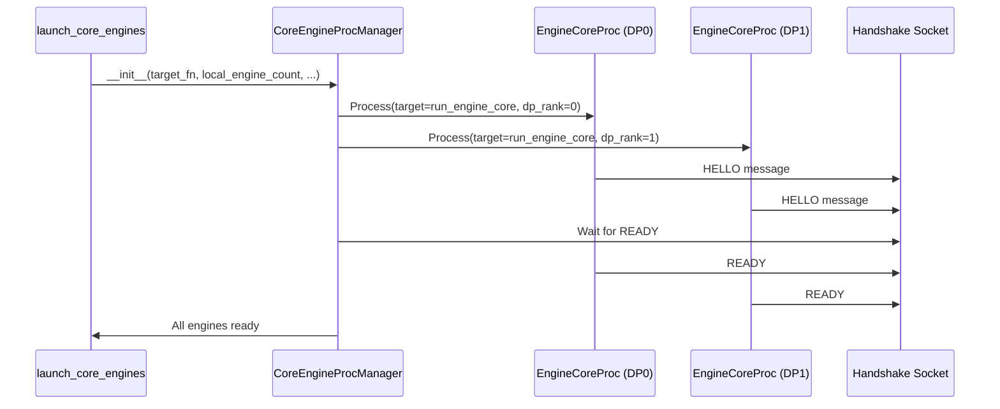

### 3.3 EngineCoreClient - 客户端实现

**文件**: `vllm/v1/engine/core_client.py` (61-1415行)

**类层次结构**:
```
EngineCoreClient (ABC)
├── InprocClient (单进程内模式)
├── MPClient (多进程模式)
│   ├── SyncMPClient (同步多进程客户端)
│   ├── AsyncMPClient (异步多进程客户端)
│   ├── DPAsyncMPClient (DP 异步客户端)
│   └── DPLBAsyncMPClient (带负载均衡的 DP 客户端)
└── (其他实现...)
```

**关键功能**:
| 功能 | 方法 | 描述 |
|------|------|------|
| 请求添加 | `add_request()` | 添加请求到 EngineCore |
| 请求中止 | `abort_requests()` | 中止指定请求 |
| 获取输出 | `get_output()` | 获取 EngineCore 输出 |
| 动态扩缩容 | `scale_elastic_ep()` | 弹性调整 DP 数量 |

### 3.4 DPEngineCoreProc - DP Engine Core

**文件**: `vllm/v1/engine/core.py` (1159-1382行)

**继承关系**:
```
EngineCore (基础引擎核心)
└── EngineCoreProc (ZMQ 包装器，后台进程运行)
    └── DPEngineCoreProc (数据并行扩展)
        └── DPEngineCoreActor (Ray Actor 版本)
```

**DP 特有功能**:
```python
class DPEngineCoreProc(EngineCoreProc):
    def __init__(self, ...):
        # DP 特有状态
        self.step_counter = 0          # 步数计数器
        self.current_wave = 0          # 当前 wave 编号
        self.last_counts = (0, 0)      # 上次统计

    def _has_global_unfinished_reqs(self, local_unfinished: bool) -> bool:
        # 每 32 步进行一次 all-reduce 同步
        self.step_counter += 1
        if self.step_counter % 32 != 0:
            return True
        return ParallelConfig.has_unfinished_dp(self.dp_group, local_unfinished)

    def add_request(self, request: Request, request_wave: int = 0):
        # 检查 wave 编号，处理过期请求
        if request_wave != self.current_wave:
            if request_wave > self.current_wave:
                self.current_wave = request_wave
            elif not self.engines_running:
                # 通知前端需要开始下一个 wave
                self.output_queue.put_nowait(
                    (-1, EngineCoreOutputs(start_wave=self.current_wave))
                )
```

### 3.5 AsyncLLM - OpenAI 兼容 API 服务器

**文件**: `vllm/v1/engine/async_llm.py` (54-867行)

**核心职责**:
| 功能 | 方法 | 描述 |
|------|------|------|
| **流式生成** | `generate()` | AsyncGenerator[RequestOutput] - OpenAI 兼容的流式 API |
| **编码** | `encode()` | AsyncGenerator[PoolingRequestOutput] - 嵌入编码 |
| **添加请求** | `add_request()` | 异步添加请求到队列 |
| **中止请求** | `abort()` | 异步中止指定请求 |
| **弹性扩展** | `scale_elastic_ep()` | 运行时动态调整 DP 数量 |
| **暂停/恢复** | `pause_generation()` / `resume_generation()` | 模型权重更新时暂停/恢复 |

**异步流式输出流程**:
```python
class AsyncLLM(EngineClient):
    async def generate(
        self,
        prompt: PromptType,
        sampling_params: SamplingParams,
        request_id: str,
        *,
        data_parallel_rank: int | None = None,
    ) -> AsyncGenerator[RequestOutput, None]:
        """流式生成请求 - OpenAI 兼容 API"""
        # 1. 添加请求
        q = await self.add_request(request_id, prompt, sampling_params, ...)

        # 2. 从队列流式获取输出
        while not finished:
            out = q.get_nowait() or await q.get()
            finished = out.finished
            yield out  # 流式返回给客户端

    def _run_output_handler(self):
        """背景任务：持续从 EngineCore 拉取输出"""
        async def output_handler():
            while True:
                # 从 EngineCore 拉取输出
                outputs = await engine_core.get_output_async()

                # 处理输出并推送到请求队列
                output_processor.process_outputs(outputs, ...)

                # 中止完成条件的请求
                await engine_core.abort_requests_async(...)

        self.output_handler = asyncio.create_task(output_handler())
```

**弹性扩展机制**:
```python
async def scale_elastic_ep(self, new_data_parallel_size: int, drain_timeout: int = 300):
    """弹性扩展 DP 数量"""
    # 1. 等待当前请求清空
    await self.wait_for_requests_to_drain(drain_timeout)

    # 2. 调用 EngineCore 扩展/缩容
    await self.engine_core.scale_elastic_ep(new_data_parallel_size)

    # 3. 更新配置和日志
    self.vllm_config.parallel_config.data_parallel_size = new_data_parallel_size
```

**客户端选择逻辑**:
```python
@staticmethod
def make_async_mp_client(vllm_config, ...) -> "MPClient":
    if parallel_config.data_parallel_size > 1:
        if parallel_config.data_parallel_external_lb:
            return DPAsyncMPClient(...)    # 外部负载均衡
        return DPLBAsyncMPClient(...)      # 内置负载均衡
    return AsyncMPClient(...)            # 单 DP 客户端
```

### 3.6 Scheduler - 调度器

**文件**: `vllm/v1/core/sched/scheduler.py` (59-800行)

**核心职责**:

| 职责 | 说明 |
|------|------|
| **请求调度** | 从等待队列选择请求进行调度 |
| **资源分配** | 为请求分配 KV Cache 块 |
| **抢占管理** | 当资源不足时抢占低优先级请求 |
| **Chunked Prefill** | 支持长请求的分块预填充 |
| **Prefix Cache** | 自动利用前缀缓存优化 |

**调度策略**:

| 策略 | 说明 |
|------|------|
| **fcfs** | 先到先服务 (First-Come-First-Served) |
| **priority** | 基于优先级调度 |
| **constant_priority** | 常量优先级调度 |

**核心组件**:

```
Scheduler
├── RequestQueue: 请求队列
│   ├── waiting: 等待中的请求
│   └── policy: 调度策略
├── KVCacheManager: KV 缓存管理
│   ├── allocate_slots(): 分配缓存块
│   ├── free(): 释放缓存块
│   └── get_blocks(): 获取请求的缓存块
├── EncoderCacheManager: 编码器缓存管理
│   └── allocate(): 分配编码器缓存
├── KVConnector: KV 跨节点传输 (可选)
└── EventPublisher: KV 事件发布 (可选)
```

**关键方法**:

| 方法 | 功能 |
|------|------|
| `schedule()` | 主调度方法，生成 SchedulerOutput |
| `add_request()` | 添加新请求到等待队列 |
| `update_from_output()` | 根据模型输出更新请求状态 |
| `_preempt_request()` | 抢占请求并放回等待队列 |

**调度流程**:

```python
def schedule(self) -> SchedulerOutput:
    """主调度方法"""
    # 1. 获取 token 预算
    token_budget = max_num_batched_tokens - num_cached_tokens

    # 2. 从等待队列选择请求
    scheduled_new_reqs = []
    scheduled_running_reqs = []
    preempted_reqs = []

    while waiting and token_budget > 0:
        request = waiting.peek_request()

        # 3. 尝试分配 KV Cache
        new_blocks = kv_cache_manager.allocate_slots(
            request, num_new_tokens
        )

        if new_blocks is None:
            # 资源不足，检查是否需要抢占
            if can_preempt():
                preempted_reqs.append(running[-1])
                _preempt_request(running[-1])
                continue
            else:
                break

        # 4. 支持 Chunked Prefill
        if enable_chunked_prefill:
            num_new_tokens = min(num_tokens, token_budget)

        # 5. 添加到调度列表
        scheduled_new_reqs.append(request)
        token_budget -= num_new_tokens

    # 6. 生成 SchedulerOutput
    return SchedulerOutput(
        scheduled_new_reqs=new_reqs_data,
        scheduled_cached_reqs=cached_reqs_data,
        num_scheduled_tokens=num_scheduled_tokens,
        preempted_req_ids=preempted_req_ids,
    )
```

**SchedulerOutput 数据结构**:

```python
@dataclass
class SchedulerOutput:
    # 新调度的请求
    scheduled_new_reqs: list[NewRequestData]

    # 已缓存的请求
    scheduled_cached_reqs: CachedRequestData

    # 每个请求的 token 数量
    num_scheduled_tokens: dict[str, int]

    # 总 token 数量
    total_num_scheduled_tokens: int

    # 被抢占的请求 ID
    preempted_req_ids: set[str]

    # 已完成的请求 ID
    finished_req_ids: set[str]
```

**调度决策图**:

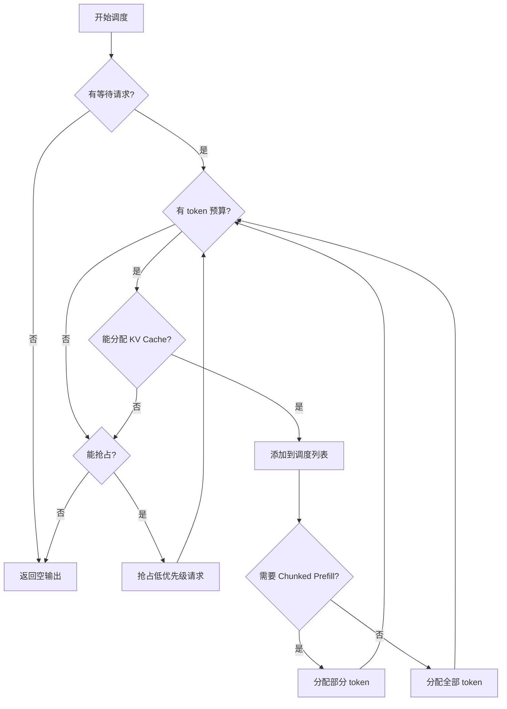

### 3.7 ModelRunner - 模型运行器

**文件**: `vllm/v1/worker/gpu/model_runner.py` (67-1000行)

**核心职责**:

| 职责 | 说明 |
|------|------|
| **模型加载** | 加载模型权重、初始化 KV Cache |
| **输入准备** | 准备 input_ids, positions, attention metadata |
| **模型执行** | 执行模型前向传播获取 hidden states |
| **采样** | 从 hidden states 采样生成 token |
| **CUDA Graph** | 管理 CUDA Graph 优化 |

**核心组件**:

```
GPUModelRunner
├── InputBuffers: 输入数据缓冲
│   ├── input_ids: 输入 token IDs
│   ├── positions: 位置编码
│   └── seq_lens: 序列长度
├── RequestState: 请求状态管理
│   ├── num_computed_tokens: 已计算 token 数
│   ├── last_sampled_tokens: 上次采样 token
│   └── next_prefill_tokens: 下次 prefill token
├── BlockTables: KV Cache 块表管理
├── Sampler: 采样器
│   ├── greedy: 贪婪采样
│   ├── beam: 束搜索
│   └── sampling: 随机采样
├── CudaGraphManager: CUDA Graph 管理
├── AttentionBackend: 注意力后端
│   ├── FA2: Flash Attention 2
│   ├── FA3: Flash Attention 3
│   ├── FlashInfer: FlashInfer
│   └── XFormers: xFormers
└── Speculator: 推测解码模型 (可选)
```

**执行流程**:

```python
def execute_model(
    self,
    scheduler_output: SchedulerOutput,
) -> ModelRunnerOutput:
    """执行模型推理"""
    # 1. 检查是否有 token 需要处理
    if total_num_scheduled_tokens == 0:
        return EMPTY_MODEL_RUNNER_OUTPUT

    # 2. 准备输入数据
    input_batch = prepare_inputs(scheduler_output)
    # ├─ input_ids: [num_tokens]
    # ├─ positions: [num_tokens]
    # ├─ seq_lens: [num_reqs]
    # ├─ attn_metadata: 注意力元数据
    # └─ logits_indices: 需要采样的位置

    # 3. 准备采样元数据
    sampling_metadata = make_sampling_metadata(
        input_batch.idx_mapping,
        input_batch.positions,
    )

    # 4. 执行模型前向传播
    hidden_states = model_forward(
        input_ids=input_batch.input_ids,
        positions=input_batch.positions,
        attn_metadata=input_batch.attn_metadata,
    )

    # 5. 采样生成 token
    sampler_output = sample(
        hidden_states=hidden_states,
        sampling_metadata=sampling_metadata,
        logits_indices=input_batch.logits_indices,
    )

    # 6. 返回结果
    return ModelRunnerOutput(
        sampled_token_ids=sampler_output.sampled_token_ids,
        logprobs=sampler_output.logprobs,
        spec_decode_tokens=spec_decode_tokens,
    )
```

**关键方法**:

| 方法 | 功能 |
|------|------|
| `execute_model()` | 执行模型推理 |
| `prepare_inputs()` | 准备模型输入 |
| `sample()` | 采样生成 token |
| `load_model()` | 加载模型权重 |
| `initialize_kv_cache()` | 初始化 KV Cache |

**ModelRunnerOutput 数据结构**:

```python
@dataclass
class ModelRunnerOutput:
    # 采样 token IDs: [num_reqs]
    sampled_token_ids: torch.Tensor

    # 采样的 token: [num_reqs]
    sampled_tokens: list[str]

    # Logprobs: [num_reqs, top_k]
    logprobs: LogprobsTensors | None

    # 推测解码相关
    spec_decode_tokens: DraftTokenIds | None

    # 是否已完成
    completed_requests: torch.Tensor | None
```

**输入准备详解**:

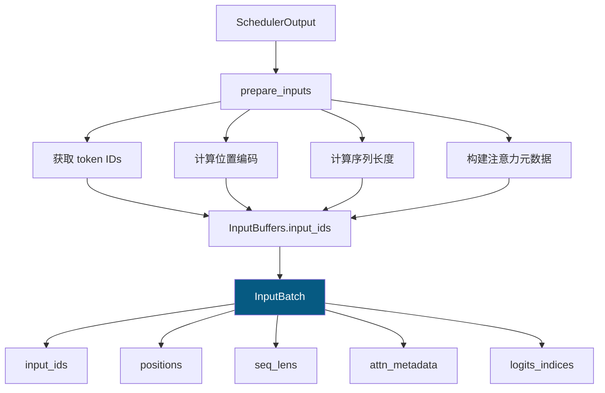

**采样流程**:

```
┌─────────────────────────────────────────────────────────────┐
│  sample(hidden_states, sampling_metadata)                   │
│                                                             │
│  1. 获取 logits                                             │
│     logits = hidden_states[logits_indices]                 │
│                                                             │
│  2. 应用温度参数                                            │
│     logits = logits / temperature                           │
│                                                             │
│  3. 应用 top-k / top-p 过滤                                  │
│     if top_k > 0: logits = top_k_filter(logits)           │
│     if top_p < 1.0: logits = top_p_filter(logits)          │
│                                                             │
│  4. 计算概率分布                                            │
│     probs = softmax(logits)                                │
│                                                             │
│  5. 采样                                                    │
│     token_id = categorical_sample(probs)                   │
│                                                             │
│  6. 返回结果                                                │
│     return SamplerOutput(token_id, logprobs)               │
└─────────────────────────────────────────────────────────────┘
```

### 3.8 MultiprocExecutor 与 Workers - 模型执行器与工作进程

**文件**:
- `vllm/v1/executor/multiproc_executor.py` (92-880行)
- `vllm/v1/executor/abstract.py` (35-353行)
- `vllm/v1/worker/gpu_worker.py` (68-730行)
- `vllm/v1/worker/worker_base.py` (1-400行)

#### 3.8.1 架构概览

```
┌───────────────────────────────────────────────────────────────────┐
│                    MultiprocExecutor (主进程)                      │
│  ┌─────────────────────────────────────────────────────────────┐  │
│  │                  Worker 管理与 RPC 调度                       │  │
│  │                                                             │  │
│  │  ┌───────────────┐  ┌───────────────┐  ┌───────────────┐    │  │
│  │  │ WorkerProc[0] │  │ WorkerProc[1] │  │ WorkerProc[2] │    │  │
│  │  │ (进程句柄)     │  │ (进程句柄)     │  │ (进程句柄)     │    │  │
│  │  └───────────────┘  └───────────────┘  └───────────────┘    │  │
│  └─────────────────────────────────────────────────────────────┘  │
└───────────────────────────────────────────────────────────────────┘
                              │
                              │ RPC 消息队列
                              ▼
┌───────────────────────────────────────────────────────────────────┐
│                       Worker 进程 (独立进程)                        │
│  ┌─────────────────────────────────────────────────────────────┐  │
│  │  Worker (WorkerBase)                                         │  │
│  │  ├─ ModelRunner (模型执行)                                   │  │
│  │  ├─ CacheEngine (缓存管理)                                   │  │
│  │  └─ RPC 服务循环 (worker_busy_loop)                          │  │
│  └─────────────────────────────────────────────────────────────┘  │
└───────────────────────────────────────────────────────────────────┘
```

#### 3.8.2 MultiprocExecutor 核心职责

**文件**: `vllm/v1/executor/multiproc_executor.py`

| 职责类别              | 功能描述                   | 关键方法                               |
| ----------------- | ---------------------- | ---------------------------------- |
| **Worker 生命周期管理** | 创建、监控、关闭 Worker 进程     | `_init_executor()`, `shutdown()`   |
| **RPC 通信调度**      | 将上层请求转发到 Workers 并收集结果 | `collective_rpc()`                 |
| **消息队列管理**        | 维护广播队列和响应队列            | `rpc_broadcast_mq`, `response_mqs` |
| **并行配置管理**        | 管理 TP/PP/DP 等并行配置      | `max_concurrent_batches`           |
| **健康监控**          | 监控 Worker 进程状态，异常处理    | `start_worker_monitor()`           |
| **输出聚合**          | 聚合多个 Worker 的输出结果      | `kv_output_aggregator`             |

**Worker 创建流程**:

```python
def _init_executor(self) -> None:
    # 1. 计算需要创建的 Worker 数量
    self.world_size = self.parallel_config.world_size  # TP × PP × PCP
    self.local_world_size = self.parallel_config.local_world_size

    # 2. 创建多个 Worker 进程
    for local_rank in range(self.local_world_size):
        global_rank = global_start_rank + local_rank
        unready_workers.append(
            WorkerProc.make_worker_process(...)  # 启动独立进程
        )

    # 3. 等待所有 Worker 就绪
    self.workers = WorkerProc.wait_for_ready(unready_workers)

    # 4. 启动健康监控线程
    self.start_worker_monitor()
```

**World Size 计算规则**:

| 配置 | world_size | local_world_size | 说明 |
|------|-----------|------------------|------|
| TP=4, 单机 | 4 | 4 | 创建 4 个 Worker |
| TP=4, PP=2, 单机 | 8 | 8 | 创建 8 个 Worker |
| TP=4, PP=2, 2节点 | 8 | 4 | 每节点 4 个 Worker |
| TP=2, DP=2 | 2 | 2 | DP 不影响 Worker 数 |

#### 3.8.3 Worker 核心职责

**文件**: `vllm/v1/worker/gpu_worker.py`, `vllm/v1/worker/worker_base.py`

| 组件                      | 职责                    | 关键属性/方法                                               |
| ----------------------- | --------------------- | ----------------------------------------------------- |
| **Worker (WorkerBase)** | 进程入口、RPC 服务、生命周期管理    | `worker_busy_loop()`, `init_device()`, `load_model()` |
| **ModelRunner**         | 模型前向执行、KV Cache 管理、采样 | `execute_model()`, `sample_tokens()`, `profile()`     |
| **CacheEngine**         | KV Cache 分配与管理        | `initialize_cache()`, `get_kv_cache_spec()`           |
| **WorkerProc**          | 进程封装、消息队列通信           | `worker_main()`, `make_worker_process()`              |

**Worker 进程结构**:

```python
class Worker(WorkerBase):
    def __init__(self, vllm_config, local_rank, rank, ...):
        # 每个 Worker 有自己的 rank 信息
        self.rank = rank                    # 全局 rank
        self.local_rank = local_rank        # 节点内 rank

        # 初始化 ModelRunner
        self.model_runner = GPUModelRunner(vllm_config, device)

        # 初始化设备
        self.init_device()                  # 设置 CUDA 设备

        # 加载模型
        self.load_model()

    def execute_model(self, scheduler_output):
        # 执行模型推理
        return self.model_runner.execute_model(scheduler_output)

    def sample_tokens(self, grammar_output):
        # 采样 token
        return self.model_runner.sample_tokens(grammar_output)
```

#### 3.8.4 RPC 通信机制

**通信架构**:

```
MultiprocExecutor                    Workers
        │                                  │
        │  ┌─────────────────────────┐    │
        ├─>│ rpc_broadcast_mq        │    │
        │  │ (SchedulerOutput)       │──┐ │
        │  └─────────────────────────┘  │ │
        │                              ▼ ▼
        │                        ┌──────────┐
        │                        │ Worker 0 │
        │                        └──────────┘
        │                              │
        │  ┌─────────────────────────┐  │
        │  │ response_mqs[0]         │◄─┘
        │  │ (ModelRunnerOutput)     │
        │  └─────────────────────────┘
        │
        ▼
   返回结果
```

**RPC 调用流程**:

```python
# 1. MultiprocExecutor 接收上层调用
def collective_rpc(self, method, args=(), kwargs=None, ...):
    # 2. 将请求放入广播队列
    self.rpc_broadcast_mq.enqueue((method, args, kwargs, output_rank))

    # 3. 从响应队列获取结果
    for mq in response_mqs:
        status, result = mq.dequeue(timeout=dequeue_timeout)
        responses.append(result)

    return responses[0] if output_rank is not None else responses
```

**Worker RPC 处理**:

```python
# Worker 进程中的 worker_busy_loop():
def worker_busy_loop(self, cancel=None):
    while True:
        # 1. 从广播队列接收请求
        method, args, kwargs, output_rank = self.rpc_broadcast_mq.dequeue()

        # 2. 执行方法
        if isinstance(method, str):
            func = getattr(self.worker, method)
        output = func(*args, **kwargs)

        # 3. 返回结果
        if output_rank is None or self.rank == output_rank:
            self.handle_output(output)
```

#### 3.8.5 Master-Worker 设计模式

```
┌──────────────────────────────────────────────────────────┐
│  Master (MultiprocExecutor)                               │
│  - 管理 Worker 生命周期                                    │
│  - 分发任务到 Workers                                      │
│  - 聚合 Worker 结果                                        │
│  - 不执行模型计算                                          │
└──────────────────────────────────────────────────────────┘
        │                │                │
        ▼                ▼                ▼
┌─────────────┐  ┌─────────────┐  ┌─────────────┐
│  Worker 0   │  │  Worker 1   │  │  Worker 2   │
│  - 执行模型  │  │  - 执行模型  │  │  - 执行模型  │
│  - 管理 GPU  │  │  - 管理 GPU  │  │  - 管理 GPU  │
│  - 计算      │  │  - 计算      │  │  - 计算      │
└─────────────┘  └─────────────┘  └─────────────┘
```

#### 3.8.6 进程关系与通信

**进程隔离**:

```
┌─────────────────────────────────────────────────────┐
│ 主进程: MultiprocExecutor                            │
│ - Python 进程 1                                       │
│ - 负责 RPC 调度和 Worker 管理                          │
└─────────────────────────────────────────────────────┘
                    │ spawns
        ┌───────────┼───────────┐
        ▼           ▼           ▼
┌──────────┐ ┌──────────┐ ┌──────────┐
│ Worker 0 │ │ Worker 1 │ │ Worker 2 │  ← 独立子进程
│ [rank=0] │ │ [rank=1] │ │ [rank=2] │
└──────────┘ └──────────┘ └──────────┘
```

**消息队列**:

| 队列 | 方向 | 内容 |
|------|------|------|
| `rpc_broadcast_mq` | Executor → Workers | RPC 请求 (method, args, kwargs) |
| `response_mqs` | Workers → Executor | RPC 响应 (status, result) |
| `peer_worker_response_mqs` | Worker ↔ Worker | 跨节点通信 |

#### 3.8.7 调用示例

**场景：EngineCore 调用 `execute_model()`**

```python
# 1. EngineCore (主进程)
scheduler_output = scheduler.schedule()

# 2. MultiprocExecutor.collective_rpc()
output = executor.collective_rpc(
    "execute_model",
    args=(scheduler_output,),
    unique_reply_rank=output_rank  # 只从指定 Worker 获取输出
)

# 3. 广播到所有 Workers
rpc_broadcast_mq.enqueue(("execute_model", (scheduler_output,), {}, output_rank))

# 4. 每个 Worker 接收并执行
# Worker 进程中的 worker_busy_loop():
method, args, kwargs, output_rank = rpc_broadcast_mq.dequeue()
output = worker.execute_model(*args, **kwargs)  # 调用 ModelRunner
response_mq.enqueue((SUCCESS, output))

# 5. MultiprocExecutor 收集结果
status, result = response_mqs[output_rank].dequeue()
return result
```

#### 3.8.8 关键代码位置

| 组件 | 文件路径 | 关键行数 |
|------|---------|---------|
| **Executor 抽象类** | `vllm/v1/executor/abstract.py` | 35-353 |
| **MultiprocExecutor** | `vllm/v1/executor/multiproc_executor.py` | 92-880 |
| **Worker 基类** | `vllm/v1/worker/worker_base.py` | 1-400 |
| **GPU Worker** | `vllm/v1/worker/gpu_worker.py` | 68-730 |
| **WorkerProc** | `vllm/v1/executor/multiproc_executor.py` | 476-613 |
| **RPC 消息队列** | `vllm/distributed/device_communicators/shm_broadcast.py` | - |

#### 3.8.9 设计优势

| 优势 | 说明 |
|------|------|
| **进程隔离** | Worker 崩溃不会影响主进程 |
| **负载均衡** | 通过 RPC 调度实现负载分发 |
| **并行执行** | 多个 Worker 并行处理不同请求 |
| **易于扩展** | 支持动态添加/移除 Worker |
| **容错机制** | 监控线程自动检测并处理异常 |

---

## 4. 多 DP 架构流程

### 4.1 完整流程图

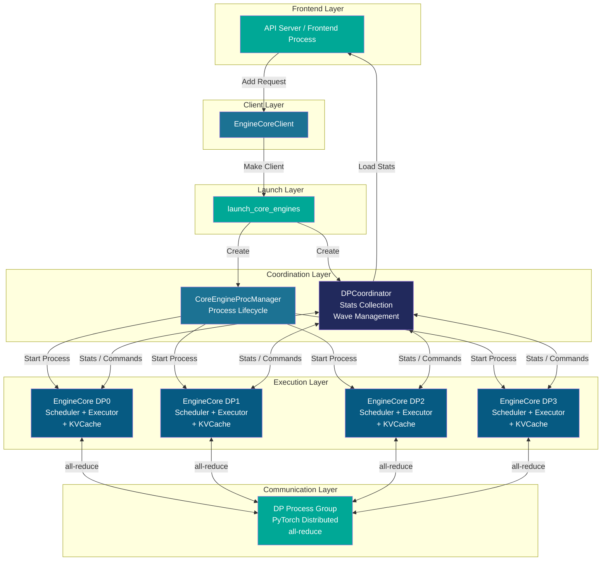

### 4.2 请求流转过程

```
1️⃣ 用户请求到达
   ↓
2️⃣ LLMEngine.add_request()
   │ - 创建 EngineCoreRequest
   │ - 调用 InputProcessor 处理输入
   ↓
3️⃣ EngineCoreClient.add_request()
   │ - 根据 DP 策略选择目标 DP rank
   │ - 通过 ZMQ 发送请求到对应 EngineCore
   ↓
4️⃣ EngineCore.add_request()
   │ - 验证请求类型
   │ - 检查任务支持 (pooling)
   │ - 调用 Scheduler.add_request()
   ↓
5️⃣ Scheduler.schedule()
   │ - 优先级调度
   │ - Chunked prefill (if enabled)
   │ - 生成 SchedulerOutput
   ↓
6️⃣ Executor.execute_model()
   │ - 模型前向传播
   │ - 返回 ModelRunnerOutput
   ↓
7️⃣ Scheduler.update_from_output()
   │ - 更新请求状态
   │ - 生成 EngineCoreOutputs
   ↓
8️⃣ DPCoordinator
   │ - 收集统计信息
   │ - 管理 wave 状态
   │ - 广播给 Frontend
   ↓
9️⃣ 返回给用户
```

### 4.3 Wave 状态机

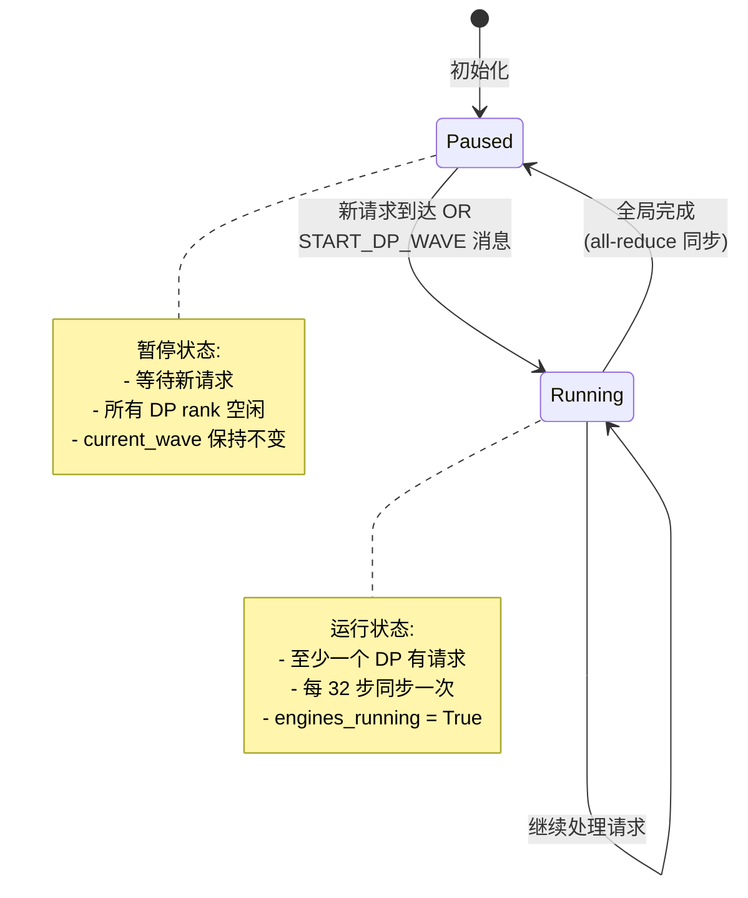

### 4.4 DP 同步机制

**同步点**: `_has_global_unfinished_reqs()`

```python
# 伪代码
def _has_global_unfinished_reqs(self, local_unfinished: bool) -> bool:
    self.step_counter += 1

    # 优化: 不是每步都同步
    if self.step_counter % 32 != 0:
        return True  # 假设还有未完成的请求

    # 执行 all-reduce，检查全局状态
    global_unfinished = ParallelConfig.has_unfinished_dp(
        self.dp_group, local_unfinished
    )

    return global_unfinished
```

**同步场景**:
| 场景 | 触发条件 | 行为 |
|------|----------|------|
| 正常执行 | step_counter % 32 == 0 | all-reduce 检查全局状态 |
| Wave 完成 | 所有 DP 都没有未完成请求 | engines_running = False |
| Wave 启动 | 新请求到达 OR START_DP_WAVE | engines_running = True |

---

## 5. 关键代码位置

### 5.1 核心文件清单

#### 5.1.1 引擎和执行器相关

| 文件 | 行号 | 类/函数 | 描述 |
|------|------|---------|------|
| `vllm/v1/engine/async_llm.py` | 54-867 | `AsyncLLM` | OpenAI 兼容 API 服务器 |
| `vllm/v1/engine/async_llm.py` | 360-470 | `generate()` | 异步流式生成方法 |
| `vllm/v1/engine/async_llm.py` | 809-837 | `scale_elastic_ep()` | 弹性扩展 DP 数量 |
| `vllm/v1/engine/core_client.py` | 61-1415 | `EngineCoreClient` 及子类 | 客户端实现 |
| `vllm/v1/engine/core_client.py` | 98-121 | `make_async_mp_client()` | 异步客户端工厂方法 |
| `vllm/v1/engine/core.py` | 76-586 | `EngineCore` | 基础引擎核心 |
| `vllm/v1/engine/core.py` | 588-878 | `EngineCoreProc` | ZMQ 包装器 |
| `vllm/v1/engine/core.py` | 1159-1382 | `DPEngineCoreProc` | DP Engine Core |
| `vllm/v1/engine/core.py` | 1385-1493 | `DPEngineCoreActor` | Ray Actor 版本 |
| `vllm/v1/engine/coordinator.py` | 22-378 | `DPCoordinator` | DP 协调器实现 |
| `vllm/v1/engine/coordinator.py` | 107-378 | `DPCoordinatorProc` | 协调器进程实现 |
| `vllm/v1/engine/utils.py` | 81-227 | `CoreEngineProcManager` | 多进程管理器 |
| `vllm/v1/engine/utils.py` | 228-756 | `CoreEngineActorManager` | Ray Actor 管理器 |
| `vllm/v1/engine/utils.py` | 759-912 | `launch_core_engines()` | 统一启动入口 |

#### 5.1.2 Scheduler 相关

| 文件 | 行号 | 类/函数 | 描述 |
|------|------|---------|------|
| `vllm/v1/core/sched/scheduler.py` | 59-800 | `Scheduler` | 调度器主类 |
| `vllm/v1/core/sched/scheduler.py` | 400-757 | `schedule()` | 主调度方法 |
| `vllm/v1/core/sched/scheduler.py` | 759-781 | `_preempt_request()` | 请求抢占 |
| `vllm/v1/core/sched/scheduler.py` | 350-398 | `add_request()` | 添加请求 |
| `vllm/v1/core/sched/scheduler.py` | 800-850 | `update_from_output()` | 更新状态 |
| `vllm/v1/core/sched/output.py` | 36-250 | `SchedulerOutput` | 调度输出数据结构 |
| `vllm/v1/core/sched/output.py` | 36-108 | `NewRequestData` | 新请求数据 |
| `vllm/v1/core/sched/output.py` | 112-250 | `CachedRequestData` | 缓存请求数据 |
| `vllm/v1/core/sched/request_queue.py` | 全文件 | `RequestQueue` | 请求队列实现 |
| `vllm/v1/core/kv_cache_manager.py` | 全文件 | `KVCacheManager` | KV Cache 管理器 |

#### 5.1.3 Executor 和 ModelRunner 相关

| 文件 | 行号 | 类/函数 | 描述 |
|------|------|---------|------|
| `vllm/v1/executor/abstract.py` | 35-200 | `Executor` | 执行器抽象基类 |
| `vllm/v1/executor/multiproc_executor.py` | 全文件 | `MultiprocExecutor` | 多进程执行器 |
| `vllm/v1/executor/ray_executor.py` | 全文件 | `RayDistributedExecutor` | Ray 分布式执行器 |
| `vllm/v1/executor/uniproc_executor.py` | 全文件 | `UniProcExecutor` | 单进程执行器 |
| `vllm/v1/worker/gpu/model_runner.py` | 67-1000 | `GPUModelRunner` | GPU 模型运行器 |
| `vllm/v1/worker/gpu/model_runner.py` | 857-950 | `execute_model()` | 执行模型推理 |
| `vllm/v1/worker/gpu/model_runner.py` | 400-595 | `prepare_inputs()` | 准备模型输入 |
| `vllm/v1/worker/gpu/model_runner.py` | 597-700 | `sample()` | 采样生成 token |
| `vllm/v1/worker/gpu/model_runner.py` | 149-175 | `load_model()` | 加载模型权重 |
| `vllm/v1/worker/gpu/sampler.py` | 全文件 | `Sampler` | 采样器实现 |
| `vllm/v1/worker/gpu/input_batch.py` | 全文件 | `InputBatch` | 输入批次数据结构 |
| `vllm/v1/worker/gpu/block_table.py` | 全文件 | `BlockTables` | KV Cache 块表管理 |
| `vllm/v1/worker/gpu/cudagraph_utils.py` | 全文件 | `CudaGraphManager` | CUDA Graph 管理 |
| `vllm/v1/worker/gpu/attn_utils.py` | 全文件 | `init_attn_backend()` | 初始化注意力后端 |

#### 5.1.4 输出和数据结构相关

| 文件 | 行号 | 类/函数 | 描述 |
|------|------|---------|------|
| `vllm/v1/outputs.py` | 全文件 | `ModelRunnerOutput` | 模型运行器输出 |
| `vllm/v1/outputs.py` | 全文件 | `EngineCoreOutputs` | 引擎核心输出 |
| `vllm/v1/outputs.py` | 全文件 | `RequestOutput` | 请求输出 |
| `vllm/v1/request.py` | 全文件 | `Request` | 请求数据结构 |
| `vllm/v1/request.py` | 全文件 | `RequestStatus` | 请求状态枚举 |

### 5.2 关键数据结构

#### 5.2.1 调度器相关数据结构

**SchedulerOutput** (output.py):
```python
@dataclass
class SchedulerOutput:
    # 新调度的请求数据
    scheduled_new_reqs: list[NewRequestData]

    # 已缓存的请求数据
    scheduled_cached_reqs: CachedRequestData

    # 每个请求的 token 数量
    num_scheduled_tokens: dict[str, int]

    # 总 token 数量
    total_num_scheduled_tokens: int

    # 被抢占的请求 ID
    preempted_req_ids: set[str]

    # 已完成的请求 ID
    finished_req_ids: set[str]

    # KV 连接器元数据
    kv_connector_metadata: KVConnectorMetadata | None

    # EC 连接器元数据
    ec_connector_metadata: ECConnectorMetadata | None
```

**NewRequestData** (output.py):
```python
@dataclass
class NewRequestData:
    req_id: str
    prompt_token_ids: list[int] | None
    mm_features: list[MultiModalFeatureSpec]
    sampling_params: SamplingParams | None
    pooling_params: PoolingParams | None
    block_ids: tuple[list[int], ...]
    num_computed_tokens: int
    lora_request: LoRARequest | None
    prompt_embeds: torch.Tensor | None
```

**CachedRequestData** (output.py):
```python
@dataclass
class CachedRequestData:
    req_ids: list[str]
    resumed_req_ids: set[str]
    new_token_ids: list[list[int]]
    all_token_ids: dict[str, list[int]]
    new_block_ids: list[tuple[list[int], ...] | None]
    num_computed_tokens: list[int]
    num_output_tokens: list[int]
```

#### 5.2.2 模型运行器相关数据结构

**ModelRunnerOutput** (outputs.py):
```python
@dataclass
class ModelRunnerOutput:
    # 采样 token IDs: [num_reqs]
    sampled_token_ids: torch.Tensor

    # 采样的 token: [num_reqs]
    sampled_tokens: list[str]

    # Logprobs: [num_reqs, top_k]
    logprobs: LogprobsTensors | None

    # 推测解码相关
    spec_decode_tokens: DraftTokenIds | None

    # 是否已完成
    completed_requests: torch.Tensor | None
```

**InputBatch** (input_batch.py):
```python
@dataclass
class InputBatch:
    req_ids: list[str]
    num_reqs: int
    num_tokens: int
    num_tokens_after_padding: int
    query_start_loc: torch.Tensor
    seq_lens: torch.Tensor
    input_ids: torch.Tensor
    positions: torch.Tensor
    attn_metadata: Any
    logits_indices: torch.Tensor
```

#### 5.2.3 通信相关数据结构

**EngineZmqAddresses** (utils.py):
```python
@dataclass
class EngineZmqAddresses:
    inputs: list[str]              # 输入 socket 地址列表
    outputs: list[str]             # 输出 socket 地址列表
    coordinator_input: str | None  # 协调器输入地址
    coordinator_output: str | None # 协调器输出地址
```

**EngineHandshakeMetadata** (utils.py):
```python
@dataclass
class EngineHandshakeMetadata:
    addresses: EngineZmqAddresses   # ZMQ 地址
    parallel_config: dict           # 并行配置
    parallel_config_hash: str | None # 配置哈希
```

### 5.3 通信协议

**ZMQ Socket 类型**:
| Socket | 类型 | 用途 |
|--------|------|------|
| Frontend ↔ EngineCore | DEALER / ROUTER | 请求-响应模式 |
| Coordinator ↔ EngineCore | XPUB / XSUB | 发布-订阅模式 |
| Coordinator ↔ Frontend | XPUB / XSUB | 统计发布 |

**消息类型** (EngineCoreRequestType):
```python
ADD                 # 添加请求
ABORT               # 中止请求
UTILITY             # 工具方法调用
EXECUTOR_FAILED     # 执行器失败
START_DP_WAVE       # 启动新的 wave (DP 特有)
```

---

## 6. 总结

### 6.1 核心要点

1. **AsyncLLM: OpenAI 兼容 API 服务器**
   - 异步流式输出：`AsyncGenerator[RequestOutput]`
   - 弹性扩展：运行时动态调整 DP 数量
   - 多实例支持：`client_count` + `client_index`
   - 暂停/恢复：支持模型权重更新

2. **每个 DP Rank 独立**
   - 独立的进程、内存、调度器和执行器
   - 通过 `run_engine_core(dp_rank=N)` 启动

3. **集中协调**
   - DPCoordinator 负责状态同步和负载均衡
   - 独立的协调器进程，使用 ZMQ 通信

4. **灵活部署**
   - **多进程模式**：`CoreEngineProcManager`，适合单机多 DP
   - **Ray Actor 模式**：`CoreEngineActorManager`，支持多机分布式和弹性扩缩容

5. **底层通信**
   - PyTorch DP Process Group 处理 all-reduce
   - 每 32 步同步一次全局状态

### 6.2 架构优势

| 优势 | 说明 |
|------|------|
| **OpenAI 兼容** | 完全兼容 OpenAI API，支持流式输出 SSE |
| **异步高并发** | 基于 asyncio，支持高并发场景 |
| **弹性扩展** | 运行时动态扩缩容，无需重启服务 (仅 Ray 模式) |
| **隔离性** | 每个 DP 独立进程/Actor，故障隔离 |
| **高效通信** | ZMQ + PyTorch distributed 双层通信 |
| **负载均衡** | 内置统计收集和负载决策支持 |
| **暂停/恢复** | 支持热更新，无需中断服务 |
| **跨节点部署** | Ray 模式支持多机分布式 |

### 6.3 适用场景

| 场景 | 推荐模式 | 说明 |
|------|---------|------|
| **OpenAI API 服务** | 多进程 / Ray | 需要兼容 OpenAI 接口的在线推理服务 |
| **流式输出** | 多进程 / Ray | 实时生成场景，如对话、文本补全 |
| **高并发 API 服务** | 多进程 / Ray | 大规模在线推理服务，处理大量并发请求 |
| **单机多卡** | 多进程 | 单机内多 GPU 部署，简单高效 |
| **多机分布式** | Ray | 跨节点分布式部署，需要 Ray 集群 |
| **弹性伸缩** | Ray | 根据负载动态扩缩容的云原生环境 |
| **热更新** | 多进程 / Ray | 需要在不中断服务的情况下更新模型权重 |
| **大规模推理** | Ray | 超大规模模型，需要跨节点的 Pipeline Parallel |
| **故障自愈** | Ray | 需要自动故障检测和恢复的生产环境 |

### 6.4 部署模式选择指南

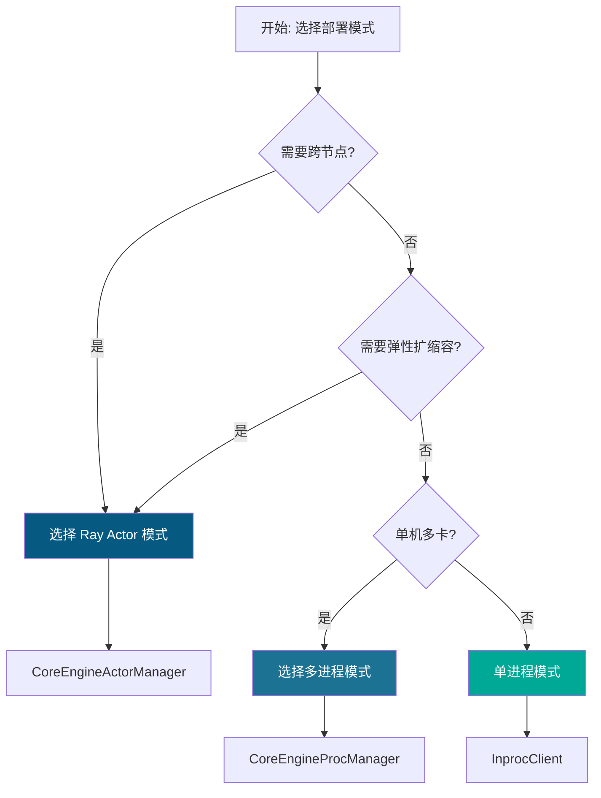

**选择建议**:
- **多进程模式**: 单机部署、快速启动、资源确定
- **Ray Actor 模式**: 多机部署、弹性伸缩、生产环境

---

## 附录

### A. 配置参数

**ParallelConfig 关键参数**:
```python
data_parallel_size: int              # DP 总数
data_parallel_rank: int              # 当前 DP rank
data_parallel_rank_local: int        # 本地 DP rank
data_parallel_master_ip: str         # master 节点 IP
data_parallel_master_port: int       # master 节点端口
data_parallel_external_lb: bool      # 外部负载均衡
data_parallel_hybrid_lb: bool        # 混合负载均衡
distributed_executor_backend: str    # 执行器后端 (mp/ray)
```

### B. 环境变量

```bash
# 多进程模式
VLLM_ENABLE_V1_MULTIPROCESSING=1

# 弹性扩容
VLLM_ELASTIC_EP_SCALE_UP_LAUNCH=1
```

### C. 相关文档

- [Data Parallel Deployment](https://docs.vllm.ai/en/latest/serving/data_parallel_deployment.html)
- [Configuration Reference](https://docs.vllm.ai/en/latest/configuration/optimization.html)

---

**文档生成时间**: 2026-03-28
**vLLM 版本**: 基于 v1 架构 (AsyncLLM)
**作者**: Claude Code Analysis

---

## AsyncLLM vs LLMEngine 对比

| 特性 | AsyncLLM | LLMEngine |
|------|----------|-----------|
| **API 类型** | 异步 API (OpenAI 兼容) | 同步 API |
| **输出方式** | AsyncGenerator (流式) | 同步返回 |
| **扩展方式** | scale_elastic_ep() | 不支持 |
| **多实例** | client_count 支持 | 单实例 |
| **暂停/恢复** | 支持 | 不支持 |
| **使用场景** | 在线推理服务 | 离线批处理 |
