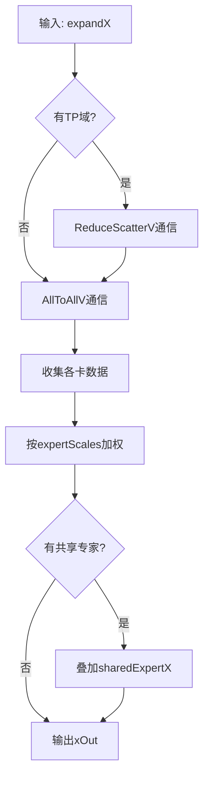
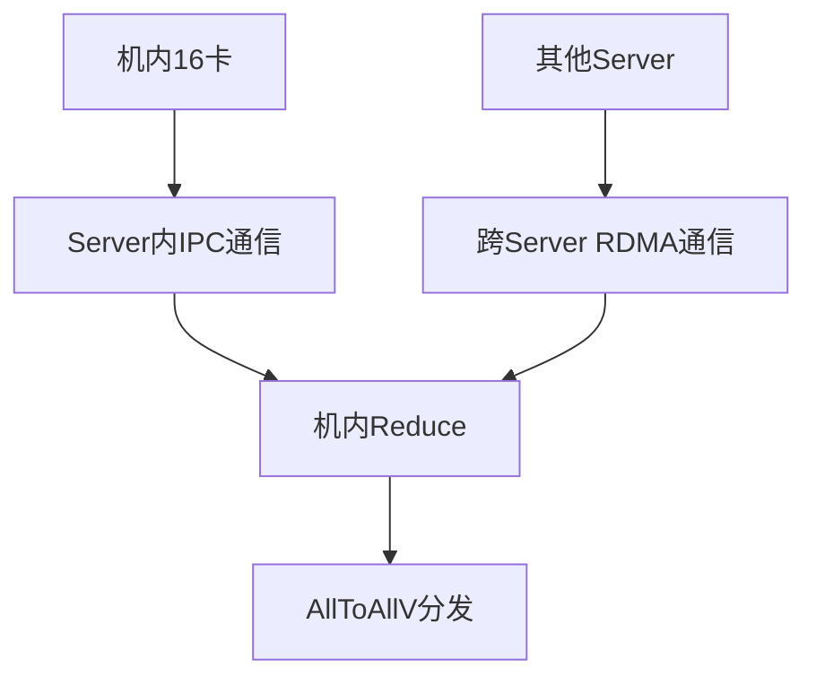

# MoeDistributeCombineV2 算子实现分析报告

> **生成时间**: 2026-04-04
> **算子名称**: MoeDistributeCombineV2
> **产品支持**: Ascend 950PR/950DT, Atlas A3训练/推理系列, Atlas A2训练/推理系列

---

## 目录

- [1. 算子概述](#1-算子概述)
- [2. 入参与核心机制详解](#2-入参与核心机制详解)
  - [2.1 核心入参说明](#21-核心入参说明)
  - [2.2 数据收集核心机制](#22-数据收集核心机制)
  - [2.3 发送端如何确定目标Rank](#23-发送端如何确定目标rank)
  - [2.4 接收端如何判断数据收齐](#24-接收端如何判断数据收齐)
  - [2.5 特殊专家处理](#25-特殊专家处理)
  - [2.6 分层通信（Hierarchy）](#26-分层通信hierarchy)
- [3. 目录结构](#3-目录结构)
- [4. 核心组件分析](#4-核心组件分析)
- [5. 关键技术实现](#5-关键技术实现)
- [6. 产品差异](#6-产品差异)
- [7. 性能优化技术](#7-性能优化技术)
- [8. 约束与限制](#8-约束与限制)
- [9. 调用示例](#9-调用示例)
- [10. 总结](#10-总结)

---

## 1. 算子概述

### 1.1 功能描述

`MoeDistributeCombineV2` 是混合专家（Mixture of Experts, MoE）架构中的核心合并算子，与 `MoeDistributeDispatchV2` 配套使用，负责将专家计算后的Token数据按照路由信息进行收集和合并。该算子支持多种量化模式、通信算法和特殊专家类型，是实现高效MoE模型训练与推理的关键组件。

### 1.2 核心功能

| 功能          | 描述                                         |
| ----------- | ------------------------------------------ |
| **数据收集** | 通过AllToAllV通信收集各卡专家计算结果 |
| **ReduceScatter** | 可选的TP域ReduceScatterV通信                         |
| **权重加权** | 按专家权重进行加权合并                           |
| **特殊专家** | 支持零专家、拷贝专家、常量专家                         |

### 1.3 计算流程



---

## 2. 入参与核心机制详解

### 2.1 核心入参说明

| 参数名                     | 类型        | Shape                              | 描述                                |
| ----------------------- | --------- | ---------------------------------- | --------------------------------- |
| **expandX**                   | FP16/BF16 | [Bs×K, H]                            | 扩展后的Token特征数据（已过专家FFN） |
| **expertIds**           | INT32     | [Bs, K]                            | 每个token的topK个专家索引                 |
| **assistInfoForCombine**      | INT32      | [A × 128] | 辅助信息，用于全卡同步 |
| **epSendCounts**         | 属性        | -                                  | 从EP域各卡接收的token数                      |
| **expertScales**        | 属性        | -                                  | 每个token的topK专家权重                           |
| **expandScalesOptional** | 属性        | -                                  | 本卡token权重（对应Dispatch的expandScales输出） |
| **sharedExpertXOptional** | FP16/BF16 | [Bs, H] | 共享专家计算后的token |
| **epWorldSize**         | 属性        | -                                  | EP通信域大小（总卡数）                      |
| **epRankId**            | 属性        | -                                  | EP域内本卡的ID [0, epWorldSize)        |
| **moeExpertNum**        | 属性        | -                                  | MoE专家总数                           |
| **sharedExpertNum**     | 属性        | -                                  | 共享专家数量                            |
| **sharedExpertRankNum** | 属性        | -                                  | 共享专家卡数量                           |

### 2.2 数据收集核心机制

#### 2.2.1 窗口通信机制

`MoeDistributeCombineV2` 使用与 `DispatchV2` 相同的窗口通信机制，通过双缓冲区实现高效的数据交换：

```
┌─────────────────────────────────────────────────────────────────┐
│                    Combine窗口通信机制                           │
├─────────────────────────────────────────────────────────────────┤
│                                                                 │
│  EP域窗口结构:                                                   │
│  ┌───────────────────────────────────────────────────────────┐  │
│  │ Rank 0 窗口 │ Rank 1 窗口 │ ... │ Rank N 窗口              │  │
│  │ ├───────────┼───────────┼─────┼───────────┤              │  │
│  │ │ TokenCounts│ TokenCounts│ ... │ TokenCounts│              │  │
│  │ ├───────────┼───────────┼─────┼───────────┤              │  │
│  │ │ Token Data│ Token Data│ ... │ Token Data│              │  │
│  │ └───────────┴───────────┴─────┴───────────┘              │  │
│  └───────────────────────────────────────────────────────────┘  │
│                                                                 │
│  通信流程:                                                       │
│  1. 各卡将本地专家计算结果写入WindowsOut                         │
│  2. AICPU执行RDMA通信，完成AllToAllV数据交换                    │
│  3. 各卡从WindowsIn读取收集到的数据                             │
│  4. 按expertIds和expertScales进行加权合并                       │
│                                                                 │
└─────────────────────────────────────────────────────────────────┘
```

#### 2.2.2 数据重排与合并

```cpp
// ========== 核心合并逻辑 ==========
// 对每个token，收集其topK个专家的计算结果并加权求和
template <CombineMC2TypeClass>
__aicore__ inline void MoeDistributeCombineV2<CombineMC2TypeClass>::ProcessExpert(
    uint32_t tokenIndex, uint32_t processLen) {
    
    // 初始化累加器
    Duplicate(sumFloatBufLocal_, static_cast<float>(0), axisH_);
    
    // 处理TopK个MoE专家
    for (uint32_t topkId = 0U; topkId < axisK_; topkId++) {
        float scaleVal = expertScalesLocal_.GetValue(index);
        
        // 从窗口读取该专家的计算结果
        GM_ADDR wAddr = epWindowGM_ + (tokenIndexOffset + topkId) * hAlignWinSize_;
        DataCopyPad(tmpUb, rowTmpGlobal_, expandXCopyParams, copyPadExtParams);
        
        // 反量化（如果使用了通信量化）
        if constexpr (QuantMode > UNQUANT) {
            quantInst_.DeQuantProcess(tmpUb, outLocalTensor, rowTmpFloatLocal_);
        }
        
        // 加权累加
        Muls(mulBufLocal_, rowTmpFloatLocal_, scaleVal, processLen);
        Add(sumFloatBufLocal_, sumFloatBufLocal_, mulBufLocal_, processLen);
        index++;
    }
    
    // 处理共享专家
    for (uint32_t topkId = axisK_; topkId < (axisK_ + sharedExpertNum_); topkId++) {
        // 读取共享专家结果并累加
        // ...
    }
    
    // 输出合并结果
    Cast(sumBufLocal, sumFloatBufLocal_, RoundMode::CAST_RINT, processLen);
    DataCopyPad(expandOutGlobal_[tokenIndex * axisH_], sumBufLocal, expandXCopyParams);
}
```

### 2.3 发送端如何确定目标Rank

#### 2.3.1 辅助信息数据结构

Combine 算子通过 `assistInfoForCombine` 参数（来自 Dispatch 算子的 `expandIdxOut` 输出）来获取发送目标信息。

```cpp
// ========== Dispatch 算子输出 expandIdxOut ==========
// Shape: [A * 128]，其中 A = 本卡可能接收的最大token数量
// 每个 token 的信息占据 3 个 INT32 位置：
struct ExpandIdxEntry {
    int32_t rankId;   // 位置0: 数据来源的 rank ID
    int32_t tokenId;  // 位置1: 在该 rank 上的 token 索引
    int32_t topkId;   // 位置2: TopK 中的索引
};

// EXPAND_IDX_INFO = 3，每个token占用3个INT32位置
```

#### 2.3.2 assistInfoForCombine 参数详解

##### 参数来源与作用

`assistInfoForCombine` 是 Dispatch 算子的输出 `expandIdxOut`，它记录了**数据来源信息**，指导 Combine 算子按原路返还数据。

```
┌─────────────────────────────────────────────────────────────────────┐
│              assistInfoForCombine 数据流向                          │
├─────────────────────────────────────────────────────────────────────┤
│                                                                     │
│  Dispatch 阶段:                                                    │
│  ┌─────────────────────────────────────────────────────────────┐   │
│  │ 输入: expertIds[Bs, K] = [[5, 9, 2],  [3, 7, 1], ...]       │   │
│  │                                                             │   │
│  │ Token_0 选择专家 [5, 9, 2]:                                │   │
│  │   - Expert 5 → 分发到 Rank 1                               │   │
│  │   - Expert 9 → 分发到 Rank 2                               │   │
│  │   - Expert 2 → 分发到 Rank 0 (本卡)                        │   │
│  │                                                             │   │
│  │ 输出 expandIdxOut (assistInfoForCombine):                   │   │
│  │   记录每个 Token 最终在哪个 Rank、哪个位置                    │   │
│  └─────────────────────────────────────────────────────────────┘   │
│                           ↓                                        │
│  Combine 阶段:                                                     │
│  ┌─────────────────────────────────────────────────────────────┐   │
│  │ 输入: assistInfoForCombine (来自 Dispatch)                   │   │
│  │                                                             │   │
│  │ 读取: Token_0 的信息                                         │   │
│  │   - 需要发回 Rank 1 (对应 Expert 5 的结果)                   │   │
│  │   - 需要发回 Rank 2 (对应 Expert 9 的结果)                   │   │
│  │   - 保留在本卡 (对应 Expert 2 的结果)                         │   │
│  │                                                             │   │
│  │ 按 expandIdxOut 指示，将专家计算结果发回原 Rank              │   │
│  └─────────────────────────────────────────────────────────────┘   │
│                                                                     │
└─────────────────────────────────────────────────────────────────────┘
```

##### 数据结构详细说明

```cpp
// ========== assistInfoForCombine 内存布局 ==========
// 总大小: A * 128 * sizeof(int32)
// 其中 A = 本卡可能接收的最大token数量
//
// 每个 token 占用 3 个连续的 INT32 位置：

struct TokenRouteInfo {
    int32_t fromRankId;   // 该 token 数据来源的 Rank ID
    int32_t fromTokenIdx;  // 在来源 Rank 上的 token 索引
    int32_t topkIndex;     // 在 TopK 中的位置 (0 ~ K-1)
};

// 访问方式:
// Token_i 的信息起始位置: i * EXPAND_IDX_INFO (i * 3)
// fromRankId  = assistInfoForCombine[i * 3 + 0]
// fromTokenIdx = assistInfoForCombine[i * 3 + 1]
// topkIndex   = assistInfoForCombine[i * 3 + 2]
```

##### 完整示例：8卡系统、16专家配置

**系统配置：**
```yaml
EP域配置:
  epWorldSize: 8              # 8张卡 (ID: 0~7)
  moeExpertNum: 16            # 16个MoE专家
  sharedExpertNum: 0           # 无共享专家
  localExpertNum: 2           # 每卡2个专家 (16/8)
  
路由规则:
  toRankId = expertId / localExpertNum
  例如: Expert 5 → Rank 2 (5/2=2), Expert 9 → Rank 4 (9/2=4)
```

**Dispatch 阶段 - Rank 0 的处理：**

```cpp
// ========== Rank 0 的输入 ==========
输入 Token: [T0, T1, T2, T3, T4, T5]  // 6个token
expertIds: [
    [5, 9, 2],   // T0 选择专家 [5, 9, 2]
    [3, 7, 11],  // T1 选择专家 [3, 7, 11]
    [1, 8, 15],  // T2 选择专家 [1, 8, 15]
    [6, 12, 4],  // T3 选择专家 [6, 12, 4]
    [10, 0, 14], // T4 选择专家 [10, 0, 14]
    [13, 2, 5]   // T5 选择专家 [13, 2, 5]
]


// ========== Dispatch 分发结果 ==========
Token 分发到各 Rank:
┌──────────┬────────────────────────────────────────────────────┐
│ Token    │ 分发目标 Rank (根据 expertId / localExpertNum)      │
├──────────┼────────────────────────────────────────────────────┤
│ T0 (E5)  │ → Rank 2 (5/2=2)                                 │
│ T0 (E9)  │ → Rank 4 (9/2=4)                                 │
│ T0 (E2)  │ → Rank 1 (2/2=1), 但 E2 在 Rank 0 上 (local)     │
│          │ 实际: Rank 0 的 Expert 2，保留在本卡              │
├──────────┼────────────────────────────────────────────────────┤
│ T1 (E3)  │ → Rank 1 (3/2=1)                                 │
│ T1 (E7)  │ → Rank 3 (7/2=3)                                 │
│ T1 (E11) │ → Rank 5 (11/2=5)                                │
├──────────┼────────────────────────────────────────────────────┤
│ T2 (E1)  │ → Rank 0 (1/2=0), 本卡 Expert 1                  │
│ T2 (E8)  │ → Rank 4 (8/2=4)                                 │
│ T2 (E15) │ → Rank 7 (15/2=7)                                │
└──────────┴────────────────────────────────────────────────────┘


// ========== Dispatch 输出 expandIdxOut ==========
// Rank 0 需要接收的 token（其他 Rank 发送给 Rank 0 的）:
//   来自 Rank 1: T1(E3), T5(E3)
//   来自 Rank 2: T0(E5), T5(E5)  
//   来自 Rank 3: T1(E7), T4(E7)
//   ...

// expandIdxOut 数据 (只展示部分):
assistInfoForCombine = [
    // ========== Token_0: 来自 Rank 2 的数据 ==========
    /* [0] */  2,    // fromRankId: 从 Rank 2 接收
    /* [1] */  5,    // fromTokenIdx: 是 Rank 2 发送的第 5 个 token
    /* [2] */  0,    // topkIndex: 对应 TopK=0 (Expert 5 的结果)
    
    // ========== Token_1: 来自 Rank 1 的数据 ==========  
    /* [3] */  1,    // fromRankId: 从 Rank 1 接收
    /* [4] */  2,    // fromTokenIdx: 是 Rank 1 发送的第 2 个 token
    /* [5] */  0,    // topkIndex: 对应 TopK=0 (Expert 3 的结果)
    
    // ========== Token_2: 来自 Rank 2 的数据 ==========
    /* [6] */  2,    // fromRankId: 从 Rank 2 接收
    /* [7] */  6,    // fromTokenIdx: 是 Rank 2 发送的第 6 个 token
    /* [8] */  2,    // topkIndex: 对应 TopK=2 (Expert 11 的结果)
    
    // ========== Token_3: 来自 Rank 3 的数据 ==========
    /* [9] */  3,    // fromRankId: 从 Rank 3 接收
    /* [10] */ 3,    // fromTokenIdx: 是 Rank 3 发送的第 3 个 token
    /* [11] */ 1,    // topkIndex: 对应 TopK=1 (Expert 7 的结果)
    
    // ... 更多 token 信息 ...
];

// 实际数据中的规律:
// - 每个连续 3 个 INT32 表示一个 token 的来源信息
// - EXPAND_IDX_INFO = 3，是固定的步长
```

**Combine 阶段 - Rank 0 的处理：**

```cpp
// ========== Combine 读取 assistInfoForCombine 并发送 ==========
template <CombineMC2TypeClass>
__aicore__ inline void ExpertAlltoAllDispatchCopyAdd() {
    LocalTensor<ExpandIdxType> expandIdxLocal = indexCountsBuf_.Get<ExpandIdxType>();
    
    // 读取辅助信息
    DataCopyPad(expandIdxLocal, expandIdxGM_[startTokenId_ * EXPAND_IDX_INFO], ...);
    
    // ========== 解析 Token_0 的信息 ==========
    uint32_t baseOffset_0 = 0 * EXPAND_IDX_INFO;  // 0 * 3 = 0
    uint32_t toRankId_0   = expandIdxLocal(baseOffset_0);     // = 2, 发回 Rank 2
    uint32_t tokenId_0    = expandIdxLocal(baseOffset_0 + 1); // = 5, 第 5 个 token
    uint32_t topkId_0     = expandIdxLocal(baseOffset_0 + 2); // = 0, TopK=0
    
    // 将本卡 Rank 0 上 Token_0 对应 Expert 5 的计算结果
    // 发送回 Rank 2 的第 5 个位置
    GM_ADDR targetGM_0 = GetWinAddrByRankId(2, EP_DOMAIN) + 
                          5 * hAlignWinSize_;
    DataCopyPad(targetGM_0, expandXGM_[0 * H], ...);
    
    // ========== 解析 Token_1 的信息 ==========
    uint32_t baseOffset_1 = 1 * EXPAND_IDX_INFO;  // 1 * 3 = 3
    uint32_t toRankId_1   = expandIdxLocal(baseOffset_1);     // = 1, 发回 Rank 1
    uint32_t tokenId_1    = expandIdxLocal(baseOffset_1 + 1); // = 2, 第 2 个 token
    uint32_t topkId_1     = expandIdxLocal(baseOffset_1 + 2); // = 0, TopK=0
    
    // 将本卡 Rank 0 上 Token_1 对应 Expert 3 的计算结果
    // 发送回 Rank 1 的第 2 个位置
    GM_ADDR targetGM_1 = GetWinAddrByRankId(1, EP_DOMAIN) + 
                          2 * hAlignWinSize_;
    DataCopyPad(targetGM_1, expandXGM_[1 * H], ...);
    
    // ... 继续处理其他 token ...
}
```

##### 关键理解要点

| 概念 | 说明 | 示例值 |
|------|------|--------|
| **fromRankId** | 数据来源的 Rank ID | `2` 表示数据从 Rank 2 来 |
| **fromTokenIdx** | 在来源 Rank 上的索引 | `5` 表示是来源 Rank 的第 5 个 token |
| **topkIndex** | TopK 中的位置 | `0` 表示第 1 个专家的结果 |
| **EXPAND_IDX_INFO** | 每个 token 占用位置数 | `3` (rankId + tokenId + topkId) |

##### 数据对应关系图

```
┌─────────────────────────────────────────────────────────────────────┐
│           Dispatch → Combine 完整数据流示例                         │
├─────────────────────────────────────────────────────────────────────┤
│                                                                     │
│  场景: T0 选择专家 [5, 9, 2]，K=3                               │
│                                                                     │
│  ┌─────────────┐     Dispatch      ┌─────────────────────────────┐  │
│  │   Rank 0    │                   │       各 Rank 窗口          │  │
│  │  Token T0    │──────────────────>│                              │  │
│  │ expertIds:   │   分发到各专家     │  Rank 1: [E0,E1, ...]       │  │
│  │  [5,9,2]     │                   │  Rank 2: [E2,E3, ...]       │  │
│  └─────────────┘                   │  Rank 4: [E8,E9, ...]       │  │
│                                     │  ...                         │  │
│         ↓                         │                              │  │
│  ┌─────────────┐                  │  Rank 2 窗口:               │  │
│  │ Expert FFN   │                  │  ┌─────────────────────┐  │  │
│  │   计算      │                  │  │ T0(E5)的计算结果     │  │  │
│  └─────────────┘                  │  │ ← T0 在这个位置      │  │  │
│         ↓                         │  └─────────────────────┘  │  │
│  ┌─────────────┐                  │                              │  │
│  │ expandIdxOut │                  │  Rank 4 窗口:               │  │
│  │ 记录来源信息  │                  │  ┌─────────────────────┐  │  │
│  │ [2,5,0,...] │<─────────────────│  │ T0(E9)的计算结果     │  │  │
│  │ [4,8,1,...] │   原路返还         │  │ ← T0 在这个位置      │  │  │
│  └─────────────┘                  │  └─────────────────────┘  │  │
│         ↓                         │                              │  │
│  ┌─────────────┐     Combine      │                              │  │
│  │   Rank 0    │<─────────────────│                              │  │
│  │  读取来源信息 │   收集数据        │  AllToAllV 通信完成          │  │
│  │  发回原 Rank  │                   │                              │  │
│  └─────────────┘                   │                              │  │
│                                     │                              │  │
│  结果: T0 的数据按 Dispatch 的路径原路返还                      │
│                                                                     │
└─────────────────────────────────────────────────────────────────────┘
```

#### 2.3.2 Dispatch→Combine 数据流

```
┌─────────────────────────────────────────────────────────────────────┐
│                    Dispatch → Combine 数据流                        │
├─────────────────────────────────────────────────────────────────────┤
│                                                                     │
│  Dispatch 阶段 (Token 发散):                                        │
│  ┌─────────────────────────────────────────────────────────────┐   │
│  │ Token_i (Rank 0) → Expert 5 → 发送到 Rank 3                 │   │
│  │ Token_j (Rank 0) → Expert 2 → 发送到 Rank 1                 │   │
│  │ ...                                                          │   │
│  │ Dispatch 输出 expandIdxOut:                                  │   │
│  │   index[0]: [3, token_5_index, topk_1,  ...]               │   │
│  │   index[1]: [1, token_2_index, topk_0,  ...]               │   │
│  └─────────────────────────────────────────────────────────────┘   │
│                           ↓                                        │
│  Combine 阶段 (数据收集):                                          │
│  ┌─────────────────────────────────────────────────────────────┐   │
│  │ Rank 0 读取 expandIdxOut:                                    │   │
│  │   - 发现 token_i 需要发回 Rank 3                             │   │
│  │   - 发现 token_j 需要发回 Rank 1                             │   │
│  │   ...                                                        │   │
│  │ 按原路返还数据                                               │   │
│  └─────────────────────────────────────────────────────────────┘   │
│                                                                     │
└─────────────────────────────────────────────────────────────────────┘
```

#### 2.3.3 发送端实现代码

```cpp
// ========== Combine 算子读取辅助信息并发送 ==========
template <CombineMC2TypeClass>
__aicore__ inline void ExpertAlltoAllDispatchCopyAdd() {
    if (sendCntNum_ == 0U) {
        return;
    }

    LocalTensor<ExpandIdxType> expandIdxLocal = indexCountsBuf_.Get<ExpandIdxType>();
    
    // ========== 步骤1: 读取辅助信息 ==========
    DataCopyPad(expandIdxLocal, expandIdxGM_[startTokenId_ * EXPAND_IDX_INFO], 
                bskParams, copyPadParams);
    
    LocalTensor<float> statusTensor = readStateBuf_.AllocTensor<float>();
    Duplicate<float>(statusTensor, (float)1, FLOAT_PER_UB_ALIGN);  // 准备标志值 1.0
    
    for (uint32_t loop = 0; loop < sendCntNum_; loop++) {
        // 错位发送，避免网络拥塞
        uint32_t tkIndex = startTokenId_ + ((loop + epRankId_) % sendCntNum_);
        uint32_t baseOffset = (tkIndex - startTokenId_) * EXPAND_IDX_INFO;
        
        // ========== 步骤2: 从 expandIdx 解析发送目标 ==========
        uint32_t toRankId = expandIdxLocal(baseOffset);     // 位置0: 目标 Rank ID
        uint32_t tokenId  = expandIdxLocal(baseOffset + 1); // 位置1: Token 索引
        uint32_t topkId   = expandIdxLocal(baseOffset + 2); // 位置2: TopK 索引
        
        // ========== 步骤3: 发送数据到目标 Rank ==========
        ExpertAlltoAllDispatchInnerCopyAdd(toRankId, tokenId, topkId, tkIndex);
        
        // ========== 步骤4: 设置接收端的状态标志 ==========
        GM_ADDR stateGM = GetWinStateAddrByRankId(toRankId, EP_DOMAIN) + 
                          tokenId * flagRcvCount_ * stateOffset_ + 
                          topkId * stateOffset_;
        GlobalTensor<float> stateGMTensor;
        stateGMTensor.SetGlobalBuffer((__gm__ float*)stateGM);
        
        // 写入标志值 1.0，表示该 TopK 通道的数据已发送
        DataCopy<float>(stateGMTensor, statusTensor, FLOAT_PER_UB_ALIGN);
    }
}
```

#### 2.3.4 关键代码解析

| 代码行 | 作用 | 说明 |
|--------|------|------|
| `expandIdxLocal(baseOffset)` | 获取目标 Rank ID | 来自 Dispatch 的路由信息 |
| `expandIdxLocal(baseOffset + 1)` | 获取 Token 索引 | 目标 Rank 上的 token 位置 |
| `expandIdxLocal(baseOffset + 2)` | 获取 TopK 索引 | 第几个专家的结果 |
| `GetWinAddrByRankId(toRankId, ...)` | 计算目标窗口地址 | 精确定位到目标 Rank 的窗口 |

### 2.4 接收端如何判断数据收齐

#### 2.4.1 状态区布局

```
┌─────────────────────────────────────────────────────────────────────┐
│                       窗口状态区布局                                 │
├─────────────────────────────────────────────────────────────────────┤
│                                                                     │
│  每个接收 Rank 的状态区（按 token 组织）:                            │
│  ┌─────────────────────────────────────────────────────────────┐   │
│  │ Token_0 的状态区                                             │   │
│  │ ├─ Flag[0][0] (TopK=0, 来自Rank A的标志)                   │   │
│  │ ├─ Flag[0][1] (TopK=1, 来自Rank B的标志)                   │   │
│  │ ├─ Flag[0][2] (TopK=2, 来自Rank C的标志)                   │   │
│  │ ├─ ...                                                       │   │
│  │ ├─ Flag[0][K] (共享专家1的标志)                              │   │
│  │ └─ Flag[0][K+1] (共享专家2的标志)                            │   │
│  ├─────────────────────────────────────────────────────────────┤   │
│  │ Token_1 的状态区 (同上结构)                                   │   │
│  ├─────────────────────────────────────────────────────────────┤   │
│  │ ...                                                          │   │
│  └─────────────────────────────────────────────────────────────┘   │
│                                                                     │
│  每个标志的值：                                                     │
│  - 初始值: 0.0                                                     │
│  - 发送端发送数据后设置为: 1.0                                      │
│  - 接收端累加所有标志，判断是否等于预期值                           │
│                                                                     │
│  状态区地址计算:                                                   │
│  stateAddr = baseAddr + tokenId * flagRcvCount * STATE_OFFSET +    │
│               topkId * STATE_OFFSET                               │
│                                                                     │
└─────────────────────────────────────────────────────────────────────┘
```

#### 2.4.2 同步时序图

```
┌─────────────────────────────────────────────────────────────────────┐
│                      Combine 数据同步时序图                          │
├─────────────────────────────────────────────────────────────────────┤
│                                                                     │
│  Rank 0 (发送端)              Rank 1 (接收端)                        │
│      │                            │                                 │
│      │  Token_0 发送流程:                                           │
│      │                            │                                 │
│      │ 1. 发送 TopK=0 数据    ──────────────────────────>          │
│      ├────────────────────────────────────────────────────────>     │
│      │  写入 Flag[0][0]=1.0   ──────────────────────────>          │
│      │                            │ 轮询: Sum(Flag)=1.0               │
│      │                            │                                 │
│      │ 2. 发送 TopK=1 数据    ──────────────────────────>          │
│      ├────────────────────────────────────────────────────────>     │
│      │  写入 Flag[0][1]=1.0   ──────────────────────────>          │
│      │                            │ 轮询: Sum(Flag)=2.0               │
│      │                            │                                 │
│      │ 3. 发送 TopK=2 数据    ──────────────────────────>          │
│      ├────────────────────────────────────────────────────────>     │
│      │  写入 Flag[0][2]=1.0   ──────────────────────────>          │
│      │                            │ 轮询: Sum(Flag)=3.0               │
│      │                            │                                 │
│      │ 4. 写入共享专家标志     ──────────────────────────>          │
│      ├────────────────────────────────────────────────────────>     │
│      │  写入 Flag[0][3]=1.0   ──────────────────────────>          │
│      │                            │ 轮询: Sum(Flag)=4.0               │
│      │                            │                                 │
│      │                            │ ✓ Sum ≈ targetCount (4.0)      │
│      │                            │ ✓ 数据收齐，开始处理            │
│      │                            │                                 │
│      │                            │ 清空 Flag，准备下次接收         │
│                                                                     │
│  关键点:                                                           │
│  1. 每个发送端独立写入对应的标志位                                   │
│  2. 接收端通过累加所有标志值判断是否收齐                             │
│  3. 使用浮点数比较 (±0.5) 容忍浮点误差                              │
│                                                                     │
└─────────────────────────────────────────────────────────────────────┘
```

#### 2.4.3 接收端实现代码

```cpp
// ========== 接收端：等待数据收齐 ==========
template <CombineMC2TypeClass>
__aicore__ inline bool WaitDispatch(uint32_t tokenIndex, 
                                    uint64_t performanceTimeStart, 
                                    uint32_t copyCount, 
                                    uint32_t beginIndex) {
    // ========== 步骤1: 计算预期接收到的数据量 ==========
    // targetCount = K + sharedExpertNum
    float target = (float)1.0 * targetCount;
    float minTarget = target - (float)0.5;
    float maxTarget = target + (float)0.5;
    
    // ========== 步骤2: 读取该 Token 的所有状态标志 ==========
    GM_ADDR stateGM = GetWinStateAddrByRankId(epRankIdOriginal_, EP_DOMAIN) + 
                      tokenIndex * flagRcvCount_ * stateOffset_;
    GlobalTensor<float> stateGMTensor;
    stateGMTensor.SetGlobalBuffer((__gm__ float*)stateGM);
    
    // 拷贝状态数据到本地
    LocalTensor<float> stateTensor = stateBuf_.Get<float>();
    DataCopy<float>(stateTensor, stateGMTensor, copyCount);
    
    // ========== 步骤3: 累加所有标志值 ==========
    LocalTensor<float> stateSumTensor = stateSumBuf_.Get<float>();
    SumParams sumParams{1, copyCount, copyCount};
    Sum(stateSumTensor, stateTensor, sumParams);
    float localState = stateSumTensor(0);
    
    // ========== 步骤4: 判断是否所有数据都已到达 ==========
    if (((minTarget < localState) && (localState < maxTarget))) {
        // 数据已全部到达
        // 清空状态区以便下次使用
        DataCopy<float>(stateGMTensor, stateResetTensor_, copyCount);
        return true;
    }
    return false;  // 数据未收齐，继续等待
}
```

#### 2.4.4 完整同步示例

假设 **K=3, sharedExpertNum=1, tokenIndex=0**：

```
预期接收:
- TopK=0: 来自 Rank A 的数据 → Flag[0][0]
- TopK=1: 来自 Rank B 的数据 → Flag[0][1]
- TopK=2: 来自 Rank C 的数据 → Flag[0][2]
- 共享专家: 本地计算或从共享专家卡接收 → Flag[0][3]

targetCount = 3 + 1 = 4

状态累加过程:
┌─────────┬─────────────┬──────────┬──────────┬─────────────┐
│ 时间点   │ Rank A发送 │ Rank B发送 │ Rank C发送│ Sum(Flag) │ 收齐? │
├─────────┼─────────────┼──────────┼──────────┼─────────────┼────┤
│ 初始    │      -      │    -     │    -     │   0.0     │  ✗  │
│ T1      │   Flag=1.0  │    -     │    -     │   1.0     │  ✗  │
│ T2      │   Flag=1.0  │ Flag=1.0 │    -     │   2.0     │  ✗  │
│ T3      │   Flag=1.0  │ Flag=1.0 │ Flag=1.0 │   3.0     │  ✗  │
│ T4      │   Flag=1.0  │ Flag=1.0 │ Flag=1.0 │   4.0     │  ✓  │
│         │ (含共享专家) │(含共享专家)│(含共享专家)│ (含共享专家)│    │
└─────────┴─────────────┴──────────┴──────────┴─────────────┴────┘

当 3.5 < Sum(Flag) < 4.5 时，判定为收齐！
```

#### 2.4.5 详细实例：接收端完整同步过程

假设场景配置：
- **K = 3**：每个 token 选择 3 个专家
- **sharedExpertNum = 1**：1 个共享专家
- **tokenIndex = 0**：观察 Token_0 的接收过程
- **总 rank 数 = 8**：Rank 0 ~ Rank 7

##### 场景设置

Token_0 在 Dispatch 阶段选择了专家 [Expert_5, Expert_9, Expert_11]：
- Expert_5 → 驻留在 Rank 2
- Expert_9 → 驻留在 Rank 4
- Expert_11 → 驻留在 Rank 1
- 共享专家 → 本地处理

```
┌─────────────────────────────────────────────────────────────────────┐
│                    Token_0 的数据来源                                │
├─────────────────────────────────────────────────────────────────────┤
│                                                                     │
│  Token_0 在 Dispatch 阶段的 TopK 选择:                              │
│  ┌─────────────────────────────────────────────────────────────┐   │
│  │  TopK[0] = Expert_5  → Rank 2 计算                         │   │
│  │  TopK[1] = Expert_9  → Rank 4 计算                         │   │
│  │  TopK[2] = Expert_11 → Rank 1 计算                         │   │
│  │  共享专家   = Expert_S → Rank 0 本地计算                    │   │
│  └─────────────────────────────────────────────────────────────┘   │
│                                                                     │
│  Combine 阶段 Rank 0 需要接收:                                      │
│  - 来自 Rank 2: TopK=0 的结果 (Expert_5)                           │
│  - 来自 Rank 4: TopK=1 的结果 (Expert_9)                           │
│  - 来自 Rank 1: TopK=2 的结果 (Expert_11)                          │
│  - 本地处理: 共享专家结果                                          │
│                                                                     │
│  flagRcvCount = K + sharedExpertNum = 3 + 1 = 4                   │
│  targetCount = 4.0                                                 │
│  判断范围: (3.5, 4.5)                                              │
│                                                                     │
└─────────────────────────────────────────────────────────────────────┘
```

##### 状态区详细布局

Token_0 在 Rank 0 上的状态区：

```
┌─────────────────────────────────────────────────────────────────────┐
│              Token_0 的状态区 (Rank 0 的状态内存)                    │
├─────────────────────────────────────────────────────────────────────┤
│                                                                     │
│  状态区基地址: stateAddrBase                                        │
│  Token_0 偏移: tokenIndex * flagRcvCount * STATE_OFFSET            │
│             = 0 * 4 * STATE_OFFSET = 0                             │
│                                                                     │
│  ┌─────────────────────────────────────────────────────────────┐   │
│  │  Token_0 状态区 (4个 FLOAT, 每个4字节)                       │   │
│  ├─────────────────────────────────────────────────────────────┤   │
│  │  偏移 0: Flag[0][0] → 对应 TopK=0 (来自 Rank 2)               │   │
│  │  偏移 1: Flag[0][1] → 对应 TopK=1 (来自 Rank 4)               │   │
│  │  偏移 2: Flag[0][2] → 对应 TopK=2 (来自 Rank 1)               │   │
│  │  偏移 3: Flag[0][3] → 对应 共享专家                           │   │
│  └─────────────────────────────────────────────────────────────┘   │
│                                                                     │
│  地址计算公式:                                                       │
│  stateAddr[topkId] = baseAddr + tokenId * flagRcvCount * STATE_OFFSET + topkId * STATE_OFFSET │
│                                                                     │
│  具体地址:                                                           │
│  Flag[0][0] = baseAddr + 0 * 4 * STATE_OFFSET + 0 * STATE_OFFSET   │
│  Flag[0][1] = baseAddr + 0 * 4 * STATE_OFFSET + 1 * STATE_OFFSET   │
│  Flag[0][2] = baseAddr + 0 * 4 * STATE_OFFSET + 2 * STATE_OFFSET   │
│  Flag[0][3] = baseAddr + 0 * 4 * STATE_OFFSET + 3 * STATE_OFFSET   │
│                                                                     │
└─────────────────────────────────────────────────────────────────────┘
```

##### 发送端标志写入过程

**Rank 2 发送端处理 TopK=0 的数据：**

```cpp
// ========== Rank 2: 发送 TopK=0 结果到 Rank 0 ==========
void ExpertAlltoAllDispatchCopyAdd() {
    // 从 assistInfoForCombine 读取目标信息
    uint32_t baseOffset = 0 * EXPAND_IDX_INFO;
    uint32_t toRankId = expandIdxLocal(baseOffset);     // = 0, 发回 Rank 0
    uint32_t tokenId  = expandIdxLocal(baseOffset + 1); // = 0, Token_0
    uint32_t topkId   = expandIdxLocal(baseOffset + 2); // = 0, TopK=0
    
    // ========== 发送数据 ==========
    GM_ADDR dataGM = GetWinAddrByRankId(0, EP_DOMAIN) + 
                     0 * hAlignWinSize_;  // Rank 0 的 Token_0 窗口
    DataCopyPad(dataGM, expertOutput[0], ...);  // 发送 Expert_5 的计算结果
    
    // ========== 写入状态标志 ==========
    GM_ADDR stateGM = GetWinStateAddrByRankId(0, EP_DOMAIN) + 
                      0 * flagRcvCount_ * stateOffset_ + 
                      0 * stateOffset_;  // Flag[0][0] 的地址
    
    LocalTensor<float> statusTensor = readStateBuf_.AllocTensor<float>();
    Duplicate<float>(statusTensor, (float)1.0, FLOAT_PER_UB_ALIGN);
    
    // 写入 1.0 表示 TopK=0 的数据已发送
    GlobalTensor<float> stateGMTensor;
    stateGMTensor.SetGlobalBuffer((__gm__ float*)stateGM);
    DataCopy<float>(stateGMTensor, statusTensor, FLOAT_PER_UB_ALIGN);
    
    // 此时 Flag[0][0] 从 0.0 变为 1.0
}
```

**Rank 4 发送端处理 TopK=1 的数据：**

```cpp
// ========== Rank 4: 发送 TopK=1 结果到 Rank 0 ==========
void ExpertAlltoAllDispatchCopyAdd() {
    // 从 assistInfoForCombine 读取目标信息
    uint32_t baseOffset = 0 * EXPAND_IDX_INFO;
    uint32_t toRankId = expandIdxLocal(baseOffset);     // = 0, 发回 Rank 0
    uint32_t tokenId  = expandIdxLocal(baseOffset + 1); // = 0, Token_0
    uint32_t topkId   = expandIdxLocal(baseOffset + 2); // = 1, TopK=1
    
    // ========== 发送数据 ==========
    GM_ADDR dataGM = GetWinAddrByRankId(0, EP_DOMAIN) + 
                     0 * hAlignWinSize_;
    DataCopyPad(dataGM, expertOutput[0], ...);  // 发送 Expert_9 的计算结果
    
    // ========== 写入状态标志 ==========
    GM_ADDR stateGM = GetWinStateAddrByRankId(0, EP_DOMAIN) + 
                      0 * flagRcvCount_ * stateOffset_ + 
                      1 * stateOffset_;  // Flag[0][1] 的地址
    
    // 写入 1.0 表示 TopK=1 的数据已发送
    // 此时 Flag[0][1] 从 0.0 变为 1.0
}
```

**Rank 1 发送端处理 TopK=2 的数据：**

```cpp
// ========== Rank 1: 发送 TopK=2 结果到 Rank 0 ==========
void ExpertAlltoAllDispatchCopyAdd() {
    // 从 assistInfoForCombine 读取目标信息
    uint32_t baseOffset = 0 * EXPAND_IDX_INFO;
    uint32_t toRankId = expandIdxLocal(baseOffset);     // = 0, 发回 Rank 0
    uint32_t tokenId  = expandIdxLocal(baseOffset + 1); // = 0, Token_0
    uint32_t topkId   = expandIdxLocal(baseOffset + 2); // = 2, TopK=2
    
    // ========== 发送数据 ==========
    GM_ADDR dataGM = GetWinAddrByRankId(0, EP_DOMAIN) + 
                     0 * hAlignWinSize_;
    DataCopyPad(dataGM, expertOutput[0], ...);  // 发送 Expert_11 的计算结果
    
    // ========== 写入状态标志 ==========
    GM_ADDR stateGM = GetWinStateAddrByRankId(0, EP_DOMAIN) + 
                      0 * flagRcvCount_ * stateOffset_ + 
                      2 * stateOffset_;  // Flag[0][2] 的地址
    
    // 写入 1.0 表示 TopK=2 的数据已发送
    // 此时 Flag[0][2] 从 0.0 变为 1.0
}
```

**共享专家处理：**

```cpp
// ========== Rank 0: 本地处理共享专家 ==========
void ProcessSharedExpert() {
    // 共享专家在本地 Rank 0 直接计算，无需网络传输
    ProcessMoeExpert(tokenIndex=0, topkId=3, scaleVal);
    
    // ========== 写入共享专家状态标志 ==========
    GM_ADDR stateGM = GetWinStateAddrByRankId(0, EP_DOMAIN) + 
                      0 * flagRcvCount_ * stateOffset_ + 
                      3 * stateOffset_;  // Flag[0][3] 的地址
    
    // 写入 1.0 表示共享专家结果已就绪
    // 此时 Flag[0][3] 从 0.0 变为 1.0
}
```

##### 接收端轮询等待过程

**Rank 0 接收端的完整轮询代码：**

```cpp
// ========== Rank 0: 接收端轮询等待数据收齐 ==========
bool WaitDispatch(uint32_t tokenIndex = 0) {
    // ========== 步骤1: 计算预期值 ==========
    const uint32_t targetCount = K + sharedExpertNum;  // = 4
    float target = (float)targetCount;                 // = 4.0
    float minTarget = target - 0.5f;                   // = 3.5
    float maxTarget = target + 0.5f;                   // = 4.5
    
    // ========== 步骤2: 读取状态区 ==========
    GM_ADDR stateGM = GetWinStateAddrByRankId(0, EP_DOMAIN) + 
                      0 * flagRcvCount_ * stateOffset_;
    
    GlobalTensor<float> stateGMTensor;
    stateGMTensor.SetGlobalBuffer((__gm__ float*)stateGM);
    
    LocalTensor<float> stateTensor = stateBuf_.Get<float>();
    const uint32_t copyCount = flagRcvCount_;  // = 4
    
    // 拷贝 4 个标志值到本地内存
    DataCopy<float>(stateTensor, stateGMTensor, copyCount);
    
    // ========== 步骤3: 累加所有标志值 ==========
    LocalTensor<float> stateSumTensor = stateSumBuf_.Get<float>();
    SumParams sumParams{1, copyCount, copyCount};
    Sum(stateSumTensor, stateTensor, sumParams);
    float localState = stateSumTensor.GetValue(0);  // 读取累加结果
    
    // ========== 步骤4: 判断是否收齐 ==========
    if ((minTarget < localState) && (localState < maxTarget)) {
        // 数据已全部到达！
        // 清空状态区以便下次使用
        DataCopy<float>(stateGMTensor, stateResetTensor_, copyCount);
        return true;
    }
    
    // 数据未收齐，继续等待
    return false;
}

// ========== 外层轮询循环 ==========
void WaitForToken0Complete() {
    uint64_t startTime = GetCurrentTime();
    
    while (true) {
        if (WaitDispatch(0)) {
            // Token_0 数据收齐，可以开始处理
            break;
        }
        
        // 检查超时
        if (GetCurrentTime() - startTime > TIMEOUT_THRESHOLD) {
            // 处理超时错误
            HandleTimeout();
        }
    }
    
    // 数据收齐后进行后续处理
    ProcessReceivedData();
}
```

##### 状态值变化时间线

```
┌─────────────────────────────────────────────────────────────────────┐
│                  Token_0 状态值变化时间线                            │
├─────────────────────────────────────────────────────────────────────┤
│                                                                     │
│  时间    │ 事件                          │ Flag[0]        │ Sum   │状态│
│  ───────┼──────────────────────────────┼───────────────┼───────┼────┤
│  T0     │ 初始状态                      │ [0.0, 0.0, 0.0, 0.0] │ 0.0  │ 等待│
│         │                              │                     │      │    │
│  T1     │ Rank 2 写入 Flag[0][0]=1.0   │ [1.0, 0.0, 0.0, 0.0] │ 1.0  │ 等待│
│         │ (TopK=0 到达)                 │                     │      │    │
│         │                              │                     │      │    │
│  T2     │ Rank 4 写入 Flag[0][1]=1.0   │ [1.0, 1.0, 0.0, 0.0] │ 2.0  │ 等待│
│         │ (TopK=1 到达)                 │                     │      │    │
│         │                              │                     │      │    │
│  T3     │ Rank 1 写入 Flag[0][2]=1.0   │ [1.0, 1.0, 1.0, 0.0] │ 3.0  │ 等待│
│         │ (TopK=2 到达)                 │                     │      │    │
│         │                              │                     │      │    │
│  T4     │ 共享专家写入 Flag[0][3]=1.0  │ [1.0, 1.0, 1.0, 1.0] │ 4.0  │ 收齐│
│         │ (共享专家结果就绪)            │                     │      │    │
│         │                              │                     │      │    │
│  T5     │ 接收端检测到 3.5 < 4.0 < 4.5 │ [0.0, 0.0, 0.0, 0.0] │ 0.0  │ 处理│
│         │ 判定数据收齐，清空状态区      │ (已清空)            │      │    │
│         │ 开始处理 Token_0 的累积数据    │                     │      │    │
│                                                                     │
└─────────────────────────────────────────────────────────────────────┘
```

```

##### 关键代码片段详解

**1. 发送端写入标志的关键代码：**

```cpp
// 文件: moe_distribute_combine_v2.h
// 函数: ExpertAlltoAllDispatchCopyAdd()

// 步骤1: 准备标志值
LocalTensor<float> statusTensor = readStateBuf_.AllocTensor<float>();
Duplicate<float>(statusTensor, (float)1, FLOAT_PER_UB_ALIGN);  // 创建值为 1.0 的张量

// 步骤2: 计算目标状态区地址
GM_ADDR stateGM = GetWinStateAddrByRankId(toRankId, EP_DOMAIN) + 
                  tokenId * flagRcvCount_ * stateOffset_ +      // token 偏移
                  topkId * stateOffset_;                        // topk 偏移

// 步骤3: 写入标志
GlobalTensor<float> stateGMTensor;
stateGMTensor.SetGlobalBuffer((__gm__ float*)stateGM);
DataCopy<float>(stateGMTensor, statusTensor, FLOAT_PER_UB_ALIGN);
```

**2. 接收端轮询检测的关键代码：**

```cpp
// 文件: moe_distribute_combine_v2.h
// 函数: WaitDispatch()

// 步骤1: 读取状态区
GM_ADDR stateGM = GetWinStateAddrByRankId(epRankIdOriginal_, EP_DOMAIN) + 
                  tokenIndex * flagRcvCount_ * stateOffset_;
GlobalTensor<float> stateGMTensor;
stateGMTensor.SetGlobalBuffer((__gm__ float*)stateGM);

// 步骤2: 拷贝到本地
LocalTensor<float> stateTensor = stateBuf_.Get<float>();
DataCopy<float>(stateTensor, stateGMTensor, flagRcvCount_);

// 步骤3: 累加所有标志
LocalTensor<float> stateSumTensor = stateSumBuf_.Get<float>();
SumParams sumParams{1, flagRcvCount_, flagRcvCount_};
Sum(stateSumTensor, stateTensor, sumParams);
float localState = stateSumTensor.GetValue(0);

// 步骤4: 判断
float target = (float)targetCount;  // = K + sharedExpertNum
float minTarget = target - 0.5f;
float maxTarget = target + 0.5f;
if ((minTarget < localState) && (localState < maxTarget)) {
    // 收齐！清空状态区
    DataCopy<float>(stateGMTensor, stateResetTensor_, flagRcvCount_);
    return true;
}
```

**3. 状态区地址计算详解：**

```cpp
// 状态区地址公式:
// stateAddr = baseAddr + tokenId * flagRcvCount * STATE_OFFSET + topkId * STATE_OFFSET

// 示例: Token_0, TopK=1
// baseAddr = 0x10000000 (假设)
// tokenId = 0
// flagRcvCount = 4
// topkId = 1
// STATE_OFFSET = 4 (float 大小)

// stateAddr = 0x10000000 + 0 * 4 * 4 + 1 * 4
//            = 0x10000000 + 0 + 4
//            = 0x10000004

// 内存布局:
// 0x10000000: Flag[0][0] (TopK=0) - 值: 1.0
// 0x10000004: Flag[0][1] (TopK=1) - 值: 1.0  ← 我们要写入的位置
// 0x10000008: Flag[0][2] (TopK=2) - 值: 1.0
// 0x1000000C: Flag[0][3] (共享)  - 值: 1.0
```

##### 实际运行示例

```
┌─────────────────────────────────────────────────────────────────────┐
│                    实际运行日志示例                                  │
├─────────────────────────────────────────────────────────────────────┤
│                                                                     │
│  [Rank 2] INFO:  Processing Token_0, Expert_5 (TopK=0)              │
│  [Rank 2] INFO:  Sending result to Rank 0, token=0, topk=0          │
│  [Rank 2] INFO:  Writing state flag at offset 0                     │
│  [Rank 2] INFO:  Flag[0][0] = 1.0                                    │
│                                                                     │
│  [Rank 0] INFO:  Polling Token_0 state...                           │
│  [Rank 0] INFO:  Flag[0] = [1.0, 0.0, 0.0, 0.0], Sum = 1.0          │
│  [Rank 0] INFO:  Not ready, waiting... (target: 4.0)                │
│                                                                     │
│  [Rank 4] INFO:  Processing Token_0, Expert_9 (TopK=1)              │
│  [Rank 4] INFO:  Sending result to Rank 0, token=0, topk=1          │
│  [Rank 4] INFO:  Writing state flag at offset 1                     │
│  [Rank 4] INFO:  Flag[0][1] = 1.0                                    │
│                                                                     │
│  [Rank 0] INFO:  Polling Token_0 state...                           │
│  [Rank 0] INFO:  Flag[0] = [1.0, 1.0, 0.0, 0.0], Sum = 2.0          │
│  [Rank 0] INFO:  Not ready, waiting... (target: 4.0)                │
│                                                                     │
│  [Rank 1] INFO:  Processing Token_0, Expert_11 (TopK=2)             │
│  [Rank 1] INFO:  Sending result to Rank 0, token=0, topk=2          │
│  [Rank 1] INFO:  Writing state flag at offset 2                     │
│  [Rank 1] INFO:  Flag[0][2] = 1.0                                    │
│                                                                     │
│  [Rank 0] INFO:  Polling Token_0 state...                           │
│  [Rank 0] INFO:  Flag[0] = [1.0, 1.0, 1.0, 0.0], Sum = 3.0          │
│  [Rank 0] INFO:  Not ready, waiting... (target: 4.0)                │
│                                                                     │
│  [Rank 0] INFO:  Processing shared expert for Token_0               │
│  [Rank 0] INFO:  Writing shared expert flag at offset 3             │
│  [Rank 0] INFO:  Flag[0][3] = 1.0                                    │
│                                                                     │
│  [Rank 0] INFO:  Polling Token_0 state...                           │
│  [Rank 0] INFO:  Flag[0] = [1.0, 1.0, 1.0, 1.0], Sum = 4.0          │
│  [Rank 0] INFO:  Data ready! 3.5 < 4.0 < 4.5                        │
│  [Rank 0] INFO:  Clearing state flags...                            │
│  [Rank 0] INFO:  Starting Token_0 accumulation...                  │
│                                                                     │
└─────────────────────────────────────────────────────────────────────┘
```

### 2.5 接收端内存布局与数据累加

接收端确实会开辟固定大小的buffer来接收不同token来自top-k的结果。本节详细说明接收端的内存布局和数据累加过程。

#### 2.5.1 接收窗口结构

```cpp
// 接收窗口定义
GlobalTensor<XType> epWindowGM_;  // EP域的接收窗口

// 计算窗口中某个token的某个topK结果的地址
GM_ADDR wAddr = (__gm__ uint8_t*)(epWindowGM_) + 
                (tokenIndexOffset + topkId) * hAlignWinSize_;
```

**接收窗口完整布局：**

```
┌─────────────────────────────────────────────────────────────────────────────┐
│                        Rank 0 的接收窗口布局                                │
├─────────────────────────────────────────────────────────────────────────────┤
│                                                                             │
│  epWindowGM_ (基地址)                                                       │
│  totalWinSizeEp = tokenNum × (K + sharedExpertNum) × hAlignWinSize_         │
│                                                                             │
│  ┌─────────────────────────────────────────────────────────────────────┐   │
│  │ Token_0 的接收区                                                      │   │
│  │  ├─ Offset 0: TopK=0 的结果 [hAlignWinSize_]                         │   │
│  │  ├─ Offset 1: TopK=1 的结果 [hAlignWinSize_]                         │   │
│  │  ├─ Offset 2: TopK=2 的结果 [hAlignWinSize_]                         │   │
│  │  └─ Offset 3: 共享专家结果   [hAlignWinSize_]                         │   │
│  ├─────────────────────────────────────────────────────────────────────┤   │
│  │ Token_1 的接收区 (同样结构)                                            │   │
│  ├─────────────────────────────────────────────────────────────────────┤   │
│  │ Token_2 的接收区                                                      │   │
│  │ ...                                                                   │   │
│  └─────────────────────────────────────────────────────────────────────┘   │
│                                                                             │
│  地址计算公式:                                                               │
│  tokenIndexOffset = tokenIndex × (K + sharedExpertNum)                     │
│  wAddr = epWindowGM_ + (tokenIndexOffset + topkId) × hAlignWinSize_        │
│                                                                             │
│  示例 (K=3, sharedExpertNum=1, Token_0, TopK=1):                           │
│  tokenIndexOffset = 0 × (3 + 1) = 0                                        │
│  topkId = 1                                                                 │
│  wAddr = epWindowGM_ + (0 + 1) × hAlignWinSize_                            │
│        = epWindowGM_ + hAlignWinSize_                                      │
│                                                                             │
└─────────────────────────────────────────────────────────────────────────────┘
```

#### 2.5.2 发送端写入接收窗口

不同发送端根据 `assistInfoForCombine` 参数精确定位接收窗口中的写入位置。

```cpp
// ========== 发送端写入目标窗口 ==========
void ExpertAlltoAllDispatchInnerCopyAdd(uint32_t toRankId, 
                                        uint32_t tokenId, 
                                        uint32_t topkId, 
                                        uint32_t tkIndex) {
    // 从 assistInfoForCombine 读取目标信息
    uint32_t baseOffset = (tkIndex - startTokenId_) * EXPAND_IDX_INFO;
    uint32_t rankId   = expandIdxLocal(baseOffset);     // 目标 Rank ID
    uint32_t targetTokenId = expandIdxLocal(baseOffset + 1); // 目标 token 索引
    uint32_t targetTopkId  = expandIdxLocal(baseOffset + 2); // 目标 topK 索引
    
    // 计算目标窗口地址
    // 目标 token 在窗口中的偏移 = (targetTokenId × (K + sharedExpertNum) + targetTopkId) × hAlignWinSize_
    GM_ADDR targetGM = GetWinAddrByRankId(toRankId, EP_DOMAIN) + 
                       targetTokenId * hAlignWinSize_;
    
    // 将数据写入目标窗口的指定位置
    DataCopyPad(targetGM, expertOutput, ...);
}
```

**多个发送端写入同一个接收窗口：**

```
┌─────────────────────────────────────────────────────────────────────────────┐
│                    不同发送端写入 Rank 0 的接收窗口                          │
├─────────────────────────────────────────────────────────────────────────────┤
│                                                                             │
│  场景: Token_0 选择了专家 [Expert_5, Expert_9, Expert_11] + 共享专家         │
│                                                                             │
│  Rank 0 的接收窗口 (Token_0 部分):                                          │
│  ┌─────────────────────────────────────────────────────────────────────┐   │
│  │ Offset 0 [hAlignWinSize_]                                            │   │
│  │   ↑                                                                  │   │
│  │   └── Rank 2 写入 (Expert_5 的计算结果)                               │   │
│  │       assistInfoForCombine: [toRankId=0, tokenId=0, topkId=0]       │   │
│  │       写入地址: epWindowGM_ + (0×4+0)×hAlignWinSize_                 │   │
│  │                                                                     │   │
│  │ Offset 1 [hAlignWinSize_]                                            │   │
│  │   ↑                                                                  │   │
│  │   └── Rank 4 写入 (Expert_9 的计算结果)                               │   │
│  │       assistInfoForCombine: [toRankId=0, tokenId=0, topkId=1]       │   │
│  │       写入地址: epWindowGM_ + (0×4+1)×hAlignWinSize_                 │   │
│  │                                                                     │   │
│  │ Offset 2 [hAlignWinSize_]                                            │   │
│  │   ↑                                                                  │   │
│  │   └── Rank 1 写入 (Expert_11 的计算结果)                              │   │
│  │       assistInfoForCombine: [toRankId=0, tokenId=0, topkId=2]       │   │
│  │       写入地址: epWindowGM_ + (0×4+2)×hAlignWinSize_                 │   │
│  │                                                                     │   │
│  │ Offset 3 [hAlignWinSize_]                                            │   │
│  │   ↑                                                                  │   │
│  │   └── 本地共享专家结果                                                │   │
│  │       无需网络传输，直接计算并写入                                     │   │
│  │       写入地址: epWindowGM_ + (0×4+3)×hAlignWinSize_                 │   │
│  └─────────────────────────────────────────────────────────────────────┘   │
│                                                                             │
│  关键点:                                                                    │
│  1. 每个发送端根据 assistInfoForCombine 中的 tokenId 和 topkId 精确定位     │
│  2. 不同发送端写入同一个 token 的不同槽位，不会覆盖                         │
│  3. 写入完成后，对应的标志位 Flag[tokenId][topkId] 被设置为 1.0             │
│                                                                             │
└─────────────────────────────────────────────────────────────────────────────┘
```

#### 2.5.3 接收端读取并累加数据

接收端在确认所有数据到达后（状态区同步完成），按顺序读取所有topK结果并累加。

```cpp
// ========== 接收端处理 Token 并累加结果 ==========
void ProcessExpert(uint32_t tokenIndex, uint32_t processLen) {
    // ========== 步骤1: 初始化累加器 ==========
    LocalTensor<float> sumFloatBufLocal = sumFloatBuf_.Get<float>();
    Duplicate(sumFloatBufLocal, static_cast<float>(0), axisH_);  // 清零
    
    // ========== 步骤2: 读取 expert scales ==========
    uint32_t index = (tokenIndex - expertScaleBeginIdx_) * axisK_;
    float scaleVal = expertScalesLocal_.GetValue(index + topkId);
    
    // ========== 步骤3: 依次处理每个 topK 结果 ==========
    uint32_t tokenIndexOffset = tokenIndex * (axisK_ + sharedExpertNum_);
    
    for (uint32_t topkId = 0; topkId < axisK_; topkId++) {
        // 计算窗口地址
        GM_ADDR wAddr = (__gm__ uint8_t*)(epWindowGM_) + 
                        (tokenIndexOffset + topkId) * hAlignWinSize_;
        
        // 读取数据
        rowTmpGlobal_.SetGlobalBuffer((__gm__ XType*)wAddr);
        LocalTensor<XType> tmpUb = moeSumQueue_.AllocTensor<XType>();
        DataCopyPad(tmpUb, rowTmpGlobal_, expandXCopyParams, copyPadExtParams);
        
        // 转换为 float
        Cast(rowTmpFloatLocal_, tmpUb, RoundMode::CAST_NONE, processLen);
        
        // 乘以 scale 并累加
        Muls(mulBufLocal_, rowTmpFloatLocal_, scaleVal, processLen);
        Add(sumFloatBufLocal, sumFloatBufLocal, mulBufLocal_, processLen);
        
        moeSumQueue_.FreeTensor<XType>(tmpUb);
    }
    
    // ========== 步骤4: 处理共享专家结果 ==========
    for (uint32_t topkId = axisK_; topkId < (axisK_ + sharedExpertNum_); topkId++) {
        GM_ADDR wAddr = (__gm__ uint8_t*)(epWindowGM_) + 
                        (tokenIndexOffset + topkId) * hAlignWinSize_;
        
        // 读取、乘以 scale、累加
        // ... (同样流程)
    }
    
    // ========== 步骤5: 输出结果 ==========
    LocalTensor<XType> sumBufLocal = tokenBuf_.Get<XType>();
    Cast(sumBufLocal, sumFloatBufLocal, RoundMode::CAST_RINT, processLen);
    DataCopyPad(expandOutGlobal_[tokenIndex * axisH_], sumBufLocal, expandXCopyParams);
}
```

**数据累加过程示意：**

```
┌─────────────────────────────────────────────────────────────────────────────┐
│                    Token_0 数据累加过程                                     │
├─────────────────────────────────────────────────────────────────────────────┤
│                                                                             │
│  [初始状态]                                                                 │
│  sumFloatBufLocal_ = [0.0, 0.0, 0.0, ..., 0.0]  (向量长度 = hidden_size)    │
│                                                                             │
│  [迭代 1] TopK=0 (Expert_5 结果)                                           │
│  ├─ 读取 Offset 0: data_5 = [v1_5, v2_5, v3_5, ...]                        │
│  ├─ 读取 scale[0]: scale_5 = 0.8                                           │
│  ├─ 计算: scaled_5 = data_5 × scale_5                                      │
│  └─ 累加: sumFloatBufLocal_ += scaled_5                                     │
│                                                                             │
│  [迭代 2] TopK=1 (Expert_9 结果)                                           │
│  ├─ 读取 Offset 1: data_9 = [v1_9, v2_9, v3_9, ...]                        │
│  ├─ 读取 scale[1]: scale_9 = 0.6                                           │
│  ├─ 计算: scaled_9 = data_9 × scale_9                                      │
│  └─ 累加: sumFloatBufLocal_ += scaled_9                                     │
│                                                                             │
│  [迭代 3] TopK=2 (Expert_11 结果)                                          │
│  ├─ 读取 Offset 2: data_11 = [v1_11, v2_11, v3_11, ...]                    │
│  ├─ 读取 scale[2]: scale_11 = 0.9                                          │
│  ├─ 计算: scaled_11 = data_11 × scale_11                                   │
│  └─ 累加: sumFloatBufLocal_ += scaled_11                                    │
│                                                                             │
│  [迭代 4] 共享专家结果                                                      │
│  ├─ 读取 Offset 3: data_shared = [v1_s, v2_s, v3_s, ...]                   │
│  ├─ 读取 scale[3]: scale_shared = 1.0                                      │
│  ├─ 计算: scaled_shared = data_shared × scale_shared                       │
│  └─ 累加: sumFloatBufLocal_ += scaled_shared                                │
│                                                                             │
│  [最终结果]                                                                 │
│  sumFloatBufLocal_ = data_5 × scale_5 +                                    │
│                     data_9 × scale_9 +                                     │
│                     data_11 × scale_11 +                                   │
│                     data_shared × scale_shared                             │
│                   = MoE(Token_0) 的输出向量                                 │
│                                                                             │
└─────────────────────────────────────────────────────────────────────────────┘
```

#### 2.5.4 完整流程示例

**场景设置：**
- K = 3
- sharedExpertNum = 1
- Token_0 选择专家 [Expert_5, Expert_9, Expert_11] + 共享专家
- Expert_5 → Rank 2
- Expert_9 → Rank 4
- Expert_11 → Rank 1

**完整流程：**

```
┌─────────────────────────────────────────────────────────────────────────────┐
│                    Token_0 完整接收与累加流程                               │
├─────────────────────────────────────────────────────────────────────────────┤
│                                                                             │
│  [阶段 1] 各发送端计算并写入数据                                            │
│  ┌─────────────────────────────────────────────────────────────────────┐   │
│  │ Rank 2: 计算 Expert_5(Token_0)                                      │   │
│  │         result_5 = FFN_5(Token_0)                                   │   │
│  │         写入: epWindowGM_Rank0[(0×4+0)×hAlignWinSize_] = result_5   │   │
│  │         设置: Flag[0][0] = 1.0                                       │   │
│  │                                                                     │   │
│  │ Rank 4: 计算 Expert_9(Token_0)                                      │   │
│  │         result_9 = FFN_9(Token_0)                                   │   │
│  │         写入: epWindowGM_Rank0[(0×4+1)×hAlignWinSize_] = result_9   │   │
│  │         设置: Flag[0][1] = 1.0                                       │   │
│  │                                                                     │   │
│  │ Rank 1: 计算 Expert_11(Token_0)                                     │   │
│  │         result_11 = FFN_11(Token_0)                                  │   │
│  │         写入: epWindowGM_Rank0[(0×4+2)×hAlignWinSize_] = result_11  │   │
│  │         设置: Flag[0][2] = 1.0                                       │   │
│  │                                                                     │   │
│  │ Rank 0 (本地): 计算共享专家(Token_0)                                 │   │
│  │         result_shared = SharedExpert(Token_0)                       │   │
│  │         写入: epWindowGM_Rank0[(0×4+3)×hAlignWinSize_] = result_shared│   │
│  │         设置: Flag[0][3] = 1.0                                       │   │
│  └─────────────────────────────────────────────────────────────────────┘   │
│                                                                             │
│  [阶段 2] 接收端等待数据收齐                                                │
│  ┌─────────────────────────────────────────────────────────────────────┐   │
│  │ 轮询状态区:                                                           │   │
│  │   T0: Sum(Flag[0]) = 0.0  → 继续等待                                 │   │
│  │   T1: Sum(Flag[0]) = 1.0  → 继续等待                                 │   │
│  │   T2: Sum(Flag[0]) = 2.0  → 继续等待                                 │   │
│  │   T3: Sum(Flag[0]) = 3.0  → 继续等待                                 │   │
│  │   T4: Sum(Flag[0]) = 4.0  → 数据收齐! 3.5 < 4.0 < 4.5               │   │
│  │   清空状态区: Flag[0] = [0.0, 0.0, 0.0, 0.0]                         │   │
│  └─────────────────────────────────────────────────────────────────────┘   │
│                                                                             │
│  [阶段 3] 接收端累加数据                                                    │
│  ┌─────────────────────────────────────────────────────────────────────┐   │
│  │ sumFloatBufLocal_ = [0.0, 0.0, ..., 0.0]  (初始化)                   │   │
│  │                                                                     │   │
│  │ sumFloatBufLocal_ += Read(Offset 0) × scale[0]  (Expert_5)          │   │
│  │ sumFloatBufLocal_ += Read(Offset 1) × scale[1]  (Expert_9)          │   │
│  │ sumFloatBufLocal_ += Read(Offset 2) × scale[2]  (Expert_11)         │   │
│  │ sumFloatBufLocal_ += Read(Offset 3) × scale[3]  (共享专家)          │   │
│  │                                                                     │   │
│  │ 输出: expandOut[0 × axisH_:1 × axisH_] = sumFloatBufLocal_          │   │
│  └─────────────────────────────────────────────────────────────────────┘   │
│                                                                             │
│  [关键点总结]                                                               │
│  1. 接收窗口是连续 buffer，按 (tokenId, topkId) 二维索引                    │
│  2. 每个发送端根据 assistInfoForCombine 精确定位写入位置                    │
│  3. 状态区同步确保所有数据到达后再开始累加                                   │
│  4. 累加使用加权求和: Σ(result_i × scale_i)                                │
│                                                                             │
└─────────────────────────────────────────────────────────────────────────────┘
```

#### 2.5.5 关键代码解析

**1. 发送端计算目标窗口地址：**

```cpp
// 文件: moe_distribute_combine_v2.h
// 函数: ExpertAlltoAllDispatchInnerCopyAdd()

// 从 assistInfoForCombine 读取目标信息
uint32_t baseOffset = (tkIndex - startTokenId_) * EXPAND_IDX_INFO;
uint32_t toRankId      = expandIdxLocal(baseOffset);     // 目标 Rank
uint32_t targetTokenId = expandIdxLocal(baseOffset + 1); // 目标 token
uint32_t targetTopkId  = expandIdxLocal(baseOffset + 2); // 目标 topK

// 计算目标窗口地址
// 注意: 这里使用的是 tokenId 作为窗口偏移，而不是 tokenIndexOffset
GM_ADDR targetGM = GetWinAddrByRankId(toRankId, EP_DOMAIN) + 
                   targetTokenId * hAlignWinSize_;

// 写入数据
DataCopyPad(rankWindow_[targetTokenId * hAlignWinCnt_], outTensor_, ...);
```

**2. 接收端计算窗口读取地址：**

```cpp
// 文件: moe_distribute_combine_v2.h
// 函数: ProcessMoeExpert()

// 计算窗口地址
// tokenIndexOffset = tokenIndex × (K + sharedExpertNum)
uint32_t tokenIndexOffset = tokenIndex * (axisK_ + sharedExpertNum_);

// wAddr = epWindowGM_ + (tokenIndexOffset + topkId) × hAlignWinSize_
GM_ADDR wAddr = (__gm__ uint8_t*)(epWindowGM_) + 
                (tokenIndexOffset + topkId) * hAlignWinSize_;

// 读取数据
rowTmpGlobal_.SetGlobalBuffer((__gm__ XType*)wAddr);
LocalTensor<XType> tmpUb = moeSumQueue_.AllocTensor<XType>();
DataCopyPad(tmpUb, rowTmpGlobal_, expandXCopyParams, copyPadExtParams);
```

**3. 地址计算示例：**

```cpp
// 假设配置:
// K = 3, sharedExpertNum = 1
// axisH_ = 4096 (hidden size)
// hAlignWinSize_ = 4096 (假设正好对齐)
// epWindowGM_ = 0x10000000

// Token_0, TopK=0 的地址:
uint32_t tokenIndex = 0;
uint32_t topkId = 0;
uint32_t tokenIndexOffset = 0 × (3 + 1) = 0;
GM_ADDR wAddr = 0x10000000 + (0 + 0) × 4096 = 0x10000000

// Token_0, TopK=1 的地址:
topkId = 1;
wAddr = 0x10000000 + (0 + 1) × 4096 = 0x10001000

// Token_0, TopK=2 的地址:
topkId = 2;
wAddr = 0x10000000 + (0 + 2) × 4096 = 0x10002000

// Token_0, 共享专家的地址:
topkId = 3;
wAddr = 0x10000000 + (0 + 3) × 4096 = 0x10003000

// Token_1, TopK=0 的地址:
tokenIndex = 1;
tokenIndexOffset = 1 × (3 + 1) = 4;
topkId = 0;
wAddr = 0x10000000 + (4 + 0) × 4096 = 0x10004000
```

#### 2.5.6 内存布局总结

```
┌─────────────────────────────────────────────────────────────────────────────┐
│                        接收端内存布局总结                                    │
├─────────────────────────────────────────────────────────────────────────────┤
│                                                                             │
│  [窗口分配]                                                                 │
│  totalWinSizeEp = tokenNum × (K + sharedExpertNum) × hAlignWinSize_         │
│                                                                             │
│  [地址映射]                                                                 │
│  WindowAddress(tokenId, topkId) =                                          │
│      epWindowGM_ + (tokenId × (K + sharedExpertNum) + topkId) × hAlignWinSize_ │
│                                                                             │
│  [发送端写入]                                                               │
│  根据 assistInfoForCombine[tkIndex × 3 + 0/1/2] 获取:                       │
│    - [0]: toRankId (目标 rank)                                             │
│    - [1]: tokenId (目标 token 在窗口中的位置)                               │
│    - [2]: topkId (第几个 topK 结果)                                        │
│  写入地址: GetWinAddrByRankId(toRankId) + tokenId × hAlignWinSize_          │
│                                                                             │
│  [接收端读取]                                                               │
│  顺序读取 tokenId 对应的 (K + sharedExpertNum) 个槽位:                      │
│    for topkId in 0..(K-1):                                                 │
│        Read(epWindowGM_ + (tokenId×(K+sharedExpertNum) + topkId)×size)      │
│    for topkId in K..(K+sharedExpertNum-1):                                 │
│        Read(epWindowGM_ + (tokenId×(K+sharedExpertNum) + topkId)×size)      │
│                                                                             │
│  [数据累加]                                                                 │
│  result = Σ(Read(topkId) × scale[topkId])                                  │
│                                                                             │
└─────────────────────────────────────────────────────────────────────────────┘
```

### 2.6 特殊专家处理

#### 2.5.1 零专家（Zero Expert）

零专家不需要任何计算操作，直接跳过：

```cpp
if (expert_id < moeExpertOriginalNum_) {
    ProcessMoeExpert(tokenIndexOffset, topkId, scaleVal);
} else if (expert_id < moeExpertOriginalNum_ + zeroExpertNum_) {
    // 零专家：不执行任何操作
    index++;
}
```

#### 2.5.2 拷贝专家（Copy Expert）

拷贝专家直接复制原始输入的token：

```cpp
__aicore__ inline void ProcessCopyExpert(uint32_t tokenIndex, float scaleVal) {
    LocalTensor<ExpandXType> tmpUb = moeSumQueue_.AllocTensor<ExpandXType>();
    DataCopyPad(tmpUb, oriXGM_[tokenIndex * axisH_], expandXCopyParams, copyPadExtParams);
    
    Cast(rowTmpFloatLocal_, tmpUb, RoundMode::CAST_NONE, axisH_);
    Muls(mulBufLocal_, rowTmpFloatLocal_, scaleVal, axisH_);
    Add(sumFloatBufLocal_, sumFloatBufLocal_, mulBufLocal_, axisH_);
}
```

#### 2.5.3 常量专家（Const Expert）

常量专家执行 `softmax(Wc·x)·[α1·x + α2·v]` 计算：

```cpp
__aicore__ inline void ProcessConstantExpert(uint32_t tokenIndex, 
                                           uint32_t const_expert_idx, 
                                           float scaleVal) {
    // 读取原始输入
    DataCopyPad(rowTmpLocal, oriXGM_[tokenIndex * axisH_], expandXCopyParams);
    Cast(rowTmpFloatLocal_, rowTmpLocal, RoundMode::CAST_NONE, axisH_);
    
    // 计算Wc1·x 和 Wc2·x
    CalConstExpertAlpha(constExpertAlpha1GM_, const_expert_idx, alpha1Float);
    CalConstExpertAlpha(constExpertAlpha2GM_, const_expert_idx, alpha2Float);
    
    // 计算softmax(Wc·x)
    float maxAlphaFloat = (alpha1Float > alpha2Float) ? alpha1Float : alpha2Float;
    alphaFloatLocal.SetValue(0, alpha1Float - maxAlphaFloat);
    alphaFloatLocal.SetValue(1, alpha2Float - maxAlphaFloat);
    Exp(alphaFloatLocal, alphaFloatLocal, 2);
    float alphaSumFloat = alphaFloatLocal.GetValue(0) + alphaFloatLocal.GetValue(1);
    alpha1Float = alphaFloatLocal.GetValue(0) / alphaSumFloat;
    alpha2Float = alphaFloatLocal.GetValue(1) / alphaSumFloat;
    
    // 读取常量向量v
    DataCopyPad(const_v_ub, constExpertVGM_[const_expert_idx * axisH_], expandXCopyParams);
    Cast(constVFloatLocal, const_v_ub, RoundMode::CAST_NONE, axisH_);
    
    // 计算 alpha1 * x + alpha2 * v
    Muls(rowTmpFloatLocal_, rowTmpFloatLocal_, alpha1Float, axisH_);
    Muls(constVFloatLocal, constVFloatLocal, alpha2Float, axisH_);
    Add(rowTmpFloatLocal_, rowTmpFloatLocal_, constVFloatLocal, axisH_);
    
    // 乘以专家权重
    Muls(mulBufLocal_, rowTmpFloatLocal_, scaleVal, axisH_);
    Add(sumFloatBufLocal_, sumFloatBufLocal_, mulBufLocal_, axisH_);
}
```

### 2.6 零专家（Zero Expert）

零专家不需要任何计算操作，直接跳过：

```cpp
if (expert_id < moeExpertOriginalNum_) {
    ProcessMoeExpert(tokenIndexOffset, topkId, scaleVal);
} else if (expert_id < moeExpertOriginalNum_ + zeroExpertNum_) {
    // 零专家：不执行任何操作
    index++;
}
```

### 2.7 拷贝专家（Copy Expert）

拷贝专家直接复制原始输入的token：

```cpp
__aicore__ inline void ProcessCopyExpert(uint32_t tokenIndex, float scaleVal) {
    LocalTensor<ExpandXType> tmpUb = moeSumQueue_.AllocTensor<ExpandXType>();
    DataCopyPad(tmpUb, oriXGM_[tokenIndex * axisH_], expandXCopyParams, copyPadExtParams);
    
    Cast(rowTmpFloatLocal_, tmpUb, RoundMode::CAST_NONE, axisH_);
    Muls(mulBufLocal_, rowTmpFloatLocal_, scaleVal, axisH_);
    Add(sumFloatBufLocal_, sumFloatBufLocal_, mulBufLocal_, axisH_);
}
```

### 2.8 常量专家（Const Expert）

常量专家执行 `softmax(Wc·x)·[α1·x + α2·v]` 计算：

```cpp
__aicore__ inline void ProcessConstantExpert(uint32_t tokenIndex, 
                                           uint32_t const_expert_idx, 
                                           float scaleVal) {
    // 读取原始输入
    DataCopyPad(rowTmpLocal, oriXGM_[tokenIndex * axisH_], expandXCopyParams);
    Cast(rowTmpFloatLocal_, rowTmpLocal, RoundMode::CAST_NONE, axisH_);
    
    // 计算Wc1·x 和 Wc2·x
    CalConstExpertAlpha(constExpertAlpha1GM_, const_expert_idx, alpha1Float);
    CalConstExpertAlpha(constExpertAlpha2GM_, const_expert_idx, alpha2Float);
    
    // 计算softmax(Wc·x)
    float maxAlphaFloat = (alpha1Float > alpha2Float) ? alpha1Float : alpha2Float;
    alphaFloatLocal.SetValue(0, alpha1Float - maxAlphaFloat);
    alphaFloatLocal.SetValue(1, alpha2Float - maxAlphaFloat);
    Exp(alphaFloatLocal, alphaFloatLocal, 2);
    float alphaSumFloat = alphaFloatLocal.GetValue(0) + alphaFloatLocal.GetValue(1);
    alpha1Float = alphaFloatLocal.GetValue(0) / alphaSumFloat;
    alpha2Float = alphaFloatLocal.GetValue(1) / alphaSumFloat;
    
    // 读取常量向量v
    DataCopyPad(const_v_ub, constExpertVGM_[const_expert_idx * axisH_], expandXCopyParams);
    Cast(constVFloatLocal, const_v_ub, RoundMode::CAST_NONE, axisH_);
    
    // 计算 alpha1 * x + alpha2 * v
    Muls(rowTmpFloatLocal_, rowTmpFloatLocal_, alpha1Float, axisH_);
    Muls(constVFloatLocal, constVFloatLocal, alpha2Float, axisH_);
    Add(rowTmpFloatLocal_, rowTmpFloatLocal_, constVFloatLocal, axisH_);
    
    // 乘以专家权重
    Muls(mulBufLocal_, rowTmpFloatLocal_, scaleVal, axisH_);
    Add(sumFloatBufLocal_, sumFloatBufLocal_, mulBufLocal_, axisH_);
}
```

### 2.9 双标志同步机制

Combine算子使用双标志机制来等待各卡数据到达：

```cpp
__aicore__ inline bool WaitDispatch(uint32_t tokenIndex, 
                                    uint64_t performanceTimeStart, 
                                    uint32_t copyCount, 
                                    uint32_t beginIndex) {
    // 计算预期接收到的数据量
    float target = (float)1.0 * targetCount;
    float minTarget = target - (float)0.5;
    float maxTarget = target + (float)0.5;
    
    // 读取状态区
    GM_ADDR stateGM = GetWinStateAddrByRankId(epRankIdOriginal_, EP_DOMAIN) + 
                      tokenIndex * flagRcvCount_ * stateOffset_;
    GlobalTensor<float> stateGMTensor;
    stateGMTensor.SetGlobalBuffer((__gm__ float*)stateGM);
    
    // 拷贝状态数据
    DataCopy<float>(stateTensor, stateGMTensor, copyCount);
    
    // 累加状态值，判断是否所有数据都已到达
    Sum(stateSumTensor, stateTensor, sumParams);
    localState = stateSumTensor(0);
    
    if (((minTarget < localState) && (localState < maxTarget))) {
        // 数据已全部到达，清空状态区
        DataCopy<float>(stateGMTensor, stateResetTensor_, copyCount);
        return true;
    }
    return false;
}
```

### 2.7 分层通信（Hierarchy）

对于大规模集群，Combine算子支持分层通信以优化跨机通信：



分层通信实现要点：
1. **机内IPC通信**: 使用共享内存进行快速数据交换
2. **跨机RDMA通信**: 仅在Server代表节点间进行通信
3. **数据聚合**: Server内节点先聚合数据，再进行跨机通信

---

## 3. 目录结构

```
moe_distribute_combine_v2/
├── op_api/                  # ACLNN API接口层
│   ├── aclnn_moe_distribute_combine_v2.{cpp,h}
│   ├── aclnn_moe_distribute_combine_v3.{cpp,h}
│   ├── aclnn_moe_distribute_combine_v4.{cpp,h}
│   └── moe_distribute_combine_v2_base.{cpp,h}
├── op_graph/                # 算子图注册
│   ├── fallback_moe_distribute_combine_v2.cpp
│   └── moe_distribute_combine_v2_gen_task.cpp
├── op_host/                 # Host侧处理
│   ├── moe_distribute_combine_v2_def.cpp        # 算子定义
│   ├── moe_distribute_combine_v2_infershape.cpp # Shape推导
│   └── op_tiling/                                   # Tiling实现
│       ├── moe_distribute_combine_v2_tiling.cpp
│       ├── moe_distribute_combine_tiling_helper.{cpp,h}
│       └── arch35/
│           └── moe_distribute_combine_tiling_arch35.{cpp,h}
├── op_kernel/               # Device侧Kernel实现
│   ├── moe_distribute_combine_v2.{cpp,h}         # 主Kernel
│   ├── moe_distribute_combine_v2_layered.h       # 分层通信实现
│   ├── moe_distribute_combine_v2_quant.h         # 量化处理
│   ├── moe_distribute_combine_a2.{h,layered.h}   # Atlas A2专用
│   ├── moe_distribute_combine_v2_tiling.h        # Tiling数据结构
│   ├── arch35/
│   │   └── moe_distribute_combine_arch35.h       # Atlas A3专用
│   ├── arch32/
│   │   └── moe_distribute_combine_a2_layered.h   # Atlas A2分层实现
│   └── moe_distribute_combine_a2_layered_aicpu.h # A2 AICPU实现
├── examples/                # 调用示例
│   └── test_aclnn_moe_distribute_combine_v2.cpp
├── tests/                   # 单元测试
│   └── ut/
│       ├── op_api/
│       ├── op_host/
│       └── op_kernel/
├── docs/                    # 文档
│   ├── aclnnMoeDistributeCombineV{2,3,4}.md
│   └── 设计文档.md
├── CMakeLists.txt
└── README.md
```

---

## 4. 核心组件分析

### 4.1 API层 (op_api)

#### 4.1.1 接口层次结构

```
aclnnMoeDistributeCombineV2    (V2版本，Atlas A2)
aclnnMoeDistributeCombineV3    (V3版本，Atlas A3/Ascend 950PR)
aclnnMoeDistributeCombineV4    (V4版本，扩展功能)
         ↓
moe_distribute_combine_v2_base (公共基类)
```

#### 4.1.2 核心接口

```cpp
ACLNN_API aclnnStatus aclnnMoeDistributeCombineV2GetWorkspaceSize(
    const aclTensor* expandX,              // 输入扩展后的Token特征
    const aclTensor* expertIds,            // 专家索引 [Bs, K]
    const aclTensor* assistInfoForCombine, // 辅助信息 [A*128]
    const aclTensor* epSendCounts,         // EP域发送计数
    const aclTensor* expertScales,         // 专家权重
    const aclTensor* tpSendCountsOptional, // TP域发送计数(可选)
    const aclTensor* xActiveMaskOptional,  // Token激活掩码
    const aclTensor* expandScalesOptional, // 扩展权重
    const aclTensor* sharedExpertXOptional,// 共享专家结果
    const char* groupEp,                   // EP通信域
    int64_t epWorldSize,                   // EP域大小
    int64_t epRankId,                      // EP域本卡ID
    int64_t moeExpertNum,                  // MoE专家数
    // ... 其他参数
    aclTensor* xOut,                       // 输出合并后的Token
    uint64_t* workspaceSize,               // 输出：工作空间大小
    aclOpExecutor** executor               // 输出：执行器
);
```

### 4.2 Kernel层架构

#### 4.2.1 主处理流程

```cpp
template <typename ExpandXType, typename XType, typename ExpandIdxType, 
          bool IsNeedReduceScatter, uint8_t QuantMode, bool HasAddRmsNorm>
class MoeDistributeCombineV2 {
public:
    __aicore__ inline void Process() {
        // 1. TP域ReduceScatter处理（如需要）
        if constexpr (IsNeedReduceScatter) {
            ReduceScatterTrans();
        }

        // 2. 初始化缓冲区
        BuffInit();

        // 3. 等待TP域同步并触发EP域通信
        SetWaitTpStatusAndDisPatch();

        // 4. AllToAll缓冲区初始化和掩码计算
        AlltoAllBuffInitAndMaskCal();

        // 5. 本地窗口数据复制
        LocalWindowCopy();
    }

private:
    __aicore__ inline void ReduceScatterTrans();         // TP域ReduceScatter
    __aicore__ inline void ExpertAlltoAllDispatchCopyAdd(); // AllToAll通信
    __aicore__ inline void ProcessExpert();              // 专家数据合并
    __aicore__ inline void ProcessConstantExpert();      // 常量专家处理
    __aicore__ inline void ProcessCopyExpert();          // 拷贝专家处理
    __aicore__ inline bool WaitDispatch();               // 等待通信完成
};
```

### 4.3 量化模块

```cpp
enum class QuantModeA5 : uint8_t {
    UNQUANT = 0,           // 非量化
    INT8_COMM_QUANT = 2    // Int8通信量化
};
```

---

## 5. 关键技术实现

### 5.1 AllToAllV通信机制

与Dispatch算子对应，Combine算子使用AllToAllV通信收集各卡数据：

```cpp
__aicore__ inline void ExpertAlltoAllDispatchCopyAdd() {
    for (uint32_t loop = 0; loop < sendCntNum_; loop++) {
        // 错位发送，避免网络拥塞
        uint32_t tkIndex = startTokenId_ + ((loop + epRankId_) % sendCntNum_);
        
        // 从expandIdx读取发送信息
        uint32_t baseOffset = (tkIndex - startTokenId_) * EXPAND_IDX_INFO;
        uint32_t toRankId = static_cast<uint32_t>(expandIdxLocal(baseOffset));
        uint32_t tokenId = static_cast<uint32_t>(expandIdxLocal(baseOffset + 1));
        uint32_t topkId = static_cast<uint32_t>(expandIdxLocal(baseOffset + 2));
        
        // 执行内联拷贝和添加
        ExpertAlltoAllDispatchInnerCopyAdd(toRankId, tokenId, topkId, tkIndex);
        
        // 更新状态标志
        GM_ADDR stateGM = GetWinStateAddrByRankId(toRankId, EP_DOMAIN) + 
                          tokenId * flagRcvCount_ * stateOffset_ + 
                          topkId * stateOffset_;
        DataCopy<float>(stateGMTensor, statusTensor, FLOAT_PER_UB_ALIGN);
    }
}
```

### 5.2 窗口地址计算

```cpp
__aicore__ GM_ADDR GetWinAddrByRankId(const int32_t rankId, const uint8_t domain) {
    if (isMc2Context_) {
        return (GM_ADDR)mc2Context_->epHcclBuffer_[rankId] + 
               STATE_SIZE + winDataSizeOffsetEp_;
    }
    if (domain == EP_DOMAIN) {
        return Mc2Kernel::GetBaseWindAddrByRankId(epWinContext_, rankId, 
                                                   epRankIdOriginal_) + 
               winDataSizeOffsetEp_;
    } else {
        return Mc2Kernel::GetBaseWindAddrByRankId(tpWinContext_, rankId, 
                                                   tpRankId_) + 
               winDataSizeOffsetTp_;
    }
}
```

### 5.3 AddRmsNorm融合算子

Combine算子支持融合Add-RmsNorm操作，减少数据搬运：

```cpp
__aicore__ inline void AddRmsNormRmsNormCompute(
    uint32_t tokenIndex, uint32_t tokenOffset, uint32_t numCol, 
    LocalTensor<float>& xFp32, LocalTensor<float>& sqx,
    LocalTensor<ExpandXType>& gammaLocal, 
    const DataCopyExtParams& copyExtParams) {
    
    // 计算rstd = 1 / sqrt(mean(x^2) * armAvgFactor + epsilon)
    Mul(sqx, xFp32, xFp32, numCol);
    Muls(sqx, sqx, armAvgFactor_, numCol);
    ReduceSum(sqx, sqx, reduceBufLocal, numCol);
    Adds(sqx, sqx, epsilon_, 1);
    Sqrt(sqx, sqx, 1);
    Div(reduceBufLocal, ONE, sqx, 1);

    // 输出rstd
    DataCopyPad(rstdOutGlobal_[tokenIndex * 1 + tokenOffset], 
                reduceBufLocal, copyParams);

    // 计算y = rstd * x * gamma
    float rstdValue = reduceBufLocal.GetValue(0);
    Muls(xFp32, xFp32, rstdValue, numCol);
    LocalTensor<XType> yLocal = rowTmpFloatBuf_.Get<XType>();
    Cast(yLocal, xFp32, RoundMode::CAST_RINT, numCol);
    Cast(xFp32, yLocal, RoundMode::CAST_NONE, numCol);
    Cast(sqx, gammaLocal, RoundMode::CAST_NONE, numCol);
    Mul(xFp32, xFp32, sqx, numCol);
    Cast(yLocal, xFp32, RoundMode::CAST_RINT, numCol);

    // 输出y
    DataCopyPad(yOutGlobal_[tokenIndex * axisH_ + tokenOffset], 
                yLocal, copyExtParams);
}
```

### 5.4 性能监控机制

Combine算子支持记录每个rank的通信等待时间：

```cpp
__aicore__ inline void PerformanceInfoPerToken(
    uint32_t tokenIndex, uint64_t performanceTimeStart, 
    uint32_t beginIndex, LocalTensor<float> stateTensor) {
    
    for (uint32_t i = 0; i < flagRcvCount_; i++) {
        // 确定数据来源rank
        uint32_t fromRankId;
        if (i < axisK_) {
            uint32_t moeExpertId = expertIdsGM_.GetValue(tokenIndex * axisK_ + i);
            fromRankId = moeExpertId / moeExpertPerRankNum_ + sharedExpertRankNum_;
        } else {
            fromRankId = (i - axisK_) * rankNumPerShareExpert_ + 
                         epRankId_ % rankNumPerShareExpert_;
        }
        
        // 记录首次到达时间
        if (stateTensor.GetValue(i * FLAG_OFFSET) > float(0.5) && 
            firstRecordTensor_.GetValue((tokenIndex - beginIndex) * flagRcvCount_ + i) == 0) {
            uint64_t performanceTimeCheck = static_cast<uint64_t>(GetSystemCycle());
            int32_t performanceTimeWait = static_cast<int32_t>(
                (performanceTimeCheck - performanceTimeStart) / CYCLES_PER_US);
            
            // 更新最大等待时间
            uint32_t fromRankIdTime = performanceInfoTensor_.GetValue(JUMP_WRITE * fromRankId);
            uint32_t maxTimeValue = (fromRankIdTime < performanceTimeWait) ? 
                                    performanceTimeWait : fromRankIdTime;
            performanceInfoTensor_.SetValue(JUMP_WRITE * fromRankId, maxTimeValue);
        }
    }
}
```

---

## 6. 产品差异

### 6.1 Atlas A2 vs Atlas A3/Ascend 950PR

| 特性 | Atlas A2 | Atlas A3 / Ascend 950PR |
|------|----------|-------------------------|
| **共享专家** | 不支持 | 支持（0-4个） |
| **TP域** | 不支持 | 支持（tpWorldSize=2） |
| **通信算法** | fullmesh, hierarchy | hierarchy, ""（默认） |
| **量化模式** | 0, 2 | 0, 2 |
| **epWorldSize** | 2/3/4/5/6/7/8/16/32/64/128/192/256/384 | 8-768 |
| **moeExpertNum** | (0, 512] | (0, 1024] |
| **H范围** | fullmesh: (0, 7168]<br>hierarchy: (0, 10240] | [1024, 8192] |
| **Bs范围** | fullmesh: (0, 256]<br>hierarchy: (0, 512] | [1, 512] |
| **特殊专家** | 不支持 | 支持zero/copy/const专家 |

### 6.2 架构实现差异

**Atlas A2**: 使用 `moe_distribute_combine_a2_layered.h`
- 支持分层通信（hierarchy）
- 机内IPC + 跨机RDMA
- AICPU参与通信调度

**Atlas A3**: 使用 `moe_distribute_combine_v2.h`
- 支持双DIE架构
- 支持TP域ReduceScatter
- 完全Device侧自治

---

## 7. 性能优化技术

### 7.1 流水并行

实现通信与计算的流水线并行：

```
时间线:
┌─────────┬────────────┬────────────┬────────────┐
│ Rank 0  │ Send Token │ Wait State │ Process    │
├─────────┼────────────┼────────────┼────────────┤
│ Rank 1  │ Send Token │ Wait State │ Process    │
└─────────┴────────────┴────────────┴────────────┘
         ↓              ↓            ↓
      通信阶段       同步等待      计算阶段
```

### 7.2 错位发送

避免网络拥塞的错位发送策略：

```cpp
// 错位发送，使各卡的发送目标分散
uint32_t tkIndex = startTokenId_ + ((loop + epRankId_) % sendCntNum_);
```

### 7.3 双缓冲机制

使用双缓冲区实现流水线：

```cpp
// 当前win区划分为前后两半区，连续两次dispatch，切换半区
winDataSizeOffsetEp_ = static_cast<uint64_t>(dataState_) * 
                        (totalWinSizeEp / 2UL);
winStatusOffset_ = COMBINE_STATE_OFFSET + dataState_ * WIN_STATE_OFFSET;
```

### 7.4 核间负载均衡

```cpp
__aicore__ inline void SplitCoreCal() {
    // 对需要发送的token数平均分核
    sendCntNum_ = selfSendCnt_ / aivNum_;
    uint32_t remainderRankNum = selfSendCnt_ % aivNum_;
    
    startTokenId_ = sendCntNum_ * coreIdx_;
    
    if (coreIdx_ < remainderRankNum) {
        sendCntNum_++;
        startTokenId_ += coreIdx_;
    } else {
        startTokenId_ += remainderRankNum;
    }
    endTokenId_ = startTokenId_ + sendCntNum_;
}
```

---

## 8. 约束与限制

### 8.1 参数约束

```cpp
// K约束
0 < K ≤ 16
0 < K ≤ moeExpertNum + zeroExpertNum + copyExpertNum + constExpertNum

// 本地专家数约束
// 对于共享专家卡: localExpertNum = 1
// 对于MoE专家卡: localExpertNum = moeExpertNum / (epWorldSize - sharedExpertRankNum)
// localExpertNum > 1时，不支持TP域通信
```

### 8.2 使用约束

- 必须与`MoeDistributeDispatchV2`配套使用
- 通信域中不允许有其他算子
- 不同层的通信参数需保持一致
- HCCL_BUFFSIZE需要满足最低要求

### 8.3 窗口大小约束

**Atlas A2 (hierarchy算法)**:
```
HCCL_BUFFSIZE >= (moeExpertNum + epWorldSize / 4) * 
                  Align512(maxBs * (H * 2 + 16 * Align8(K))) * 1B + 8MB
```

**Atlas A3**:
```
HCCL_BUFFSIZE >= 2 * (localExpertNum * maxBs * epWorldSize * 
                      Align512(Align32(2 * H) + 64) + 
                      (K + sharedExpertNum) * maxBs * Align512(2 * H))
```

---

## 9. 调用示例

### 9.1 基本调用流程

```cpp
// 1. 创建输入Tensor
aclTensor* expandX = ...;              // [Bs*K, H] FP16/BF16
aclTensor* expertIds = ...;            // [Bs, K] INT32
aclTensor* assistInfoForCombine = ...; // [A*128] INT32
aclTensor* epSendCounts = ...;         // 发送计数
aclTensor* expertScales = ...;         // [Bs, K] FP32

// 2. 计算工作空间并执行
aclnnMoeDistributeCombineV2GetWorkspaceSize(
    expandX, expertIds, assistInfoForCombine, epSendCounts,
    expertScales, nullptr, nullptr, nullptr, nullptr, nullptr, nullptr,
    groupEp, epWorldSize, epRankId, moeExpertNum,
    nullptr, 0, 0, 0, sharedExpertNum, sharedExpertRankNum,
    globalBs, 0, commQuantMode, 0, commAlg, xOut, 
    &workspaceSize, &executor);

aclrtMalloc(&workspace, workspaceSize, ...);
aclnnMoeDistributeCombineV2(workspace, workspaceSize, executor, stream);
```

### 9.2 完整调用示例（与Dispatch配套）

```cpp
// ========== Dispatch阶段 ==========
// 1. 创建Dispatch输入
aclTensor* x = ...;                    // [Bs, H] 输入token
aclTensor* expertIds = ...;            // [Bs, K] 专家索引

// 2. 调用Dispatch
aclnnMoeDistributeDispatchV2GetWorkspaceSize(..., &workspaceSize, &executor);
aclnnMoeDistributeDispatchV2(workspace, workspaceSize, executor, stream);

// 3. 获取Dispatch输出
// assistInfoForCombineOut, epRecvCountsOut, tpRecvCountsOut, expandScalesOut


// ========== Combine阶段 ==========
// 1. 创建Combine输入（使用Dispatch输出）
aclTensor* expandX = ...;              // 专家计算后的结果
aclTensor* assistInfoForCombine = assistInfoForCombineOut;
aclTensor* epSendCounts = epRecvCountsOut;
aclTensor* expandScales = expandScalesOut;

// 2. 调用Combine
aclnnMoeDistributeCombineV2GetWorkspaceSize(
    expandX, expertIds, assistInfoForCombine, epSendCounts,
    expertScales, ..., &workspaceSize, &executor);
aclnnMoeDistributeCombineV2(workspace, workspaceSize, executor, stream);
```

---

## 10. 总结

### 10.1 核心计算公式

```cpp
// 无TP域通信
xOut = Sum(expertScales * AllToAllV(expandX) + 
           expertScales * sharedExpertX)

// 有TP域通信
rsOut = ReduceScatterV(expandX)
xOut = Sum(expertScales * AllToAllV(rsOut) + 
           expertScales * sharedExpertX)
```

### 10.2 设计亮点

1. **配套设计**: 与DispatchV2完美配套，原路返回数据
2. **高效收集**: 使用AllToAllV高效收集各卡专家结果
3. **灵活配置**: 支持共享专家、特殊专家、量化等多种模式
4. **性能监控**: 支持记录通信等待时间，便于性能分析
5. **融合优化**: 支持Add-RmsNorm融合，减少数据搬运

### 10.3 与DispatchV2的对应关系

| DispatchV2 | CombineV2 | 说明 |
|-----------|-----------|------|
| 输入: x | 输出: xOut | 数据流向相反 |
| 输出: assistInfoForCombineOut | 输入: assistInfoForCombine | 辅助信息传递 |
| 输出: epRecvCountsOut | 输入: epSendCounts | 发送/接收计数对应 |
| 分发Token | 收集Token | 操作相反 |
| 写入WindowsOut | 读取WindowsIn | 窗口读写对应 |

---

**文档版本**: 1.0
**最后更新**: 2026-04-04
