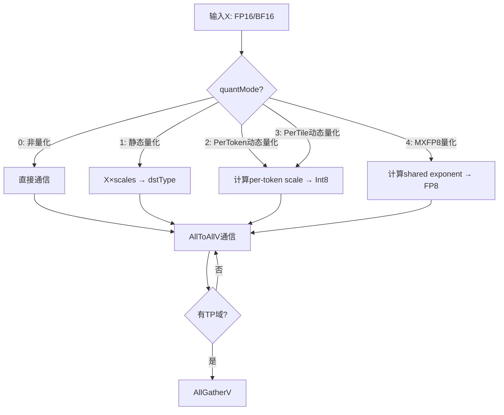
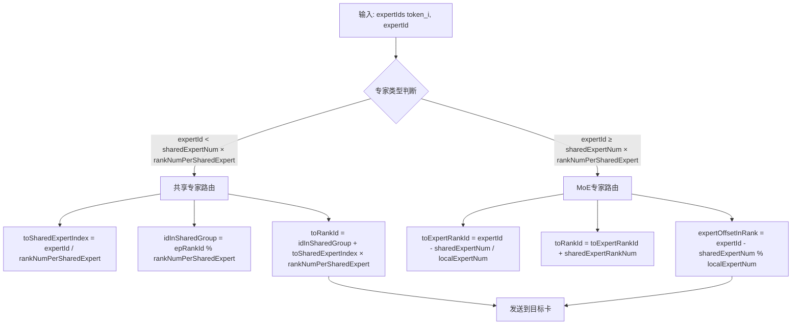
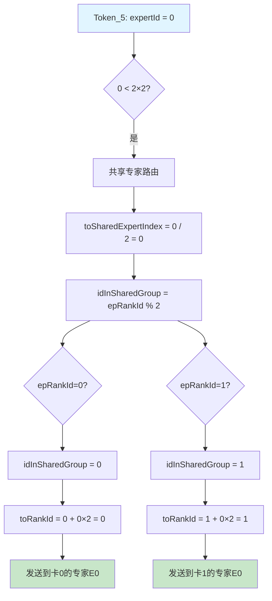
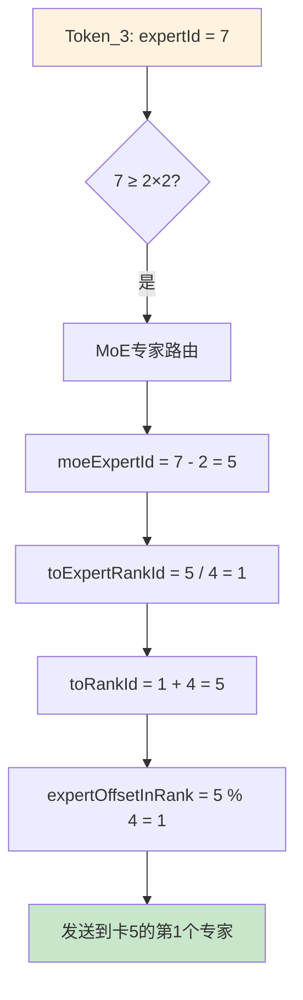
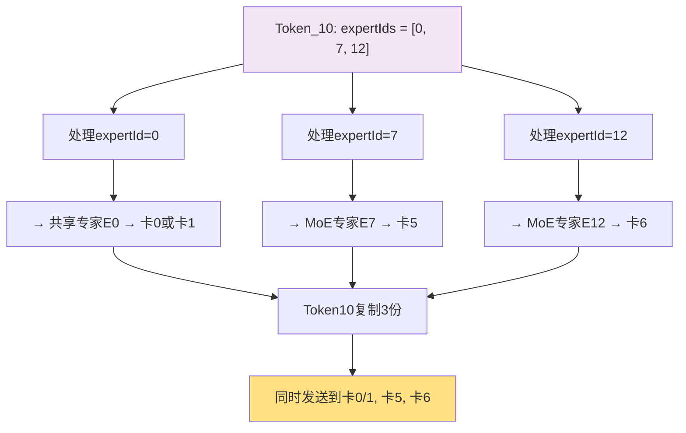

# MoeDistributeDispatchV2 算子实现分析报告

> **生成时间**: 2026-04-03
> **算子名称**: MoeDistributeDispatchV2
> **产品支持**: Ascend 950PR/950DT, Atlas A3训练/推理系列, Atlas A2训练/推理系列

---

## 目录

- [1. 算子概述](#1-算子概述)
- [2. 入参与路由机制详解](#2-入参与路由机制详解)
- [3. 目录结构](#3-目录结构)
- [4. 核心组件分析](#4-核心组件分析)
- [5. 关键技术实现](#5-关键技术实现)
- [6. 产品差异](#6-产品差异)
- [7. 性能优化技术](#7-性能优化技术)
- [8. 约束与限制](#8-约束与限制)
- [9. 调用示例](#9-调用示例)
- [10. 总结](#10-总结)

---

## 1. 算子概述

### 1.1 功能描述

`MoeDistributeDispatchV2` 是混合专家（Mixture of Experts, MoE）架构中的核心分发算子，负责将Token数据按照专家路由信息分发到各个专家节点。该算子支持多种量化模式和通信算法，是实现高效MoE模型训练与推理的关键组件。

### 1.2 核心功能

| 功能          | 描述                                         |
| ----------- | ------------------------------------------ |
| **Token量化** | 支持非量化、静态量化、动态量化（per-token/pertile）、MXFP8量化 |
| **EP域通信**   | 专家并行的AllToAllV通信                           |
| **TP域通信**   | 可选的数据并行AllGatherV通信                        |
| **辅助信息生成**  | 为Combine算子生成同步辅助信息                         |

### 1.3 量化模式



---

## 2. 入参与路由机制详解

### 2.1 核心入参说明

| 参数名                     | 类型        | Shape                              | 描述                                |
| ----------------------- | --------- | ---------------------------------- | --------------------------------- |
| **x**                   | FP16/BF16 | [Bs, H]                            | Token特征数据，Bs为token数，H为hidden size |
| **expertIds**           | INT32     | [Bs, K]                            | 每个token的topK个专家索引                 |
| **scalesOptional**      | FP32      | [moeExpertNum] 或 [moeExpertNum, H] | 量化平滑系数（可选）                        |
| **epWorldSize**         | 属性        | -                                  | EP通信域大小（总卡数）                      |
| **epRankId**            | 属性        | -                                  | EP域内本卡的ID [0, epWorldSize)        |
| **moeExpertNum**        | 属性        | -                                  | MoE专家总数                           |
| **sharedExpertNum**     | 属性        | -                                  | 共享专家数量                            |
| **sharedExpertRankNum** | 属性        | -                                  | 共享专家卡数量                           |

### 2.2 Token路由核心机制

#### 2.2.1 路由计算公式

算子的核心功能是根据 `expertIds` 将Token分发到正确的卡和专家。路由计算的关键公式如下：

```cpp
// ========== 关键变量定义 ==========
// localExpertNum: 每张卡上的MoE专家数
//   - 对于MoE专家卡: localExpertNum = moeExpertNum / (epWorldSize - sharedExpertRankNum)
//   - 对于共享专家卡: localExpertNum = 1

// expertId: 全局专家ID，范围 [0, moeExpertNum)

// ========== 核心路由公式 ==========
// 1. 计算目标专家所在卡（在MoE专家卡中的索引）
toExpertRankId = expertId / localExpertNum;

// 2. 计算实际目标卡ID（考虑共享专家卡）
toRankId = toExpertRankId + sharedExpertRankNum;

// 3. 计算专家在该卡上的局部索引
expertOffsetInRank = expertId % localExpertNum;
```

#### 2.2.2 路由流程图

**通用路由决策流程：**



#### 2.2.3 具体路由示例

**示例配置：**

```yaml
系统配置:
  epWorldSize: 8              # 总共8张卡 (ID: 0~7)
  moeExpertNum: 16            # 16个MoE专家 (ID: 0~15)
  sharedExpertNum: 2          # 2个共享专家 (ID: 0~1)
  sharedExpertRankNum: 4      # 共享专家占用4张卡 (ID: 0~3)

计算结果:
  moeExpertRankNum: 4         # MoE专家卡数 = 8 - 4 = 4
  localExpertNum: 4           # 每卡MoE专家数 = 16 / 4 = 4
  rankNumPerSharedExpert: 2   # 每共享专家卡数 = 4 / 2 = 2
```

**卡分布情况：**

```
┌─────────────────────────────────────────────────────────────────────┐
│                         专家分布图                                   │
├──────────┬──────────┬──────────┬──────────┬──────────┬─────────────┤
│   卡ID   │   0      │   1      │   2      │   3      │   4~7      │
├──────────┼──────────┼──────────┼──────────┼──────────┼─────────────┤
│ 类型      │ 共享     │ 共享      │ 共享     │ 共享     │   MoE      │
├──────────┼──────────┼──────────┼──────────┼──────────┼─────────────┤
│ 专家列表  │ E0, E1   │ E0, E1   │ E0, E1   │ E0, E1   │ E2~E15    │
│          │ (共享)    │ (共享)   │ (共享)    │ (共享)   │ (各4个)   │
└──────────┴──────────┴──────────┴──────────┴──────────┴─────────────┘

说明:
- 共享专家E0: 部署在卡0、卡1 (rankNumPerSharedExpert=2)
- 共享专家E1: 部署在卡2、卡3
- MoE专家E2-E5: 部署在卡4 (localExpertNum=4)
- MoE专家E6-E9: 部署在卡5
- MoE专家E10-E13: 部署在卡6
- MoE专家E14-E15: 部署在卡7
```

**示例1：Token需要发送到共享专家E0**



**示例2：Token需要发送到MoE专家E7**



**示例3：TopK=3的Token多路由**



**完整路由计算过程示例：**

假设当前卡 `epRankId = 3`（共享专家卡），处理 `expertId = 9` 的token：

```
步骤1: 判断专家类型
├── 共享专家阈值 = sharedExpertNum × rankNumPerSharedExpert = 2 × 2 = 4
└── 9 ≥ 4 → MoE专家路由

步骤2: 计算MoE专家相对ID
└── moeExpertId = expertId - sharedExpertNum = 9 - 2 = 7

步骤3: 计算目标卡（在MoE专家卡中的索引）
└── toExpertRankId = moeExpertId / localExpertNum = 7 / 4 = 1

步骤4: 计算实际目标卡ID
└── toRankId = toExpertRankId + sharedExpertRankNum = 1 + 4 = 5

步骤5: 计算专家在目标卡上的局部索引
└── expertOffsetInRank = moeExpertId % localExpertNum = 7 % 4 = 3

结果: Token发送到 卡5 的第3个专家（专家E12）
```

#### 2.2.4 代码实现示例

```cpp
// Atlas A3 架构实现 (arch35/moe_distribute_dispatch_arch35.h)
__aicore__ inline void MoeScatterCopyTokens() {
    for (uint32_t tokenId = startTokenId; tokenId < endTokenId; ++tokenId) {
        // 获取专家ID
        uint32_t expertId = sortedOutI32LT_(tokenId);

        // 计算目标卡
        uint32_t toExpertRankId = expertId / localExpertNum_;
        uint32_t toRankId = toExpertRankId + sharedExpertRankNum_;

        // 计算前置专家的token数（用于数据重排）
        uint32_t rankStartExpertId = toExpertRankId * localExpertNum_;
        uint32_t preCount = tokenId;
        if (rankStartExpertId > 0) {
            preCount = tokenId - expertCumSumLT_(rankStartExpertId - 1);
        }

        // 计算目标地址
        GM_ADDR tokenGM = sendBufGM_ + COUNT_OFFSET * (toRankId + 1) +
                          (toRankId * axisMaxBs_ * localExpertNum_ + preCount) * perTokenCommSize_;

        // 处理token
        uint32_t tokenIndex = sortedIndex1LT_(tokenId) / axisK_;
        uint32_t expertIndex = sharedExpertRankNum_ > 0 ? (expertId + 1) : expertId;
        ProcessToken(outTokenGT, tokenIndex, ..., expertIndex);
    }
}
```

### 2.3 共享专家特殊处理

#### 2.3.1 共享专家分布

```
共享专家特点:
├── 每个共享专家可以复制部署到多张卡
├── 共享专家卡排在MoE专家卡前面
└── rankNumPerSharedExpert = sharedExpertRankNum / sharedExpertNum

卡分布示例 (sharedExpertNum=2, sharedExpertRankNum=4, epWorldSize=8):
┌────────────────────────────────────────────────────────────┐
│ 卡ID │ 0   │ 1   │ 2   │ 3   │ 4   │ 5   │ 6   │ 7   │
├──────┼─────┼─────┼─────┼─────┼─────┼─────┼─────┼─────┤
│类型  │共享│共享│共享│共享│ MoE│ MoE│ MoE│ MoE│
│专家  │E0,E1│E0,E1│E0,E1│E0,E1│... │... │... │... │
└──────┴─────┴─────┴─────┴─────┴─────┴─────┴─────┘
rankNumPerSharedExpert = 4 / 2 = 2 (每个共享专家部署在2张卡上)
```

#### 2.3.2 共享专家路由代码

```cpp
// 共享专家发送 (moe_distribute_dispatch_v2_full_mesh.h)
__aicore__ inline void SendToSharedExpert() {
    for (uint32_t virtualTokenIndex = startTokenId; virtualTokenIndex < endTokenId; ++virtualTokenIndex) {
        uint32_t sendTokenIndex = virtualTokenIndex % activeMaskBsCnt_;
        uint32_t toSharedExpertIndex = virtualTokenIndex / activeMaskBsCnt_;

        // 计算本卡在共享专家组中的ID
        uint32_t idInSharedGroup = epRankId_ % rankNumPerSharedExpert_;

        // 计算目标卡ID
        int32_t toRankId = idInSharedGroup + toSharedExpertIndex * rankNumPerSharedExpert_;

        // 计算目标地址
        dstWinGMTensor.SetGlobalBuffer((__gm__ XOutType*)(
            GetWindAddrByRankId(toRankId) + expertPerSizeOnWin_ * epRankId_ +
            sendTokenIndex * hCommuSize_));

        // 处理token
        TokenToExpert(dstWinGMTensor, inQueue, srcTokenIndex, axisK_ + toSharedExpertIndex);
    }
}
```

### 2.4 专家ID与卡映射示例

#### 2.4.1 示例配置

```yaml
配置参数:
  epWorldSize: 8              # 8张卡
  moeExpertNum: 16            # 16个MoE专家
  sharedExpertNum: 2          # 2个共享专家
  sharedExpertRankNum: 4      # 共享专家占用4张卡

计算结果:
  moeExpertRankNum: 4         # MoE专家卡数 = 8 - 4 = 4
  localExpertNum: 4           # 每卡MoE专家数 = 16 / 4 = 4
  rankNumPerSharedExpert: 2   # 每共享专家卡数 = 4 / 2 = 2
```

#### 2.4.2 专家分布表

| 全局专家ID | 专家类型 | 目标卡ID | 卡内局部索引 |
|-----------|---------|---------|-------------|
| 0 | 共享专家0 | 0, 1 | 0 |
| 1 | 共享专家1 | 2, 3 | 0 |
| 2 | MoE专家0 | 4 | 0 |
| 3 | MoE专家1 | 4 | 1 |
| 4 | MoE专家2 | 4 | 2 |
| 5 | MoE专家3 | 4 | 3 |
| 6 | MoE专家4 | 5 | 0 |
| 7 | MoE专家5 | 5 | 1 |
| ... | ... | ... | ... |
| 15 | MoE专家11 | 7 | 3 |

#### 2.4.3 Token路由示例

```cpp
// 假设 expertIds[3][2] = [5, 7, 9] 表示第3个token的top3专家
// Token 3 需要发送到:
//  - 专家5: toRankId = 5/4 + 4 = 5, offset = 5%4 = 1 (卡5的第1个专家)
//  - 专家7: toRankId = 7/4 + 4 = 5, offset = 7%4 = 3 (卡5的第3个专家)
//  - 专家9: toRankId = 9/4 + 4 = 6, offset = 9%4 = 1 (卡6的第1个专家)

// 代码实现
for (int k = 0; k < K; k++) {
    int expertId = expertIds[tokenIndex][k];

    if (expertId < sharedExpertNum * rankNumPerSharedExpert) {
        // 共享专家路由
        int toSharedExpertIndex = expertId / rankNumPerSharedExpert;
        int idInSharedGroup = epRankId % rankNumPerSharedExpert;
        int toRankId = idInSharedGroup + toSharedExpertIndex * rankNumPerSharedExpert;
        SendToRank(toRankId, tokenData, ...);
    } else {
        // MoE专家路由
        int moeExpertId = expertId - sharedExpertNum;
        int toExpertRankId = moeExpertId / localExpertNum;
        int toRankId = toExpertRankId + sharedExpertRankNum;
        int expertOffsetInRank = moeExpertId % localExpertNum;
        SendToExpertOnRank(toRankId, expertOffsetInRank, tokenData, ...);
    }
}
```

### 2.5 数据重排优化

#### 2.5.1 重排目的

将发送到同一rank的数据在GM内存中连续存放，减少RDMA通信次数。

#### 2.5.2 重排前后对比

```
原始布局 (expertIds已排序):
Token: [T0, T1, T2, T3, T4, T5, ...]
Expert:[E5, E5, E2, E5, E6, E2, ...]
Rank:  [R5, R5, R5, R5, R6, R5, ...]
       ↓ 数据分散，需要6次RDMA发送

重排后布局:
Rank 5: [T0, T1, T2, T5, ...]  ← 连续存放
Rank 6: [T4, ...]            ← 连续存放
       ↓ 只需2次RDMA发送
```

#### 2.5.3 重排实现

**示例配置：**
```yaml
配置: 8张卡, 16个MoE专家
  epWorldSize: 8
  moeExpertNum: 16
  sharedExpertNum: 0         # 简化示例，无共享专家
  localExpertNum: 2          # 每卡2个专家
```

**完整重排过程示例：**

**步骤0：原始输入数据**

```
输入: expertIds[6][2] (6个token, 每个token选2个专家)
┌───────┬────────────────┐
│ Token │   expertIds    │
├───────┼────────────────┤
│  T0   │   [5, 9]       │
│  T1   │   [3, 7]       │
│  T2   │   [5, 11]      │
│  T3   │   [1, 9]       │
│  T4   │   [7, 15]      │
│  T5   │   [3, 11]      │
└───────┴────────────────┘
```

**步骤1：展平expertIds并计算目标rank**

```cpp
// 展平为12个 (token, expertId) 对
// 每个expertId对应的目标rank计算: toRankId = expertId / localExpertNum
┌─────────┬───────────┬───────────┐
│  索引   │ expertId  │ toRankId  │
├─────────┼───────────┼───────────┤
│    0    │     5     │     2     │  // T0的第1个专家
│    1    │     9     │     4     │  // T0的第2个专家
│    2    │     3     │     1     │  // T1的第1个专家
│    3    │     7     │     3     │  // T1的第2个专家
│    4    │     5     │     2     │  // T2的第1个专家
│    5    │     11    │     5     │  // T2的第2个专家
│    6    │     1     │     0     │  // T3的第1个专家
│    7    │     9     │     4     │  // T3的第2个专家
│    8    │     7     │     3     │  // T4的第1个专家
│    9    │     15    │     7     │  // T4的第2个专家
│   10    │     3     │     1     │  // T5的第1个专家
│   11    │     11    │     5     │  // T5的第2个专家
└─────────┴───────────┴───────────┘
```

**步骤2：按expertId排序（关键步骤）**

```
排序前: [5, 9, 3, 7, 5, 11, 1, 9, 7, 15, 3, 11]
         ↓ 按expertId升序排序
排序后: [1, 3, 3, 5, 5, 7, 7, 9, 9, 11, 11, 15]

对应的原始索引: [6, 2, 10, 0, 4, 3, 8, 1, 7, 5, 11, 9]
对应的rank:     [0, 1, 1, 2, 2, 3, 3, 4, 4, 5, 5, 7]
```

**步骤2.5：计算专家前缀和（核心机制）**

**什么是前缀和？**

前缀和数组 `expertCumsum[i]` 表示从专家0到专家i-1的所有token总数。换句话说，它告诉我们专家i的token在重排后数组中的**起始位置**。

```
expertCumsum[i] = Σ(count[j]) for j = 0 to i-1
                    ↑
                专家0到i-1的token总数
```

**前缀和计算过程详解：**

```
首先统计每个专家的token数量（从步骤1的数据）:
┌─────────┬──────────┬───────────────────────────────┐
│ expertId │ token数量 │ 说明                          │
├─────────┼──────────┼───────────────────────────────┤
│    0    │    0     │ 无token选择专家0              │
│    1    │    1     │ T3选择专家1 (索引6)           │
│    2    │    0     │ 无token选择专家2              │
│    3    │    2     │ T1, T5选择专家3 (索引2,10)   │
│    4    │    0     │ 无token选择专家4              │
│    5    │    2     │ T0, T2选择专家5 (索引0,4)    │
│    6    │    0     │ 无token选择专家6              │
│    7    │    2     │ T1, T4选择专家7 (索引3,8)    │
│    8    │    0     │ 无token选择专家8              │
│    9    │    2     │ T0, T3选择专家9 (索引1,7)    │
│   10    │    0     │ 无token选择专家10             │
│   11    │    2     │ T2, T5选择专家11 (索引5,11)  │
│   12    │    0     │ 无token选择专家12             │
│   13    │    0     │ 无token选择专家13             │
│   14    │    0     │ 无token选择专家14             │
│   15    │    1     │ T4选择专家15 (索引9)         │
└─────────┴──────────┴───────────────────────────────┘
```

**计算前缀和数组：**

```
expertCumsum[0] = 0                                    // 基础值
expertCumsum[1] = expertCumsum[0] + count[0] = 0 + 0 = 0
expertCumsum[2] = expertCumsum[1] + count[1] = 0 + 1 = 1
expertCumsum[3] = expertCumsum[2] + count[2] = 1 + 0 = 1
expertCumsum[4] = expertCumsum[3] + count[3] = 1 + 2 = 3  ← 专家4的起始位置是3
expertCumsum[5] = expertCumsum[4] + count[4] = 3 + 0 = 3
expertCumsum[6] = expertCumsum[5] + count[5] = 3 + 2 = 5  ← 专家6的起始位置是5
expertCumsum[7] = expertCumsum[6] + count[6] = 5 + 0 = 5
expertCumsum[8] = expertCumsum[7] + count[7] = 5 + 2 = 7  ← 专家8的起始位置是7
expertCumsum[9] = expertCumsum[8] + count[8] = 7 + 0 = 7
expertCumsum[10] = expertCumsum[9] + count[9] = 7 + 2 = 9  ← 专家10的起始位置是9
expertCumsum[11] = expertCumsum[10] + count[10] = 9 + 0 = 9
expertCumsum[12] = expertCumsum[11] + count[11] = 9 + 2 = 11 ← 专家12的起始位置是11
expertCumsum[13] = expertCumsum[12] + count[12] = 11 + 0 = 11
expertCumsum[14] = expertCumsum[13] + count[13] = 11 + 0 = 11
expertCumsum[15] = expertCumsum[14] + count[14] = 11 + 0 = 11
expertCumsum[16] = expertCumsum[15] + count[15] = 11 + 1 = 12

结果: expertCumsum = [0, 0, 1, 1, 3, 3, 5, 5, 7, 7, 9, 9, 11, 11, 11, 11, 12]
```

**前缀和的直观含义：**

```
重排后的数组布局（按expertId排序）:
索引:   0   1   2   3   4   5   6   7   8   9  10  11
专家:  E1  E3  E3  E5  E5  E7  E7  E9  E9 E11 E11 E15
       ↑       ↑       ↑       ↑       ↑       ↑       ↑
       |       |       |       |       |       |       |
       0       1       3       5       7       9       11
       |       |       |       |       |       |       |
       |←E1→|←─E3─→|←─E5─→|←─E7─→|←─E9─→|←E11→|←E15→|

前缀和告诉我们:
- expertCumsum[3] = 1  → 专家3的token从索引1开始
- expertCumsum[5] = 3  → 专家5的token从索引3开始
- expertCumsum[9] = 7  → 专家9的token从索引7开始
- expertCumsum[11] = 9 → 专家11的token从索引9开始
```

**前缀和在重排中的作用：计算token在目标rank中的位置**

```
问题: 排序后数组中的某个token，在发送到目标rank时，应该放在该rank缓冲区的什么位置？

解决: 使用前缀和计算相对位置

公式:
preCount = sortedIndex - expertCumsum[rankStartExpertId - 1]

其中:
- sortedIndex: token在排序后数组中的索引
- rankStartExpertId: 该rank的第一个专家的全局ID
- expertCumsum[...]: 该rank之前所有专家的token总数
```

**具体计算示例：**

```
示例1: 计算T0-expert5在rank2中的位置
─────────────────────────────────────────────────────
输入:
- sortedIndex = 3        (T0-expert5在排序后数组的索引)
- expertId = 5
- toRankId = 5 / 2 = 2   (rank2)
- rankStartExpertId = 2 * 2 = 4  (rank2的第一个专家是E4)

计算:
preCount = sortedIndex - expertCumsum[rankStartExpertId - 1]
        = 3 - expertCumsum[4-1]
        = 3 - expertCumsum[3]
        = 3 - 1
        = 2

含义: T0-expert5是rank2中第2个到达的token（前面有E0,E1,E2,E3共1个token）
结果: T0-expert5放在rank2缓冲区的位置2


示例2: 计算T2-expert5在rank2中的位置
─────────────────────────────────────────────────────
输入:
- sortedIndex = 4        (T2-expert5在排序后数组的索引)
- expertId = 5
- toRankId = 5 / 2 = 2   (rank2)
- rankStartExpertId = 4

计算:
preCount = 4 - expertCumsum[3]
        = 4 - 1
        = 3

含义: T2-expert5是rank2中第3个到达的token
结果: T2-expert5放在rank2缓冲区的位置3


示例3: 计算T1-expert3在rank1中的位置
─────────────────────────────────────────────────────
输入:
- sortedIndex = 1        (T1-expert3在排序后数组的索引)
- expertId = 3
- toRankId = 3 / 2 = 1   (rank1)
- rankStartExpertId = 1 * 2 = 2  (rank1的第一个专家是E2)

计算:
preCount = 1 - expertCumsum[2-1]
        = 1 - expertCumsum[1]
        = 1 - 0
        = 0

含义: T1-expert3是rank1中第0个（第1个）到达的token
结果: T1-expert5放在rank1缓冲区的位置0


示例4: 计算T5-expert3在rank1中的位置
─────────────────────────────────────────────────────
输入:
- sortedIndex = 2        (T5-expert3在排序后数组的索引)
- expertId = 3
- toRankId = 3 / 2 = 1   (rank1)
- rankStartExpertId = 2

计算:
preCount = 2 - expertCumsum[1]
        = 2 - 0
        = 1

含义: T5-expert3是rank1中第1个（第2个）到达的token
结果: T5-expert3放在rank1缓冲区的位置1
```

**前缀和的作用总结图：**

```
┌─────────────────────────────────────────────────────────────────┐
│                    前缀和的作用机制                             │
├─────────────────────────────────────────────────────────────────┤
│                                                                 │
│  排序后数组: [E1, E3, E3, E5, E5, E7, E7, E9, E9, E11, E11, E15] │
│  索引:        0    1    2    3    4    5    6    7    8    9   10   11│
│                                                                 │
│  前缀和数组: expertCumsum[Ei] = E0~Ei-1的token总数            │
│                                                                 │
│  计算某token在目标rank中的位置:                                │
│  ┌─────────────────────────────────────────────────────────┐   │
│  │ preCount = sortedIndex - expertCumsum[rankStartExpert-1]│   │
│  │                                                         │   │
│  │ 含义: 该token在目标rank中是第几个到达的                  │   │
│  └─────────────────────────────────────────────────────────┘   │
│                                                                 │
│  应用: 计算GM地址                                             │
│  GM_ADDR = baseAddr + rankOffset + preCount * tokenSize       │
│           ↑           ↑              ↑                        │
│        基地址      rank偏移      rank内位置                   │
│                                                                 │
└─────────────────────────────────────────────────────────────────┘
```

**为什么需要前缀和？**

没有前缀和的情况下，计算token位置需要：
1. 遍历前面所有token
2. 统计有多少个发往同一rank
3. 时间复杂度: O(n)

使用前缀和后：
1. 一次O(1)查表
2. 直接获得前面有多少token
3. 时间复杂度: O(1)

**步骤3：按rank分组（重排后的布局）**

```
排序后的数据按rank连续存放:
┌─────────────────────────────────────────────────────────────┐
│ Rank 0: [索引6] → [T3, expertId=1]                          │
│ Rank 1: [索引2, 索引10] → [T1, expertId=3], [T5, expertId=3] │
│ Rank 2: [索引0, 索引4] → [T0, expertId=5], [T2, expertId=5]  │
│ Rank 3: [索引3, 索引8] → [T1, expertId=7], [T4, expertId=7]  │
│ Rank 4: [索引1, 索引7] → [T0, expertId=9], [T3, expertId=9]  │
│ Rank 5: [索引5, 索引11] → [T2, expertId=11], [T5, expertId=11]│
│ Rank 6: [] → (空)                                        │
│ Rank 7: [索引9] → [T4, expertId=15]                       │
└─────────────────────────────────────────────────────────────┘

优势: 
- 原始: 需要8次RDMA发送（可能每个rank都需要单独发送）
- 重排后: 只需5次RDMA发送（跳过空rank6）
```

**步骤4：数据内存布局变化图**

```
原始内存布局 (按token顺序):
┌────┬────┬────┬────┬────┬────┬────┬────┬────┬────┬────┬────┐
│ T0 │ T0 │ T1 │ T1 │ T2 │ T2 │ T3 │ T3 │ T4 │ T4 │ T5 │ T5 │
│ E5 │ E9 │ E3 │ E7 │ E5 │E11 │ E1 │ E9 │ E7 │E15 │ E3 │E11 │
└────┴────┴────┴────┴────┴────┴────┴────┴────┴────┴────┴────┘
  ↓      ↓      ↓      ↓      ↓      ↓      ↓      ↓      ↓      ↓      ↓      ↓
 R2     R4     R1     R3     R2     R5     R0     R4     R3     R7     R1     R5
       ↑ 数据分散，rank不连续

重排后内存布局 (按rank分组):
┌────┬────┬────┬────┬────┬────┬────┬────┬────┬────┬────┬────┐
│ T3 │ T1 │ T5 │ T0 │ T2 │ T1 │ T4 │ T0 │ T3 │ T2 │ T5 │ T4 │
│ E1 │ E3 │ E3 │ E5 │ E5 │ E7 │ E7 │ E9 │ E9 │ E11│ E11│E15 │
└────┴────┴────┴────┴────┴────┴────┴────┴────┴────┴────┴────┘
  R0    R1,R1   R2,R2   R3,R3   R4,R4    R5,R5    R6(空)   R7
       ↑ 同rank数据连续，减少RDMA次数
```

**代码实现详解：**

```cpp
// ========== 步骤1: 统计每个(rank, expert)的token数量 ==========
// statusTensor[rankId][expertOffset] = tokenCount
for (uint32_t i = 0; i < expertIdsCnt_; i++) {
    int expertId = expertIdsLT_(i);
    int rankId = expertId / localExpertNum_;           // 计算目标rank
    int expertOffsetInRank = expertId % localExpertNum_; // rank内专家索引
    
    // 读取当前计数并保存
    expertCountTensor_(i) = statusTensor_(rankId * STATUS_ENTRY_COUNT + expertOffsetInRank);
    
    // 计数+1
    statusTensor_(rankId * STATUS_ENTRY_COUNT + expertOffsetInRank)++;
}

// 示例结果:
// statusTensor[2][1] = 2  // rank2的expert1(E5)收到2个token
// statusTensor[4][1] = 2  // rank4的expert1(E9)收到2个token


// ========== 步骤2: 计算专家前缀和（用于确定重排位置）==========
expertCumsumTensor_(0) = 0;
for (uint32_t expertId = 1; expertId < moeExpertNum_; expertId++) {
    // 获取该专家的token数量
    int rankId = (expertId - 1) / localExpertNum_;
    int expertOffsetInRank = (expertId - 1) % localExpertNum_;
    uint32_t count = statusTensor_(rankId * STATUS_ENTRY_COUNT + expertOffsetInRank);
    
    // 累加前面的数量
    uint32_t preSum = expertCumsumTensor_(expertId - 1);
    expertCumsumTensor_(expertId) = count + preSum;
}

// 示例结果:
// expertCumsumTensor[0] = 0   // E0: 前0个token
// expertCumsumTensor[1] = 0   // E1: 前0个token
// expertCumsumTensor[2] = 0   // E2: 前0个token
// expertCumsumTensor[3] = 1   // E3: 前1个token (索引6)
// expertCumsumTensor[4] = 1   // E4: 前1个token
// expertCumsumTensor[5] = 3   // E5: 前3个token (索引6,2,10)


// ========== 步骤3: 使用Sort进行重排 ==========
// 构造排序key: expertId (负值用于升序排列)
LocalTensor<float> sortKeys;
for (uint32_t i = 0; i < expertIdsCnt_; i++) {
    sortKeys(i) = -expertIdsLT_(i);  // 取负值实现升序
}

// 执行排序
Sort(sortedKeys, sortedIndices, ...);

// 排序后，发送到同一rank的token会连续存放
// 例如: expertId=[3,3,5,5] → rank=[1,1,2,2] 连续


// ========== 步骤4: 计算每个token的重排位置 ==========
for (uint32_t i = 0; i < sortNum_; i++) {
    int expertId = sortedExpertIds_(i);  // 排序后的expertId
    int rankId = expertId / localExpertNum_;
    
    // 计算重排位置
    uint32_t rankStartExpertId = rankId * localExpertNum_;
    uint32_t preCount = i;
    if (rankStartExpertId > 0) {
        preCount = i - expertCumsumLT_(rankStartExpertId - 1);
    }
    
    // preCount就是该token在目标rank中的位置
    // 用于计算GM地址
}
```

**关键优化点：**

1. **排序减少通信次数**: 将8次可能的rank通信减少到5次实际通信
2. **内存访问局部性**: 同rank数据连续存放，提高RDMA效率
3. **前缀和快速定位**: O(1)时间计算token在目标rank中的位置

### 2.6 通信窗口布局

#### 2.6.1 窗口结构

```
┌─────────────────────────────────────────────────────────┐
│              WindowsIn/WindowsOut 布局                  │
├─────────────────────────────────────────────────────────┤
│  每个rank对应一个窗口，窗口内布局:                        │
│  ┌──────────────────────────────────────────────────┐  │
│  │ TokenCounts (STATUS_ENTRY_COUNT个int32)          │  │
│  │ - sendCounts[rankId][0]: 发往rankId的第0个专家的token数│
│  │ - sendCounts[rankId][1]: 发往rankId的第1个专家的token数│
│  │ - ...                                            │  │
│  │ - FLAG1: 同步标志位1                              │  │
│  ├──────────────────────────────────────────────────┤  │
│  │ Tokens Data (连续存储)                           │  │
│  │ - 按rank分组，每个rank的数据连续存放               │  │
│  │ - 每个rank内按专家索引排序                         │  │
│  ├──────────────────────────────────────────────────┤  │
│  │ FLAG2: 同步标志位2                                │  │
│  └──────────────────────────────────────────────────┘  │
└─────────────────────────────────────────────────────────┘
```

#### 2.6.2 地址计算

```cpp
// 计算目标rank的窗口地址
GM_ADDR tokenGM = sendBufGM_ +                    // 基地址
                   COUNT_OFFSET * (toRankId + 1) + // 跳过前面的count区域
                   (toRankId * axisMaxBs_ * localExpertNum_ + preCount) * perTokenCommSize_;
                   // ↑ rank偏移    ↑ 每rank的token容量    ↑ 该rank内已发送的token数
```

---

## 3. 目录结构

```
moe_distribute_dispatch_v2/
├── op_api/                  # ACLNN API接口层
│   ├── aclnn_moe_distribute_dispatch_v2.{cpp,h}
│   ├── aclnn_moe_distribute_dispatch_v3.{cpp,h}
│   ├── aclnn_moe_distribute_dispatch_v4.{cpp,h}
│   └── moe_distribute_dispatch_v2_base.{cpp,h}
├── op_graph/                # 算子图注册
│   ├── fallback_moe_distribute_dispatch_v2.cpp
│   └── moe_distribute_dispatch_v2_gen_task.cpp
├── op_host/                 # Host侧处理
│   ├── moe_distribute_dispatch_v2_def.cpp        # 算子定义
│   ├── moe_distribute_dispatch_v2_infershape.cpp # Shape推导
│   └── op_tiling/                                   # Tiling实现
│       ├── moe_distribute_dispatch_v2_tiling.cpp
│       ├── moe_distribute_dispatch_tiling_helper.{cpp,h}
│       └── arch35/
│           └── moe_distribute_dispatch_tiling_arch35.{cpp,h}
├── op_kernel/               # Device侧Kernel实现
│   ├── moe_distribute_dispatch_v2.{cpp,h}         # 主Kernel
│   ├── moe_distribute_dispatch_v2_full_mesh.h     # 全互联通信
│   ├── moe_distribute_dispatch_v2_layered.h       # 分层通信
│   ├── moe_distribute_dispatch_v2_host_kfc.h      # KFC优化
│   ├── moe_distribute_dispatch_v2_quant.h         # 量化处理
│   ├── moe_distribute_dispatch_a2.{h,layered.h}   # Atlas A2专用
│   ├── quantize_functions.h                       # 量化函数
│   ├── moe_distribute_v2_base.h                   # 基础类
│   ├── moe_distribute_v2_constant.h               # 常量定义
│   ├── moe_distribute_elastic.h                   # 弹性通信
│   ├── check_winsize.h                            # 窗口大小检查
│   ├── common.h
│   └── arch35/
│       └── moe_distribute_dispatch_arch35.h       # Atlas A3专用
├── examples/                # 调用示例
│   └── test_aclnn_moe_distribute_dispatch_v2.cpp
├── tests/                   # 单元测试
│   └── ut/
│       ├── op_api/
│       └── op_host/
├── docs/                    # 文档
│   ├── aclnnMoeDistributeDispatchV{2,3,4}.md
│   └── MoeDistributeDispatch-Combine算子设计介绍.md
├── CMakeLists.txt
└── README.md
```

---

## 4. 核心组件分析

### 4.1 API层 (op_api)

#### 4.1.1 接口层次结构

```
aclnnMoeDistributeDispatchV2    (V2版本，Atlas A2)
aclnnMoeDistributeDispatchV3    (V3版本，Atlas A3/Ascend 950PR)
aclnnMoeDistributeDispatchV4    (V4版本，扩展功能)
         ↓
moe_distribute_dispatch_v2_base (公共基类)
```

#### 4.1.2 核心接口

```cpp
// 工作空间计算
ACLNN_API aclnnStatus aclnnMoeDistributeDispatchGetWorkspaceSize(
    const aclTensor* x,                  // 输入Token
    const aclTensor* expertIds,          // 专家索引 [Bs, K]
    const aclTensor* scalesOptional,     // 量化系数
    const aclTensor* xActiveMaskOptional, // Token激活掩码
    const char* groupEp,                 // EP通信域
    int64_t epWorldSize,                 // EP域大小
    int64_t epRankId,                    // EP域本卡ID
    int64_t moeExpertNum,                // MoE专家数
    const char* groupTp,                 // TP通信域（可选）
    int64_t quantMode,                   // 量化模式
    const char* commAlg,                 // 通信算法
    // ... 其他参数
    uint64_t* workspaceSize,             // 输出：工作空间大小
    aclOpExecutor** executor             // 输出：执行器
);
```

### 4.2 Kernel层架构

#### 4.2.1 主处理流程

```cpp
template <typename XType, typename ExpandXOutType, int32_t QuantMode,
          bool IsSmoothScaleExist, bool IsNeedAllgather>
class MoeDistributeDispatchV2 {
public:
    __aicore__ inline void Process() {
        // 1. Token激活掩码计算
        TokenActiveMaskCal();

        // 2. 分发处理
        AlltoAllDispatch();

        // 3. AllGather处理（如需要）
        if constexpr (IsNeedAllgather) {
            AllgatherProcessOut();
        }

        // 4. 设置专家Token数量输出
        SetExpertTokenNums();
    }

private:
    __aicore__ inline void SendToSharedExpert();    // 发送到共享专家
    __aicore__ inline void SendToMoeExpert();       // 发送到MoE专家
    __aicore__ inline void WaitDispatch();          // 等待通信完成
};
```

### 4.3 量化模块

```cpp
enum class QuantModeA5 : uint32_t {
    NON_QUANT = 0,              // 非量化
    STATIC_QUANT = 1,           // 静态量化
    PERTOKEN_DYNAMIC_QUANT = 2, // Per-Token动态量化
    PERGROUP_DYNAMIC_QUANT = 3, // Per-Group动态量化
    MX_QUANT = 4                // MXFP8量化
};
```

---

## 5. 关键技术实现

### 5.1 Token重排优化

详见 [2.5 数据重排优化](#25-数据重排优化)

### 5.2 窗口通信机制

窗口通信机制是MoE算子实现高效RDMA通信的核心技术。通过在共享内存中预分配通信窗口，各卡可以自主进行RDMA通信，无需Host侧干预。

#### 5.2.1 窗口基本概念

**什么是通信窗口？**

通信窗口是在HCCL（Heterogeneous Compute Communication Library）管理的共享内存区域中预分配的缓冲区，每张卡都有自己的发送窗口（WindowsOut）和接收窗口（WindowsIn）。

```
┌─────────────────────────────────────────────────────────────────┐
│                    窗口整体布局 (以8卡系统为例)                   │
├─────────────────────────────────────────────────────────────────┤
│                                                                 │
│  Rank 0 内存:                                                   │
│  ┌───────────────────────────────────────────────────────────┐  │
│  │ WindowsIn_0  ← 接收其他卡发来的数据                        │  │
│  │ WindowsOut_0 ← 存放要发给其他卡的数据                        │  │
│  └───────────────────────────────────────────────────────────┘  │
│                                                                 │
│  Rank 1 内存:                                                   │
│  ┌───────────────────────────────────────────────────────────┐  │
│  │ WindowsIn_1                                                │  │
│  │ WindowsOut_1                                               │  │
│  └───────────────────────────────────────────────────────────┘  │
│  ...                                                           │
│  Rank 7 内存:                                                   │
│  ┌───────────────────────────────────────────────────────────┐  │
│  │ WindowsIn_7                                                │  │
│  │ WindowsOut_7                                               │  │
│  └───────────────────────────────────────────────────────────┘  │
│                                                                 │
└─────────────────────────────────────────────────────────────────┘
```

#### 5.2.2 窗口内部结构详解

**每个窗口被划分为多个子区域，每个rank对应一个子区域：**

```
WindowsOut (发送窗口) 布局:
┌─────────────────────────────────────────────────────────────────┐
│ Rank 0 子区 │ Rank 1 子区 │ Rank 2 子区 │ ... │ Rank 7 子区 │    │
├─────────────┼─────────────┼─────────────┼─────┼─────────────┼────┤
│ TokenCounts │ TokenCounts │ TokenCounts │ ... │ TokenCounts │ ... │
│ + FLAG1     │ + FLAG1     │ + FLAG1     │     │ + FLAG1     │    │
├─────────────┼─────────────┼─────────────┼─────┼─────────────┼────┤
│ Token Data  │ Token Data  │ Token Data  │ ... │ Token Data  │    │
│ (连续存放)   │ (连续存放)   │ (连续存放)   │     │ (连续存放)   │    │
├─────────────┼─────────────┼─────────────┼─────┼─────────────┼────┤
│ FLAG2       │ FLAG2       │ FLAG2       │ ... │ FLAG2       │    │
└─────────────┴─────────────┴─────────────┴─────┴─────────────┴────┘

每个子区包含:
1. TokenCounts: 记录发往该rank每个专家的token数量
2. Token Data: 实际的token数据，按专家索引连续存放
3. FLAG1: 同步标志1，表示TokenCounts是否接收完成
4. FLAG2: 同步标志2，表示Token Data是否接收完成
```

#### 5.2.3 窗口通信完整流程示例

**示例配置：**
```yaml
系统: 4张卡 (epWorldSize=4)
每卡专家数: 2 (localExpertNum=2)
Token数据: 每个token hidden size = 128 (H=128)
```

**场景：Rank 0 发送数据到 Rank 1, 2, 3**

```
┌─────────────────────────────────────────────────────────────────┐
│                    窗口通信完整流程                            │
├─────────────────────────────────────────────────────────────────┤
│                                                                 │
│  步骤1: Rank 0 准备发送数据                                    │
│  ┌─────────────────────────────────────────────────────────┐   │
│  │ 输入: T0→E2(rank1), T0→E5(rank2), T1→E4(rank2)          │   │
│  │       T1→E7(rank3)                                       │   │
│  │                                                         │   │
│  │ 按rank重排后:                                            │   │
│  │   Rank 1: [T0→E2]                                      │   │
│  │   Rank 2: [T0→E5, T1→E4]                               │   │
│  │   Rank 3: [T1→E7]                                      │   │
│  └─────────────────────────────────────────────────────────┘   │
│                           ↓                                     │
│  步骤2: Rank 0 写入WindowsOut_0                               │
│  ┌─────────────────────────────────────────────────────────┐   │
│  │ WindowsOut_0 布局:                                     │   │
│  │ ┌───────────┬───────────┬───────────┬───────────┐      │   │
│  │ │ Rank 0   │ Rank 1   │ Rank 2   │ Rank 3   │      │   │
│  │ ├───────────┼───────────┼───────────┼───────────┤      │   │
│  │ │ [0,0,0]  │ [1,0,0]  │ [2,0,0]  │ [1,0,0]  │      │   │
│  │ │ + FLAG1  │ + FLAG1  │ + FLAG1  │ + FLAG1  │      │   │
│  │ ├───────────┼───────────┼───────────┼───────────┤      │   │
│  │ │ (本卡数据)│ T0→E2   │ T0→E5    │ T1→E7   │      │   │
│  │ │           │          │ T1→E4    │          │      │   │
│  │ ├───────────┼───────────┼───────────┼───────────┤      │   │
│  │ │ FLAG2     │ FLAG2    │ FLAG2    │ FLAG2    │      │   │
│  │ └───────────┴───────────┴───────────┴───────────┘      │   │
│  │                                                         │   │
│  │ 说明: [1,0,0]表示rank1有1个token发给expert0            │   │
│  │       [2,0,0]表示rank2有2个token分别发给expert0,1      │   │
│  └─────────────────────────────────────────────────────────┘   │
│                           ↓                                     │
│  步骤3: Rank 0 触发RDMA通信                                  │
│  ┌─────────────────────────────────────────────────────────┐   │
│  │ AICPU执行RDMA:                                          │   │
│  │   src = WindowsOut_0[Rank1子区]                        │   │
│  │   dst = WindowsIn_1[Rank0子区]                          │   │
│  │   (其他rank同理)                                         │   │
│  │                                                         │   │
│  │ 关键: 一次RDMA发送整个rank子区的连续数据                │   │
│  └─────────────────────────────────────────────────────────┘   │
│                           ↓                                     │
│  步骤4: Rank 1 轮询等待接收完成                                │
│  ┌─────────────────────────────────────────────────────────┐   │
│  │ WindowsIn_1 布局 (Rank 1视角):                          │   │
│  │ ┌───────────┬───────────┬───────────┬───────────┐      │   │
│  │ │ Rank 0   │ Rank 1   │ Rank 2   │ Rank 3   │      │   │
│  │ ├───────────┼───────────┼───────────┼───────────┤      │   │
│  │ │ 等待...   │ [0,0,0]  │ 等待...   │ 等待...   │      │   │
│  │ │ + FLAG1  │ + FLAG1  │ + FLAG1  │ + FLAG1  │      │   │
│  │ ├───────────┼───────────┼───────────┼───────────┤      │   │
│  │ │ T0→E2    │ (本卡数据)│ T?→E?    │ T?→E?    │      │   │
│  │ │ (从rank0来)│          │ (从rank2来)│          │      │   │
│  │ ├───────────┼───────────┼───────────┼───────────┤      │   │
│  │ │ FLAG2    │ FLAG2    │ FLAG2    │ FLAG2    │      │   │
│  │ └───────────┴───────────┴───────────┴───────────┘      │   │
│  │                                                         │   │
│  │ 等待逻辑:                                                │   │
│  │   while (FLAG1 != EXPECTED_VALUE) { sleep(); }         │   │
│  │   // FLAG1刷新 → TokenCounts接收完成                     │   │
│  │   while (FLAG2 != EXPECTED_VALUE) { sleep(); }         │   │
│  │   // FLAG2刷新 → Token Data接收完成                      │   │
│  └─────────────────────────────────────────────────────────┘   │
│                           ↓                                     │
│  步骤5: Rank 1 处理接收到的数据                                │
│  ┌─────────────────────────────────────────────────────────┐   │
│  │ 接收到的数据: T0→E2                                     │   │
│  │                                                         │   │
│  │ 后续处理:                                               │   │
│  │   - 按专家索引重新排序                                    │   │
│  │   - 送往FFN层计算                                       │   │
│  │   - 等待Combine算子合并结果                               │   │
│  └─────────────────────────────────────────────────────────┘   │
│                                                                 │
└─────────────────────────────────────────────────────────────────┘
```

#### 5.2.4 窗口地址计算详解

**关键参数：**
```cpp
perTokenCommSize_   // 每个token的通信大小（包含特征+辅助信息）
axisMaxBs_          // 每个rank最大接收token数
localExpertNum_     // 每个rank的专家数
COUNT_OFFSET        // TokenCounts区域大小
```

**地址计算公式推导：**

```
目标: 计算发送给rankId的token数据在WindowsOut中的地址

公式:
tokenGM = sendBufGM_ +                                    // 基地址
          COUNT_OFFSET * (toRankId + 1) +                // 跳过前面rank的TokenCounts区
          (toRankId * axisMaxBs_ * localExpertNum_ +      // rank偏移
           preCount) * perTokenCommSize_;               // rank内偏移

详解:
┌────────────────────────────────────────────────────────────────┐
│ sendBufGM_                                                  │
│   ↓                                                         │
│ ├─ COUNT_OFFSET (跳过Rank0的TokenCounts+FLAG1)             │
│ │                                                             │
│ ├─ COUNT_OFFSET (跳过Rank1的TokenCounts+FLAG1)  ← toRankId=1时 │
│ │                                                             │
│ ├─ Rank0的Token Data区 (大小: axisMaxBs_ * localExpertNum_)    │
│ │   │                                                         │
│ │   └─ Rank1的Token Data区 (大小: axisMaxBs_ * localExpertNum_) │
│ │       │                                                     │
│ │       └─ Rank2的Token Data区...                            │
│ │           │                                                 │
│ │           └─ preCount * perTokenCommSize_                  │
│ │               ↑ 该rank内已存放的token数                     │
│ │                                                           │
│ └─ 最终地址 = 这里存放下一个token                             │
│                                                             │
└────────────────────────────────────────────────────────────────┘
```

**具体计算示例：**

```cpp
配置:
  perTokenCommSize_ = 512 bytes      // 每个token 128*4 = 512字节
  axisMaxBs_ = 64                     // 每rank最大接收64个token
  localExpertNum_ = 2                  // 每rank 2个专家
  COUNT_OFFSET = 256 bytes              // TokenCounts区大小

示例1: 计算发送给Rank 1的第2个token的地址
───────────────────────────────────────────────────────
输入:
  toRankId = 1
  preCount = 2                         // 该rank内第2个token(从0开始)

计算:
  baseOffset = COUNT_OFFSET * (1 + 1)
             = 256 * 2
             = 512 bytes
  
  rankOffset = 1 * (64 * 2) * 512
             = 1 * 128 * 512
             = 65536 bytes
  
  innerOffset = 2 * 512
             = 1024 bytes
  
  tokenGM = sendBufGM_ + 512 + 65536 + 1024
          = sendBufGM_ + 67072 bytes

结果: 第2个token存放在WindowsOut基址+67072字节处


示例2: 计算发送给Rank 2的第0个token的地址
───────────────────────────────────────────────────────
输入:
  toRankId = 2
  preCount = 0                         // 该rank内第0个token

计算:
  baseOffset = COUNT_OFFSET * (2 + 1)
             = 256 * 3
             = 768 bytes
  
  rankOffset = 2 * (64 * 2) * 512
             = 2 * 128 * 512
             = 131072 bytes
  
  innerOffset = 0 * 512
             = 0 bytes
  
  tokenGM = sendBufGM_ + 768 + 131072 + 0
          = sendBufGM_ + 131840 bytes

结果: 第0个token存放在WindowsOut基址+131840字节处
```

#### 5.2.5 双标志同步机制详解

```
┌─────────────────────────────────────────────────────────────────┐
│                    双标志同步时序图                             │
├─────────────────────────────────────────────────────────────────┤
│                                                                 │
│  Rank 0 (发送方)              Rank 1 (接收方)                    │
│      │                            │                             │
│      │  1. 写入TokenCounts                                        │
│      ├─────────────────────────────────>                         │
│      │                            │ 等待...                      │
│      │  2. 写入FLAG1 = MAGIC_VALUE                                  │
│      ├─────────────────────────────────>                         │
│      │                            │ 检测: FLAG1 == MAGIC?         │
│      │                            │                             │
│      │  3. 写入Token Data                                         │
│      ├─────────────────────────────────>    RDMA传输                │
│      │                            │ 等待...                      │
│      │                            │ 累加接收计数                  │
│      │  4. 写入FLAG2 = MAGIC_VALUE                                  │
│      ├─────────────────────────────────>                         │
│      │                            │ 检测: FLAG2 == MAGIC?         │
│      │                            │                             │
│      │                            │ 数据接收完成，开始处理        │
│      │                            │                             │
│      │                            │ 5. 处理完成后，可选择复用     │
│      │  │                            │                             │
│                                                                 │
└─────────────────────────────────────────────────────────────────┘

关键点:
- FLAG1 和 FLAG2 是设备侧同步的原子变量
- 使用轮询方式检测，避免中断开销
- 双标志设计支持流水线：数据传输与计算并行
```

#### 5.2.6 窗口大小计算

```cpp
// 窗口大小计算公式
uint64_t winSize = 2 * (                              // 双缓冲
    STATUS_SIZE +                                  // 状态区大小
    epWorldSize * (                                // 每个rank
        sizeof(int32_t) * localExpertNum +         // TokenCounts
        axisMaxBs * hAlignWinSize                 // Token Data区
    )
);

// 示例计算
uint64_t winSize = 2 * (
    256 +                                      // STATUS_SIZE
    8 * (                                     // epWorldSize = 8
        sizeof(int32_t) * 2 +                   // 2个专家，8字节
        64 * 512                               // 64个token，每个512字节
    )
);
// winSize = 2 * (256 + 8 * 16 + 32768)
// winSize = 2 * (256 + 128 + 32768)
// winSize = 2 * 33152
// winSize = 66304 bytes ≈ 64 KB
```

#### 5.2.7 窗口通信的优势

| 特性 | 传统AllToAllV | 窗口通信机制 |
|------|-------------|-------------|
| **Host参与** | 需要Host构造子图 | 完全Device侧自治 |
| **通信延迟** | 每次通信Host调度 | 自主RDMA，无调度开销 |
| **同步机制** | HCCL内置同步 | 双标志轮询同步 |
| **数据布局** | 灵活但分散 | 按rank分组，减少通信次数 |
| **扩展性** | 受Host调度限制 | Device侧并行，扩展性好 |

### 5.3 通信同步机制

```cpp
// 双循环等待策略
void WaitDispatch() {
    for (rank in assignedRanks) {
        // 等待Token数量接收完成
        while (window[rank].FLAG1 != EXPECTED_VALUE);

        // 确定FLAG2位置
        flag2Pos = CalculateFlag2Position(rank);

        // 等待数据接收完成
        while (window[rank].FLAG2 != EXPECTED_VALUE);
    }
}
```

---

## 6. 产品差异

### 6.1 Atlas A2 vs Atlas A3/Ascend 950PR

| 特性 | Atlas A2 | Atlas A3 / Ascend 950PR |
|------|----------|-------------------------|
| **共享专家** | 不支持 | 支持（0-4个） |
| **TP域** | 不支持 | 支持（tpWorldSize=2） |
| **通信算法** | fullmesh, hierarchy | fullmesh_v1, fullmesh_v2, hierarchy |
| **量化模式** | 0, 2 | 0, 1, 2, 3, 4 |
| **epWorldSize** | 2/3/4/5/6/7/8/16/32/64/128/192/256/384 | 2-768 |
| **moeExpertNum** | (0, 512] | (0, 1024] |
| **H范围** | fullmesh: (0, 7168]<br>hierarchy: (0, 10240] | [1024, 8192] |
| **Bs范围** | fullmesh: (0, 256]<br>hierarchy: (0, 512] | [1, 512] |

---

## 7. 性能优化技术

### 7.1 通算融合
将路由计算下沉至Device侧，消除Host-Device同步开销。

### 7.2 AIV+AICPU协同
- **AIV负责**: Token路由计算、数据重排、等待通信完成
- **AICPU负责**: RDMA通信驱动

### 7.3 流水并行
实现AllToAllV通信与部分计算的流水并行。

### 7.4 批量通信
通过数据重排，实现单次通信完成对同一rank所有专家的数据发送。

---

## 8. 约束与限制

### 8.1 参数约束

```cpp
// K约束
0 < K ≤ 16
0 < K ≤ moeExpertNum + zeroExpertNum + copyExpertNum + constExpertNum

// 本地专家数约束
// 对于共享专家卡: localExpertNum = 1
// 对于MoE专家卡: localExpertNum = moeExpertNum / (epWorldSize - sharedExpertRankNum)
// localExpertNum > 1时，不支持TP域通信
```

### 8.2 使用约束

- 必须与`MoeDistributeCombineV2`配套使用
- 通信域中不允许有其他算子
- 不同层的通信参数需保持一致

---

## 9. 调用示例

```cpp
// 1. 创建输入Tensor
aclTensor* x = ...;              // [Bs, H] FP16/BF16
aclTensor* expertIds = ...;      // [Bs, K] INT32

// 2. 计算工作空间并执行
aclnnMoeDistributeDispatchGetWorkspaceSize(..., &workspaceSize, &executor);
aclrtMalloc(&workspace, workspaceSize, ...);
aclnnMoeDistributeDispatch(workspace, workspaceSize, executor, stream);
```

---

## 10. 总结

### 10.1 核心路由公式

```cpp
// MoE专家路由
toExpertRankId = expertId / localExpertNum;
toRankId = toExpertRankId + sharedExpertRankNum;
expertOffsetInRank = expertId % localExpertNum;

// 共享专家路由
toSharedExpertIndex = expertId / rankNumPerSharedExpert;
idInSharedGroup = epRankId % rankNumPerSharedExpert;
toRankId = idInSharedGroup + toSharedExpertIndex * rankNumPerSharedExpert;
```

### 10.2 设计亮点

1. **高效路由**: O(1)时间复杂度的路由计算
2. **数据重排**: 通过排序实现同rank数据连续存放
3. **通信优化**: 窗口机制+批量RDMA通信
4. **灵活配置**: 支持共享专家、多种量化模式、多种通信算法

---

**文档版本**: 2.0
**最后更新**: 2026-04-03
