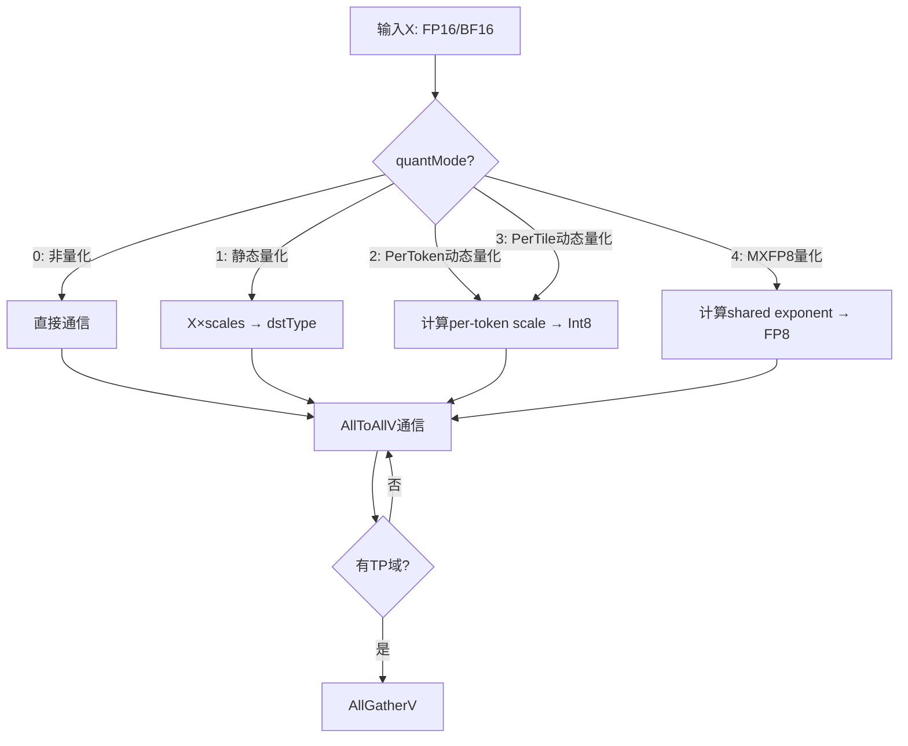
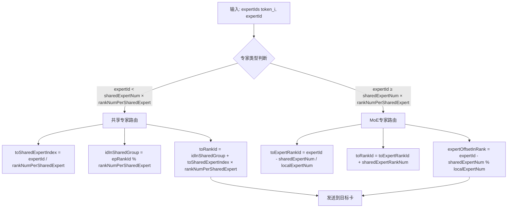
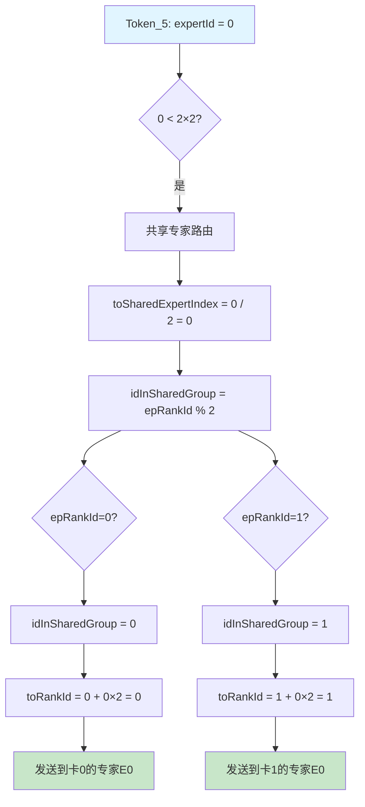
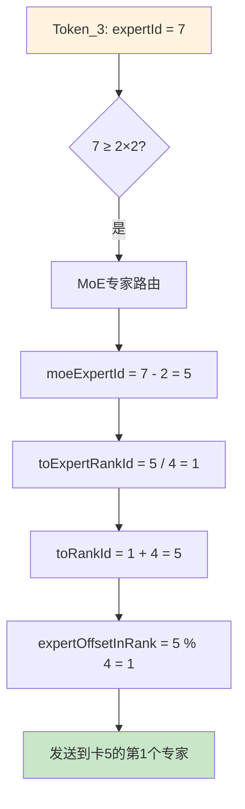
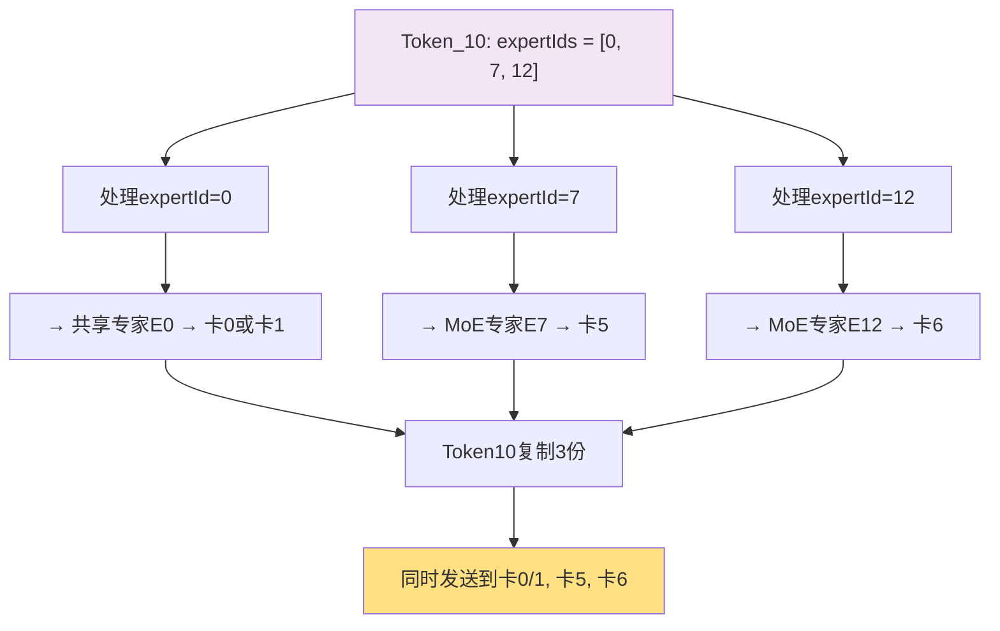
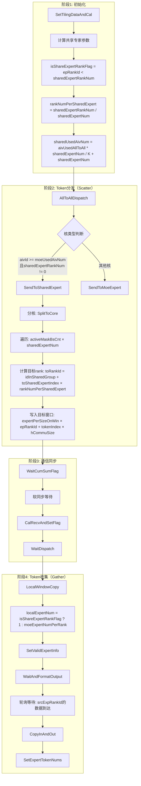
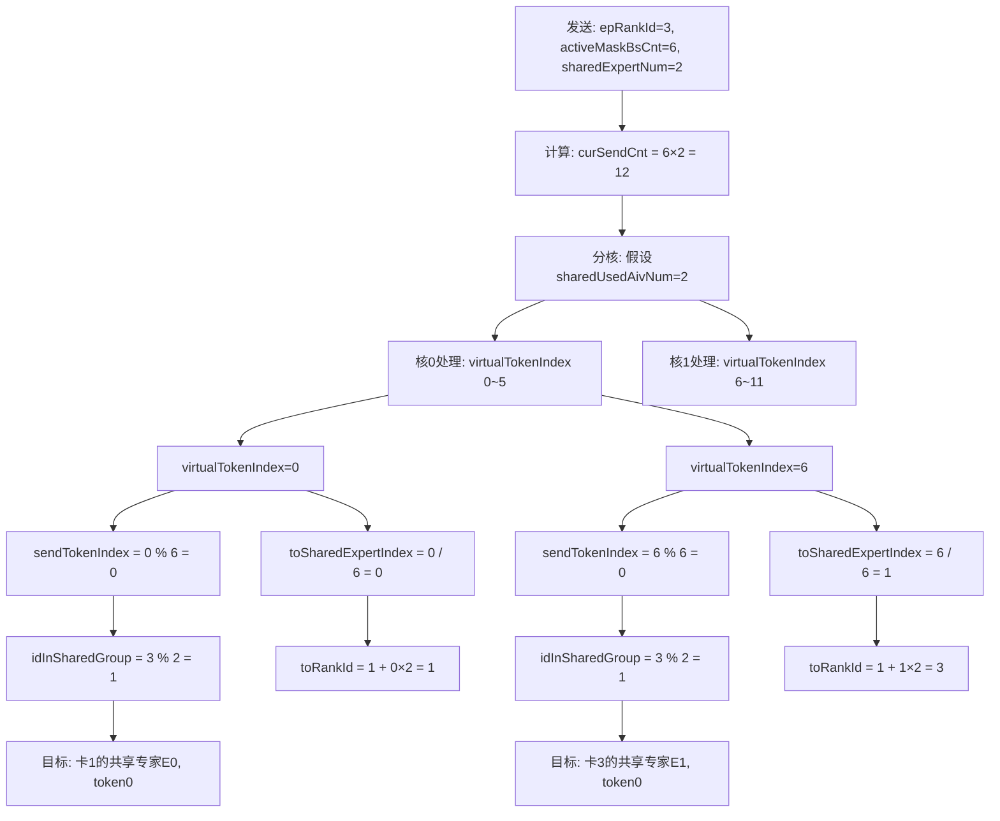
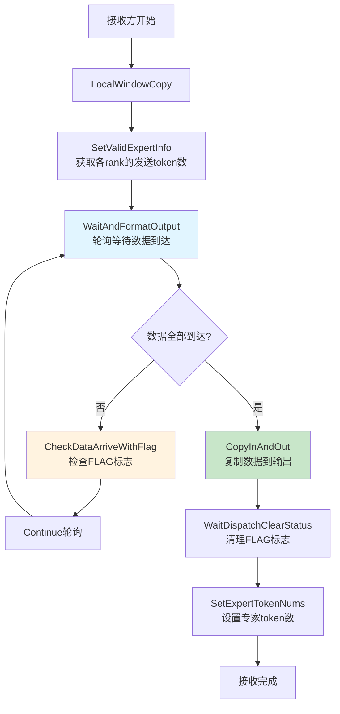

# MoeDistributeDispatchV2 算子实现分析报告

> **生成时间**: 2026-04-03
> **算子名称**: MoeDistributeDispatchV2
> **产品支持**: Ascend 950PR/950DT, Atlas A3训练/推理系列, Atlas A2训练/推理系列

---

## 目录

- [1. 算子概述](#1-算子概述)
- [2. 入参与路由机制详解](#2-入参与路由机制详解)
- [3. 目录结构](#3-目录结构)
- [4. 核心组件分析](#4-核心组件分析)
- [5. 关键技术实现](#5-关键技术实现)
- [6. 产品差异](#6-产品差异)
- [7. 性能优化技术](#7-性能优化技术)
- [8. 约束与限制](#8-约束与限制)
- [9. 调用示例](#9-调用示例)
- [10. 总结](#10-总结)

---

## 1. 算子概述

### 1.1 功能描述

`MoeDistributeDispatchV2` 是混合专家（Mixture of Experts, MoE）架构中的核心分发算子，负责将Token数据按照专家路由信息分发到各个专家节点。该算子支持多种量化模式和通信算法，是实现高效MoE模型训练与推理的关键组件。

### 1.2 核心功能

| 功能          | 描述                                         |
| ----------- | ------------------------------------------ |
| **Token量化** | 支持非量化、静态量化、动态量化（per-token/pertile）、MXFP8量化 |
| **EP域通信**   | 专家并行的AllToAllV通信                           |
| **TP域通信**   | 可选的数据并行AllGatherV通信                        |
| **辅助信息生成**  | 为Combine算子生成同步辅助信息                         |

### 1.3 量化模式



---

## 2. 入参与路由机制详解

### 2.1 核心入参说明

| 参数名                     | 类型        | Shape                              | 描述                                |
| ----------------------- | --------- | ---------------------------------- | --------------------------------- |
| **x**                   | FP16/BF16 | [Bs, H]                            | Token特征数据，Bs为token数，H为hidden size |
| **expertIds**           | INT32     | [Bs, K]                            | 每个token的topK个专家索引                 |
| **scalesOptional**      | FP32      | [moeExpertNum] 或 [moeExpertNum, H] | 量化平滑系数（可选）                        |
| **epWorldSize**         | 属性        | -                                  | EP通信域大小（总卡数）                      |
| **epRankId**            | 属性        | -                                  | EP域内本卡的ID [0, epWorldSize)        |
| **moeExpertNum**        | 属性        | -                                  | MoE专家总数                           |
| **sharedExpertNum**     | 属性        | -                                  | 共享专家数量                            |
| **sharedExpertRankNum** | 属性        | -                                  | 共享专家卡数量                           |

### 2.2 Token路由核心机制

#### 2.2.1 路由计算公式

算子的核心功能是根据 `expertIds` 将Token分发到正确的卡和专家。路由计算的关键公式如下：

```cpp
// ========== 关键变量定义 ==========
// localExpertNum: 每张卡上的MoE专家数
//   - 对于MoE专家卡: localExpertNum = moeExpertNum / (epWorldSize - sharedExpertRankNum)
//   - 对于共享专家卡: localExpertNum = 1

// expertId: 全局专家ID，范围 [0, moeExpertNum)

// ========== 核心路由公式 ==========
// 1. 计算目标专家所在卡（在MoE专家卡中的索引）
toExpertRankId = expertId / localExpertNum;

// 2. 计算实际目标卡ID（考虑共享专家卡）
toRankId = toExpertRankId + sharedExpertRankNum;

// 3. 计算专家在该卡上的局部索引
expertOffsetInRank = expertId % localExpertNum;
```

#### 2.2.2 路由流程图

**通用路由决策流程：**



#### 2.2.3 具体路由示例

**示例配置：**

```yaml
系统配置:
  epWorldSize: 8              # 总共8张卡 (ID: 0~7)
  moeExpertNum: 16            # 16个MoE专家 (ID: 0~15)
  sharedExpertNum: 2          # 2个共享专家 (ID: 0~1)
  sharedExpertRankNum: 4      # 共享专家占用4张卡 (ID: 0~3)

计算结果:
  moeExpertRankNum: 4         # MoE专家卡数 = 8 - 4 = 4
  localExpertNum: 4           # 每卡MoE专家数 = 16 / 4 = 4
  rankNumPerSharedExpert: 2   # 每共享专家卡数 = 4 / 2 = 2
```

**卡分布情况：**

```
┌─────────────────────────────────────────────────────────────────────┐
│                         专家分布图                                   │
├──────────┬──────────┬──────────┬──────────┬──────────┬─────────────┤
│   卡ID   │   0      │   1      │   2      │   3      │   4~7      │
├──────────┼──────────┼──────────┼──────────┼──────────┼─────────────┤
│ 类型      │ 共享     │ 共享      │ 共享     │ 共享     │   MoE      │
├──────────┼──────────┼──────────┼──────────┼──────────┼─────────────┤
│ 专家列表  │ E0, E1   │ E0, E1   │ E0, E1   │ E0, E1   │ E2~E15    │
│          │ (共享)    │ (共享)   │ (共享)    │ (共享)   │ (各4个)   │
└──────────┴──────────┴──────────┴──────────┴──────────┴─────────────┘

说明:
- 共享专家E0: 部署在卡0、卡1 (rankNumPerSharedExpert=2)
- 共享专家E1: 部署在卡2、卡3
- MoE专家E2-E5: 部署在卡4 (localExpertNum=4)
- MoE专家E6-E9: 部署在卡5
- MoE专家E10-E13: 部署在卡6
- MoE专家E14-E15: 部署在卡7
```

**示例1：Token需要发送到共享专家E0**



**示例2：Token需要发送到MoE专家E7**



**示例3：TopK=3的Token多路由**



**完整路由计算过程示例：**

假设当前卡 `epRankId = 3`（共享专家卡），处理 `expertId = 9` 的token：

```
步骤1: 判断专家类型
├── 共享专家阈值 = sharedExpertNum × rankNumPerSharedExpert = 2 × 2 = 4
└── 9 ≥ 4 → MoE专家路由

步骤2: 计算MoE专家相对ID
└── moeExpertId = expertId - sharedExpertNum = 9 - 2 = 7

步骤3: 计算目标卡（在MoE专家卡中的索引）
└── toExpertRankId = moeExpertId / localExpertNum = 7 / 4 = 1

步骤4: 计算实际目标卡ID
└── toRankId = toExpertRankId + sharedExpertRankNum = 1 + 4 = 5

步骤5: 计算专家在目标卡上的局部索引
└── expertOffsetInRank = moeExpertId % localExpertNum = 7 % 4 = 3

结果: Token发送到 卡5 的第3个专家（专家E12）
```

#### 2.2.4 代码实现示例

```cpp
// Atlas A3 架构实现 (arch35/moe_distribute_dispatch_arch35.h)
__aicore__ inline void MoeScatterCopyTokens() {
    for (uint32_t tokenId = startTokenId; tokenId < endTokenId; ++tokenId) {
        // 获取专家ID
        uint32_t expertId = sortedOutI32LT_(tokenId);

        // 计算目标卡
        uint32_t toExpertRankId = expertId / localExpertNum_;
        uint32_t toRankId = toExpertRankId + sharedExpertRankNum_;

        // 计算前置专家的token数（用于数据重排）
        // expertCumsum[i] 表示 E0~E(i-1) 的token总数
        uint32_t rankStartExpertId = toExpertRankId * localExpertNum_;
        uint32_t preCount = tokenId;
        if (rankStartExpertId > 0) {
            preCount = tokenId - expertCumSumLT_(rankStartExpertId);
        }

        // 计算目标地址
        GM_ADDR tokenGM = sendBufGM_ + COUNT_OFFSET * (toRankId + 1) +
                          (toRankId * axisMaxBs_ * localExpertNum_ + preCount) * perTokenCommSize_;

        // 处理token
        uint32_t tokenIndex = sortedIndex1LT_(tokenId) / axisK_;
        uint32_t expertIndex = sharedExpertRankNum_ > 0 ? (expertId + 1) : expertId;
        ProcessToken(outTokenGT, tokenIndex, ..., expertIndex);
    }
}
```

### 2.3 共享专家特殊处理

#### 2.3.1 共享专家架构概览

**共享专家是Atlas A3/Ascend 950PR引入的关键特性**，用于处理频繁访问的专家，提高系统整体效率。

```
共享专家特点:
├── 每个共享专家可以复制部署到多张卡
├── 共享专家卡排在MoE专家卡前面 (rank 0 ~ sharedExpertRankNum-1)
├── 支持动态弹性通信（弹性扩缩容场景）
└── rankNumPerSharedExpert = sharedExpertRankNum / sharedExpertNum

关键公式:
rankNumPerSharedExpert = sharedExpertRankNum / sharedExpertNum
                        ↑                    ↑
                    共享专家占用卡数        共享专家数量

部署模式判断:
├── rankNumPerSharedExpert > 1: 每个共享专家部署在多张卡上（复制模式）
└── rankNumPerSharedExpert == 1: 每个共享专家单独部署在一张卡上（独占模式）
```

#### 2.3.1.1 共享专家部署模式对比

**模式1: 复制部署模式（每个共享专家部署在多张卡）**

```
配置: sharedExpertNum=2, sharedExpertRankNum=4, epWorldSize=8
计算: rankNumPerSharedExpert = 4 / 2 = 2

卡分布:
┌──────────────────────────────────────────────────────┐
│ 卡ID │ 0   │ 1   │ 2   │ 3   │ 4   │ 5   │ 6   │ 7   │
├──────┼─────┼─────┼─────┼─────┼─────┼─────┼─────┼─────┤
│类型   │共享 │共享  │共享 │共享 │ MoE │ MoE │ MoE │ MoE │
│专家  │E0,E1│E0,E1│E0,E1│E0,E1│E2~E5│E6~E9│E10~E13│E14~E15│
└──────┴─────┴─────┴─────┴─────┴─────┴─────┴─────┘─────┘

特点:
├── E0复制部署在卡0、卡1（提高吞吐量）
├── E1复制部署在卡2、卡3
├── 每张卡承载2个共享专家
└── 适用于共享专家负载高的场景
```

**模式2: 独占部署模式（每个共享专家单独部署在一张卡）**

```
配置: sharedExpertNum=2, sharedExpertRankNum=2, epWorldSize=8
计算: rankNumPerSharedExpert = 2 / 2 = 1

卡分布:
┌──────────────────────────────────────────────────────┐
│ 卡ID │ 0   │ 1   │ 2   │ 3   │ 4   │ 5   │ 6   │ 7   │
├──────┼─────┼─────┼─────┼─────┼─────┼─────┼─────┼─────┤
│类型   │共享 │共享  │ MoE │ MoE │ MoE │ MoE │ MoE │ MoE │
│专家  │E0   │E1    │E2~E5│E6~E9│E10~E13│E14~E15│... │... │
└──────┴─────┴─────┴─────┴─────┴─────┴─────┴─────┘─────┘

特点:
├── E0独占卡0（不复制）
├── E1独占卡1
├── 每张卡只承载1个共享专家
├── 更多卡可用于MoE专家（6张 vs 4张）
└── 适用于共享专家负载不高的场景

关键代码差异:
─────────────────────────────────────────────────────────────
// 模式1: rankNumPerSharedExpert = 2
idInSharedGroup = epRankId % 2;  // epRankId=0→0, epRankId=1→1
toRankId = idInSharedGroup + toSharedExpertIndex * 2;

// 例如: epRankId=3, toSharedExpertIndex=0
// idInSharedGroup = 3 % 2 = 1
// toRankId = 1 + 0×2 = 1 (发送到卡1)
─────────────────────────────────────────────────────────────
─────────────────────────────────────────────────────────────
// 模式2: rankNumPerSharedExpert = 1
idInSharedGroup = epRankId % 1;  // 任何epRankId→0
toRankId = idInSharedGroup + toSharedExpertIndex * 1;

// 例如: epRankId=3, toSharedExpertIndex=1
// idInSharedGroup = 3 % 1 = 0
// toRankId = 0 + 1×1 = 1 (发送到卡1的专家E1)
─────────────────────────────────────────────────────────────
```

**模式3: 单共享专家全复制模式**

```
配置: sharedExpertNum=1, sharedExpertRankNum=4, epWorldSize=8
计算: rankNumPerSharedExpert = 4 / 1 = 4

卡分布:
┌──────────────────────────────────────────────────────┐
│ 卡ID │ 0   │ 1   │ 2   │ 3   │ 4   │ 5   │ 6   │ 7   │
├──────┼─────┼─────┼─────┼─────┼─────┼─────┼─────┼─────┤
│类型   │共享 │共享  │共享 │共享 │ MoE │ MoE │ MoE │ MoE │
│专家  │E0   │E0    │E0   │E0   │E1~E4│E5~E8│E9~E12│E13~E16│
└──────┴─────┴─────┴─────┴─────┴─────┴─────┴─────┘─────┘

特点:
├── 只有1个共享专家E0
├── E0复制部署在所有共享专家卡（0~3）
├── 最大化E0的处理能力
└── 适用于单个共享专家负载极高的场景
```

**部署模式选择建议：**

| 场景 | 推荐模式 | sharedExpertNum | sharedExpertRankNum | rankNumPerSharedExpert |
|------|---------|-----------------|---------------------|------------------------|
| 高负载共享专家，需要高吞吐 | 复制部署 | 2 | 4-8 | 2-4 |
| 低负载共享专家，节省资源 | 独占部署 | 2 | 2 | 1 |
| 单个核心共享专家 | 单专家全复制 | 1 | 4-8 | 4-8 |
| 无共享专家 | 无 | 0 | 0 | N/A |

#### 2.3.1.3 卡类型互斥机制

**关键设计原则：一张卡要么是共享专家卡，要么是MoE专家卡，不会同时存在两者。**

**代码验证 (arch35.h:224-241)：**

```cpp
// ========== 计算MoE专家卡数 ==========
moeExpertRankNum_ = epWorldSize_ - sharedExpertRankNum_;
//                    ↑               ↑
//                  总卡数          共享专家卡数

// 示例: epWorldSize=8, sharedExpertRankNum=4
//       moeExpertRankNum = 8 - 4 = 4 (4张MoE专家卡)

// ========== 计算每卡MoE专家数 ==========
localExpertNum_ = moeExpertNum_ / moeExpertRankNum_;

// 示例: moeExpertNum=16, moeExpertRankNum=4
//       localExpertNum = 16 / 4 = 4 (每张MoE专家卡有4个专家)

// ========== 判断当前卡类型 ==========
isShareExpertRank_ = epRankId_ < sharedExpertRankNum_;
//                     ↑
//              true=共享专家卡, false=MoE专家卡

// 示例: epRankId=3, sharedExpertRankNum=4
//       3 < 4 → true → 共享专家卡
// 示例: epRankId=5, sharedExpertRankNum=4
//       5 < 4 → false → MoE专家卡
```

**接收端处理差异 (full_mesh.h:1122)：**

```cpp
// 根据卡类型决定本地专家数
uint32_t localExpertNum = isShareExpertRankFlag_ ? 1 : moeExpertNumPerRank_;
//                            ↑                              ↑
//                      共享专家卡                        MoE专家卡
//                      localExpertNum=1                  localExpertNum>1
```

**卡类型分布图：**

```
┌─────────────────────────────────────────────────────────────────────────────┐
│                      卡类型互斥分布示意图                                    │
├─────────────────────────────────────────────────────────────────────────────┤
│                                                                             │
│  epWorldSize = 8                                                            │
│  sharedExpertRankNum = 4                                                    │
│  moeExpertRankNum = 8 - 4 = 4                                               │
│                                                                             │
│  Rank ID:    0       1       2       3       4       5       6       7     │
│  ┌─────────┬─────────┬─────────┬─────────┬─────────┬─────────┬─────────┬─────┐│
│  │共享专家卡│共享专家卡│共享专家卡│共享专家卡│MoE专家卡│MoE专家卡│MoE专家卡│MoE  ││
│  └─────────┴─────────┴─────────┴─────────┴─────────┴─────────┴─────────┴─────┘│
│  ↓                                                                      │
│  判断条件:                                                              │
│  epRankId < sharedExpertRankNum?                                         │
│  ┌────────────────────────────────────────────────────────────────────┐   │
│  │ Rank 0-3: epRankId(0~3) < 4 → true  → 共享专家卡                     │   │
│  │ Rank 4-7: epRankId(4~7) < 4 → false → MoE专家卡                     │   │
│  └────────────────────────────────────────────────────────────────────┘   │
│                                                                             │
│  本地专家数:                                                                │
│  ┌────────────────────────────────────────────────────────────────────┐   │
│  │ Rank 0-3: localExpertNum = 1 (共享专家卡每卡1个专家)                 │   │
│  │ Rank 4-7: localExpertNum = 4 (MoE专家卡每卡4个专家)                 │   │
│  └────────────────────────────────────────────────────────────────────┘   │
│                                                                             │
└─────────────────────────────────────────────────────────────────────────────┘
```

**关键约束 (moe_distribute_dispatch_v2_infershape.cpp:207-209)：**

```cpp
// 参数验证时强制要求MoE专家卡数大于0
int64_t moeRankNum = *epWorldSize - *sharedExpertRankNum;
OP_CHECK_IF(moeRankNum <= 0, 
    OP_LOGE(..., "moeRankNum(epWorldSize - sharedExpertRankNum) should be larger than 0, but got %ld.", moeRankNum), 
    return ge::GRAPH_FAILED);

// 这意味着: sharedExpertRankNum < epWorldSize
// 即: 必须有至少一张卡用于MoE专家
```

**为什么采用互斥设计？**

```
优势:
├── 职责清晰: 共享专家卡专注于高频专家，MoE专家卡专注于长尾专家
├── 资源隔离: 避免共享专家和MoE专家争抢同一张卡的算力
├── 负载均衡: 共享专家卡通常负载高，独占部署可避免干扰
└── 简化实现: localExpertNum的计算逻辑更简单

接收端处理差异:
┌────────────────────┬─────────────────────────────────────────────────┐
│ 卡类型              │ localExpertNum │ 说明                          │
├────────────────────┼────────────────┼────────────────────────────────┤
│ 共享专家卡          │ 1              │ 每卡只处理1个共享专家            │
│ MoE专家卡           │ moeExpertNumPerRank │ 每卡处理多个MoE专家       │
└────────────────────┴────────────────┴────────────────────────────────┘
```

#### 2.3.1.2 参数配置方式

**共享专家参数通过ACLNN API接口传入：**

```cpp
// API接口 (aclnn_moe_distribute_dispatch_v3.h:62-74)
ACLNN_API aclnnStatus aclnnMoeDistributeDispatchV3GetWorkspaceSize(
    const aclTensor* x,
    const aclTensor* expertIds,
    // ... 其他输入
    const char* groupEp,           // EP通信域名称
    int64_t epWorldSize,           // EP通信域大小
    int64_t epRankId,              // EP域内本卡ID
    int64_t moeExpertNum,          // MoE专家总数
    // ... 其他参数
    int64_t sharedExpertNum,       // ⭐ 共享专家数量（关键参数1）
    int64_t sharedExpertRankNum,   // ⭐ 共享专家卡数量（关键参数2）
    // ... 其他参数
);
```

**部署模式与参数对应关系：**

```
┌─────────────────────────────────────────────────────────────────────────────┐
│                    共享专家部署模式参数配置表                              │
├──────────────────┬─────────────────────┬─────────────────────┬───────────────┤
│ 部署模式          │ sharedExpertNum     │ sharedExpertRankNum │ 结果           │
├──────────────────┼─────────────────────┼─────────────────────┼───────────────┤
│ 无共享专家        │ 0                   │ 0                   │ 无共享专家      │
├──────────────────┼─────────────────────┼─────────────────────┼───────────────┤
│ 默认模式          │ 1                   │ 0                   │ 单专家，卡数    │
│                  │                     │                     │ 由系统自动决定  │
├──────────────────┼─────────────────────┼─────────────────────┼───────────────┤
│ 独占部署          │ 2                   │ 2                   │ 每卡1个专家     │
│                  │ 3                   │ 3                   │                 │
│                  │ N                   │ N                   │                 │
├──────────────────┼─────────────────────┼─────────────────────┼───────────────┤
│ 复制部署          │ 2                   │ 4                   │ 每专家2卡      │
│                  │                     │ 6                   │ 每专家3卡      │
│                  │                     │ 8                   │ 每专家4卡      │
├──────────────────┼─────────────────────┼─────────────────────┼───────────────┤
│ 单专家全复制      │ 1                   │ 4                   │ 单专家，4卡    │
│                  │                     │ 6                   │ 单专家，6卡    │
│                  │                     │ 8                   │ 单专家，8卡    │
└──────────────────┴─────────────────────┴─────────────────────┴───────────────┘
```

**参数验证逻辑 (moe_distribute_dispatch_v2_infershape.cpp:197-201)：**

```cpp
// 三种有效的共享专家配置模式
bool isSharedDefault = ((*sharedExpertNum == 1) && (*sharedExpertRankNum == 0));
// ↓ 默认模式: sharedExpertNum=1, sharedExpertRankNum=0
//   系统自动决定共享专家部署的卡数

bool isNoShared = ((*sharedExpertNum == 0) && (*sharedExpertRankNum == 0));
// ↓ 无共享专家: sharedExpertNum=0, sharedExpertRankNum=0

bool isValidShared = ((*sharedExpertNum > 0)
                      && ((*sharedExpertRankNum / *sharedExpertNum) > 0)
                      && ((*sharedExpertRankNum % *sharedExpertNum) == 0));
// ↓ 自定义模式: sharedExpertNum > 0, sharedExpertRankNum > 0
//   约束条件:
//   1. sharedExpertRankNum 必须能被 sharedExpertNum 整除
//   2. sharedExpertRankNum / sharedExpertNum > 0
//   3. sharedExpertRankNum < epWorldSize

bool isSharedSettingValid = (isSharedDefault || isNoShared || isValidShared);
```

**参数配置示例代码：**

```cpp
// ========== 示例1: 单共享专家全复制模式 ==========
// 场景: 单个共享专家E0，复制部署在4张卡上
int64_t sharedExpertNum = 1;       // 1个共享专家
int64_t sharedExpertRankNum = 4;   // 占用4张卡
// 结果: rankNumPerSharedExpert = 4/1 = 4
//       E0部署在卡0、1、2、3

// ========== 示例2: 复制部署模式 ==========
// 场景: 2个共享专家，每个专家复制部署在2张卡上
int64_t sharedExpertNum = 2;       // 2个共享专家
int64_t sharedExpertRankNum = 4;   // 占用4张卡
// 结果: rankNumPerSharedExpert = 4/2 = 2
//       E0部署在卡0、1; E1部署在卡2、3

// ========== 示例3: 独占部署模式 ==========
// 场景: 2个共享专家，每个专家独占一张卡
int64_t sharedExpertNum = 2;       // 2个共享专家
int64_t sharedExpertRankNum = 2;   // 占用2张卡
// 结果: rankNumPerSharedExpert = 2/2 = 1
//       E0部署在卡0; E1部署在卡1

// ========== 示例4: 无共享专家 ==========
// 场景: 不使用共享专家（Atlas A2模式）
int64_t sharedExpertNum = 0;       // 0个共享专家
int64_t sharedExpertRankNum = 0;   // 占用0张卡
// 结果: 无共享专家，所有卡都是MoE专家卡

// ========== 示例5: 默认模式 ==========
// 场景: 使用默认配置，系统自动决定
int64_t sharedExpertNum = 1;       // 1个共享专家
int64_t sharedExpertRankNum = 0;   // 系统自动决定
// 结果: 由系统根据epWorldSize等参数自动分配
```

**调用示例：**

```python
# Python调用示例
import torch
import aclnn

# 配置参数
ep_world_size = 8
shared_expert_num = 1      # ⭐ 单个共享专家
shared_expert_rank_num = 4  # ⭐ 部署在4张卡上

# 调用算子
workspace_size, executor = aclnn.aclnn_moe_distribute_dispatch_v3_get_workspace_size(
    x=x_tensor,
    expert_ids=expert_ids_tensor,
    # ... 其他参数
    group_ep="ep_group",
    ep_world_size=ep_world_size,
    ep_rank_id=rank_id,
    moe_expert_num=16,
    shared_expert_num=shared_expert_num,      # 传入共享专家数量
    shared_expert_rank_num=shared_expert_rank_num,  # 传入共享专家卡数
    # ... 其他参数
)

# 执行算子
aclnn.aclnn_moe_distribute_dispatch_v3(workspace, workspace_size, executor, stream)
```

#### 2.3.2 共享专家处理完整流程

**全互联模式（FullMesh）下的共享专家处理流程：**



#### 2.3.3 AIV核分配策略

**共享专家与MoE专家的AIV核动态分配：**

```
核分配原则:
├── 总核数: aivNum_
├── 通信核数: aivUsedAllToAll_ = aivNum_ - aivUsedCumSum_
├── 共享专家核数: sharedUsedAivNum_
└── MoE专家核数: moeUsedAivNum_ = aivUsedAllToAll_ - sharedUsedAivNum_

计算公式 (full_mesh.h:428-434):
sharedUsedAivNum_ = (aivUsedAllToAll_ × sharedExpertNum_) / (K + sharedExpertNum_)
                 = (aivUsedAllToAll_ × sharedExpertNum_) / (axisK_ + sharedExpertNum_)

示例配置:
│ aivNum │ aivUsedAllToAll │ sharedExpertNum │ axisK │ sharedUsedAivNum │ moeUsedAivNum │
│ 8      │ 6               │ 2               │ 4     │ 2               │ 4             │

核分布:
┌─────────────────────────────────────────────────────────────┐
│ 核ID │ 0   │ 1   │ 2   │ 3   │ 4   │ 5   │ 6~7 │
├──────┼─────┼─────┼─────┼─────┼─────┼─────┼─────┤
│用途  │MoE │MoE │MoE │MoE │共享│共享│CumSum│
│      │分发│分发│分发│分发│分发│分发│计算  │
└──────┴─────┴─────┴─────┴─────┴─────┴─────┘
```

#### 2.3.4 发送阶段详解

**共享专家发送核心实现 (full_mesh.h:624-659)：**

```cpp
template <TemplateMC2TypeFullmeshClass>
__aicore__ inline void MoeDistributeDispatchV2FullMesh<TemplateMC2TypeFullmeshFunc>::SendToSharedExpert(
    TQue<QuePosition::VECIN, 1> inQueue, TBuf<> outBuf)
{
    // ========== 步骤1: 初始化输出缓冲区 ==========
    LocalTensor<float> outTensorFp32 = outBuf.Get<float>();
    Duplicate<float>(outTensorFp32, float(1), hCommuSize_ * BUFFER_NUM / sizeof(float));
    PipeBarrier<PIPE_V>();

    // ========== 步骤2: 分配任务到各核 ==========
    uint32_t startTokenId, endTokenId, sendTokenNum;
    // 计算总发送数: activeMaskBsCnt_个token，每个发送到sharedExpertNum_个共享专家
    uint32_t curSendCnt = activeMaskBsCnt_ * sharedExpertNum_;
    SplitToCore(curSendCnt, sharedUsedAivNum_, startTokenId, endTokenId, sendTokenNum, false);
    if (startTokenId >= curSendCnt) {return;}

    // ========== 步骤3: 发送token到共享专家 ==========
    GlobalTensor<XOutType> dstWinGMTensor;
    uint32_t idInSharedGroup = epRankId_ % rankNumPerSharedExpert_;  // 本卡在共享专家组中的位置

    for (uint32_t virtualTokenIndex = startTokenId; virtualTokenIndex < endTokenId; ++virtualTokenIndex) {
        // virtualTokenIndex的编码:
        // - 低activeMaskBsCnt_位: token索引
        // - 高位: 共享专家索引
        uint32_t sendTokenIndex = virtualTokenIndex % activeMaskBsCnt_;
        uint32_t toSharedExpertIndex = virtualTokenIndex / activeMaskBsCnt_;

        // 核心路由计算: 确定目标卡ID
        // 公式: toRankId = idInSharedGroup + toSharedExpertIndex × rankNumPerSharedExpert
        int32_t toRankId = idInSharedGroup + toSharedExpertIndex * rankNumPerSharedExpert_;

        // 弹性通信支持: 如果开启弹性通信，映射到真实的物理卡
        if (isScalingDownFlag_) {
            toRankId = elasticInfoTensor_.GetValue(ELASTIC_INFO_OFFSET + epWorldSizeOriginal_ + toRankId);
        }

        // ========== 步骤4: 计算目标窗口地址 ==========
        // 地址 = 基址 + 目标rank的窗口偏移 + 本卡的数据区偏移 + token偏移
        dstWinGMTensor.SetGlobalBuffer((__gm__ XOutType*)(
            GetWindAddrByRankId(toRankId) +                // 基址
            expertPerSizeOnWin_ * epRankId_ +              // 本卡的数据区偏移
            sendTokenIndex * hCommuSize_));                // token偏移

        // ========== 步骤5: 处理token（量化或直接复制）==========
        uint32_t srcTokenIndex = sendTokenIndex;
        if (isExpertMaskFlag_) {
            srcTokenIndex = validBsIndexTensor_.GetValue(sendTokenIndex);
        }

        if constexpr ((QuantMode > UNQUANT) || (QuantMode == UNQUANT && !Std::IsSame<ExpandXOutType, XType>::value)) {
            // 量化场景: 填充专家索引和量化专家索引
            uint32_t fillExpertIdx = axisK_ + toSharedExpertIndex;  // K+0, K+1, ... (三元组中的topK位置)
            uint32_t quantExpertIdx = toSharedExpertIndex;           // 0, 1, ...
            TokenToExpertInQuant(dstWinGMTensor, inQueue, srcTokenIndex, fillExpertIdx, quantExpertIdx);
        } else {
            // 非量化场景: 直接复制
            TokenToExpert(dstWinGMTensor, inQueue, srcTokenIndex, axisK_ + toSharedExpertIndex);
        }
    }
}
```

**发送阶段关键流程图：**



#### 2.3.5 接收阶段详解

**共享专家接收核心实现 (full_mesh.h:1327-1374)：**

```cpp
template <TemplateMC2TypeFullmeshClass>
__aicore__ inline void MoeDistributeDispatchV2FullMesh<TemplateMC2TypeFullmeshFunc>::WaitAndFormatOutput(
    TBuf<> tBuf, uint32_t validNum)
{
    uint32_t index = 0;
    uint32_t finishNum = 0;
    uint32_t maxCopyTokenCnt = tBufRealSize_ / hCommuSize_;

    // ========== 关键区分: 共享专家卡与MoE专家卡的处理差异 ==========
    uint32_t localExpertNum = isShareExpertRankFlag_ ? 1 : moeExpertNumPerRank_;
    // isShareExpertRankFlag = true  → 共享专家卡, localExpertNum = 1
    // isShareExpertRankFlag = false → MoE专家卡, localExpertNum = moeExpertNumPerRank_

    uint32_t srcExpRankId, dstPosition, arriveCount, copyCnt, srcDataBlockIdx;

    // ========== 轮询等待各源rank的数据到达 ==========
    while (true) {
        // 跳过已完成的专家
        if (expertLeftNumTensor_(index) == 0) {
            index = (index + 1) % validNum;
            continue;
        }

        // 获取源rank ID
        srcExpRankId = expertMapTensor_(index);

        // 计算本次复制的token数
        copyCnt = expertLeftNumTensor_(index) > maxCopyTokenCnt ?
                  maxCopyTokenCnt : expertLeftNumTensor_(index);

        // ========== 核心地址计算: 转换到数据区排布偏移 ==========
        // 公式: srcDataBlockIdx = srcExpRankId % epWorldSize_ × localExpertNum + srcExpRankId / epWorldSize_
        // 说明:
        // - 共享专家卡: localExpertNum=1
        // - MoE专家卡: localExpertNum=moeExpertNumPerRank_
        srcDataBlockIdx = srcExpRankId % epWorldSize_ * localExpertNum + srcExpRankId / epWorldSize_;

        // ========== 检查数据是否到达（通过FLAG标志）==========
        arriveCount = CheckDataArriveWithFlag(srcDataBlockIdx, expertFinishNumTensor_(index), copyCnt);

        if (arriveCount == copyCnt) {
            // ========== 计算目标位置 ==========
            dstPosition = srcExpRankId != 0 ? sendCntTensor_(srcExpRankId - 1) : 0;
            dstPosition += expertFinishNumTensor_(index);

            // ========== 复制数据到输出 ==========
            GM_ADDR wAddr = (__gm__ uint8_t*)(windowGM_) + srcDataBlockIdx * expertPerSizeOnWin_;
            CopyInAndOut(xOutInt32Tensor, wAddr, index, dstPosition, arriveCount);

            // ========== 更新完成状态并清理FLAG ==========
            expertFinishNumTensor_(index) += arriveCount;
            expertLeftNumTensor_(index) -= arriveCount;
            PipeBarrier<PIPE_ALL>();

            if (expertLeftNumTensor_(index) == 0) {
                // 清理FLAG标志，为下一轮通信做准备
                cleanGlobal.SetGlobalBuffer((__gm__ float *)(wAddr));
                for (uint32_t i = 0; i < expertFinishNumTensor_(index); i++){
                    uint32_t flagIndex = i * SPLIT_BLOCK_COUNT * blockCntPerToken_ + SPLIT_BLOCK_DATA_COUNT;
                    DataCopy(cleanGlobal[flagIndex], cleanUpTensor_, cleanUpParams);
                }
                finishNum++;
            }
        } else {
            index = (index + 1) % validNum;
        }

        // 所有专家的数据都接收完成
        if (validNum == finishNum) {
            break;
        }
    }
}
```

**接收阶段地址计算详解：**

```
数据区排布偏移计算公式:
srcDataBlockIdx = (srcExpRankId % epWorldSize_) × localExpertNum + (srcExpRankId / epWorldSize_)

共享专家卡示例 (epRankId=1, epWorldSize=8):
┌──────────────────────────────────────────────────────────────┐
│ srcExpRankId │ 计算                            │ srcDataBlockIdx │
├──────────────┼────────────────────────────────────────────────┼─────────────────┤
│ 0            │ 0%8×1 + 0/8 = 0 + 0 = 0        │ 0                │
│ 1            │ 1%8×1 + 1/8 = 1 + 0 = 1        │ 1                │
│ 2            │ 2%8×1 + 2/8 = 2 + 0 = 2        │ 2                │
│ 3            │ 3%8×1 + 3/8 = 3 + 0 = 3        │ 3                │
│ 4~7          │ 4~7                            │ 4~7              │
└──────────────┴────────────────────────────────────────────────┴─────────────────┘

MoE专家卡示例 (epRankId=5, epWorldSize=8, moeExpertNumPerRank=4):
┌──────────────────────────────────────────────────────────────────────────────┐
│ srcExpRankId │ 计算                                        │ srcDataBlockIdx │
├──────────────┼──────────────────────────────────────────────────────────────┼─────────────────┤
│ 0            │ 0%8×4 + 0/8 = 0×4 + 0 = 0                │ 0                │
│ 1            │ 1%8×4 + 1/8 = 1×4 + 0 = 4                │ 4                │
│ 2            │ 2%8×4 + 2/8 = 2×4 + 0 = 8                │ 8                │
│ 3            │ 3%8×4 + 3/8 = 3×4 + 0 = 12               │ 12               │
│ 4            │ 4%8×4 + 4/8 = 4×4 + 0 = 16               │ 16               │
│ 5            │ 5%8×4 + 5/8 = 5×4 + 0 = 20               │ 20               │
└──────────────┴──────────────────────────────────────────────────────────────┴─────────────────┘

说明:
- 共享专家卡: localExpertNum=1, srcExpRankId直接作为数据区索引
- MoE专家卡: localExpertNum=4, srcExpRankId需按4倍扩展作为数据区索引
```

#### 2.3.6 共享专家与MoE专家的交互

**共享专家卡与MoE专家卡的数据交互图：**

```
┌─────────────────────────────────────────────────────────────────────────────┐
│                    共享专家与MoE专家交互流程                                  │
├─────────────────────────────────────────────────────────────────────────────┤
│                                                                             │
│  共享专家卡 (Rank 0~3)              MoE专家卡 (Rank 4~7)                      │
│  ┌─────────────────────┐          ┌─────────────────────┐                    │
│  │ SendToSharedExpert  │          │ SendToMoeExpert      │                    │
│  │                     │          │                     │                    │
│  │ Token0 → E0,E1      │          │ Token0 → E2~E15     │                    │
│  │ Token1 → E0,E1      │          │ Token1 → E2~E15     │                    │
│  │ ...                │          │ ...                 │                    │
│  └─────────┬───────────┘          └──────────┬──────────┘                    │
│            │                                │                             │
│            │ AllToAllV通信                  │                             │
│            ├────────────────────────────────>│                             │
│            │                                │                             │
│            │                         等待接收...                            │
│            │<───────────────────────────────┤                             │
│            │                                │                             │
│  ┌─────────▼───────────┐          ┌──────────▼──────────┐                    │
│  │ LocalWindowCopy     │          │ LocalWindowCopy     │                    │
│  │                     │          │                     │                    │
│  │ 接收来自:           │          │ 接收来自:           │                    │
│  │ - 共享专家卡        │          │ - 共享专家卡        │                    │
│  │ - MoE专家卡         │          │ - MoE专家卡         │                    │
│  └─────────────────────┘          └─────────────────────┘                    │
│                                                                             │
│  关键差异:                                                                   │
│  - 共享专家卡: localExpertNum=1, 每卡只处理1个共享专家                          │
│  - MoE专家卡: localExpertNum>1, 每卡处理多个MoE专家                            │
│                                                                             │
└─────────────────────────────────────────────────────────────────────────────┘
```

#### 2.3.7 关键配置参数

**共享专家相关配置参数汇总：**

| 参数名 | 类型 | 描述 | 典型值 |
|-------|------|------|--------|
| `sharedExpertNum` | uint32_t | 共享专家数量 | 0~4 |
| `sharedExpertRankNum` | uint32_t | 共享专家占用卡数 | 0~(epWorldSize/2) |
| `rankNumPerSharedExpert` | uint32_t | 每共享专家卡数 | sharedExpertRankNum/sharedExpertNum |
| `sharedUsedAivNum` | uint32_t | 处理共享专家的AIV核数 | 动态计算 |
| `isShareExpertRankFlag` | bool | 当前卡是否为共享专家卡 | epRankId < sharedExpertRankNum |
| `shareRankRcvTokenCnt` | uint32_t | 共享专家卡接收token数 | axisBS × epWorldSize / sharedExpertRankNum |

**初始化代码片段 (arch35.h:227-241)：**

```cpp
template <TemplateMoeDistributeDispatchA5TypeClass>
__aicore__ inline void MoeDistributeDispatchA5<TemplateMoeDistributeDispatchA5TypeFunc>::InitGlobalAttrs(
    const MoeDistributeDispatchV2TilingData *tilingData)
{
    // ... 其他参数初始化

    // 计算MoE专家卡数
    moeExpertRankNum_ = epWorldSize_ - sharedExpertRankNum_;

    // 计算每卡MoE专家数
    localExpertNum_ = moeExpertNum_ / moeExpertRankNum_;

    // 共享专家配置
    sharedExpertNum_ = tilingData->moeDistributeDispatchV2Info.sharedExpertNum;
    if (sharedExpertRankNum_ != 0) {
        // 分配核给共享专家处理
        sharedUsedAivNum_ = aivNum_ / (axisK_ + 1);
        if (sharedUsedAivNum_ == 0) {
            sharedUsedAivNum_ = 1;
        }
        // 计算共享专家卡接收的token数
        shareRankRcvTokenCnt_ = axisBS_ * (epWorldSize_ / sharedExpertRankNum_);
    }

    // 剩余核给MoE专家处理
    moeUsedAivNum_ = aivNum_ - sharedUsedAivNum_;

    // 计算每共享专家部署的卡数
    if (sharedExpertNum_ != 0) {
        rankNumPerSharedExpert_ = sharedExpertRankNum_ / sharedExpertNum_;
    }

    // 判断当前卡类型
    isShareExpertRank_ = epRankId_ < sharedExpertRankNum_;
}
```

### 2.4 专家ID与卡映射示例

#### 2.4.1 示例配置

```yaml
配置参数:
  epWorldSize: 8              # 8张卡
  moeExpertNum: 16            # 16个MoE专家
  sharedExpertNum: 2          # 2个共享专家
  sharedExpertRankNum: 4      # 共享专家占用4张卡

计算结果:
  moeExpertRankNum: 4         # MoE专家卡数 = 8 - 4 = 4
  localExpertNum: 4           # 每卡MoE专家数 = 16 / 4 = 4
  rankNumPerSharedExpert: 2   # 每共享专家卡数 = 4 / 2 = 2
```

#### 2.4.2 专家分布表

| 全局专家ID | 专家类型 | 目标卡ID | 卡内局部索引 |
|-----------|---------|---------|-------------|
| 0 | 共享专家0 | 0, 1 | 0 |
| 1 | 共享专家1 | 2, 3 | 0 |
| 2 | MoE专家0 | 4 | 0 |
| 3 | MoE专家1 | 4 | 1 |
| 4 | MoE专家2 | 4 | 2 |
| 5 | MoE专家3 | 4 | 3 |
| 6 | MoE专家4 | 5 | 0 |
| 7 | MoE专家5 | 5 | 1 |
| ... | ... | ... | ... |
| 15 | MoE专家11 | 7 | 3 |

#### 2.4.3 Token路由示例

```cpp
// 假设 expertIds[3][2] = [5, 7, 9] 表示第3个token的top3专家
// Token 3 需要发送到:
//  - 专家5: toRankId = 5/4 + 4 = 5, offset = 5%4 = 1 (卡5的第1个专家)
//  - 专家7: toRankId = 7/4 + 4 = 5, offset = 7%4 = 3 (卡5的第3个专家)
//  - 专家9: toRankId = 9/4 + 4 = 6, offset = 9%4 = 1 (卡6的第1个专家)

// 代码实现
for (int k = 0; k < K; k++) {
    int expertId = expertIds[tokenIndex][k];

    if (expertId < sharedExpertNum * rankNumPerSharedExpert) {
        // 共享专家路由
        int toSharedExpertIndex = expertId / rankNumPerSharedExpert;
        int idInSharedGroup = epRankId % rankNumPerSharedExpert;
        int toRankId = idInSharedGroup + toSharedExpertIndex * rankNumPerSharedExpert;
        SendToRank(toRankId, tokenData, ...);
    } else {
        // MoE专家路由
        int moeExpertId = expertId - sharedExpertNum;
        int toExpertRankId = moeExpertId / localExpertNum;
        int toRankId = toExpertRankId + sharedExpertRankNum;
        int expertOffsetInRank = moeExpertId % localExpertNum;
        SendToExpertOnRank(toRankId, expertOffsetInRank, tokenData, ...);
    }
}
```

#### 2.4.4 Token完整分发流程（sharedExpertNum=0）

本节通过一个完整示例说明 **expertId** 及其关键入参如何经过 **Token路由核心机制** → **数据重排优化** → **通信窗口布局**，最终将 token 发送到正确的 rank 的通信窗口位置。

为简化说明，本节设置 **sharedExpertNum = 0**（无共享专家）。

##### 2.4.4.1 基本配置与参数定义

**系统配置：**

```yaml
# ========== 基础配置 ==========
epWorldSize: 8              # EP通信域总卡数 (rank ID: 0~7)
epRankId: 3                 # 当前卡ID (假设为rank 3)
moeExpertNum: 16            # MoE专家总数 (expert ID: 0~15)
sharedExpertNum: 0          # 共享专家数 = 0（无共享专家）
sharedExpertRankNum: 0      # 共享专家卡数 = 0

# ========== 派生参数 ==========
moeExpertRankNum: 8         # MoE专家卡数 = epWorldSize - sharedExpertRankNum = 8
localExpertNum: 2           # 每卡MoE专家数 = moeExpertNum / moeExpertRankNum = 2
axisK: 2                    # 每个token选择的topK专家数
axisMaxBs: 32               # 每个rank最大token容量
perTokenCommSize: 256       # 每个token通信大小（字节）
                            #   = hiddenSize * dataTypeSize
                            #   = 128 * 2 (FP16) = 256 bytes

# ========== 通信窗口配置 ==========
COUNT_OFFSET: 256           # TokenCounts区域大小（字节）
                            #   = STATUS_ENTRY_COUNT * sizeof(int32)
                            #   = 64 * 4 = 256 bytes
```

**专家到卡的映射关系：**

```
┌─────────────────────────────────────────────────────────────────────────────┐
│                    专家分布图 (sharedExpertNum=0)                          │
├─────────────────────────────────────────────────────────────────────────────┤
│                                                                             │
│  Rank ID:    0       1       2       3       4       5       6       7     │
│  ┌─────────┬─────────┬─────────┬─────────┬─────────┬─────────┬─────────┬─────┐│
│  │  E0,E1  │  E2,E3  │  E4,E5  │  E6,E7  │  E8,E9  │ E10,E11 │ E12,E13 │E14,E15││
│  └─────────┴─────────┴─────────┴─────────┴─────────┴─────────┴─────────┴─────┘│
│                                                                             │
│  路由公式: toRankId = expertId / localExpertNum                             │
│                                                                             │
│  示例:                                                                       │
│  - expertId=5  → toRankId=5/2=2   → rank 2                                 │
│  - expertId=7  → toRankId=7/2=3   → rank 3                                 │
│  - expertId=12 → toRankId=12/2=6  → rank 6                                 │
│                                                                             │
└─────────────────────────────────────────────────────────────────────────────┘
```

##### 2.4.4.2 输入数据准备

**当前卡 (rank 3) 的输入数据：**

```cpp
// ========== 输入Tensor ==========
// x: 输入token特征数据 [Bs, H]
//    Bs = 4 (当前卡有4个token需要分发)
//    H = 128 (hidden size)
//
// expertIds: 每个token选择的专家ID [Bs, K]
//            K = 2 (topK=2, 每个token选2个专家)
Token 0: expertIds[0] = [5, 7]   // token0 选择专家5和专家7
Token 1: expertIds[1] = [3, 12]  // token1 选择专家3和专家12
Token 2: expertIds[2] = [7, 9]   // token2 选择专家7和专家9
Token 3: expertIds[3] = [5, 15]  // token3 选择专家5和专家15
```

**展平后的 (token, expertId) 对：**

```
总共 4 × 2 = 8 个 (token, expertId) 对

┌──────────┬───────────┬───────────┬─────────────────────┐
│   索引   │  tokenId  │ expertId │      说明            │
├──────────┼───────────┼───────────┼─────────────────────┤
│    0     │     0     │     5     │ token0 → 专家5       │
│    1     │     0     │     7     │ token0 → 专家7       │
│    2     │     1     │     3     │ token1 → 专家3       │
│    3     │     1     │    12     │ token1 → 专家12      │
│    4     │     2     │     7     │ token2 → 专家7       │
│    5     │     2     │     9     │ token2 → 专家9       │
│    6     │     3     │     5     │ token3 → 专家5       │
│    7     │     3     │    15     │ token3 → 专家15      │
└──────────┴───────────┴───────────┴─────────────────────┘
```

##### 2.4.4.3 步骤1：Token路由核心机制

**路由计算：计算每个expertId对应的目标rank**

```
路由公式: toRankId = expertId / localExpertNum
        localExpertNum = 2

计算结果:
┌──────────┬───────────┬───────────┬───────────┬───────────────┐
│   索引   │  tokenId  │ expertId │ toRankId  │     说明      │
├──────────┼───────────┼───────────┼───────────┼───────────────┤
│    0     │     0     │     5     │     2     │ 5/2 = 2      │
│    1     │     0     │     7     │     3     │ 7/2 = 3      │
│    2     │     1     │     3     │     1     │ 3/2 = 1      │
│    3     │     1     │    12     │     6     │ 12/2 = 6     │
│    4     │     2     │     7     │     3     │ 7/2 = 3      │
│    5     │     2     │     9     │     4     │ 9/2 = 4      │
│    6     │     3     │     5     │     2     │ 5/2 = 2      │
│    7     │     3     │    15     │     7     │ 15/2 = 7     │
└──────────┴───────────┴───────────┴───────────┴───────────────┘

按目标rank分组:
Rank 1: [(token1, expert3)]
Rank 2: [(token0, expert5), (token3, expert5)]
Rank 3: [(token0, expert7), (token2, expert7)]
Rank 4: [(token2, expert9)]
Rank 6: [(token1, expert12)]
Rank 7: [(token3, expert15)]
```

**代码实现：**

```cpp
// ========== Token路由计算 ==========
for (uint32_t i = 0; i < totalTokenExpertPairs; ++i) {
    uint32_t tokenId = i / axisK;          // token索引
    uint32_t expertId = expertIds[tokenId][i % axisK];  // 专家ID

    // 计算目标rank (sharedExpertNum=0时的简化公式)
    uint32_t toRankId = expertId / localExpertNum;

    // 计算专家在目标rank上的局部索引
    uint32_t expertOffsetInRank = expertId % localExpertNum;

    // 存储路由信息
    routeInfo[i].tokenId = tokenId;
    routeInfo[i].expertId = expertId;
    routeInfo[i].toRankId = toRankId;
    routeInfo[i].expertOffsetInRank = expertOffsetInRank;
}
```

##### 2.4.4.4 步骤2：数据重排优化

**重排目的：** 将发送到同一rank的数据在GM内存中连续存放，减少RDMA通信次数。

**2.4.4.4.1 按expertId排序**

```
排序前: [5, 7, 3, 12, 7, 9, 5, 15]
        ↓ 按expertId升序排序
排序后: [3, 5, 5, 7, 7, 9, 12, 15]

对应的原始索引: [2, 0, 6, 1, 4, 5, 3, 7]
对应的rank:     [1, 2, 2, 3, 3, 4, 6, 7]
对应的token:    [1, 0, 3, 0, 2, 2, 1, 3]
```

**2.4.4.4.2 计算专家前缀和（expertCumsum）**

```
首先统计每个专家的token数量:
┌─────────┬──────────┬───────────────────────────────┐
│ expertId │ token数量 │ 说明                          │
├─────────┼──────────┼───────────────────────────────┤
│    0    │    0     │ 无token选择专家0              │
│    1    │    0     │ 无token选择专家1              │
│    2    │    0     │ 无token选择专家2              │
│    3    │    1     │ token1选择专家3              │
│    4    │    0     │ 无token选择专家4              │
│    5    │    2     │ token0,token3选择专家5       │
│    6    │    0     │ 无token选择专家6              │
│    7    │    2     │ token0,token2选择专家7       │
│    8    │    0     │ 无token选择专家8              │
│    9    │    1     │ token2选择专家9              │
│   10    │    0     │ 无token选择专家10             │
│   11    │    0     │ 无token选择专家11             │
│   12    │    1     │ token1选择专家12             │
│   13    │    0     │ 无token选择专家13             │
│   14    │    0     │ 无token选择专家14             │
│   15    │    1     │ token3选择专家15             │
└─────────┴──────────┴───────────────────────────────┘

计算前缀和数组:
expertCumsum[0]  = 0                                    (E0之前的token数)
expertCumsum[1]  = expertCumsum[0] + count[0] = 0 + 0 = 0   (E0)
expertCumsum[2]  = expertCumsum[1] + count[1] = 0 + 0 = 0   (E0+E1)
expertCumsum[3]  = expertCumsum[2] + count[2] = 0 + 0 = 0   (E0+E1+E2)
expertCumsum[4]  = expertCumsum[3] + count[3] = 0 + 1 = 1   (E0~E3)
expertCumsum[5]  = expertCumsum[4] + count[4] = 1 + 0 = 1   (E0~E4)
expertCumsum[6]  = expertCumsum[5] + count[5] = 1 + 2 = 3   (E0~E5)
expertCumsum[7]  = expertCumsum[6] + count[6] = 3 + 0 = 3   (E0~E6)
expertCumsum[8]  = expertCumsum[7] + count[7] = 3 + 2 = 5   (E0~E7)
expertCumsum[9]  = expertCumsum[8] + count[8] = 5 + 0 = 5   (E0~E8)
expertCumsum[10] = expertCumsum[9] + count[9] = 5 + 1 = 6   (E0~E9)
expertCumsum[11] = expertCumsum[10] + count[10] = 6 + 0 = 6  (E0~E10)
expertCumsum[12] = expertCumsum[11] + count[11] = 6 + 0 = 6  (E0~E11)
expertCumsum[13] = expertCumsum[12] + count[12] = 6 + 1 = 7  (E0~E12)
expertCumsum[14] = expertCumsum[13] + count[13] = 7 + 0 = 7  (E0~E13)
expertCumsum[15] = expertCumsum[14] + count[14] = 7 + 0 = 7  (E0~E14)
expertCumsum[16] = expertCumsum[15] + count[15] = 7 + 1 = 8  (E0~E15，总token数)

expertCumsum = [0, 0, 0, 0, 1, 1, 3, 3, 5, 5, 6, 6, 6, 7, 7, 7, 8]
索引:            0  1  2  3  4  5  6  7  8  9 10 11 12 13 14 15 16
```

**2.4.4.4.3 计算token在目标rank中的相对位置（preCount）**

```
公式:
preCount = sortedIndex - expertCumsum[rankStartExpertId]

其中:
- sortedIndex: token在排序后数组中的索引
- rankStartExpertId: 该rank的第一个专家的全局ID = toRankId × localExpertNum
- expertCumsum[rankStartExpertId]: expertId < rankStartExpertId 的所有token总数（即E0~E(rankStartExpertId-1)）

计算示例:
┌─────┬───────────┬───────────┬───────────┬─────────────────┬────────────┬──────────┐
│索引 │ expertId  │ toRankId  │sortedIndex│rankStartExpertId│expertCumsum │ preCount │
├─────┼───────────┼───────────┼───────────┼─────────────────┼────────────┼──────────┤
│  0  │     3     │     1     │     0     │      2          │cumsum[2]= 0│ 0 - 0 = 0│
│  1  │     5     │     2     │     1     │      4          │cumsum[4]= 1│ 1 - 1 = 0│
│  2  │     5     │     2     │     2     │      4          │cumsum[4]= 1│ 2 - 1 = 1│
│  3  │     7     │     3     │     3     │      6          │cumsum[6]= 3│ 3 - 3 = 0│
│  4  │     7     │     3     │     4     │      6          │cumsum[6]= 3│ 4 - 3 = 1│
│  5  │     9     │     4     │     5     │      8          │cumsum[8]= 5│ 5 - 5 = 0│
│  6  │    12     │     6     │     6     │     12          │cumsum[12]= 6│ 6 - 6 = 0│
│  7  │    15     │     7     │     7     │     14          │cumsum[14]= 7│ 7 - 7 = 0│
└─────┴───────────┴───────────┴───────────┴─────────────────┴────────────┴──────────┘

**修正说明：**
- expertCumsum[i] 表示 E0~E(i-1) 的token总数
- rankStartExpertId=2时，E0~E1的token总数用expertCumsum[2]=0
- rankStartExpertId=4时，E0~E3的token总数用expertCumsum[4]=1
- rankStartExpertId=6时，E0~E5的token总数用expertCumsum[6]=3
- rankStartExpertId=8时，E0~E7的token总数用expertCumsum[8]=5
- rankStartExpertId=12时，E0~E11的token总数用expertCumsum[12]=6
- rankStartExpertId=14时，E0~E13的token总数用expertCumsum[14]=7

**关键说明：**

**preCount的含义：**
preCount表示：**该token在发往目标rank的所有token中的相对位置（从0开始）**

**验证示例：**

1. **expertId=5（rank 2）**
   - rank 2包含专家E4和E5
   - rankStartExpertId = 2×2 = 4（E4是rank2的第一个专家）
   - expertCumsum[4]=1 表示E4之前的专家（E0,E1,E2,E3）共有1个token（expertId=3的token1）
   - 因此发往rank2的token从相对位置0开始：
     - sortedIndex=1的token0：preCount = 1 - 1 = 0（第0个位置）
     - sortedIndex=2的token3：preCount = 2 - 1 = 1（第1个位置）

2. **expertId=7（rank 3）**
   - rank 3包含专家E6和E7
   - rankStartExpertId = 3×2 = 6（E6是rank3的第一个专家）
   - expertCumsum[6]=3 表示E6之前的专家（E0~E5）共有3个token
   - 因此发往rank3的token从相对位置0开始，这里expertId=7的两个token分别位于位置0和1

**完整expertCumsum数组参考：**
```
expertId:   0   1   2   3   4   5   6   7   8   9  10  11  12  13  14  15
token数:    0   0   0   1   0   2   0   2   0   1   0   0   1   0   0   1
cumsum:    0   0   0   0   1   1   3   3   5   5   6   6   6   7   7   7   8
索引:      0   1   2   3   4   5   6   7   8   9  10  11  12  13  14  15  16
           ↑                           ↑               ↑       ↑
        cumsum[0]                  cumsum[4]       cumsum[7] cumsum[12]
        =0 (E0之前)               =1 (E4之前)     =5 (E8之前)=6 (E12之前)

说明:
- cumsum[11]=6: E0~E10的token总数（E10有0个token）
- cumsum[12]=6: E0~E11的token总数（E11有0个token，所以仍然是6）
- cumsum[13]=7: E0~E12的token总数（E12有1个token，所以+1）
```

**2.4.4.4.4 Token在各Rank通信窗口中的布局**

根据上述计算结果，8个token在各rank通信窗口中的具体布局如下：

```
┌───────────────────────────────────────────────────────────────┐
│                    Token在Rank通信窗口中的分布                                                                                   │
├───────────────────────────────────────────────────────────────┤
│                                                                                                                                                      │
│  Rank 1 窗口 (专家E2,E3):                                                                                                                 │
│  ┌──────────┬──────────┬──────────┬──────────┬──────────┐                 │
│  │  位置0             │  位置1              │  位置2             │  位置3             │   ...                  │                 │
│  ├──────────┼──────────┼──────────┼──────────┼──────────┤                 │
│  │  token1          │    空                  │    空                │    空                 │   ...                  │                 │
│  │preCount=0    │                          │                       │                        │                       │                 │
│  └──────────┴──────────┴──────────┴──────────┴──────────┘                 │
│                                                                             │
│  Rank 2 窗口 (专家E4,E5):                                                   │
│  ┌──────────┬──────────┬──────────┬──────────┬──────────┐                 │
│  │  位置0   │  位置1   │  位置2   │  位置3   │   ...    │                 │
│  ├──────────┼──────────┼──────────┼──────────┼──────────┤                 │
│  │  token0  │  token3  │    空    │    空    │   ...    │                 │
│  │preCount=0 │preCount=1 │          │          │          │                 │
│  └──────────┴──────────┴──────────┴──────────┴──────────┘                 │
│                                                                             │
│  Rank 3 窗口 (专家E6,E7):                                                   │
│  ┌──────────┬──────────┬──────────┬──────────┬──────────┐                 │
│  │  位置0   │  位置1   │  位置2   │  位置3   │   ...    │                 │
│  ├──────────┼──────────┼──────────┼──────────┼──────────┤                 │
│  │  token0  │  token2  │    空    │    空    │   ...    │                 │
│  │preCount=0 │preCount=1 │          │          │          │                 │
│  └──────────┴──────────┴──────────┴──────────┴──────────┘                 │
│                                                                             │
│  Rank 4 窗口 (专家E8,E9):                                                   │
│  ┌──────────┬──────────┬──────────┬──────────┬──────────┐                 │
│  │  位置0   │  位置1   │  位置2   │  位置3   │   ...    │                 │
│  ├──────────┼──────────┼──────────┼──────────┼──────────┤                 │
│  │  token2  │    空    │    空    │    空    │   ...    │                 │
│  │preCount=0 │          │          │          │          │                 │
│  └──────────┴──────────┴──────────┴──────────┴──────────┘                 │
│                                                                             │
│  Rank 6 窗口 (专家E12,E13):                                                 │
│  ┌──────────┬──────────┬──────────┬──────────┬──────────┐                 │
│  │  位置0   │  位置1   │  位置2   │  位置3   │   ...    │                 │
│  ├──────────┼──────────┼──────────┼──────────┼──────────┤                 │
│  │  token1  │    空    │    空    │    空    │   ...    │                 │
│  │preCount=0 │          │          │          │          │                 │
│  └──────────┴──────────┴──────────┴──────────┴──────────┘                 │
│                                                                             │
│  Rank 7 窗口 (专家E14,E15):                                                 │
│  ┌──────────┬──────────┬──────────┬──────────┬──────────┐                 │
│  │  位置0   │  位置1   │  位置2   │  位置3   │   ...    │                 │
│  ├──────────┼──────────┼──────────┼──────────┼──────────┤                 │
│  │  token3  │    空    │    空    │    空    │   ...    │                 │
│  │preCount=0 │          │          │          │          │                 │
│  └──────────┴──────────┴──────────┴──────────┴──────────┘                 │
│                                                                             │
│  说明: Rank 0 和 Rank 5 没有接收到任何token                                │
│                                                                             │
└─────────────────────────────────────────────────────────────┘
```

**各Rank接收的Token汇总表：**

```
┌─────────┬───────────┬───────────┬───────┬─────────┐
│ Rank ID        │  包含专家           │  接收token        │ preCount  │      说明        │
├─────────┼───────────┼───────────┼───────┼─────────┤
│    1                │  E2, E3               │  token1             │    0     │ expertId=3       │
│    2                │  E4, E5               │ token0             │    0     │ expertId=5       │
│    2                │  E4, E5               │ token3             │    1     │ expertId=5       │
│    3                │  E6, E7               │ token0             │    0     │ expertId=7       │
│    3                │  E6, E7               │ token2             │    1     │ expertId=7       │
│    4                │  E8, E9               │  token2             │    0     │ expertId=9       │
│    5                │  E10,E11            │    无                   │    -     │ 无token发此rank│
│    6                │  E12,E13            │   token1             │    0     │ expertId=12      │
│    7                │  E14,E15            │   token3             │    0     │ expertId=15      │
│    0                 │  E0, E1              │    无                   │    -     │ 无token发此rank│
└─────────┴───────────┴───────────┴─────┴───────────┘
```

**代码实现：**

```cpp
// ========== 数据重排优化 ==========
// 计算每个token在目标rank中的相对位置
for (uint32_t sortedIndex = 0; sortedIndex < totalTokenExpertPairs; ++sortedIndex) {
    uint32_t expertId = sortedExpertIds[sortedIndex];
    uint32_t toRankId = expertId / localExpertNum;
    uint32_t rankStartExpertId = toRankId * localExpertNum;

    // 计算前置专家的token数（使用前缀和）
    // expertCumsum[i] 表示 E0~E(i-1) 的token总数
    uint32_t preCount;
    if (rankStartExpertId > 0) {
        preCount = sortedIndex - expertCumsum[rankStartExpertId];
    } else {
        preCount = sortedIndex;
    }

    // 存储重排信息
    reorderInfo[sortedIndex].toRankId = toRankId;
    reorderInfo[sortedIndex].preCount = preCount;
}
```

注意：同一个token选中同一rank的多个专家时，该token会复制多份，按expertId排序后连续存放在该rank的通信窗口中。
##### 2.4.4.5 步骤3：通信窗口布局

**2.4.4.5.1 通信窗口结构**

```
┌─────────────────────────────────────────────────────────────────────────────┐
│                    通信窗口布局 (WindowsOut)                               │
├─────────────────────────────────────────────────────────────────────────────┤
│                                                                             │
│  sendBufGM_ (发送缓冲区基地址)                                              │
│  │                                                                          │
│  ├─ Rank 0 窗口:                                                            │
│  │  ├─ TokenCounts区 (COUNT_OFFSET = 256 bytes)                            │
│  │  │  ├─ sendCounts[0][0]: 发往rank0专家0的token数                        │
│  │  │  ├─ sendCounts[0][1]: 发往rank0专家1的token数                        │
│  │  │  └─ ...                                                              │
│  │  ├─ Rank 0 Token数据区 (axisMaxBs × localExpertNum × perTokenCommSize)  │
│  │  │  └─ 连续存放发往rank0的所有token                                     │
│  │  └─ FLAG1                                                               │
│  │                                                                          │
│  ├─ Rank 1 窗口:                                                            │
│  │  ├─ TokenCounts区 (COUNT_OFFSET = 256 bytes)                            │
│  │  ├─ Rank 1 Token数据区                                                  │
│  │  └─ FLAG1                                                               │
│  │                                                                          │
│  ├─ Rank 2 窗口:  ← token0(expert5)和token3(expert5)将存放在这里            │
│  │  ├─ TokenCounts区                                                       │
│  │  ├─ Rank 2 Token数据区                                                  │
│  │  └─ FLAG1                                                               │
│  │                                                                          │
│  └─ ...                                                                    │
│                                                                             │
└─────────────────────────────────────────────────────────────────────────────┘
```

**2.4.4.5.2 目标地址计算**

```
公式:
tokenGM = sendBufGM_ +                     // 基地址
          COUNT_OFFSET × (toRankId + 1) + // 跳过前面rank+1个count区
          (toRankId × axisMaxBs × localExpertNum + preCount) × perTokenCommSize
          // ↑ rank偏移                              ↑ 该rank内相对位置

说明:
- COUNT_OFFSET × (toRankId + 1): 跳过(toRankId + 1)个TokenCounts区
  - 为什么要+1? 因为每个rank窗口前面都有1个TokenCounts区
  - 例如: toRankId=2时，需要跳过rank0,rank1,rank2的TokenCounts区

- (toRankId × axisMaxBs × localExpertNum): 计算rank窗口内的基础偏移
  - 每个rank的token容量 = axisMaxBs × localExpertNum
  - 例如: toRankId=2时，rank0和rank1占用的空间 = 2 × 32 × 2 = 64个token槽位

- preCount: 该token在目标rank中的相对位置（从数据重排步骤获得）
```

**计算示例：**

```
示例1: 计算token0-expert5的目标地址
─────────────────────────────────────────────────────
输入:
- toRankId = 2
- preCount = 1
- sendBufGM_ = 0x10000000 (假设)
- COUNT_OFFSET = 256
- axisMaxBs = 32
- localExpertNum = 2
- perTokenCommSize = 256

计算:
baseOffset = COUNT_OFFSET × (toRankId + 1)
           = 256 × (2 + 1)
           = 256 × 3
           = 768 bytes

rankDataOffset = (toRankId × axisMaxBs × localExpertNum + preCount) × perTokenCommSize
               = (2 × 32 × 2 + 1) × 256
               = (128 + 1) × 256
               = 129 × 256
               = 33024 bytes

tokenGM = sendBufGM_ + baseOffset + rankDataOffset
        = 0x10000000 + 768 + 33024
        = 0x10008520

结果: token0-expert5将存放在地址 0x10008520


示例2: 计算token0-expert7的目标地址
─────────────────────────────────────────────────────
输入:
- toRankId = 3
- preCount = 2
- sendBufGM_ = 0x10000000
- COUNT_OFFSET = 256
- axisMaxBs = 32
- localExpertNum = 2
- perTokenCommSize = 256

计算:
baseOffset = 256 × (3 + 1) = 1024 bytes
rankDataOffset = (3 × 32 × 2 + 2) × 256 = (192 + 2) × 256 = 49664 bytes

tokenGM = 0x10000000 + 1024 + 49664 = 0x1000C528
```

**代码实现：**

```cpp
// ========== 通信窗口地址计算 ==========
for (uint32_t i = 0; i < totalTokenExpertPairs; ++i) {
    uint32_t toRankId = routeInfo[i].toRankId;
    uint32_t preCount = reorderInfo[i].preCount;

    // 计算目标地址
    GM_ADDR tokenGM = sendBufGM_ +
                      COUNT_OFFSET * (toRankId + 1) +
                      (toRankId * axisMaxBs_ * localExpertNum_ + preCount) * perTokenCommSize_;

    // 将token数据写入目标地址
    WriteTokenToGM(tokenGM, tokenData[i]);
}
```

##### 2.4.4.6 完整分发流程图

```
┌─────────────────────────────────────────────────────────────────────────────┐
│                   Token完整分发流程 (sharedExpertNum=0)                    │
├─────────────────────────────────────────────────────────────────────────────┤
│                                                                             │
│  输入: expertIds[4][2] = [[5,7], [3,12], [7,9], [5,15]]                     │
│                                                                             │
│  ┌─────────────────────────────────────────────────────────────────────┐   │
│  │  步骤1: Token路由核心机制                                            │   │
│  │  ┌───────────────────────────────────────────────────────────────┐  │   │
│  │  │ expertId → toRankId = expertId / localExpertNum               │  │   │
│  │  │                                                               │  │   │
│  │  │ [5,7,3,12,7,9,5,15] → [2,3,1,6,3,4,2,7]                       │  │   │
│  │  └───────────────────────────────────────────────────────────────┘  │   │
│  └─────────────────────────────────────────────────────────────────────┘   │
│                              ↓                                              │
│  ┌─────────────────────────────────────────────────────────────────────┐   │
│  │  步骤2: 数据重排优化                                                │   │
│  │  ┌───────────────────────────────────────────────────────────────┐  │   │
│  │  │ 2.1 按expertId排序                                             │  │   │
│  │  │     [5,7,3,12,7,9,5,15] → [3,5,5,7,7,9,12,15]                 │  │   │
│  │  │                                                               │  │   │
│  │  │ 2.2 计算专家前缀和 (expertCumsum)                             │  │   │
│  │  │     expertCumsum = [0,0,0,0,1,1,3,3,5,5,6,6,7,7,7,7,8]       │  │   │
│  │  │                                                               │  │   │
│  │  │ 2.3 计算相对位置 (preCount)                                   │  │   │
│  │  │     preCount = sortedIndex - expertCumsum[rankStartExpertId]  │  │   │
│  │  │     expertId=5: preCount = 1                              │  │   │
│  │  │     expertId=7: preCount = 2                               │  │   │
│  │  └───────────────────────────────────────────────────────────────┘  │   │
│  └─────────────────────────────────────────────────────────────────────┘   │
│                              ↓                                              │
│  ┌─────────────────────────────────────────────────────────────────────┐   │
│  │  步骤3: 通信窗口布局与地址计算                                       │   │
│  │  ┌───────────────────────────────────────────────────────────────┐  │   │
│  │  │ tokenGM = sendBufGM_ + COUNT_OFFSET×(toRankId+1) +           │  │   │
│  │  │           (toRankId×axisMaxBs×localExpertNum+preCount)×size  │  │   │
│  │  │                                                               │  │   │
│  │  │ expertId=5, toRankId=2, preCount=1:                          │  │   │
│  │  │   tokenGM = 0x10000000 + 768 + 33024 = 0x10008520            │  │   │
│  │  │                                                               │  │   │
│  │  │ expertId=7, toRankId=3, preCount=2:                          │  │   │
│  │  │   tokenGM = 0x10000000 + 1024 + 49664 = 0x1000C528           │  │   │
│  │  └───────────────────────────────────────────────────────────────┘  │   │
│  └─────────────────────────────────────────────────────────────────────┘   │
│                              ↓                                              │
│  ┌─────────────────────────────────────────────────────────────────────┐   │
│  │  步骤4: 数据写入与RDMA通信                                           │   │
│  │  ┌───────────────────────────────────────────────────────────────┐  │   │
│  │  │ 将token数据写入计算好的地址，然后触发RDMA通信                 │  │   │
│  │  │                                                               │  │   │
│  │  │ WindowsOut[rank 2] ← token0-expert5, token3-expert5          │  │   │
│  │  │ WindowsOut[rank 3] ← token0-expert7, token2-expert7          │  │   │
│  │  │ WindowsOut[rank 1] ← token1-expert3                          │  │   │
│  │  │ WindowsOut[rank 4] ← token2-expert9                          │  │   │
│  │  │ WindowsOut[rank 6] ← token1-expert12                         │  │   │
│  │  │ WindowsOut[rank 7] ← token3-expert15                         │  │   │
│  │  └───────────────────────────────────────────────────────────────┘  │   │
│  └─────────────────────────────────────────────────────────────────────┘   │
│                              ↓                                              │
│  ┌─────────────────────────────────────────────────────────────────────┐   │
│  │  接收端 (Rank 2)                                                    │   │
│  │  ┌───────────────────────────────────────────────────────────────┐  │   │
│  │  │ WindowsIn接收到的数据:                                        │  │   │
│  │  │   - 从Rank 3接收: token0-expert5 (位置0)                      │  │   │
│  │  │   - 从Rank 3接收: token3-expert5 (位置1)                      │  │   │
│  │  │   - 从其他rank接收其他专家的token...                          │  │   │
│  │  │                                                               │  │   │
│  │  │ Rank 2的专家E5收到: token0, token3                            │  │   │
│  │  └───────────────────────────────────────────────────────────────┘  │   │
│  └─────────────────────────────────────────────────────────────────────┘   │
│                                                                             │
└─────────────────────────────────────────────────────────────────────────────┘
```

● preCount 在传输中的核心作用：

  1. 通信窗口地址计算的关键参数
```
  在计算token存入通信窗口的目标地址时，preCount决定了该token在目标rank数据区中的精确存储位置：

  tokenGM = sendBufGM_ +
            COUNT_OFFSET × (toRankId + 1) +
            (toRankId × axisMaxBs × localExpertNum + preCount) × perTokenCommSize
            ↑                                     ↑
                        rank偏移              preCount在这里
```
  2. 具体示例说明
  ```
  以 expertId=5 的两个token为例：
  发往rank 2的token列表（按expertId排序后）:
  ┌───────────┬───────────┬──────────┬──────────────────┐
  │ sortedIdx │  tokenId  │ expertId │    preCount      │
  ├───────────┼───────────┼──────────┼──────────────────┤
  │     1     │    token0 │     5    │      1           │ ← 第1个位置
  │     2     │    token3 │     5    │      2           │ ← 第2个位置
  └───────────┴───────────┴──────────┴──────────────────┘

  它们在rank 2通信窗口中的布局:
  ┌───────────────────────────────────────────────────────┐
  │ Rank 2 Token数据区                                    │
  │ ┌─────────┬─────────┬─────────┬─────────┬─────────┐ │
  │ │  位置0  │  位置1  │  位置2  │  位置3  │   ...   │ │
  │ ├─────────┼─────────┼─────────┼─────────┼─────────┤ │
  │ │  空     │ token0  │ token3  │  空     │   ...   │ │
  │ │         │(preCount│(preCount│         │         │ │
  │ │         │  = 1)  │  = 2)  │         │         │ │
  │ └─────────┴─────────┴─────────┴─────────┴─────────┘ │
  │            ↑                                    ↑    │
  │         偏移量1×256                           偏移量2×256│
  │         = 256 bytes                          = 512 bytes│
  └───────────────────────────────────────────────────────┘
  ```
  3. 实现单次RDMA通信发送整个rank的数据
```
  通过preCount将发往同一rank的所有token连续存放：

  没有preCount优化（分散存放）:
  Rank 2窗口: [token0, 空, token3, 空, token5, 空, ...]
             ↑ 需要多次RDMA发送

  有preCount优化（连续存放）:
  Rank 2窗口: [token0, token3, token5, ...]
             ↑ 只需一次RDMA发送整个连续块
```
  4. 总结
```
  ┌──────────────┬──────────────────────────────────────────────┐
  │     作用     │                     说明                     │
  ├──────────────┼──────────────────────────────────────────────┤
  │ 精确定位     │ 决定token在目标rank通信窗口中的字节偏移量    │
  ├──────────────┼──────────────────────────────────────────────┤
  │ 数据连续化   │ 将分散的token按rank重新组织，形成连续内存块  │
  ├──────────────┼──────────────────────────────────────────────┤
  │ 减少通信次数 │ 连续存储使得单个RDMA操作可发送整个rank的数据 │
  ├──────────────┼──────────────────────────────────────────────┤
  │ 接收端友好   │ 接收rank可以直接按顺序读取，无需额外重排     │
  └──────────────┴──────────────────────────────────────────────┘
```
  简单来说：preCount就是将分散的token"打包"成连续内存块的索引，使RDMA通信更高效。

##### 2.4.4.7 关键参数作用总结

| 参数名 | 在流程中的作用 | 计算公式/说明 |
|-------|--------------|--------------|
| **expertId** | 标识token要发送到的目标专家 | 路由计算的起点 |
| **moeExpertNum** | 专家总数，用于计算localExpertNum | localExpertNum = moeExpertNum / (epWorldSize - sharedExpertRankNum) |
| **epWorldSize** | 总卡数，用于计算rank映射 | rankId范围: [0, epWorldSize) |
| **sharedExpertNum** | 共享专家数，影响路由公式 | = 0 时使用简化路由公式 |
| **localExpertNum** | 每卡专家数，用于计算toRankId | toRankId = expertId / localExpertNum |
| **axisMaxBs** | 每rank最大token容量 | 用于计算通信窗口偏移 |
| **perTokenCommSize** | 每token通信大小（字节） | 用于计算数据区偏移 |
| **COUNT_OFFSET** | TokenCounts区大小 | 用于跳过count区 |

### 2.5 数据重排优化

#### 2.5.1 重排目的

将发送到同一rank的数据在GM内存中连续存放，减少RDMA通信次数。

#### 2.5.2 重排前后对比

```
原始布局 (expertIds已排序):
Token: [T0, T1, T2, T3, T4, T5, ...]
Expert:[E5, E5, E2, E5, E6, E2, ...]
Rank:  [R5, R5, R5, R5, R6, R5, ...]
       ↓ 数据分散，需要6次RDMA发送

重排后布局:
Rank 5: [T0, T1, T2, T5, ...]  ← 连续存放
Rank 6: [T4, ...]            ← 连续存放
       ↓ 只需2次RDMA发送
```

#### 2.5.3 重排实现

**示例配置：**
```yaml
配置: 8张卡, 16个MoE专家
  epWorldSize: 8
  moeExpertNum: 16
  sharedExpertNum: 0         # 简化示例，无共享专家
  localExpertNum: 2          # 每卡2个专家
```

**完整重排过程示例：**

**步骤0：原始输入数据**

```
输入: expertIds[6][2] (6个token, 每个token选2个专家)
┌───────┬────────────────┐
│ Token │   expertIds    │
├───────┼────────────────┤
│  T0   │   [5, 9]       │
│  T1   │   [3, 7]       │
│  T2   │   [5, 11]      │
│  T3   │   [1, 9]       │
│  T4   │   [7, 15]      │
│  T5   │   [3, 11]      │
└───────┴────────────────┘
```

**步骤1：展平expertIds并计算目标rank**

```cpp
// 展平为12个 (token, expertId) 对
// 每个expertId对应的目标rank计算: toRankId = expertId / localExpertNum
┌─────────┬───────────┬───────────┐
│  索引   │ expertId  │ toRankId  │
├─────────┼───────────┼───────────┤
│    0    │     5     │     2     │  // T0的第1个专家
│    1    │     9     │     4     │  // T0的第2个专家
│    2    │     3     │     1     │  // T1的第1个专家
│    3    │     7     │     3     │  // T1的第2个专家
│    4    │     5     │     2     │  // T2的第1个专家
│    5    │     11    │     5     │  // T2的第2个专家
│    6    │     1     │     0     │  // T3的第1个专家
│    7    │     9     │     4     │  // T3的第2个专家
│    8    │     7     │     3     │  // T4的第1个专家
│    9    │     15    │     7     │  // T4的第2个专家
│   10    │     3     │     1     │  // T5的第1个专家
│   11    │     11    │     5     │  // T5的第2个专家
└─────────┴───────────┴───────────┘
```

**步骤2：按expertId排序（关键步骤）**

```
排序前: [5, 9, 3, 7, 5, 11, 1, 9, 7, 15, 3, 11]
         ↓ 按expertId升序排序
排序后: [1, 3, 3, 5, 5, 7, 7, 9, 9, 11, 11, 15]

对应的原始索引: [6, 2, 10, 0, 4, 3, 8, 1, 7, 5, 11, 9]
对应的rank:     [0, 1, 1, 2, 2, 3, 3, 4, 4, 5, 5, 7]
```

**步骤2.5：计算专家前缀和（核心机制）**

**什么是前缀和？**

前缀和数组 `expertCumsum[i]` 表示从专家0到专家i-1的所有token总数。换句话说，它告诉我们专家i的token在重排后数组中的**起始位置**。

```
expertCumsum[i] = Σ(count[j]) for j = 0 to i-1
                    ↑
                专家0到i-1的token总数
```

**前缀和计算过程详解：**

```
首先统计每个专家的token数量（从步骤1的数据）:
┌─────────┬──────────┬───────────────────────────────┐
│ expertId │ token数量 │ 说明                          │
├─────────┼──────────┼───────────────────────────────┤
│    0    │    0     │ 无token选择专家0              │
│    1    │    1     │ T3选择专家1 (索引6)           │
│    2    │    0     │ 无token选择专家2              │
│    3    │    2     │ T1, T5选择专家3 (索引2,10)   │
│    4    │    0     │ 无token选择专家4              │
│    5    │    2     │ T0, T2选择专家5 (索引0,4)    │
│    6    │    0     │ 无token选择专家6              │
│    7    │    2     │ T1, T4选择专家7 (索引3,8)    │
│    8    │    0     │ 无token选择专家8              │
│    9    │    2     │ T0, T3选择专家9 (索引1,7)    │
│   10    │    0     │ 无token选择专家10             │
│   11    │    2     │ T2, T5选择专家11 (索引5,11)  │
│   12    │    0     │ 无token选择专家12             │
│   13    │    0     │ 无token选择专家13             │
│   14    │    0     │ 无token选择专家14             │
│   15    │    1     │ T4选择专家15 (索引9)         │
└─────────┴──────────┴───────────────────────────────┘
```

**计算前缀和数组：**

```
expertCumsum[0] = 0                                    // 基础值
expertCumsum[1] = expertCumsum[0] + count[0] = 0 + 0 = 0
expertCumsum[2] = expertCumsum[1] + count[1] = 0 + 1 = 1
expertCumsum[3] = expertCumsum[2] + count[2] = 1 + 0 = 1
expertCumsum[4] = expertCumsum[3] + count[3] = 1 + 2 = 3  ← 专家4的起始位置是3
expertCumsum[5] = expertCumsum[4] + count[4] = 3 + 0 = 3
expertCumsum[6] = expertCumsum[5] + count[5] = 3 + 2 = 5  ← 专家6的起始位置是5
expertCumsum[7] = expertCumsum[6] + count[6] = 5 + 0 = 5
expertCumsum[8] = expertCumsum[7] + count[7] = 5 + 2 = 7  ← 专家8的起始位置是7
expertCumsum[9] = expertCumsum[8] + count[8] = 7 + 0 = 7
expertCumsum[10] = expertCumsum[9] + count[9] = 7 + 2 = 9  ← 专家10的起始位置是9
expertCumsum[11] = expertCumsum[10] + count[10] = 9 + 0 = 9
expertCumsum[12] = expertCumsum[11] + count[11] = 9 + 2 = 11 ← 专家12的起始位置是11
expertCumsum[13] = expertCumsum[12] + count[12] = 11 + 0 = 11
expertCumsum[14] = expertCumsum[13] + count[13] = 11 + 0 = 11
expertCumsum[15] = expertCumsum[14] + count[14] = 11 + 0 = 11
expertCumsum[16] = expertCumsum[15] + count[15] = 11 + 1 = 12

结果: expertCumsum = [0, 0, 1, 1, 3, 3, 5, 5, 7, 7, 9, 9, 11, 11, 11, 11, 12]
```

**前缀和的直观含义：**

```
重排后的数组布局（按expertId排序）:
索引:   0   1   2   3   4   5   6   7   8   9  10  11
专家:  E1  E3  E3  E5  E5  E7  E7  E9  E9 E11 E11 E15
       ↑       ↑       ↑       ↑       ↑       ↑       ↑
       |       |       |       |       |       |       |
       0       1       3       5       7       9       11
       |       |       |       |       |       |       |
       |←E1→|←─E3─→|←─E5─→|←─E7─→|←─E9─→|←E11→|←E15→|

前缀和告诉我们:
- expertCumsum[3] = 1  → 专家3的token从索引1开始
- expertCumsum[5] = 3  → 专家5的token从索引3开始
- expertCumsum[9] = 7  → 专家9的token从索引7开始
- expertCumsum[11] = 9 → 专家11的token从索引9开始
```

**前缀和在重排中的作用：计算token在目标rank中的位置**

```
问题: 排序后数组中的某个token，在发送到目标rank时，应该放在该rank缓冲区的什么位置？

解决: 使用前缀和计算相对位置

公式:
preCount = sortedIndex - expertCumsum[rankStartExpertId]

其中:
- sortedIndex: token在排序后数组中的索引
- rankStartExpertId: 该rank的第一个专家的全局ID
- expertCumsum[rankStartExpertId]: expertId < rankStartExpertId 的所有token总数
```

**具体计算示例：**

```
示例1: 计算T0-expert5在rank2中的位置
─────────────────────────────────────────────────────
输入:
- sortedIndex = 3        (T0-expert5在排序后数组的索引)
- expertId = 5
- toRankId = 5 / 2 = 2   (rank2)
- rankStartExpertId = 2 * 2 = 4  (rank2的第一个专家是E4)

计算:
preCount = sortedIndex - expertCumsum[rankStartExpertId]
        = 3 - expertCumsum[4]
        = 3 - 1
        = 2

含义: T0-expert5是rank2中第2个到达的token（E0~E3共1个token）
结果: T0-expert5放在rank2缓冲区的位置2


示例2: 计算T2-expert5在rank2中的位置
─────────────────────────────────────────────────────
输入:
- sortedIndex = 4        (T2-expert5在排序后数组的索引)
- expertId = 5
- toRankId = 5 / 2 = 2   (rank2)
- rankStartExpertId = 4

计算:
preCount = 4 - expertCumsum[3]
        = 4 - 1
        = 3

含义: T2-expert5是rank2中第3个到达的token
结果: T2-expert5放在rank2缓冲区的位置3


示例3: 计算T1-expert3在rank1中的位置
─────────────────────────────────────────────────────
输入:
- sortedIndex = 1        (T1-expert3在排序后数组的索引)
- expertId = 3
- toRankId = 3 / 2 = 1   (rank1)
- rankStartExpertId = 1 * 2 = 2  (rank1的第一个专家是E2)

计算:
preCount = 1 - expertCumsum[2-1]
        = 1 - expertCumsum[1]
        = 1 - 0
        = 0

含义: T1-expert3是rank1中第0个（第1个）到达的token
结果: T1-expert5放在rank1缓冲区的位置0


示例4: 计算T5-expert3在rank1中的位置
─────────────────────────────────────────────────────
输入:
- sortedIndex = 2        (T5-expert3在排序后数组的索引)
- expertId = 3
- toRankId = 3 / 2 = 1   (rank1)
- rankStartExpertId = 2

计算:
preCount = 2 - expertCumsum[1]
        = 2 - 0
        = 1

含义: T5-expert3是rank1中第1个（第2个）到达的token
结果: T5-expert3放在rank1缓冲区的位置1
```

**前缀和的作用总结图：**

```
┌─────────────────────────────────────────────────────────────────┐
│                    前缀和的作用机制                             │
├─────────────────────────────────────────────────────────────────┤
│                                                                 │
│  排序后数组: [E1, E3, E3, E5, E5, E7, E7, E9, E9, E11, E11, E15] │
│  索引:        0    1    2    3    4    5    6    7    8    9   10   11│
│                                                                 │
│  前缀和数组: expertCumsum[Ei] = E0~Ei-1的token总数            │
│                                                                 │
│  计算某token在目标rank中的位置:                                │
│  ┌─────────────────────────────────────────────────────────┐   │
│  │ preCount = sortedIndex - expertCumsum[rankStartExpert]  │   │
│  │                                                         │   │
│  │ 含义: 该token在目标rank中是第几个到达的                  │   │
│  └─────────────────────────────────────────────────────────┘   │
│                                                                 │
│  应用: 计算GM地址                                             │
│  GM_ADDR = baseAddr + rankOffset + preCount * tokenSize       │
│           ↑           ↑              ↑                        │
│        基地址      rank偏移      rank内位置                   │
│                                                                 │
└─────────────────────────────────────────────────────────────────┘
```

**为什么需要前缀和？**

没有前缀和的情况下，计算token位置需要：
1. 遍历前面所有token
2. 统计有多少个发往同一rank
3. 时间复杂度: O(n)

使用前缀和后：
1. 一次O(1)查表
2. 直接获得前面有多少token
3. 时间复杂度: O(1)

**步骤3：按rank分组（重排后的布局）**

```
排序后的数据按rank连续存放:
┌─────────────────────────────────────────────────────────────┐
│ Rank 0: [索引6] → [T3, expertId=1]                          │
│ Rank 1: [索引2, 索引10] → [T1, expertId=3], [T5, expertId=3] │
│ Rank 2: [索引0, 索引4] → [T0, expertId=5], [T2, expertId=5]  │
│ Rank 3: [索引3, 索引8] → [T1, expertId=7], [T4, expertId=7]  │
│ Rank 4: [索引1, 索引7] → [T0, expertId=9], [T3, expertId=9]  │
│ Rank 5: [索引5, 索引11] → [T2, expertId=11], [T5, expertId=11]│
│ Rank 6: [] → (空)                                        │
│ Rank 7: [索引9] → [T4, expertId=15]                       │
└─────────────────────────────────────────────────────────────┘

优势: 
- 原始: 需要8次RDMA发送（可能每个rank都需要单独发送）
- 重排后: 只需5次RDMA发送（跳过空rank6）
```

**步骤4：数据内存布局变化图**

```
原始内存布局 (按token顺序):
┌────┬────┬────┬────┬────┬────┬────┬────┬────┬────┬────┬────┐
│ T0 │ T0 │ T1 │ T1 │ T2 │ T2 │ T3 │ T3 │ T4 │ T4 │ T5 │ T5 │
│ E5 │ E9 │ E3 │ E7 │ E5 │E11 │ E1 │ E9 │ E7 │E15 │ E3 │E11 │
└────┴────┴────┴────┴────┴────┴────┴────┴────┴────┴────┴────┘
  ↓      ↓      ↓      ↓      ↓      ↓      ↓      ↓      ↓      ↓      ↓      ↓
 R2     R4     R1     R3     R2     R5     R0     R4     R3     R7     R1     R5
       ↑ 数据分散，rank不连续

重排后内存布局 (按rank分组):
┌────┬────┬────┬────┬────┬────┬────┬────┬────┬────┬────┬────┐
│ T3 │ T1 │ T5 │ T0 │ T2 │ T1 │ T4 │ T0 │ T3 │ T2 │ T5 │ T4 │
│ E1 │ E3 │ E3 │ E5 │ E5 │ E7 │ E7 │ E9 │ E9 │ E11│ E11│E15 │
└────┴────┴────┴────┴────┴────┴────┴────┴────┴────┴────┴────┘
  R0    R1,R1   R2,R2   R3,R3   R4,R4    R5,R5    R6(空)   R7
       ↑ 同rank数据连续，减少RDMA次数
```

**代码实现详解：**

```cpp
// ========== 步骤1: 统计每个(rank, expert)的token数量 ==========
// statusTensor[rankId][expertOffset] = tokenCount
for (uint32_t i = 0; i < expertIdsCnt_; i++) {
    int expertId = expertIdsLT_(i);
    int rankId = expertId / localExpertNum_;           // 计算目标rank
    int expertOffsetInRank = expertId % localExpertNum_; // rank内专家索引
    
    // 读取当前计数并保存
    expertCountTensor_(i) = statusTensor_(rankId * STATUS_ENTRY_COUNT + expertOffsetInRank);
    
    // 计数+1
    statusTensor_(rankId * STATUS_ENTRY_COUNT + expertOffsetInRank)++;
}

// 示例结果:
// statusTensor[2][1] = 2  // rank2的expert1(E5)收到2个token
// statusTensor[4][1] = 2  // rank4的expert1(E9)收到2个token


// ========== 步骤2: 计算专家前缀和（用于确定重排位置）==========
expertCumsumTensor_(0) = 0;
for (uint32_t expertId = 1; expertId < moeExpertNum_; expertId++) {
    // 获取该专家的token数量
    int rankId = (expertId - 1) / localExpertNum_;
    int expertOffsetInRank = (expertId - 1) % localExpertNum_;
    uint32_t count = statusTensor_(rankId * STATUS_ENTRY_COUNT + expertOffsetInRank);
    
    // 累加前面的数量
    uint32_t preSum = expertCumsumTensor_(expertId - 1);
    expertCumsumTensor_(expertId) = count + preSum;
}

// 示例结果:
// expertCumsumTensor[0] = 0   // E0: 前0个token
// expertCumsumTensor[1] = 0   // E1: 前0个token
// expertCumsumTensor[2] = 0   // E2: 前0个token
// expertCumsumTensor[3] = 1   // E3: 前1个token (索引6)
// expertCumsumTensor[4] = 1   // E4: 前1个token
// expertCumsumTensor[5] = 3   // E5: 前3个token (索引6,2,10)


// ========== 步骤3: 使用Sort进行重排 ==========
// 构造排序key: expertId (负值用于升序排列)
LocalTensor<float> sortKeys;
for (uint32_t i = 0; i < expertIdsCnt_; i++) {
    sortKeys(i) = -expertIdsLT_(i);  // 取负值实现升序
}

// 执行排序
Sort(sortedKeys, sortedIndices, ...);

// 排序后，发送到同一rank的token会连续存放
// 例如: expertId=[3,3,5,5] → rank=[1,1,2,2] 连续


// ========== 步骤4: 计算每个token的重排位置 ==========
for (uint32_t i = 0; i < sortNum_; i++) {
    int expertId = sortedExpertIds_(i);  // 排序后的expertId
    int rankId = expertId / localExpertNum_;
    
    // 计算重排位置
    uint32_t rankStartExpertId = rankId * localExpertNum_;
    uint32_t preCount = i;
    if (rankStartExpertId > 0) {
        preCount = i - expertCumsumLT_(rankStartExpertId);
    }
    
    // preCount就是该token在目标rank中的位置
    // 用于计算GM地址
}
```

**关键优化点：**

1. **排序减少通信次数**: 将8次可能的rank通信减少到5次实际通信
2. **内存访问局部性**: 同rank数据连续存放，提高RDMA效率
3. **前缀和快速定位**: O(1)时间计算token在目标rank中的位置

### 2.6 通信窗口布局

#### 2.6.1 窗口结构

```
┌─────────────────────────────────────────────────────────┐
│              WindowsIn/WindowsOut 布局                  │
├─────────────────────────────────────────────────────────┤
│  每个rank对应一个窗口，窗口内布局:                        │
│  ┌──────────────────────────────────────────────────┐  │
│  │ TokenCounts (STATUS_ENTRY_COUNT个int32)          │  │
│  │ - sendCounts[rankId][0]: 发往rankId的第0个专家的token数│
│  │ - sendCounts[rankId][1]: 发往rankId的第1个专家的token数│
│  │ - ...                                            │  │
│  │ - FLAG1: 同步标志位1                              │  │
│  ├──────────────────────────────────────────────────┤  │
│  │ Tokens Data (连续存储)                           │  │
│  │ - 按rank分组，每个rank的数据连续存放               │  │
│  │ - 每个rank内按专家索引排序                         │  │
│  ├──────────────────────────────────────────────────┤  │
│  │ FLAG2: 同步标志位2                                │  │
│  └──────────────────────────────────────────────────┘  │
└─────────────────────────────────────────────────────────┘
```

#### 2.6.2 地址计算

```cpp
// 计算目标rank的窗口地址
GM_ADDR tokenGM = sendBufGM_ +                    // 基地址
                   COUNT_OFFSET * (toRankId + 1) + // 跳过前面的count区域
                   (toRankId * axisMaxBs_ * localExpertNum_ + preCount) * perTokenCommSize_;
                   // ↑ rank偏移    ↑ 每rank的token容量    ↑ 该rank内已发送的token数
```

---

## 3. 目录结构

```
moe_distribute_dispatch_v2/
├── op_api/                  # ACLNN API接口层
│   ├── aclnn_moe_distribute_dispatch_v2.{cpp,h}
│   ├── aclnn_moe_distribute_dispatch_v3.{cpp,h}
│   ├── aclnn_moe_distribute_dispatch_v4.{cpp,h}
│   └── moe_distribute_dispatch_v2_base.{cpp,h}
├── op_graph/                # 算子图注册
│   ├── fallback_moe_distribute_dispatch_v2.cpp
│   └── moe_distribute_dispatch_v2_gen_task.cpp
├── op_host/                 # Host侧处理
│   ├── moe_distribute_dispatch_v2_def.cpp        # 算子定义
│   ├── moe_distribute_dispatch_v2_infershape.cpp # Shape推导
│   └── op_tiling/                                   # Tiling实现
│       ├── moe_distribute_dispatch_v2_tiling.cpp
│       ├── moe_distribute_dispatch_tiling_helper.{cpp,h}
│       └── arch35/
│           └── moe_distribute_dispatch_tiling_arch35.{cpp,h}
├── op_kernel/               # Device侧Kernel实现
│   ├── moe_distribute_dispatch_v2.{cpp,h}         # 主Kernel
│   ├── moe_distribute_dispatch_v2_full_mesh.h     # 全互联通信
│   ├── moe_distribute_dispatch_v2_layered.h       # 分层通信
│   ├── moe_distribute_dispatch_v2_host_kfc.h      # KFC优化
│   ├── moe_distribute_dispatch_v2_quant.h         # 量化处理
│   ├── moe_distribute_dispatch_a2.{h,layered.h}   # Atlas A2专用
│   ├── quantize_functions.h                       # 量化函数
│   ├── moe_distribute_v2_base.h                   # 基础类
│   ├── moe_distribute_v2_constant.h               # 常量定义
│   ├── moe_distribute_elastic.h                   # 弹性通信
│   ├── check_winsize.h                            # 窗口大小检查
│   ├── common.h
│   └── arch35/
│       └── moe_distribute_dispatch_arch35.h       # Atlas A3专用
├── examples/                # 调用示例
│   └── test_aclnn_moe_distribute_dispatch_v2.cpp
├── tests/                   # 单元测试
│   └── ut/
│       ├── op_api/
│       └── op_host/
├── docs/                    # 文档
│   ├── aclnnMoeDistributeDispatchV{2,3,4}.md
│   └── MoeDistributeDispatch-Combine算子设计介绍.md
├── CMakeLists.txt
└── README.md
```

---

## 4. 核心组件分析

### 4.1 API层 (op_api)

#### 4.1.1 接口层次结构

```
aclnnMoeDistributeDispatchV2    (V2版本，Atlas A2)
aclnnMoeDistributeDispatchV3    (V3版本，Atlas A3/Ascend 950PR)
aclnnMoeDistributeDispatchV4    (V4版本，扩展功能)
         ↓
moe_distribute_dispatch_v2_base (公共基类)
```

#### 4.1.2 核心接口

```cpp
// 工作空间计算
ACLNN_API aclnnStatus aclnnMoeDistributeDispatchGetWorkspaceSize(
    const aclTensor* x,                  // 输入Token
    const aclTensor* expertIds,          // 专家索引 [Bs, K]
    const aclTensor* scalesOptional,     // 量化系数
    const aclTensor* xActiveMaskOptional, // Token激活掩码
    const char* groupEp,                 // EP通信域
    int64_t epWorldSize,                 // EP域大小
    int64_t epRankId,                    // EP域本卡ID
    int64_t moeExpertNum,                // MoE专家数
    const char* groupTp,                 // TP通信域（可选）
    int64_t quantMode,                   // 量化模式
    const char* commAlg,                 // 通信算法
    // ... 其他参数
    uint64_t* workspaceSize,             // 输出：工作空间大小
    aclOpExecutor** executor             // 输出：执行器
);
```

### 4.2 Kernel层架构

#### 4.2.1 主处理流程

```cpp
template <typename XType, typename ExpandXOutType, int32_t QuantMode,
          bool IsSmoothScaleExist, bool IsNeedAllgather>
class MoeDistributeDispatchV2 {
public:
    __aicore__ inline void Process() {
        // 1. Token激活掩码计算
        TokenActiveMaskCal();

        // 2. 分发处理
        AlltoAllDispatch();

        // 3. AllGather处理（如需要）
        if constexpr (IsNeedAllgather) {
            AllgatherProcessOut();
        }

        // 4. 设置专家Token数量输出
        SetExpertTokenNums();
    }

private:
    __aicore__ inline void SendToSharedExpert();    // 发送到共享专家
    __aicore__ inline void SendToMoeExpert();       // 发送到MoE专家
    __aicore__ inline void WaitDispatch();          // 等待通信完成
};
```

### 4.3 量化模块

```cpp
enum class QuantModeA5 : uint32_t {
    NON_QUANT = 0,              // 非量化
    STATIC_QUANT = 1,           // 静态量化
    PERTOKEN_DYNAMIC_QUANT = 2, // Per-Token动态量化
    PERGROUP_DYNAMIC_QUANT = 3, // Per-Group动态量化
    MX_QUANT = 4                // MXFP8量化
};
```

---

## 5. 关键技术实现

### 5.1 Token重排优化

详见 [2.5 数据重排优化](#25-数据重排优化)

### 5.2 窗口通信机制

窗口通信机制是MoE算子实现高效RDMA通信的核心技术。通过在共享内存中预分配通信窗口，各卡可以自主进行RDMA通信，无需Host侧干预。

#### 5.2.1 窗口基本概念

**什么是通信窗口？**

通信窗口是在HCCL（Heterogeneous Compute Communication Library）管理的共享内存区域中预分配的缓冲区，每张卡都有自己的发送窗口（WindowsOut）和接收窗口（WindowsIn）。

```
┌─────────────────────────────────────────────────────────────────┐
│                    窗口整体布局 (以8卡系统为例)                   │
├─────────────────────────────────────────────────────────────────┤
│                                                                 │
│  Rank 0 内存:                                                   │
│  ┌───────────────────────────────────────────────────────────┐  │
│  │ WindowsIn_0  ← 接收其他卡发来的数据                        │  │
│  │ WindowsOut_0 ← 存放要发给其他卡的数据                        │  │
│  └───────────────────────────────────────────────────────────┘  │
│                                                                 │
│  Rank 1 内存:                                                   │
│  ┌───────────────────────────────────────────────────────────┐  │
│  │ WindowsIn_1                                                │  │
│  │ WindowsOut_1                                               │  │
│  └───────────────────────────────────────────────────────────┘  │
│  ...                                                           │
│  Rank 7 内存:                                                   │
│  ┌───────────────────────────────────────────────────────────┐  │
│  │ WindowsIn_7                                                │  │
│  │ WindowsOut_7                                               │  │
│  └───────────────────────────────────────────────────────────┘  │
│                                                                 │
└─────────────────────────────────────────────────────────────────┘
```

#### 5.2.2 窗口内部结构详解

**每个窗口被划分为多个子区域，每个rank对应一个子区域：**

```
WindowsOut (发送窗口) 布局:
┌─────────────────────────────────────────────────────────────────┐
│ Rank 0 子区 │ Rank 1 子区  │ Rank 2 子区 │ ... │ Rank 7 子区 │    │
├─────────────┼─────────────┼─────────────┼─────┼─────────────┼────┤
│ TokenCounts │ TokenCounts │ TokenCounts │ ... │ TokenCounts │ ... │
│ + FLAG1     │ + FLAG1     │ + FLAG1     │     │ + FLAG1     │    │
├─────────────┼─────────────┼─────────────┼─────┼─────────────┼────┤
│ Token Data  │ Token Data  │ Token Data  │ ... │ Token Data  │    │
│ (连续存放)   │ (连续存放)   │ (连续存放)   │     │ (连续存放)   │    │
├─────────────┼─────────────┼─────────────┼─────┼─────────────┼────┤
│ FLAG2       │ FLAG2       │ FLAG2       │ ... │ FLAG2       │    │
└─────────────┴─────────────┴─────────────┴─────┴─────────────┴────┘

每个子区包含:
1. TokenCounts: 记录发往该rank每个专家的token数量
2. Token Data: 实际的token数据，按专家索引连续存放
3. FLAG1: 同步标志1，表示TokenCounts是否接收完成
4. FLAG2: 同步标志2，表示Token Data是否接收完成
```

#### 5.2.3 窗口通信完整流程示例

**示例配置：**
```yaml
系统: 4张卡 (epWorldSize=4)
每卡专家数: 2 (localExpertNum=2)
Token数据: 每个token hidden size = 128 (H=128)
```

**场景：Rank 0 发送数据到 Rank 1, 2, 3**

```
┌─────────────────────────────────────────────────────────────────┐
│                    窗口通信完整流程                            │
├─────────────────────────────────────────────────────────────────┤
│                                                                 │
│  步骤1: Rank 0 准备发送数据                                    │
│  ┌─────────────────────────────────────────────────────────┐   │
│  │ 输入: T0→E2(rank1), T0→E5(rank2), T1→E4(rank2)          │   │
│  │       T1→E7(rank3)                                       │   │
│  │                                                         │   │
│  │ 按rank重排后:                                            │   │
│  │   Rank 1: [T0→E2]                                      │   │
│  │   Rank 2: [T0→E5, T1→E4]                               │   │
│  │   Rank 3: [T1→E7]                                      │   │
│  └─────────────────────────────────────────────────────────┘   │
│                           ↓                                     │
│  步骤2: Rank 0 写入WindowsOut_0                               │
│  ┌─────────────────────────────────────────────────────────┐   │
│  │ WindowsOut_0 布局:                                     │   │
│  │ ┌───────────┬───────────┬───────────┬───────────┐      │   │
│  │ │ Rank 0   │ Rank 1   │ Rank 2   │ Rank 3   │      │   │
│  │ ├───────────┼───────────┼───────────┼───────────┤      │   │
│  │ │ [0,0,0]  │ [1,0,0]  │ [2,0,0]  │ [1,0,0]  │      │   │
│  │ │ + FLAG1  │ + FLAG1  │ + FLAG1  │ + FLAG1  │      │   │
│  │ ├───────────┼───────────┼───────────┼───────────┤      │   │
│  │ │ (本卡数据)│ T0→E2   │ T0→E5    │ T1→E7   │      │   │
│  │ │           │          │ T1→E4    │          │      │   │
│  │ ├───────────┼───────────┼───────────┼───────────┤      │   │
│  │ │ FLAG2     │ FLAG2    │ FLAG2    │ FLAG2    │      │   │
│  │ └───────────┴───────────┴───────────┴───────────┘      │   │
│  │                                                         │   │
│  │ 说明: [1,0,0]表示rank1有1个token发给expert0            │   │
│  │       [2,0,0]表示rank2有2个token分别发给expert0,1      │   │
│  └─────────────────────────────────────────────────────────┘   │
│                           ↓                                     │
│  步骤3: Rank 0 触发RDMA通信                                  │
│  ┌─────────────────────────────────────────────────────────┐   │
│  │ AICPU执行RDMA:                                          │   │
│  │   src = WindowsOut_0[Rank1子区]                        │   │
│  │   dst = WindowsIn_1[Rank0子区]                          │   │
│  │   (其他rank同理)                                         │   │
│  │                                                         │   │
│  │ 关键: 一次RDMA发送整个rank子区的连续数据                │   │
│  └─────────────────────────────────────────────────────────┘   │
│                           ↓                                     │
│  步骤4: Rank 1 轮询等待接收完成                                │
│  ┌─────────────────────────────────────────────────────────┐   │
│  │ WindowsIn_1 布局 (Rank 1视角):                          │   │
│  │ ┌───────────┬───────────┬───────────┬───────────┐      │   │
│  │ │ Rank 0   │ Rank 1   │ Rank 2   │ Rank 3   │      │   │
│  │ ├───────────┼───────────┼───────────┼───────────┤      │   │
│  │ │ 等待...   │ [0,0,0]  │ 等待...   │ 等待...   │      │   │
│  │ │ + FLAG1  │ + FLAG1  │ + FLAG1  │ + FLAG1  │      │   │
│  │ ├───────────┼───────────┼───────────┼───────────┤      │   │
│  │ │ T0→E2    │ (本卡数据)│ T?→E?    │ T?→E?    │      │   │
│  │ │ (从rank0来)│          │ (从rank2来)│          │      │   │
│  │ ├───────────┼───────────┼───────────┼───────────┤      │   │
│  │ │ FLAG2    │ FLAG2    │ FLAG2    │ FLAG2    │      │   │
│  │ └───────────┴───────────┴───────────┴───────────┘      │   │
│  │                                                         │   │
│  │ 等待逻辑:                                                │   │
│  │   while (FLAG1 != EXPECTED_VALUE) { sleep(); }         │   │
│  │   // FLAG1刷新 → TokenCounts接收完成                     │   │
│  │   while (FLAG2 != EXPECTED_VALUE) { sleep(); }         │   │
│  │   // FLAG2刷新 → Token Data接收完成                      │   │
│  └─────────────────────────────────────────────────────────┘   │
│                           ↓                                     │
│  步骤5: Rank 1 处理接收到的数据                                │
│  ┌─────────────────────────────────────────────────────────┐   │
│  │ 接收到的数据: T0→E2                                     │   │
│  │                                                         │   │
│  │ 后续处理:                                               │   │
│  │   - 按专家索引重新排序                                    │   │
│  │   - 送往FFN层计算                                       │   │
│  │   - 等待Combine算子合并结果                               │   │
│  └─────────────────────────────────────────────────────────┘   │
│                                                                 │
└─────────────────────────────────────────────────────────────────┘
```

#### 5.2.4 窗口地址计算详解

**关键参数：**
```cpp
perTokenCommSize_   // 每个token的通信大小（包含特征+辅助信息）
axisMaxBs_          // 每个rank最大接收token数
localExpertNum_     // 每个rank的专家数
COUNT_OFFSET        // TokenCounts区域大小
```

**地址计算公式推导：**

```
目标: 计算发送给rankId的token数据在WindowsOut中的地址

公式:
tokenGM = sendBufGM_ +                                    // 基地址
          COUNT_OFFSET * (toRankId + 1) +                // 跳过前面rank的TokenCounts区
          (toRankId * axisMaxBs_ * localExpertNum_ +      // rank偏移
           preCount) * perTokenCommSize_;               // rank内偏移

详解:
┌────────────────────────────────────────────────────────────────┐
│ sendBufGM_                                                  │
│   ↓                                                         │
│ ├─ COUNT_OFFSET (跳过Rank0的TokenCounts+FLAG1)             │
│ │                                                             │
│ ├─ COUNT_OFFSET (跳过Rank1的TokenCounts+FLAG1)  ← toRankId=1时 │
│ │                                                             │
│ ├─ Rank0的Token Data区 (大小: axisMaxBs_ * localExpertNum_)    │
│ │   │                                                         │
│ │   └─ Rank1的Token Data区 (大小: axisMaxBs_ * localExpertNum_) │
│ │       │                                                     │
│ │       └─ Rank2的Token Data区...                            │
│ │           │                                                 │
│ │           └─ preCount * perTokenCommSize_                  │
│ │               ↑ 该rank内已存放的token数                     │
│ │                                                           │
│ └─ 最终地址 = 这里存放下一个token                             │
│                                                             │
└────────────────────────────────────────────────────────────────┘
```

**具体计算示例：**

```cpp
配置:
  perTokenCommSize_ = 512 bytes      // 每个token 128*4 = 512字节
  axisMaxBs_ = 64                     // 每rank最大接收64个token
  localExpertNum_ = 2                  // 每rank 2个专家
  COUNT_OFFSET = 256 bytes              // TokenCounts区大小

示例1: 计算发送给Rank 1的第2个token的地址
───────────────────────────────────────────────────────
输入:
  toRankId = 1
  preCount = 2                         // 该rank内第2个token(从0开始)

计算:
  baseOffset = COUNT_OFFSET * (1 + 1)
             = 256 * 2
             = 512 bytes
  
  rankOffset = 1 * (64 * 2) * 512
             = 1 * 128 * 512
             = 65536 bytes
  
  innerOffset = 2 * 512
             = 1024 bytes
  
  tokenGM = sendBufGM_ + 512 + 65536 + 1024
          = sendBufGM_ + 67072 bytes

结果: 第2个token存放在WindowsOut基址+67072字节处


示例2: 计算发送给Rank 2的第0个token的地址
───────────────────────────────────────────────────────
输入:
  toRankId = 2
  preCount = 0                         // 该rank内第0个token

计算:
  baseOffset = COUNT_OFFSET * (2 + 1)
             = 256 * 3
             = 768 bytes
  
  rankOffset = 2 * (64 * 2) * 512
             = 2 * 128 * 512
             = 131072 bytes
  
  innerOffset = 0 * 512
             = 0 bytes
  
  tokenGM = sendBufGM_ + 768 + 131072 + 0
          = sendBufGM_ + 131840 bytes

结果: 第0个token存放在WindowsOut基址+131840字节处
```

#### 5.2.5 双标志同步机制详解

```
┌─────────────────────────────────────────────────────────────────┐
│                    双标志同步时序图                             │
├─────────────────────────────────────────────────────────────────┤
│                                                                 │
│  Rank 0 (发送方)              Rank 1 (接收方)                    │
│      │                            │                             │
│      │  1. 写入TokenCounts                                        │
│      ├─────────────────────────────────>                         │
│      │                            │ 等待...                      │
│      │  2. 写入FLAG1 = MAGIC_VALUE                                  │
│      ├─────────────────────────────────>                         │
│      │                            │ 检测: FLAG1 == MAGIC?         │
│      │                            │                             │
│      │  3. 写入Token Data                                         │
│      ├─────────────────────────────────>    RDMA传输                │
│      │                            │ 等待...                      │
│      │                            │ 累加接收计数                  │
│      │  4. 写入FLAG2 = MAGIC_VALUE                                  │
│      ├─────────────────────────────────>                         │
│      │                            │ 检测: FLAG2 == MAGIC?         │
│      │                            │                             │
│      │                            │ 数据接收完成，开始处理        │
│      │                            │                             │
│      │                            │ 5. 处理完成后，可选择复用     │
│      │  │                            │                             │
│                                                                 │
└─────────────────────────────────────────────────────────────────┘

关键点:
- FLAG1 和 FLAG2 是设备侧同步的原子变量
- 使用轮询方式检测，避免中断开销
- 双标志设计支持流水线：数据传输与计算并行
```

#### 5.2.6 窗口大小计算

```cpp
// 窗口大小计算公式
uint64_t winSize = 2 * (                              // 双缓冲
    STATUS_SIZE +                                  // 状态区大小
    epWorldSize * (                                // 每个rank
        sizeof(int32_t) * localExpertNum +         // TokenCounts
        axisMaxBs * hAlignWinSize                 // Token Data区
    )
);

// 示例计算
uint64_t winSize = 2 * (
    256 +                                      // STATUS_SIZE
    8 * (                                     // epWorldSize = 8
        sizeof(int32_t) * 2 +                   // 2个专家，8字节
        64 * 512                               // 64个token，每个512字节
    )
);
// winSize = 2 * (256 + 8 * 16 + 32768)
// winSize = 2 * (256 + 128 + 32768)
// winSize = 2 * 33152
// winSize = 66304 bytes ≈ 64 KB
```

#### 5.2.7 接收方窗口通信机制详解

**接收方的处理流程与发送方相对应，负责检测数据到达、读取数据并完成同步。**

##### 5.2.7.1 接收方整体流程



##### 5.2.7.2 核心函数实现

**1. WaitAndFormatOutput - 轮询等待数据到达**

```cpp
// moe_distribute_dispatch_v2_full_mesh.h:1327-1374
template <TemplateMC2TypeFullmeshClass>
__aicore__ inline void MoeDistributeDispatchV2FullMesh<TemplateMC2TypeFullmeshFunc>::WaitAndFormatOutput(
    TBuf<> tBuf, uint32_t validNum)
{
    uint32_t index = 0;
    uint32_t finishNum = 0;
    uint32_t maxCopyTokenCnt = tBufRealSize_ / hCommuSize_;
    
    // 关键: 区分共享专家卡和MoE专家卡
    uint32_t localExpertNum = isShareExpertRankFlag_ ? 1 : moeExpertNumPerRank_;
    
    while (true) {
        // ========== 轮询检查当前负责的rank数据是否到达 ==========
        if (expertLeftNumTensor_(index) == 0) {
            index = (index + 1) % validNum;  // 跳过已完成的rank
            continue;
        }
        
        srcExpRankId = expertMapTensor_(index);  // 源rank ID
        copyCnt = expertLeftNumTensor_(index) > maxCopyTokenCnt ? 
                  maxCopyTokenCnt : expertLeftNumTensor_(index);
        
        // ========== 地址转换: rank ID → 数据块索引 ==========
        // 公式: srcDataBlockIdx = (srcExpRankId % epWorldSize_) × localExpertNum + (srcExpRankId / epWorldSize_)
        // 说明:
        // - 共享专家卡: localExpertNum=1, srcDataBlockIdx = srcExpRankId
        // - MoE专家卡: localExpertNum>1, srcDataBlockIdx按倍数扩展
        srcDataBlockIdx = srcExpRankId % epWorldSize_ * localExpertNum + srcExpRankId / epWorldSize_;
        
        // ========== 检查数据是否到达（通过FLAG标志）==========
        arriveCount = CheckDataArriveWithFlag(srcDataBlockIdx, expertFinishNumTensor_(index), copyCnt);
        
        if (arriveCount == copyCnt) {
            // ========== 数据已到达，计算目标位置 ==========
            dstPosition = srcExpRankId != 0 ? sendCntTensor_(srcExpRankId - 1) : 0;
            dstPosition += expertFinishNumTensor_(index);
            
            // ========== 从窗口复制数据到输出 ==========
            GM_ADDR wAddr = (__gm__ uint8_t*)(windowGM_) + srcDataBlockIdx * expertPerSizeOnWin_;
            CopyInAndOut(xOutInt32Tensor, wAddr, index, dstPosition, arriveCount);
            
            // ========== 更新进度并清理FLAG ==========
            expertFinishNumTensor_(index) += arriveCount;
            expertLeftNumTensor_(index) -= arriveCount;
            
            if (expertLeftNumTensor_(index) == 0) {
                // 清理FLAG标志，为下一轮通信做准备
                CleanUpFlags(wAddr, expertFinishNumTensor_(index));
                finishNum++;
            }
        } else {
            index = (index + 1) % validNum;
        }
        
        if (validNum == finishNum) {
            break;  // 所有rank的数据都接收完成
        }
    }
}
```

**2. CheckDataArriveWithFlag - 检查数据到达**

```cpp
// moe_distribute_dispatch_v2_full_mesh.h:1260-1297
template <TemplateMC2TypeFullmeshClass>
__aicore__ inline uint32_t MoeDistributeDispatchV2FullMesh<TemplateMC2TypeFullmeshFunc>::CheckDataArriveWithFlag(
    uint32_t srcExpDataIdx, int32_t beginIdx, int32_t copyCnt)
{
    // ========== 计算FLAG区域的地址 ==========
    // 地址 = windowGM + srcExpDataIdx × expertPerSizeOnWin_ + beginIdx × hCommuSize_ + FLAG偏移
    GM_ADDR wAddr = (__gm__ uint8_t*)(windowGM_) + 
        srcExpDataIdx * expertPerSizeOnWin_ + 
        beginIdx * hCommuSize_ + 
        SPLIT_BLOCK_DATA_SIZE;  // 跳过数据区，直达FLAG区
    
    // ========== 复制FLAG数据到本地 ==========
    GlobalTensor<float> dataFlagGlobal;
    dataFlagGlobal.SetGlobalBuffer((__gm__ float *)(wAddr));
    DataCopyPad(flagRecvTensor_, dataFlagGlobal, expFlagCopyParams, expFlagPadParams);
    
    // ========== 检查FLAG是否为1（数据已到达）==========
    GatherMask(flagGatherOutTensor_, flagRecvTensor_, flagRecvGatherMask_, true, uint32_t(1), ...);
    CompareScalar(flagCompResultU8_, flagGatherOutTensor_, float(1), AscendC::CMPMODE::EQ, compareCount);
    
    // ========== 统计已到达的token数量 ==========
    for (uint32_t i = 0; i < compResultU64Num; i++) {
        uint64_t flagCompMask = flagCompResultLtU64_(i);
        int64_t firstValidIdx = ScalarGetSFFValue<0>(flagCompMask);  // 找到第一个0（未到达）
        if (firstValidIdx == -1) {
            arriveFlagNum += 64U;  // 全部64个FLAG都为1，累加
        } else {
            arriveFlagNum += uint32_t(firstValidIdx);  // 累加到第一个0的位置
            break;
        }
    }
    
    return uint32_t(arriveFlagNum / blockCntPerToken_);  // 返回到达的token数
}
```

**3. CopyInAndOut - 复制数据到输出**

```cpp
// moe_distribute_dispatch_v2_full_mesh.h:1300-1324
template <TemplateMC2TypeFullmeshClass>
__aicore__ inline void MoeDistributeDispatchV2FullMesh<TemplateMC2TypeFullmeshFunc>::CopyInAndOut(
    LocalTensor<int32_t> xOutInt32Tensor, GM_ADDR wAddr, 
    uint32_t index, uint32_t dstPosition, uint32_t arriveCount)
{
    // ========== 从窗口读取数据 ==========
    GlobalTensor<XOutType> dataFlagGlobal;
    dataFlagGlobal.SetGlobalBuffer((__gm__ XOutType *)(wAddr));
    
    // 读取token数据（跳过FLAG区域）
    DataCopyPad(xTmpTensor_, 
        dataFlagGlobal[expertFinishNumTensor_(index) * hCommuSize_ / sizeof(XOutType)],
        srcTokenCopyParams, srcTokenPadParams);
    
    // ========== 处理量化数据（如有）==========
    quantInst_.CopyScalesToOut(dstPosition, scaleOutBytes_, xTmpTensor_, scalesCopyParams);
    
    // ========== 写入到输出Tensor ==========
    GlobalTensor<XOutType> expandXOutGlobal;
    expandXOutGlobal.SetGlobalBuffer((__gm__ XOutType*)(expandXOutGM_) + dstPosition * hOutElemCount);
    DataCopyPad(expandXOutGlobal, xTmpTensor_, tokenCopyParams);
    
    // ========== 写入三元组索引 ==========
    DataCopyPad(expandIdxGMTensor_[dstPosition * EXPAND_IDX_INFO], 
        xOutInt32Tensor[tokenQuantAlign_], expandIdxCopyParams);
}
```

**4. WaitDispatch - 等待所有rank通信完成**

```cpp
// moe_distribute_dispatch_v2_full_mesh.h:1043-1078
template <TemplateMC2TypeFullmeshClass>
__aicore__ inline void MoeDistributeDispatchV2FullMesh<TemplateMC2TypeFullmeshFunc>::WaitDispatch()
{
    LocalTensor<float> statusSumOutTensor = scalarBuf_.GetWithOffset<float>(UB_ALIGN / sizeof(float), UB_ALIGN);
    statusFp32Tensor_ = waitStatusBuf_.Get<float>();
    
    float compareTarget = static_cast<float>(1.0) * recStatusNumPerCore_;
    float sumOfFlag = static_cast<float>(-1.0);
    
    // ========== 轮询等待所有rank的FLAG ==========
    while (sumOfFlag != compareTarget) {
        // 从窗口读取状态
        DataCopy(statusFp32Tensor_, 
            windowInstatusFp32Tensor_[startStatusIndex_ * STATE_OFFSET / sizeof(float)], 
            intriParams);
        
        // 计算已到达的rank数量
        ReduceSum(statusSumOutTensor, statusFp32Tensor_, gatherMaskOutTensor, mask, 
                   recStatusNumPerCore_, 1);
        sumOfFlag = statusSumOutTensor.GetValue(0);
    }
    
    // ========== 清理状态 ==========
    WaitDispatchClearStatus();
    
    // ========== 统计接收到的token数 ==========
    GatherSumRecvCnt(gatherMaskOutTensor, gatherTmpTensor, statusSumOutTensor);
}
```

##### 5.2.7.3 接收方窗口布局

**接收方窗口布局（与发送方镜像对应）：**

```
WindowsIn (接收窗口) 布局:
┌─────────────────────────────────────────────────────────────────┐
│ Rank 0 子区 │ Rank 1 子区 │ Rank 2 子区 │ ... │ Rank 7 子区 │    │
├─────────────┼─────────────┼─────────────┼─────┼─────────────┼────┤
│ TokenCounts │ TokenCounts │ TokenCounts │ ... │ TokenCounts │ ... │
│ + FLAG1     │ + FLAG1     │ + FLAG1     │     │ + FLAG1     │    │
├─────────────┼─────────────┼─────────────┼─────┼─────────────┼────┤
│ Token Data  │ Token Data  │ Token Data  │ ... │ Token Data  │    │
│ + FLAG2     │ + FLAG2     │ + FLAG2     │     │ + FLAG2     │    │
└─────────────┴─────────────┴─────────────┴─────┴─────────────┴────┘

每个子区结构:
┌─────────────────────────────────────────────────────────────────┐
│ 0~N Token Data                                               │
│   ├─ Token 0: [特征数据 H字节] [辅助信息] [FLAG区]                │
│   ├─ Token 1: [特征数据 H字节] [辅助信息] [FLAG区]                │
│   └─ Token N: [特征数据 H字节] [辅助信息] [FLAG区]                │
│                                                                 │
│ FLAG区说明:                                                     │
│ - 每个 token 后面有一个 SPLIT_BLOCK_DATA_SIZE 字节的FLAG区        │
│ - FLAG = 1 表示该token已到达                                   │
│ - FLAG = 0 表示该token尚未到达                                 │
└─────────────────────────────────────────────────────────────────┘
```

**具体示例：MoE专家卡的接收窗口布局**

```
配置参数:
┌─────────────────────────────────────────────────────────────────┐
│ 参数名称                    │ 参数值                          │
├────────────────────────────┼─────────────────────────────────┤
│ epWorldSize (EP总rank数)    │ 8                               │
│ moeExpertNum (MoE专家总数)   │ 16                              │
│ sharedExpertRankNum         │ 2                               │
│ moeExpertRankNum            │ 8 - 2 = 6                       │
│ moeExpertNumPerRank         │ 16 / 6 ≈ 3 (每卡3个MoE专家)       │
│ axisBS (每卡batch size)    │ 32                              │
│ axisH (特征维度)            │ 4096                            │
│ sizeof(XOutType)            │ 2 bytes (half/FP16)             │
└────────────────────────────┴─────────────────────────────────┘

关键计算 (full_mesh.h:415-419):
┌─────────────────────────────────────────────────────────────────┐
│ hOutSize_ = copyOutAxisH × sizeof(XOutType)                    │
│           = 4096 × 2 = 8192 bytes                             │
│                                                                 │
│ hOutSizeAlign_ = tokenQuantAlign × sizeof(int32_t) + UB_ALIGN  │
│                = 12 × 4 + 32 = 80 bytes (三元组+对齐)          │
│                                                                 │
│ blockCntPerToken_ = Ceil(hOutSizeAlign_, SPLIT_BLOCK_DATA_SIZE)│
│                   = Ceil(80, 480) = 2 blocks                  │
│                   说明: 每个token需要2个SPLIT_BLOCK(480B)      │
│                                                                 │
│ hCommuSize_ = blockCntPerToken_ × SPLIT_BLOCK_SIZE             │
│            = 2 × 512 = 1024 bytes                             │
│            说明: 每个token通信时占用1024字节(含FLAG区)          │
│                                                                 │
│ expertPerSizeOnWin_ = axisMaxBS_ × hCommuSize_                 │
│                    = 32 × 1024 = 32768 bytes = 32KB          │
│                    说明: 每个专家在窗口中预留32KB空间            │
└─────────────────────────────────────────────────────────────────┘

接收窗口区块布局:
┌─────────────────────────────────────────────────────────────────────────────┐
│ 接收窗口总区块数 = epWorldSize × moeExpertNumPerRank                        │
│                 = 8 × 3 = 24 个数据块                                        │
│                                                                             │
│ 接收窗口总大小 = recvWinBlockNum × expertPerSizeOnWin                       │
│               = 24 × 32KB = 768KB                                          │
│                                                                             │
│ 数据块索引映射 (srcDataBlockIdx计算):                                        │
│ ┌──────────┬────────────────────────────────────────────────────────────┐   │
│ │ 源Rank ID│ 数据块索引计算                                            │   │
│ ├──────────┼────────────────────────────────────────────────────────────┤   │
│ │ Rank 0   │ idx=0:  (0%8)×3+(0/8)=0×3+0=0  │ idx=1:  (8%8)×3+(8/8)=0×3+1=1 │   │
│ │          │ idx=2:  (16%8)×3+(16/8)=0×3+2=2                           │   │
│ ├──────────┼────────────────────────────────────────────────────────────┤   │
│ │ Rank 1   │ idx=3:  (1%8)×3+(1/8)=1×3+0=3  │ idx=4:  (9%8)×3+(9/8)=1×3+1=4│   │
│ │          │ idx=5:  (17%8)×3+(17/8)=1×3+2=5                           │   │
│ ├──────────┼────────────────────────────────────────────────────────────┤   │
│ │ Rank 2   │ idx=6:  (2%8)×3+(2/8)=2×3+0=6  │ idx=7:  (10%8)×3+(10/8)=2×3+1=7│
│ │          │ idx=8:  (18%8)×3+(18/8)=2×3+2=8                           │   │
│ ├──────────┼────────────────────────────────────────────────────────────┤   │
│ │ Rank 7   │ idx=21: (7%8)×3+(7/8)=7×3+0=21 │ idx=22: (15%8)×3+(15/8)=7×3+1=22│
│ │          │ idx=23: (23%8)×3+(23/8)=7×3+2=23                          │   │
│ └──────────┴────────────────────────────────────────────────────────────┘   │
│                                                                             │
│ 物理内存布局:                                                                │
│ ┌────────────────────────────────────────────────────────────────────────┐  │
│ │ Block 0 (Rank0-E0) │ Block 1 (Rank8-E0) │ Block 2 (Rank16-E0) │ ...  │  │
│ │ ├─ Token 0 (1KB)   │ ├─ Token 0 (1KB)   │ ├─ Token 0 (1KB)      │     │  │
│ │ ├─ Token 1 (1KB)   │ ├─ Token 1 (1KB)   │ ├─ Token 1 (1KB)      │     │  │
│ │ └─ ... (max 32)    │ └─ ... (max 32)    │ └─ ... (max 32)       │     │  │
│ │ [32KB]             │ [32KB]             │ [32KB]                │     │  │
│ ├────────────────────┴────────────────────┴────────────────────┤       │  │
│ │ Block 3 (Rank1-E0) │ Block 4 (Rank9-E0) │ Block 5 (Rank17-E0) │ ...  │  │
│ │ [32KB]             │ [32KB]             │ [32KB]                │     │  │
│ ├────────────────────────────────────────────────────────────┤       │  │
│ │ ...                                                      │       │  │
│ ├────────────────────────────────────────────────────────────┤       │  │
│ │ Block 21 (Rank7-E0)│ Block 22 (Rank15-E0)│ Block 23 (Rank23-E0)│   │  │
│ │ [32KB]             │ [32KB]              │ [32KB]               │  │  │
│ └────────────────────────────────────────────────────────────┘       │  │
│                                                                             │
│ 说明:                                                                        │
│ 1. 每个Block对应一个专家的数据区，大小为 expertPerSizeOnWin (32KB)          │
│ 2. 每个Block内最多可容纳 axisMaxBS (32) 个token                              │
│ 3. 每个token占用 hCommuSize (1KB)，包含:                                    │
│    - 数据区: blockCntPerToken × SPLIT_BLOCK_DATA_SIZE = 2×480 = 960B       │
│    - FLAG区: blockCntPerToken × (SPLIT_BLOCK_SIZE - SPLIT_BLOCK_DATA_SIZE)  │
│            = 2×32 = 64B                                                     │
│ 4. localExpertNum=3 表示每个源rank对应3个专家(E0,E1,E2)                      │
│                                                                             │
└─────────────────────────────────────────────────────────────────────────────┘
```

**共享专家卡的接收窗口布局对比：**

```
配置参数:
┌─────────────────────────────────────────────────────────────────┐
│ 当前卡为共享专家卡 (epRankId=1 < sharedExpertRankNum=2)        │
│ localExpertNum = 1 (共享专家卡每卡只处理1个专家)                 │
└─────────────────────────────────────────────────────────────────┘

接收窗口区块布局:
┌─────────────────────────────────────────────────────────────────────────────┐
│ 接收窗口区块数 = epWorldSize × localExpertNum = 8 × 1 = 8 个数据块          │
│                                                                             │
│ 数据块索引映射 (localExpertNum=1):                                          │
│ ┌──────────┬────────────────────────────────────────────────────────────┐   │
│ │ 源Rank ID │ 数据块索引                                            │   │
│ ├──────────┼────────────────────────────────────────────────────────────┤   │
│ │ Rank 0   │ idx=0:  (0%8)×1+(0/8)=0×1+0=0                             │   │
│ │ Rank 1   │ idx=1:  (1%8)×1+(1/8)=1×1+0=1                             │   │
│ │ Rank 2   │ idx=2:  (2%8)×1+(2/8)=2×1+0=2                             │   │
│ │ ...      │ ...                                                      │   │
│ │ Rank 7   │ idx=7:  (7%8)×1+(7/8)=7×1+0=7                             │   │
│ └──────────┴────────────────────────────────────────────────────────────┘   │
│                                                                             │
│ 物理内存布局:                                                                │
│ ┌────────────────────────────────────────────────────────────────────────┐  │
│ │ Block 0 (Rank0-SharedE) │ Block 1 (Rank1-SharedE) │ ... │ Block 7    │  │
│ │ [32KB]                  │ [32KB]                  │     │ [32KB]      │  │
│ └────────────────────────────────────────────────────────────────────────┘  │
│                                                                             │
│ 关键差异:                                                                    │
│ ┌────────────────────┬─────────────────────────────────────────────────┐   │
│ │ 卡类型              │ localExpertNum │ 数据块数 │ 每rank对应专家数    │   │
│ ├────────────────────┼────────────────┼──────────┼────────────────────┤   │
│ │ 共享专家卡          │ 1              │ 8        │ 1个共享专家         │   │
│ │ MoE专家卡          │ 3              │ 24       │ 3个MoE专家(E0,E1,E2)│   │
│ └────────────────────┴────────────────┴──────────┴────────────────────┘   │
│                                                                             │
└─────────────────────────────────────────────────────────────────────────────┘
```

**窗口通信参数常量说明 (full_mesh.h:45-57)：**

```
┌─────────────────────────────────────────────────────────────────┐
│ 常量名称                    │ 值        │ 说明                  │
├────────────────────────────┼───────────┼───────────────────────┤
│ WIN_ADDR_ALIGN             │ 512       │ 窗口地址对齐边界      │
│ SPLIT_BLOCK_SIZE           │ 512       │ 通信块大小(字节)      │
│ SPLIT_BLOCK_DATA_SIZE      │ 480       │ 实际数据区大小        │
│ SPLIT_BLOCK_DATA_COUNT     │ 120       │ 数据区float数量       │
│ FLAG_FIELD_OFFSET          │ 768KB     │ FLAG标识区偏移        │
│ WIN_STATE_OFFSET           │ 384KB     │ 状态区偏移            │
│ CUMSUM_CAL_OFFSET          │ 868KB     │ CumSum计算区偏移      │
│ CUMSUM_FLAG_OFFSET         │ 876KB     │ CumSum标志区偏移      │
└────────────────────────────┴───────────┴───────────────────────┘

每个token的FLAG区结构:
┌─────────────────────────────────────────────────────────────────┐
│ [数据区 480B] [FLAG区 32B]                                      │
│   ↓                                                              │
│ 总计 512B = SPLIT_BLOCK_SIZE                                    │
│                                                                  │
│ 对于需要2个block的token (hOutSizeAlign=80B):                    │
│ ┌────────────────┬────────────────┐                             │
│ │ Block 0        │ Block 1        │                             │
│ │ [数据 480B]    │ [数据 400B]    │ ← 80B实际数据              │
│ │ [FLAG 32B]     │ [FLAG 32B]     │ ← 剩余填充+FLAG            │
│ └────────────────┴────────────────┘                             │
│   ↓              ↓                                              │
│ 总计 1024B = hCommuSize_                                        │
└─────────────────────────────────────────────────────────────────┘
```

##### 5.2.7.4 接收方数据检测流程详解

```
┌─────────────────────────────────────────────────────────────────────────────┐
│                    接收方数据检测流程                                │
├─────────────────────────────────────────────────────────────────────────────┤
│                                                                             │
│  Step 1: 计算窗口地址                                                 │
│  ┌─────────────────────────────────────────────────────────────────────┐   │
│  │ srcDataBlockIdx = (srcExpRankId % epWorldSize) × localExpertNum   │   │
│  │                  + (srcExpRankId / epWorldSize_)                  │   │
│  │                                                                 │   │
│  │ 示例: epWorldSize=8, localExpertNum=2, srcExpRankId=5           │   │
│  │   → srcDataBlockIdx = (5 % 8) × 2 + (5 / 8)                    │   │
│  │   → srcDataBlockIdx = 1 × 2 + 0 = 2                          │   │
│  └─────────────────────────────────────────────────────────────────────┘   │
│                           ↓                                             │
│  Step 2: 计算FLAG区地址                                               │
│  ┌─────────────────────────────────────────────────────────────────────┐   │
│  │ flagAddr = windowGM + srcDataBlockIdx × expertPerSizeOnWin     │   │
│  │           + beginIdx × hCommuSize + SPLIT_BLOCK_DATA_SIZE      │   │
│  │                                                                 │   │
│  │ 说明:                                                             │   │
│  │ - srcDataBlockIdx × expertPerSizeOnWin: 跳转到目标rank的数据区  │   │
│  │ - beginIdx × hCommuSize: 跳转到该rank内已接收的token位置      │   │
│  │ - SPLIT_BLOCK_DATA_SIZE: 跳过token数据，直达FLAG区            │   │
│  └─────────────────────────────────────────────────────────────────────┘   │
│                           ↓                                             │
│  Step 3: 复制FLAG并检测                                                │
│  ┌─────────────────────────────────────────────────────────────────────┐   │
│  │ 复制FLAG数据到本地: flagRecvTensor                           │   │
│  │ GatherMask: 提取FLAG值                                          │   │
│  │ CompareScalar: 检查FLAG是否为1                                  │   │
│  │                                                                 │   │
│  │ 检测逻辑:                                                         │   │
│  │ for each 64-bit FLAG block:                                    │   │
│  │   if (所有FLAG == 1) → arriveCount += 64                       │   │
│  │   else → 找到第一个FLAG=0的位置，arriveCount += position        │   │
│  └─────────────────────────────────────────────────────────────────────┘   │
│                           ↓                                             │
│  Step 4: 判断是否接收完成                                              │
│  ┌─────────────────────────────────────────────────────────────────────┐   │
│  │ if (arriveCount == copyCnt) {                                   │   │
│  │     // 预期数量的token都已到达                                   │   │
│  │     CopyInAndOut();  // 复制数据到输出                          │   │
│  │     expertFinishNum += arriveCount;                             │   │
│  │     CleanUpFlags();   // 清理FLAG                               │   │
│  │ } else {                                                        │   │
│  │     // 继续轮询                                                 │   │
│  │     index = (index + 1) % validNum;                             │   │
│  │ }                                                            │   │
│  └─────────────────────────────────────────────────────────────────────┘   │
│                                                                             │
└─────────────────────────────────────────────────────────────────────────────┘
```

##### 5.2.7.5 接收方地址计算示例

**共享专家卡接收地址计算：**

```
配置: epWorldSize=8, sharedExpertRankNum=4
      (当前卡为共享专家卡，epRankId=1)

接收来自 Rank 5 的数据:
───────────────────────────────────────────────────────
输入:
  srcExpRankId = 5
  localExpertNum = 1  // 共享专家卡
  expertPerSizeOnWin = 64KB

计算:
  srcDataBlockIdx = (5 % 8) × 1 + (5 / 8)
                 = 5 × 1 + 0
                 = 5

结果: 从 srcDataBlockIdx=5 的数据区读取数据
```

**MoE专家卡接收地址计算：**

```
配置: epWorldSize=8, sharedExpertRankNum=4
      (当前卡为MoE专家卡，epRankId=5)
      localExpertNum = 4

接收来自 Rank 3 的数据:
───────────────────────────────────────────────────────
输入:
  srcExpRankId = 3
  localExpertNum = 4  // MoE专家卡
  expertPerSizeOnWin = 64KB

计算:
  srcDataBlockIdx = (3 % 8) × 4 + (3 / 8)
                 = 3 × 4 + 0
                 = 12

结果: 从 srcDataBlockIdx=12 的数据区读取数据

接收来自 Rank 7 的数据:
───────────────────────────────────────────────────────
输入:
  srcExpRankId = 7

计算:
  srcDataBlockIdx = (7 % 8) × 4 + (7 / 8)
                 = 7 × 4 + 0
                 = 28

结果: 从 srcDataBlockIdx=28 的数据区读取数据
```

##### 5.2.7.6 接收方同步机制

```
┌─────────────────────────────────────────────────────────────────────────────┐
│                    接收方多级同步机制                                 │
├─────────────────────────────────────────────────────────────────────────────┤
│                                                                             │
│  Level 1: CumSum同步                                                   │
│  ┌─────────────────────────────────────────────────────────────────────┐   │
│  │ WaitCumSumFlag(): 等待CumSum计算完成                              │   │
│  │ - 轮询检测 CUMSUM_FLAG 标志                                        │   │
│  │ - 标志值 = aivUsedCumSum_ × UB_ALIGN_DATA_COUNT                  │   │
│  │ - 作用: 确保所有rank的发送token数统计完成                          │   │
│  └─────────────────────────────────────────────────────────────────────┘   │
│                           ↓                                             │
│  Level 2: Dispatch同步                                                │
│  ┌─────────────────────────────────────────────────────────────────────┐   │
│  │ WaitDispatch(): 等待所有rank数据到达                              │   │
│  │ - 轮询检测 windowInstatusFp32Tensor_ 中的状态                      │   │
│  │ - ReduceSum统计已到达的rank数量                                   │   │
│  │ - 目标: sumOfFlag == 1.0 × recStatusNumPerCore_                    │   │
│  │ - 作用: 确保所有预期的rank都已发送数据                            │   │
│  └─────────────────────────────────────────────────────────────────────┘   │
│                           ↓                                             │
│  Level 3: Token级别同步                                                 │
│  ┌─────────────────────────────────────────────────────────────────────┐   │
│  │ CheckDataArriveWithFlag(): 检查每个token是否到达                       │   │
│  │ - 检查每个token后面的FLAG标志                                      │   │
│  │ - 统计已到达的token数量                                           │   │
│  │ - 作用: 精确控制每个token的接收进度                                │   │
│  └─────────────────────────────────────────────────────────────────────┘   │
│                                                                             │
└─────────────────────────────────────────────────────────────────────────────┘
```

#### 5.2.8 窗口通信的优势

### 5.3 通信同步机制

```cpp
// 双循环等待策略
void WaitDispatch() {
    for (rank in assignedRanks) {
        // 等待Token数量接收完成
        while (window[rank].FLAG1 != EXPECTED_VALUE);

        // 确定FLAG2位置
        flag2Pos = CalculateFlag2Position(rank);

        // 等待数据接收完成
        while (window[rank].FLAG2 != EXPECTED_VALUE);
    }
}
```

---

## 6. 产品差异

### 6.1 Atlas A2 vs Atlas A3/Ascend 950PR

| 特性 | Atlas A2 | Atlas A3 / Ascend 950PR |
|------|----------|-------------------------|
| **共享专家** | 不支持 | 支持（0-4个） |
| **TP域** | 不支持 | 支持（tpWorldSize=2） |
| **通信算法** | fullmesh, hierarchy | fullmesh_v1, fullmesh_v2, hierarchy |
| **量化模式** | 0, 2 | 0, 1, 2, 3, 4 |
| **epWorldSize** | 2/3/4/5/6/7/8/16/32/64/128/192/256/384 | 2-768 |
| **moeExpertNum** | (0, 512] | (0, 1024] |
| **H范围** | fullmesh: (0, 7168]<br>hierarchy: (0, 10240] | [1024, 8192] |
| **Bs范围** | fullmesh: (0, 256]<br>hierarchy: (0, 512] | [1, 512] |

---

## 7. 性能优化技术

### 7.1 通算融合
将路由计算下沉至Device侧，消除Host-Device同步开销。

### 7.2 AIV+AICPU协同
- **AIV负责**: Token路由计算、数据重排、等待通信完成
- **AICPU负责**: RDMA通信驱动

### 7.3 流水并行
实现AllToAllV通信与部分计算的流水并行。

### 7.4 批量通信
通过数据重排，实现单次通信完成对同一rank所有专家的数据发送。

---

## 8. 约束与限制

### 8.1 参数约束

```cpp
// K约束
0 < K ≤ 16
0 < K ≤ moeExpertNum + zeroExpertNum + copyExpertNum + constExpertNum

// 本地专家数约束
// 对于共享专家卡: localExpertNum = 1
// 对于MoE专家卡: localExpertNum = moeExpertNum / (epWorldSize - sharedExpertRankNum)
// localExpertNum > 1时，不支持TP域通信
```

### 8.2 使用约束

- 必须与`MoeDistributeCombineV2`配套使用
- 通信域中不允许有其他算子
- 不同层的通信参数需保持一致

---

## 9. 调用示例

```cpp
// 1. 创建输入Tensor
aclTensor* x = ...;              // [Bs, H] FP16/BF16
aclTensor* expertIds = ...;      // [Bs, K] INT32

// 2. 计算工作空间并执行
aclnnMoeDistributeDispatchGetWorkspaceSize(..., &workspaceSize, &executor);
aclrtMalloc(&workspace, workspaceSize, ...);
aclnnMoeDistributeDispatch(workspace, workspaceSize, executor, stream);
```

---

## 10. 总结

### 10.1 核心路由公式

```cpp
// MoE专家路由
toExpertRankId = expertId / localExpertNum;
toRankId = toExpertRankId + sharedExpertRankNum;
expertOffsetInRank = expertId % localExpertNum;

// 共享专家路由
toSharedExpertIndex = expertId / rankNumPerSharedExpert;
idInSharedGroup = epRankId % rankNumPerSharedExpert;
toRankId = idInSharedGroup + toSharedExpertIndex * rankNumPerSharedExpert;
```

### 10.2 设计亮点

1. **高效路由**: O(1)时间复杂度的路由计算
2. **数据重排**: 通过排序实现同rank数据连续存放
3. **通信优化**: 窗口机制+批量RDMA通信
4. **灵活配置**: 支持共享专家、多种量化模式、多种通信算法

---

**文档版本**: 2.0
**最后更新**: 2026-04-03
