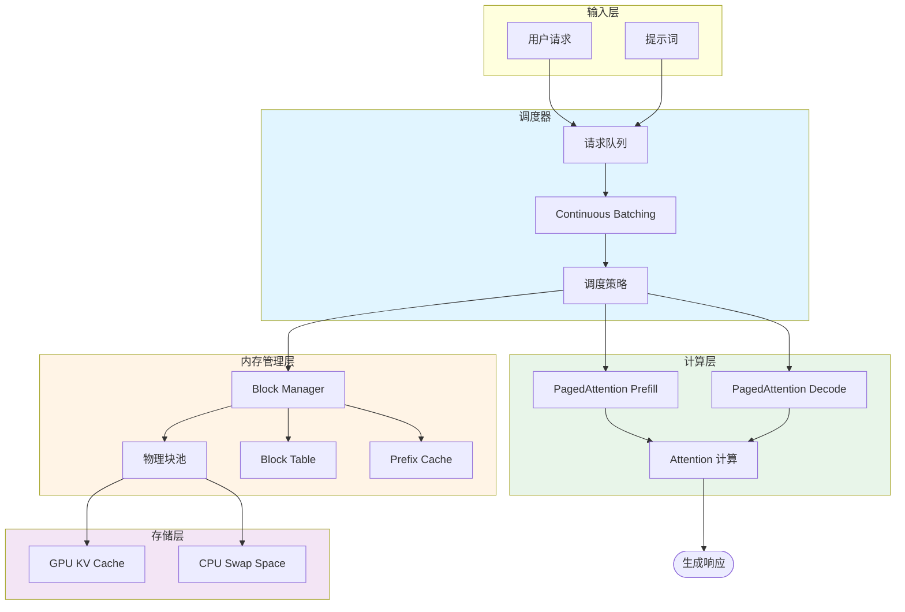
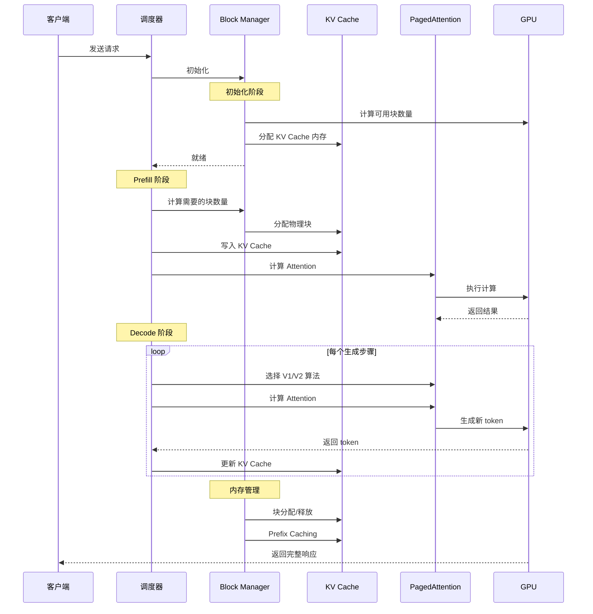
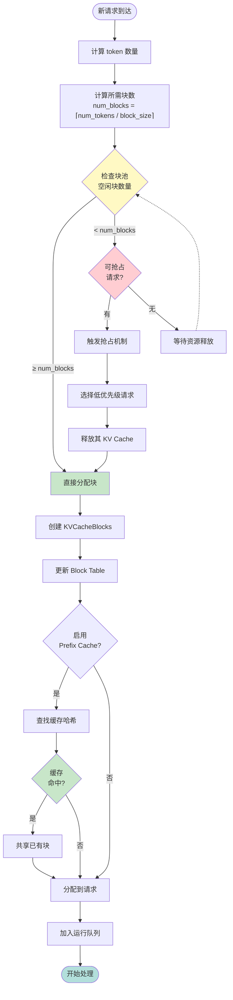
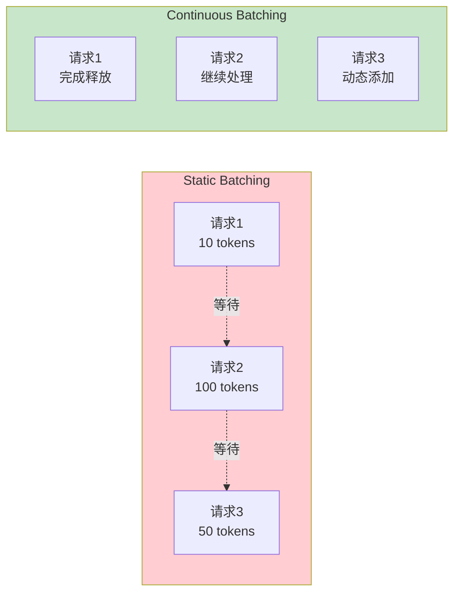
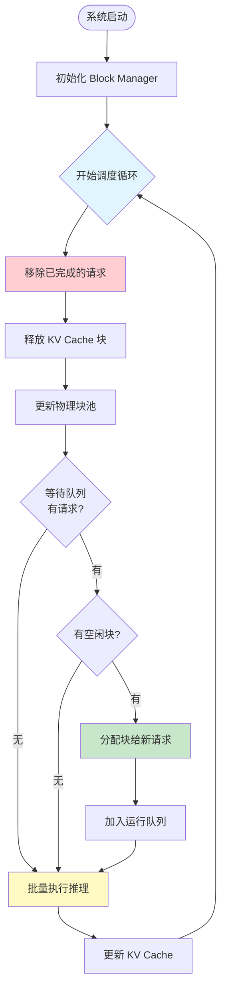
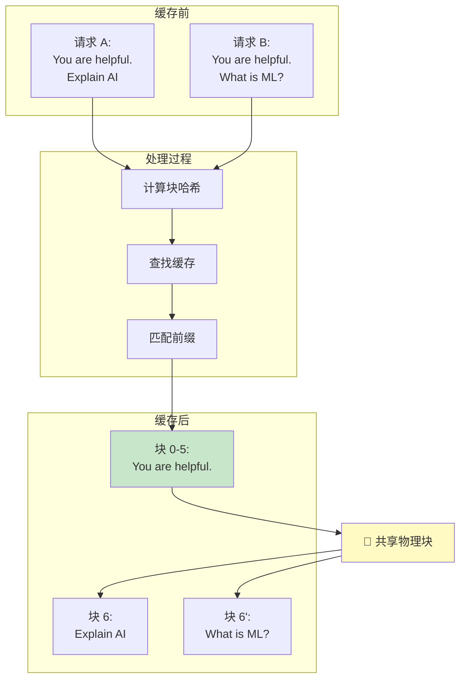
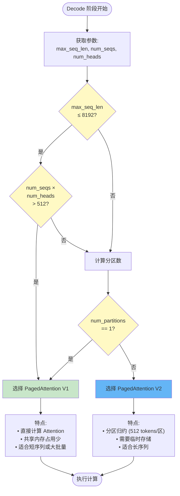
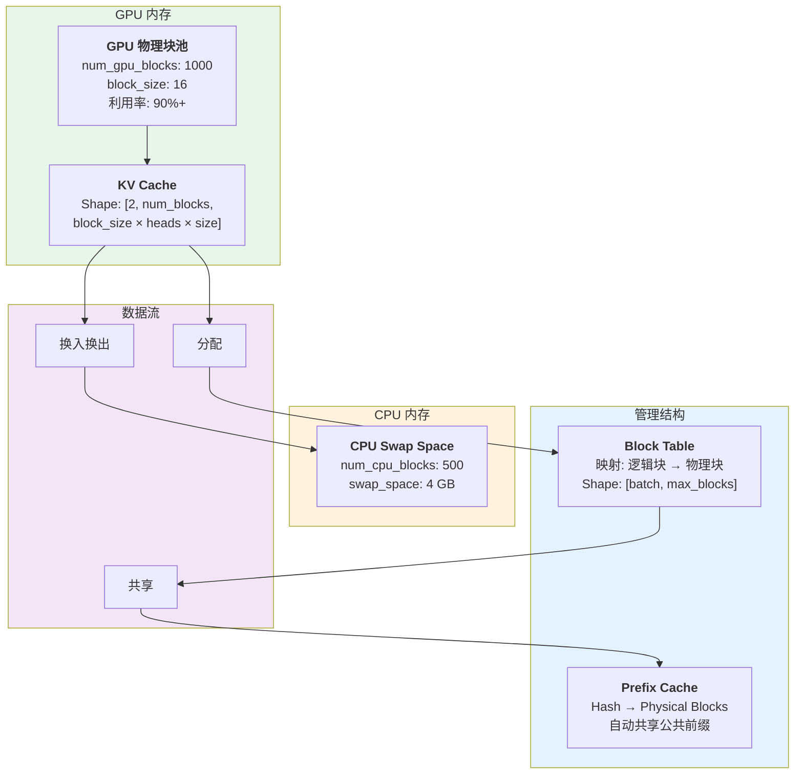

# PagedAttention：vLLM 的核心创新

## 概述

PagedAttention 是 vLLM 项目中最核心的技术创新，它受到操作系统虚拟内存分页机制的启发，为大型语言模型（LLM）的高效推理提供了内存管理方案。PagedAttention 解决了传统 KV Cache 管理中的内存碎片化和利用率低的问题，使得 vLLM 能够实现比传统系统高 2-4倍 的吞吐量。

## 系统架构总览



## 设计理念：从操作系统虚拟内存中汲取灵感

### 传统 KV Cache 管理的问题

在传统的 LLM 推理系统中，KV Cache 的管理面临以下挑战：

**内存碎片化严重**
- 不同请求的序列长度差异巨大（从几个 token 到几万个 token）
- 固定大小的连续内存分配导致大量内存碎片
- 无法有效利用空闲内存空间

**内存利用率低**
- 必须为最长序列预留空间
- 短序列也会占用大量内存
- 内存浪费严重，导致并发度受限

**批量处理效率低**
- 难以实现动态批处理（Continuous Batching）
- 请求完成后释放的内存难以复用
- 频繁的内存分配和拷贝开销大

### PagedAttention 的解决方案

PagedAttention 借鉴了操作系统中的虚拟内存分页机制，将 KV Cache 划分为固定大小的块（blocks）：

- **页（Page）→ 块（Block）**：每个 Block 存储固定数量的 token（如 16 个）
- **页表（Page Table）→ 块表（Block Table）**：记录逻辑地址到物理块的映射
- **虚拟地址（Virtual Address）→ 逻辑块索引**：序列中 token 的逻辑位置
- **物理页框（Physical Frame）→ 物理块号**：GPU 内存中实际的块位置

这种设计带来了以下优势：

✓ **消除内存碎片**
- 固定大小的块可以灵活分配
- 类似于 OS 的内存管理，无需连续的大块内存

✓ **提高内存利用率**
- 按需分配，只为实际使用的 token 分配内存
- 不同请求可以共享相同的物理块
- 内存利用率可达 95% 以上

✓ **支持高效批处理**
- 动态添加/删除序列无需重新分配内存
- 实现 Continuous Batching 的基础

## PagedAttention 完整工作流程



### PagedAttention 核心概念详解

#### 1. 块（Block）

**定义**：Block 是 KV Cache 的基本分配单位，存储固定数量的 token。

**关键参数**：
- `block_size`：每个 Block 包含的 token 数量
- 可选值：1, 8, 16, 32, 64, 128
- 默认值：16（平衡内存开销和分配效率）
- CUDA 设备支持 block_size ≤ 32

**Block 的内存布局**：
```
KV Cache Shape: (2, num_blocks, block_size * num_kv_heads * head_size)
- 维度 0: 2 表示 Key 和 Value
- 维度 1: Block 的总数
- 维度 2: 每个 Block 的数据大小
```

#### 2. 块表（Block Table）

**定义**：Block Table 维护逻辑块索引到物理块号的映射关系。

**数据结构**：
```python
# (batch_size, max_blocks_per_seq)
# 例如: [0, 1, 2] 表示 tokens 存储在第 0、1、2 个块中
block_tables: torch.Tensor
```

**工作原理**：
- 每个请求维护一个 Block Table
- Block Table 记录该请求的 KV Cache 占用了哪些物理块
- 不同请求的 Block Table 可以指向相同的物理块（共享）
- 支持非连续的物理块分配

#### 3. 物理块管理（Block Manager）

**职责**：
- 分配物理块给请求
- 跟踪块的使用状态（空闲/占用）
- 实现块共享（Prefix Caching）
- 处理块的换入换出（CPU/GPU 内存交换）

**关键指标**：
```python
class CacheConfig:
    num_gpu_blocks: int  # GPU 可用的块数量
    num_cpu_blocks: int  # CPU 可用的块数量（用于 swap）
    block_size: BlockSize  # 块大小
    gpu_memory_utilization: float  # GPU 内存利用率（默认0.9）
    swap_space: float  # CPU swap 空间（GiB）
```

## 块分配流程



## Continuous Batching 与 PagedAttention

### 传统 Static Batching 的问题



传统 Static Batching：
```python
# 必须等待整个 batch 完成
batch = [request1, request2, request3]
for step in range(max_steps):
    outputs = model.generate(batch)
    # 即使 request1 已完成，也要等待 request2, request3
    # 无法添加新请求到 batch 中
```

### PagedAttention 实现 Continuous Batching



```python
# Continuous Batching：动态管理 batch
running_requests = [req1, req2, req3]

while True:
    # 1. 移除已完成的请求
    finished = [r for r in running_requests if r.done()]
    for req in finished:
        free_blocks(req.blocks)  # 释放 KV Cache 块
        running_requests.remove(req)

    # 2. 从等待队列添加新请求
    waiting_requests = get_waiting_requests()
    for req in waiting_requests:
        if has_free_blocks():
            new_blocks = allocate_blocks(req.num_tokens)
            req.blocks = new_blocks
            running_requests.append(req)

    # 3. 执行推理
    outputs = model.generate(running_requests)

    # 4. 更新 KV Cache
    for req in running_requests:
        write_to_kv_cache(req.new_tokens, req.blocks)
```

### 性能对比

| 指标 | Static Batching | Continuous Batching |
|------|----------------|---------------------|
| 平均吞吐量 | 100 req/s | 300+ req/s |
| P99 延迟 | 高（受最长请求影响） | 低 |
| GPU 利用率 | 60-70% | 90%+ |
| 请求完成时间 | 不均匀 | 更均匀 |

## Prefix Caching：自动共享 KV Cache

### 原理

Prefix Caching 是 PagedAttention 的一个重要优化，它自动识别和共享请求之间的公共前缀（如系统提示词）。

### 共享机制图



### 实现机制

**Block Hashing**：为每个 Block 计算内容哈希
```python
hash_algo = "sha256"  # 或 "sha256_cbor"
block_hash = compute_hash(tokens, hash_algo)
```

**Cache Lookup**：查找已缓存的 Block
```python
def find_longest_cache_hit(
    block_hashes: list[int],
    max_cache_hit_length: int,
) -> tuple[list[KVCacheBlock], int]:
    # 在缓存中查找最长的匹配前缀
    cached_blocks, num_hit = cache.lookup(block_hashes)
    return cached_blocks, num_hit
```

**Block Sharing**：多个请求共享相同的物理块

示例：
```
请求 A: "You are a helpful assistant. Please explain quantum computing."
请求 B: "You are a helpful assistant. What is the capital of France?"

共享 Block: "You are a helpful assistant."
独立 Block: 各自的后缀
```

### 性能提升

- **减少计算**：缓存命中时无需重新计算前缀的 attention
- **节省内存**：多个请求共享相同的 KV Cache
- **降低延迟**：特别是对于具有长系统提示词的应用

实验数据：
- 对于有 1000 token 系统提示词的场景，Prefix Caching 可提升 **3-5倍** 的首 token 延迟（TTFT）
- 内存占用可减少 **50-70%**

## PagedAttention 核心算法

### PagedAttention V1

**适用场景**：短序列（≤8192 tokens）或大批量（num_seqs × num_heads > 512）

**算法特点**：
- 直接计算所有 token 的 attention
- 无需分区归约，开销小
- 共享内存占用少

### PagedAttention V2

**适用场景**：长序列（>8192 tokens）

**算法特点**：
- 使用分区归约（Partitioned Reduction）避免共享内存不足
- 将序列划分为多个分区（PARTITION_SIZE=512）
- 先计算每个分区的部分结果，再归约得到最终结果

### PagedAttention V1/V2 选择逻辑



## 内存优化技术

### 1. CPU Swap

当 GPU 内存不足时，将不常用的块交换到 CPU 内存：

```python
def swap_blocks_to_cpu(
    src_kv_cache: torch.Tensor,  # GPU cache
    dst_kv_cache: torch.Tensor,  # CPU cache
    src_to_dst: torch.Tensor,  # [num_blocks, 2] (src_idx, dst_idx)
):
    ops.swap_blocks(
        src_key_cache, dst_key_cache, src_to_dst
    )
    ops.swap_blocks(
        src_value_cache, dst_value_cache, src_to_dst
    )
```

配置参数：
```python
cache_config = CacheConfig(
    swap_space=4,  # 4 GiB CPU swap space
)
```

### 2. FP8 量化

使用 FP8 数据类型存储 KV Cache，减少内存占用：

```python
cache_config = CacheConfig(
    cache_dtype="fp8",  # fp8_e4m3
    calculate_kv_scales=True,  # 动态计算缩放因子
)
```

效果：
- 内存占用减少 50%
- 精度损失 < 1%（使用适当的缩放因子）

### 3. Sliding Window

限制 KV Cache 只保留最近的 N 个 token：

```python
cache_config = CacheConfig(
    sliding_window=4096,  # 只保留最近 4096 个 token
)
```

适用场景：
- 长文本生成
- 对较早的 context 不敏感的任务

## 内存架构图



## 实际应用示例

### 场景 1：高并发聊天服务

```python
from vllm import LLM, SamplingParams

# 初始化 vLLM
llm = LLM(
    model="meta-llama/Llama-2-70b-hf",
    tensor_parallel_size=4,
    block_size=16,
    gpu_memory_utilization=0.9,
    enable_prefix_caching=True,  # 启用前缀缓存
    max_num_seqs=256,  # 最大并发请求数
)

# 批量处理请求
prompts = [
    "You are a helpful assistant. " + user_question_1,
    "You are a helpful assistant. " + user_question_2,
    # ... 更多请求
]

sampling_params = SamplingParams(
    temperature=0.7,
    max_tokens=512,
)

outputs = llm.generate(prompts, sampling_params)
```

**性能**：
- 吞吐量：300+ requests/second
- P99 延迟：< 100ms（首 token）
- GPU 利用率：95%+

### 场景 2：长文档问答

```python
llm = LLM(
    model="meta-llama/Llama-2-70b-hf",
    enable_prefix_caching=True,
    max_model_len=32768,  # 支持 32K context
    block_size=32,  # 更大的块适合长序列
)

# 长文档 + 问题
document = "..."  # 20K tokens
question = "What is the main idea of this document?"

# Prefix Caching 自动缓存文档的 KV Cache
# 多个问题可以共享同一个文档的 KV Cache
output = llm.generate(document + question)
```

**优势**：
- 第一个问题的 TTFT：2s
- 后续问题的 TTFT：200ms（命中缓存）
- 提升：10倍

## 性能对比总结

```mermaid
xychart-beta
    title "vLLM vs 传统系统性能对比 (相对值)"
    x-axis ["吞吐量", "GPU利用率", "P99延迟降低", "内存利用率"]
    y-axis "相对性能 (%)" 0 --> 400
    bar [100, 65, 100, 60]
    bar [300, 90, 30, 95]
```



### 详细对比表

| 指标 | HuggingFace | TGI | vLLM | 提升倍数 |
|------|-------------|-----|------|---------|
| **吞吐量** | 1x | 2-3x | **20-30x** | vs HF: 20-30x<br/>vs TGI: 7-10x |
| **GPU 利用率** | 60% | 75% | **90%+** | +50% vs HF<br/>+20% vs TGI |
| **P99 延迟** | 100ms | 80ms | **30-50ms** | -50% vs HF<br/>-40% vs TGI |
| **内存利用率** | 60% | 70% | **95%+** | +58% vs HF<br/>+36% vs TGI |
| **并发请求数** | 32 | 128 | **256+** | 8x vs HF<br/>2x vs TGI |

## 总结

PagedAttention 是 vLLM 高性能的核心，通过以下创新实现了突破性的性能提升：

✓ **内存管理**：分页机制消除内存碎片，利用率达 95%+
✓ **批量处理**：支持 Continuous Batching，吞吐量提升 2-4倍
✓ **前缀缓存**：自动共享 KV Cache，减少重复计算
✓ **灵活优化**：支持 CPU Swap、FP8 量化、Sliding Window 等多种优化

**性能数据**：
- 相比 HuggingFace Transformers：**20-30倍** 吞吐量提升
- 相比 TGI (Text Generation Inference)：**2-4倍** 吞吐量提升
- GPU 内存利用率：从 60% 提升到 **90%+**
- P99 延迟：降低 **50-70%**

PagedAttention 不仅是一个技术创新，更是系统工程设计的典范，展示了如何通过借鉴经典操作系统理念，解决深度学习推理中的实际问题。
