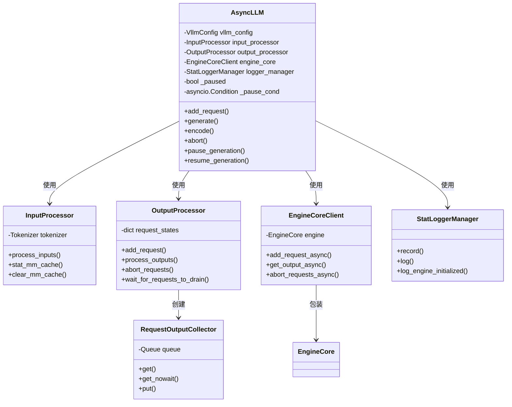
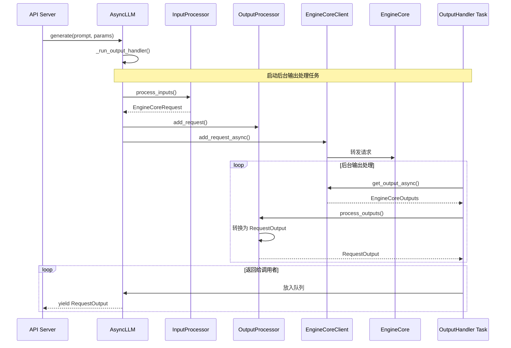
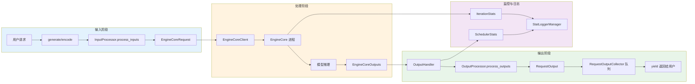

# Code Explanation: async_llm.py

## Quick Summary

`async_llm.py` 是 vLLM v1 架构的核心异步引擎实现。它提供了一个高性能的异步接口，用于处理大语言模型的推理请求。该类作为 API 服务器和底层 EngineCore 之间的桥梁，负责请求处理、输出收集、生命周期管理等功能。主要特点包括多进程架构、异步流式输出、请求暂停/恢复、LoRA 适配器支持等。

---

## Dependencies

| Import | Purpose | From |
|--------|---------|------|
| `asyncio` | 异步编程支持 | Python stdlib |
| `torch` | PyTorch profiler 集成 | PyTorch |
| `VllmConfig` | 全局配置对象 | vllm.config |
| `EngineCoreClient` | 与核心引擎进程通信 | vllm.v1.engine.core_client |
| `InputProcessor` | 输入数据预处理 | vllm.v1.engine.input_processor |
| `OutputProcessor` | 输出数据后处理 | vllm.v1.engine.output_processor |
| `Executor` | 执行器基类 | vllm.v1.executor |
| `StatLoggerManager` | 统计日志管理 | vllm.v1.metrics.loggers |
| `EngineCoreRequest` | 核心请求类型 | vllm.v1.engine |
| `ParentRequest` | 并行采样父请求 | vllm.v1.engine.parallel_sampling |

---

## Architecture Overview



---

## Request Flow Sequence Diagram



---

## Data Flow Diagram



---

## Detailed Breakdown

### Section 1: Class Definition and Initialization (Lines 55-191)

```python
class AsyncLLM(EngineClient):
    def __init__(
        self,
        vllm_config: VllmConfig,
        executor_class: type[Executor],
        log_stats: bool,
        usage_context: UsageContext = UsageContext.ENGINE_CONTEXT,
        # ... other parameters
    ) -> None:
```

**Purpose**: 初始化 AsyncLLM 引擎实例，设置所有必要的组件。

**Lines 92-114**: 配置和验证
- 注册自定义 transformer 配置序列化
- 处理统计日志配置
- 初始化 tokenizer（如果未跳过）

**Lines 117-132**: 处理器初始化
```python
self.input_processor = InputProcessor(self.vllm_config, tokenizer)
self.io_processor = get_io_processor(...)
self.output_processor = OutputProcessor(...)
```
- `InputProcessor`: 处理输入数据、tokenization
- `io_processor`: IO 处理插件
- `OutputProcessor`: 将引擎输出转换为 API 输出
- 初始化 tracer（如果配置了 OTLP 端点）

**Lines 134-155**: EngineCore 和日志管理器
```python
self.engine_core = EngineCoreClient.make_async_mp_client(...)
```
- 在单独的进程中启动 EngineCore（多进程架构）
- 初始化 StatLoggerManager 用于指标收集

**Lines 157-167**: 暂停/恢复状态
```python
self._pause_cond = asyncio.Condition()
self._paused = False
```
- 用于异步 RL 工作流的暂停/恢复机制
- 使用 asyncio.Condition 实现线程安全

**Lines 169-191**: Profiler 配置
```python
self.profiler = torch.profiler.profile(...)
```
- 如果启用了 torch profiler，配置 CPU 性能分析

---

### Section 2: Factory Methods (Lines 201-253)

```python
@classmethod
def from_vllm_config(cls, vllm_config: VllmConfig, ...) -> "AsyncLLM":
```

**Purpose**: 提供便捷的工厂方法来创建 AsyncLLM 实例。

**Lines 216-228**: `from_vllm_config` 方法
- 从 VllmConfig 创建实例
- 自动获取正确的 executor 类
- 支持多客户端配置（data parallel）

**Lines 231-253**: `from_engine_args` 方法
- 从 AsyncEngineArgs 创建实例
- 创建引擎配置并返回 AsyncLLM

---

### Section 3: Shutdown and Cleanup (Lines 255-268)

```python
def shutdown(self):
    shutdown_prometheus()
    engine_core.shutdown()
    cancel_task_threadsafe(handler)
```

**Purpose**: 清理资源，优雅关闭引擎。

**Lines 261-264**: 关闭 Prometheus 监控

**Lines 263-264**: 关闭 EngineCore 进程

**Lines 266-268**: 取消后台输出处理任务

---

### Section 4: Request Management - add_request (Lines 273-354)

```python
async def add_request(
    self,
    request_id: str,
    prompt: EngineCoreRequest | PromptType,
    params: SamplingParams | PoolingParams,
    # ...
) -> RequestOutputCollector:
```

**Purpose**: 添加新请求到引擎，返回输出收集器。

**Lines 288-294**: 错误检查和输出队列创建
```python
if self.errored:
    raise EngineDeadError()
queue = RequestOutputCollector(output_kind=params.output_kind)
```

**Lines 296-315**: 输入处理
```python
if isinstance(prompt, EngineCoreRequest):
    request = prompt
else:
    request = self.input_processor.process_inputs(...)
```
- 如果输入已经是 EngineCoreRequest，直接使用
- 否则，通过 InputProcessor 处理输入

**Lines 320-322**: 单请求或 n=1 的情况
```python
if is_pooling or params.n == 1:
    await self._add_request(request, prompt_text, None, 0, queue)
    return queue
```

**Lines 324-336**: 并行采样处理 (n>1)
```python
parent_request = ParentRequest(request_id, parent_params)
for idx in range(parent_params.n):
    request_id, child_params = parent_request.get_child_info(idx)
    child_request = request if idx == parent_params.n - 1 else copy(request)
    # ...
```
- 为每个采样分支创建子请求
- 最后一个分支复用原始请求（优化内存）

---

### Section 5: Request Generation - generate (Lines 361-471)

```python
async def generate(
    self,
    prompt: EngineCoreRequest | PromptType,
    sampling_params: SamplingParams,
    request_id: str,
    # ...
) -> AsyncGenerator[RequestOutput, None]:
```

**Purpose**: 主入口函数，处理文本生成请求并流式返回结果。

**Lines 389-397**: 配置验证
```python
if (
    self.vllm_config.cache_config.kv_sharing_fast_prefill
    and sampling_params.prompt_logprobs
):
    raise ValueError(...)
```
- 检查不兼容的配置组合

**Lines 399-407**: 初始化和暂停检查
```python
self._run_output_handler()
async with self._pause_cond:
    await self._pause_cond.wait_for(lambda: not self._paused)
```
- 确保输出处理程序已启动
- 等待引擎恢复（如果已暂停）

**Lines 409-429**: 添加请求
```python
q = await self.add_request(...)
```
- 调用 add_request 添加到引擎

**Lines 431-443**: 输出循环
```python
while not finished:
    out = q.get_nowait() or await q.get()
    finished = out.finished
    yield out
```
- 从队列中获取输出
- 流式返回给调用者
- 检查是否完成

**Lines 448-471**: 异常处理
- `CancelledError`: 客户端断开，中止请求
- `EngineDeadError`: 引擎死亡，不中止（已关闭）
- `ValueError`: 请求验证错误
- 其他异常: 中止请求并抛出

---

### Section 6: Output Handler Loop (Lines 473-542)

```python
def _run_output_handler(self):
    async def output_handler():
        while True:
            outputs = await engine_core.get_output_async()
            # 处理输出...
    self.output_handler = asyncio.create_task(output_handler())
```

**Purpose**: 后台循环，从 EngineCore 拉取输出并推送到请求队列。

**Lines 476-485**: 捕获局部变量
```python
engine_core = self.engine_core
output_processor = self.output_processor
# ...
```
- 避免循环引用，确保正确的垃圾回收

**Lines 488-540**: 主循环
```python
while True:
    outputs = await engine_core.get_output_async()
```

**Lines 492-507**: 输出分块处理
```python
if num_outputs <= envs.VLLM_V1_OUTPUT_PROC_CHUNK_SIZE:
    slices = (outputs.outputs,)
else:
    slices = np.array_split(...)
```
- 将大量输出分成小块
- 避免长时间阻塞事件循环

**Lines 509-524**: 处理每个块
```python
for i, outputs_slice in enumerate(slices):
    processed_outputs = output_processor.process_outputs(...)
    await engine_core.abort_requests_async(processed_outputs.reqs_to_abort)
```
- 处理输出
- 中止因 stop string 完成的请求

**Lines 526-537**: 统计日志
```python
output_processor.update_scheduler_stats(outputs.scheduler_stats)
if logger_manager:
    logger_manager_record(...)
```

---

### Section 7: Request Abort (Lines 544-554)

```python
async def abort(self, request_id: str | Iterable[str]) -> None:
```

**Purpose**: 中止指定请求，在 OutputProcessor 和 EngineCore 中清理。

**Lines 547-551**: 批量中止
```python
request_ids = (...) if isinstance(request_id, str) else as_list(request_id)
all_request_ids = self.output_processor.abort_requests(request_ids)
await self.engine_core.abort_requests_async(all_request_ids)
```
- 支持单个或多个请求ID
- 在两个组件中都要中止

---

### Section 8: Pause/Resume (Lines 556-606)

```python
async def pause_generation(
    self,
    *,
    wait_for_inflight_requests: bool = False,
    clear_cache: bool = True,
) -> None:
```

**Purpose**: 暂停生成以允许模型权重更新（用于 RL 工作流）。

**Lines 576-579**: 设置暂停状态
```python
async with self._pause_cond:
    if self._paused:
        return
    self._paused = True
```

**Lines 581-584**: 立即中止选项
```python
if not wait_for_inflight_requests:
    request_ids = list(self.output_processor.request_states.keys())
    if request_ids:
        await self.abort(request_ids)
```

**Lines 586-593**: 等待排空和清理缓存
```python
if self.output_processor.has_unfinished_requests():
    await self.output_processor.wait_for_requests_to_drain()
if clear_cache:
    await self.reset_prefix_cache()
    await self.reset_mm_cache()
```

**Lines 595-606**: Resume 方法
```python
async def resume_generation(self) -> None:
    async with self._pause_cond:
        self._paused = False
        self._pause_cond.notify_all()
```
- 清除暂停状态
- 唤醒所有等待的请求

---

### Section 9: Encoding (Lines 608-712)

```python
async def encode(
    self,
    prompt: PromptType,
    pooling_params: PoolingParams,
    # ...
) -> AsyncGenerator[PoolingRequestOutput, None]:
```

**Purpose**: 处理 embedding/pooling 请求（与 generate 类似但输出不同）。

**Lines 649-657**: 弃用警告
```python
if truncate_prompt_tokens is not None:
    warnings.warn(...)
```
- `truncate_prompt_tokens` 参数已弃用

**Lines 664-685**: 主循环（与 generate 类似）
- 添加请求
- 从队列获取输出
- 返回 `PoolingRequestOutput` 而不是 `RequestOutput`

---

### Section 10: Properties and Status (Lines 714-880)

**Lines 714-724**: Tokenizer 访问
```python
@property
def tokenizer(self) -> TokenizerLike | None:
    return self.input_processor.tokenizer

async def get_tokenizer(self) -> TokenizerLike:
    if self.tokenizer is None:
        raise ValueError(...)
    return self.tokenizer
```

**Lines 865-880**: 状态属性
```python
@property
def is_running(self) -> bool:
    return self.output_handler is None or not self.output_handler.done()

@property
def errored(self) -> bool:
    return self.engine_core.resources.engine_dead or not self.is_running
```

---

### Section 11: LoRA Support (Lines 777-791)

```python
async def add_lora(self, lora_request: LoRARequest) -> bool:
    return await self.engine_core.add_lora_async(lora_request)

async def remove_lora(self, lora_id: int) -> bool:
    return await self.engine_core.remove_lora_async(lora_id)
```

**Purpose**: 动态加载/卸载 LoRA 适配器。

---

### Section 12: Scaling and Sleep (Lines 807-873)

**Lines 807-821**: 等待请求排空
```python
async def wait_for_requests_to_drain(self, drain_timeout: int = 300):
    while time.time() - start_time < drain_timeout:
        if not self.engine_core.dp_engines_running():
            return
        await asyncio.sleep(1)
    raise TimeoutError(...)
```

**Lines 823-863**: 弹性扩缩容
```python
async def scale_elastic_ep(
    self, new_data_parallel_size: int, drain_timeout: int = 300
):
```
- 等待请求排空
- 扩缩容 engine cores
- 重建统计日志记录器

---

## Key Concepts

### 1. **多进程架构**
AsyncLLM 运行在主进程，EngineCore 运行在单独的进程中。这种设计提供了：
- 隔离性：引擎崩溃不会影响 API 服务器
- 稳定性：可以独立重启引擎
- GIL 绕过：真正的并行执行

### 2. **异步流式输出**
使用 `AsyncGenerator` 和队列实现流式返回：
- `RequestOutputCollector`: 每个请求的输出队列
- `OutputHandler`: 后台任务，从引擎拉取输出
- `generate()`: 用户协程，从队列获取并返回

### 3. **并行采样 (n>1)**
使用 `ParentRequest` 管理多个采样分支：
- 每个分支有独立的 request_id
- 最后一个分支复用原始请求对象
- 输出聚合到同一个收集器

### 4. **暂停/恢复机制**
用于模型权重更新场景：
- 使用 `asyncio.Condition` 实现线程安全
- 新请求被阻塞直到恢复
- 可选择等待现有请求完成或立即中止

### 5. **输出分块处理**
为避免阻塞事件循环：
- 大量输出被分成小块
- 每块之间让出控制权 (`await asyncio.sleep(0)`)
- 平衡吞吐量和响应性

---

## Notes

### 设计亮点
1. **清晰的关注点分离**: InputProcessor、OutputProcessor、EngineCore 各司其职
2. **优雅的错误处理**: 多层异常处理，区分可恢复和不可恢复错误
3. **灵活的配置**: 支持日志、profiling、tracing 等多种配置
4. **生命周期管理**: 完善的初始化、运行、关闭流程

### 潜在改进点
1. `generate()` 和 `encode()` 有大量重复代码，可以提取共享逻辑
2. 硬编码的超时时间（如 300秒）可以配置化
3. Prometheus 指标重置逻辑（Lines 855-863）需要进一步澄清

### 性能考虑
1. `get_nowait() or await q.get()` 模式优化了队列获取
2. 输出分块避免了长时间阻塞
3. 最后一个采样分支复用请求对象节省内存
4. 局部变量捕获避免循环引用

---

## Summary Table

| 组件 | 职责 | 通信方式 |
|------|------|----------|
| **InputProcessor** | 输入预处理、tokenization | 同步调用 |
| **OutputProcessor** | 输出后处理、请求状态管理 | 同步调用 |
| **EngineCoreClient** | 与引擎进程通信 | 异步IPC |
| **OutputHandler** | 后台输出拉取任务 | 异步循环 |
| **StatLoggerManager** | 指标收集和日志 | 异步调用 |

---

*Generated by Claude Code Explainer*
*Date: 2026-03-15*
