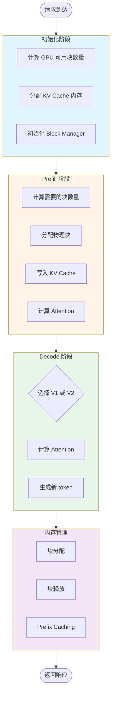
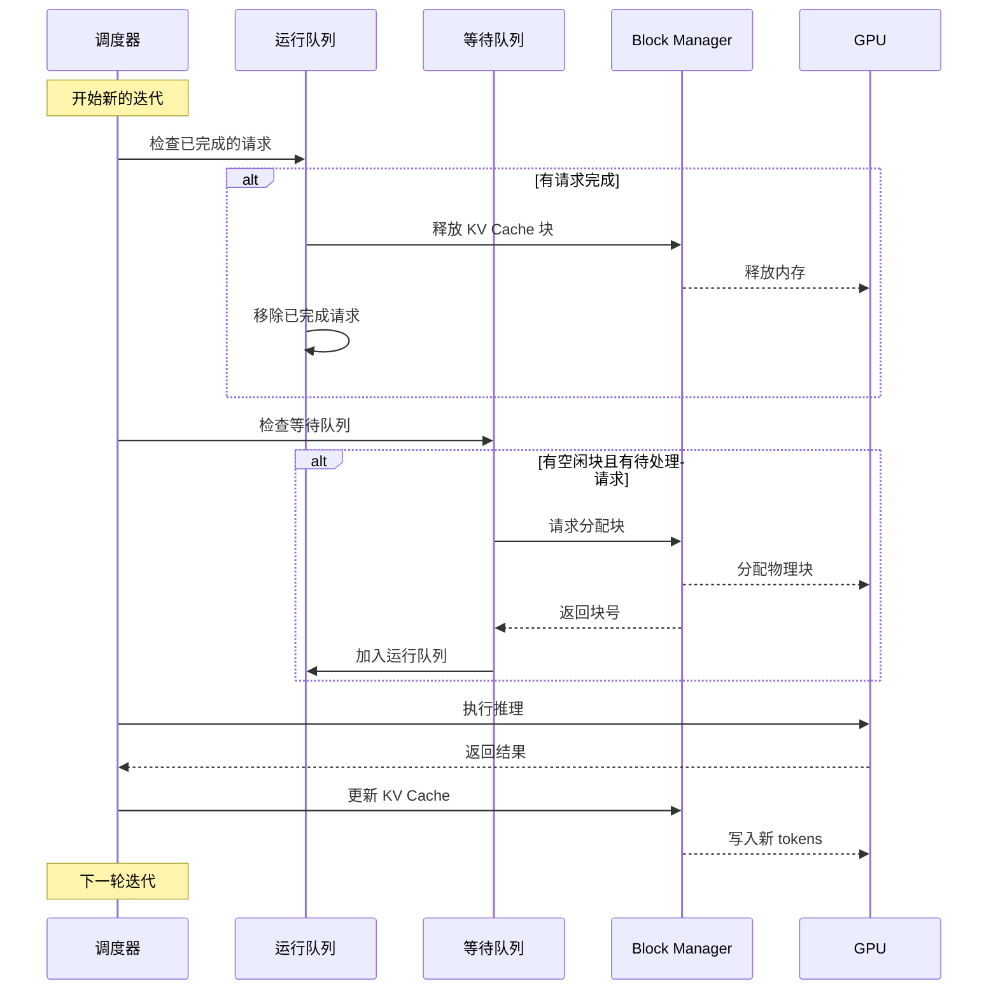
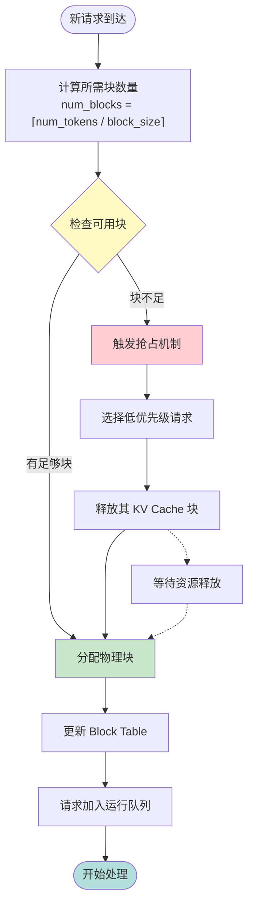
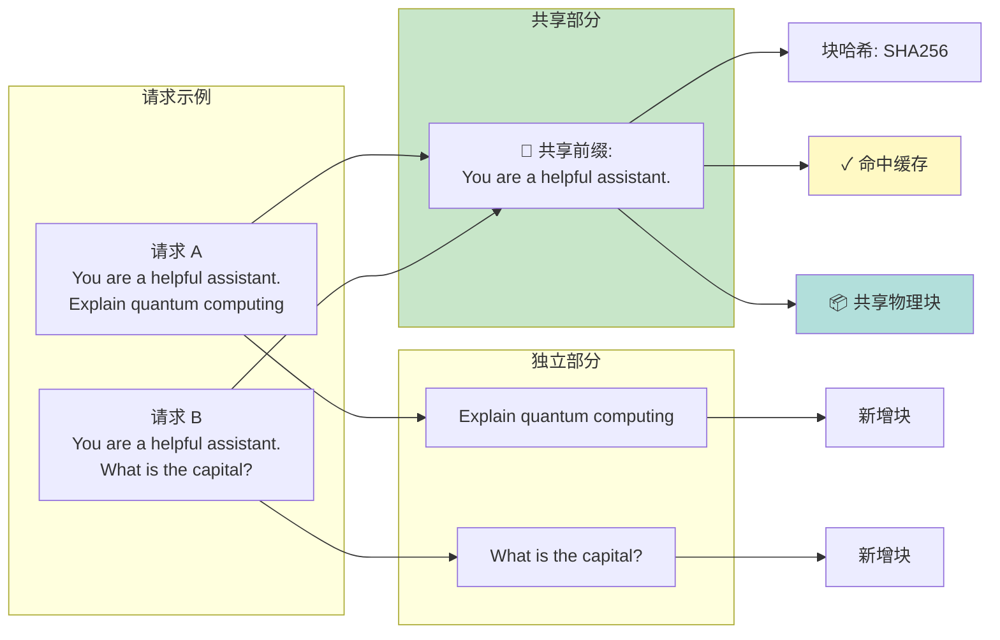
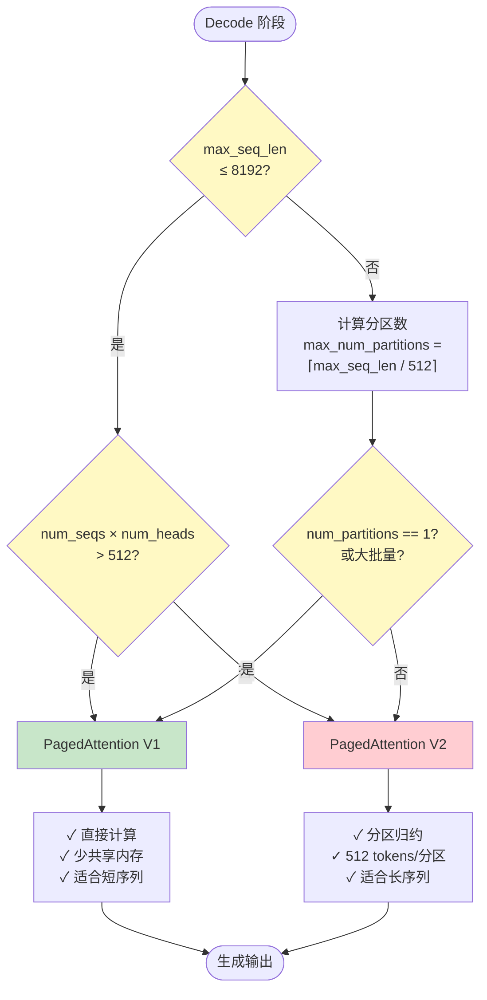
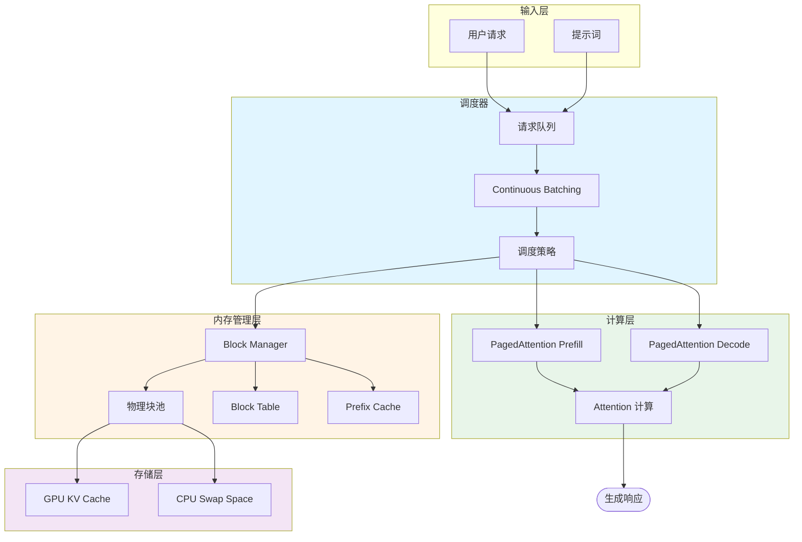
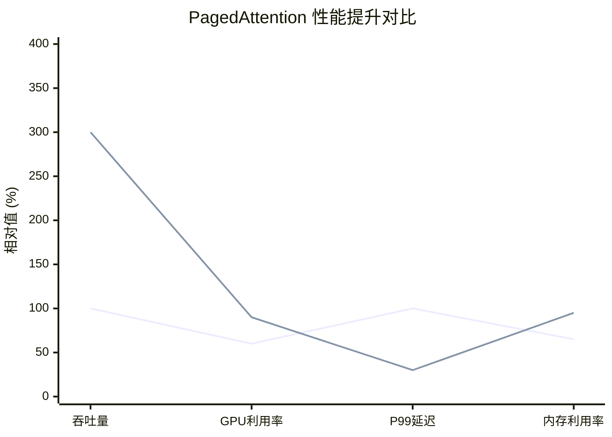

# PagedAttention 图表 - Mermaid 格式

## 1. PagedAttention 完整工作流程图

## 2. Continuous Batching 工作流程

## 3. 块分配流程图

## 4. Prefix Caching 工作流程

## 5. PagedAttention V1/V2 选择逻辑

## 6. 系统架构总览

## 7. 性能对比图

## 使用说明

### 在飞书文档中使用：

1. **插入流程图**：
   - 在飞书文档中输入 `/mermaid` 或选择"插入" → "代码块"
   - 选择 Mermaid 语言
   - 复制上述代码粘贴进去

2. **插入图片**：
   - 将生成的 PNG/PDF 图片上传到飞书文档
   - 拖拽到合适位置

3. **调整样式**：
   - 飞书支持 Mermaid 的所有主题
   - 可以在代码块中添加 `%%{init: {'theme':'base', 'themeVariables': { 'primaryColor':'#ff0000'}}}%%` 来自定义颜色

### 各图表用途说明：

- **图表1**: 展示 PagedAttention 的完整工作流程，适合放在文档开头
- **图表2**: 展示 Continuous Batching 的时序交互，适合放在批处理章节
- **图表3**: 展示块分配的详细逻辑，适合放在内存管理章节
- **图表4**: 展示 Prefix Caching 的工作原理，适合放在优化技术章节
- **图表5**: 展示 V1/V2 算法选择逻辑，适合放在核心算法章节
- **图表6**: 展示系统整体架构，适合放在架构设计章节
- **图表7**: 展示性能对比数据，适合放在性能测试章节
