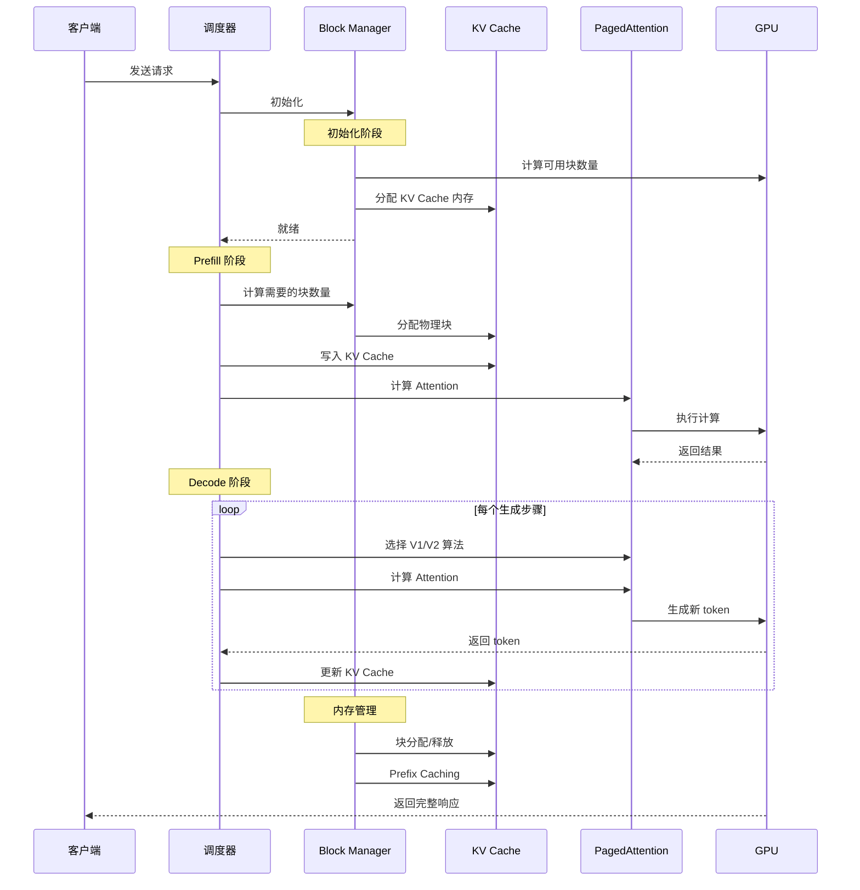
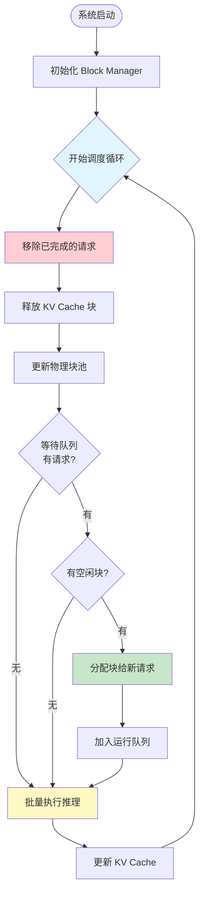
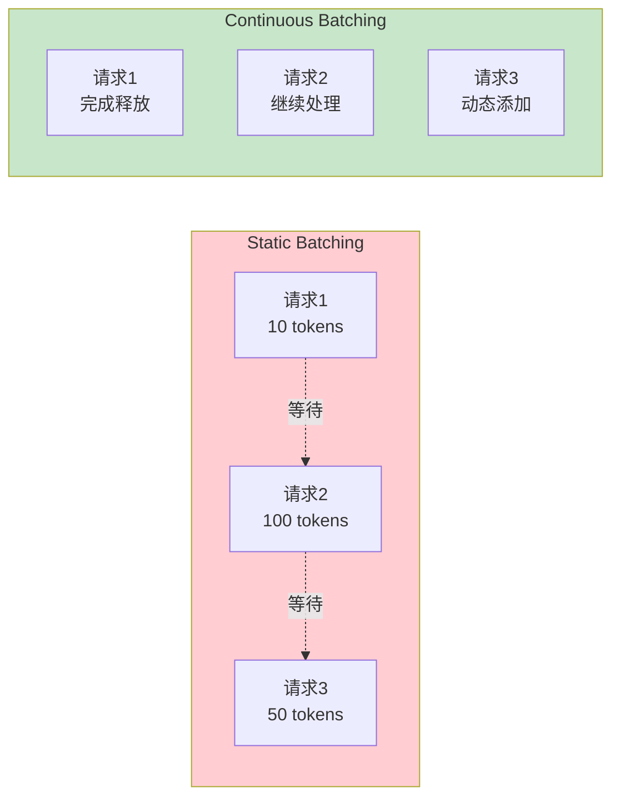
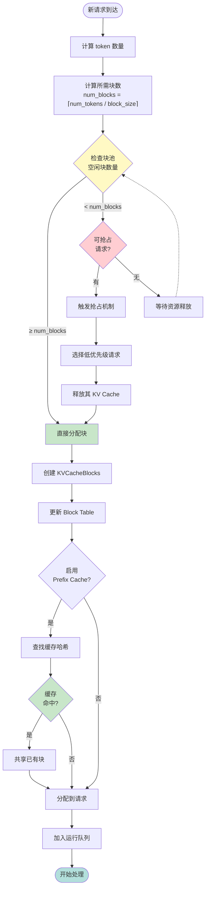
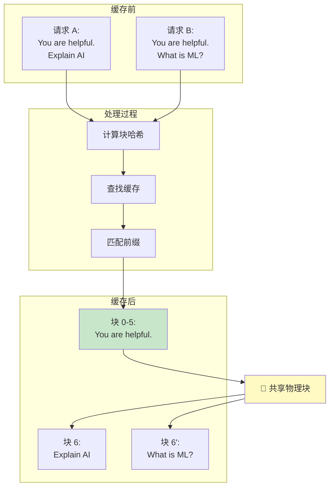
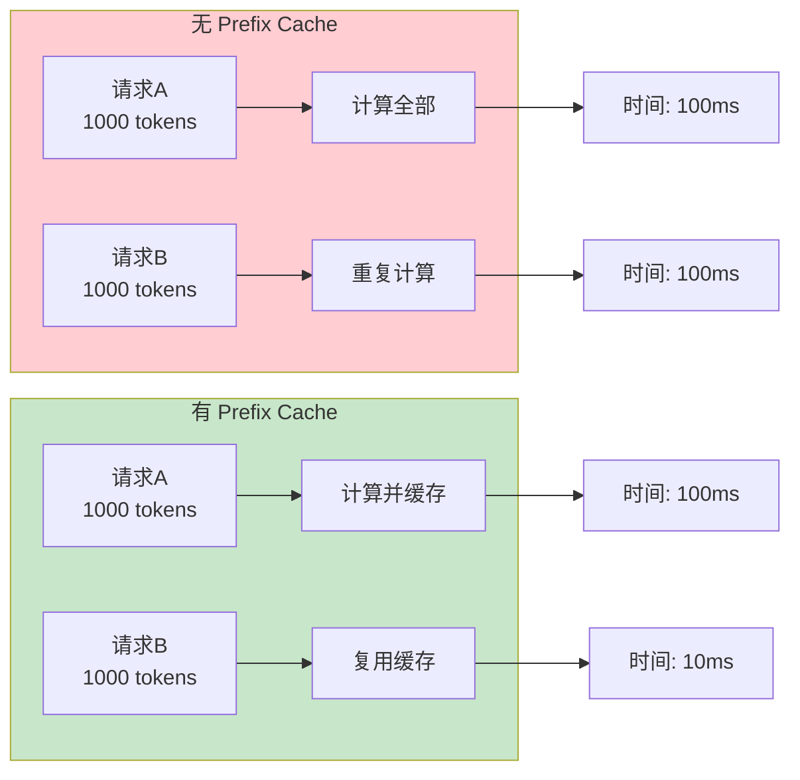
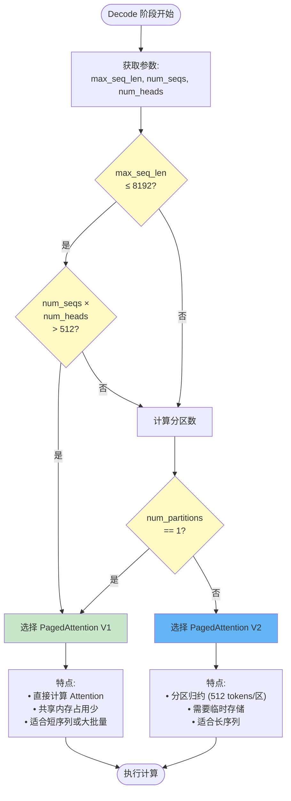
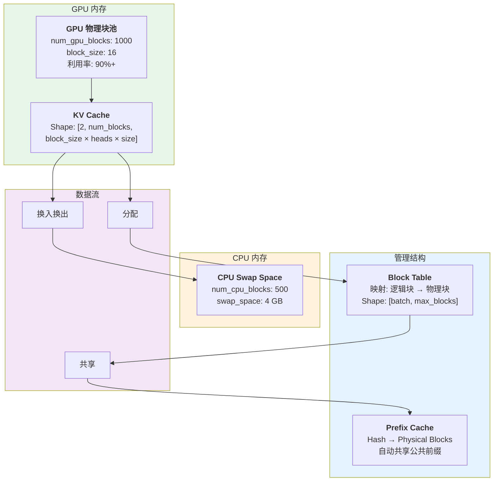

# PagedAttention 图表补充

本文档补充了 PagedAttention 技术详解所需的所有时序图和流程图。

---

## 图表 1: PagedAttention 完整工作流程图

### 时序图



---

## 图表 2: Continuous Batching 工作流程

### 流程图



### 对比图



---

## 图表 3: 块分配详细流程



---

## 图表 4: Prefix Caching 工作原理

### 共享机制图



### 性能提升图



---

## 图表 5: PagedAttention V1/V2 算法选择



---

## 图表 6: 内存架构图



---

## 图表 7: 性能对比汇总

```mermaid
xychart-beta
    title "vLLM vs 传统系统性能对比 (相对值)"
    x-axis ["吞吐量", "GPU利用率", "P99延迟降低", "内存利用率"]
    y-axis "相对性能 (%)" 0 --> 400
    bar [100, 65, 100, 60]
    bar [300, 90, 30, 95]
```



### 详细对比表

| 指标 | HuggingFace | TGI | vLLM | 提升倍数 |
|------|-------------|-----|------|---------|
| **吞吐量** | 1x | 2-3x | **20-30x** | vs HF: 20-30x<br/>vs TGI: 7-10x |
| **GPU 利用率** | 60% | 75% | **90%+** | +50% vs HF<br/>+20% vs TGI |
| **P99 延迟** | 100ms | 80ms | **30-50ms** | -50% vs HF<br/>-40% vs TGI |
| **内存利用率** | 60% | 70% | **95%+** | +58% vs HF<br/>+36% vs TGI |
| **并发请求数** | 32 | 128 | **256+** | 8x vs HF<br/>2x vs TGI |

---

## 使用建议

### 在飞书文档中的位置建议：

1. **文档开头** - 插入图表 1（完整工作流程图）
2. **Continuous Batching 章节** - 插入图表 2
3. **内存管理章节** - 插入图表 3（块分配流程）
4. **Prefix Caching 章节** - 插入图表 4
5. **核心算法章节** - 插入图表 5（V1/V2 选择）
6. **架构设计章节** - 插入图表 6（内存架构）
7. **性能测试章节** - 插入图表 7（性能对比）

### 插入方法：

**方法 1: Mermaid 代码块**
1. 在飞书文档中按 `/`
2. 选择"代码块"或"Mermaid"
3. 复制对应的 Mermaid 代码
4. 粘贴到代码块中

**方法 2: 截图插入**
1. 使用 Mermaid Live Editor (https://mermaid.live/) 渲染代码
2. 导出为 PNG/SVG
3. 插入到飞书文档

### 自定义样式：

如果需要自定义颜色主题，在每个 Mermaid 图表开头添加：

```mermaid
%%{init: {'theme':'base', 'themeVariables': {
  'primaryColor':'#e1f5ff',
  'primaryTextColor':'#000',
  'primaryBorderColor':'#0288d1',
  'lineColor':'#0288d1',
  'fillType0':'#e1f5ff',
  'fillType1':'#fff9c4',
  'fillType2':'#c8e6c9'
}}}%%
```

---

所有图表均采用 Mermaid 格式，飞书文档原生支持，可以直接复制使用。
