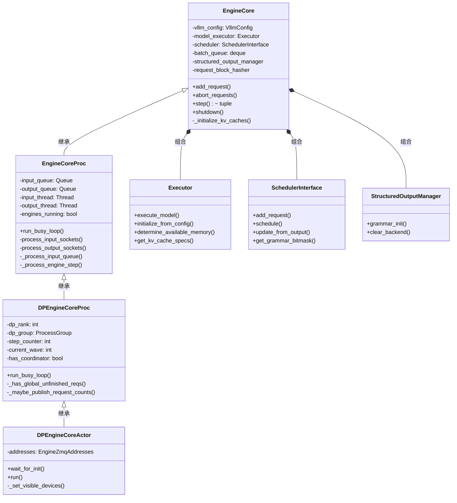
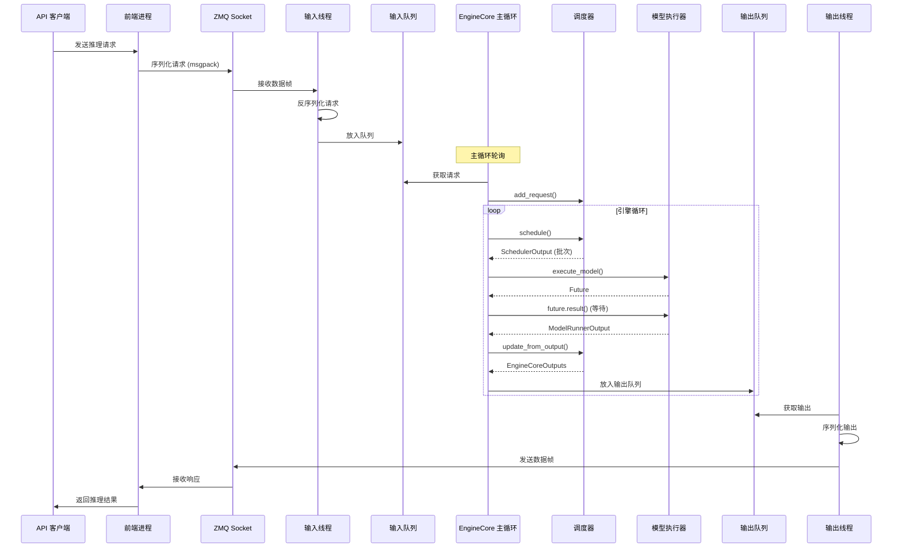

# vLLM EngineCore 代码详细解释

## 文件信息
- **文件路径**: `vllm/v1/engine/core.py`
- **主要功能**: vLLM 引擎核心，负责 LLM 推理的调度和执行
- **代码行数**: 1494 行
- **复杂度**: 高（涉及多进程通信、数据并行、异步调度）

---

## 快速摘要

这个文件实现了 vLLM 的引擎核心（EngineCore），是 vLLM 推理引擎的心脏。它负责：

1. **请求调度**: 管理多个推理请求的调度和批处理
2. **模型执行**: 协调模型执行器进行前向推理
3. **KV 缓存管理**: 管理 KV 缓存的初始化和分配
4. **多进程通信**: 通过 ZMQ 实现前后端分离的进程间通信
5. **数据并行**: 支持多实例数据并行推理

文件包含四个主要类：
- `EngineCore`: 引擎核心主逻辑
- `EngineCoreProc`: 进程包装器（使用 ZMQ 通信）
- `DPEngineCoreProc`: 数据并行版本
- `DPEngineCoreActor`: Ray 分布式 actor 版本

---

## 目录
1. [依赖关系分析](#依赖关系分析)
2. [系统架构图](#系统架构图)
3. [请求处理流程图](#请求处理流程图序列图)
4. [引擎循环时序图](#引擎循环时序图)
5. [数据流分析](#数据流分析)
6. [详细代码解释](#详细代码解释)
7. [关键概念](#关键概念)
8. [设计模式](#设计模式)
9. [性能优化点](#性能优化点)

---

## 依赖关系分析

### 核心依赖

| 导入 | 用途 | 来源 |
|------|------|------|
| `zmq` | ZeroMQ 消息队列，用于进程间通信 | 第三方库 (pyzmq) |
| `msgspec` | 高性能序列化/反序列化 | 第三方库 |
| `VllmConfig` | vLLM 全局配置 | vllm.config |
| `SchedulerInterface` | 调度器接口 | vllm.v1.core.sched |
| `Executor` | 模型执行器接口 | vllm.v1.executor |
| `Request` | 请求对象 | vllm.v1.request |
| `KVCacheConfig` | KV 缓存配置 | vllm.v1.kv_cache_interface |

### 关键依赖说明

**ZMQ (ZeroMQ)**
- 用于实现 EngineCore 进程与前端 API 服务器的通信
- 支持 DEALER、ROUTER、PUSH、XSUB 等模式
- 允许前后端分离部署，提高稳定性

**msgspec**
- 高性能的消息序列化库
- 比标准 json/pickle 更快
- 用于 EngineCoreRequest 和 EngineCoreOutputs 的序列化

**调度器 (SchedulerInterface)**
- 负责决定哪些请求应该被处理
- 管理请求的优先级和资源分配
- 处理 prefix caching 和 KV transfer

---

## 系统架构图



**架构说明**:
- `EngineCore` 是基类，包含核心推理逻辑
- `EngineCoreProc` 添加了多进程通信能力（ZMQ）
- `DPEngineCoreProc` 添加了数据并行协调能力
- `DPEngineCoreActor` 添加了 Ray 集群支持

---

## 请求处理流程图（序列图）



**流程说明**:
1. 客户端请求通过 ZMQ 到达 EngineCore 进程
2. 输入线程处理 Socket IO，反序列化后放入输入队列
3. EngineCore 主循环从队列获取请求，提交给调度器
4. 调度器生成批次，执行器执行模型推理
5. 输出通过输出队列和输出线程返回给前端

---

## 引擎循环时序图

```mermaid
gantt
    title EngineCore 单次迭代时序
    dateFormat X
    axisFormat %L ms

    section 输入处理
    处理输入队列     :0, 5
    处理 Abort 请求  :5, 6

    section 调度
    调度器调度       :6, 15

    section 执行
    执行模型推理     :15, 60
    采样 Token       :60, 65

    section 输出处理
    更新调度器状态   :65, 75
    发送输出到队列   :75, 77

    section 后处理
    Post-step 钩子   :77, 80
    Yield GIL (如需) :80, 81
```



**时序说明**:
- 调度阶段约 9ms：涉及请求排序、KV 缓存分配
- 执行阶段约 45ms：这是 GPU 上的实际模型推理时间
- 输出处理约 12ms：更新状态、生成响应
- 总迭代时间约 80ms（示例）

---

## 数据流分析

### 请求生命周期数据流

**数据流图**: 📊 已创建详细的可视化数据流图

**Excalidraw 文件**: `vllm_engine_core_data_flow.excalidraw`

**如何查看**:
1. 访问 https://excalidraw.com
2. 将 `.excalidraw` 文件拖入浏览器
3. 或使用 VS Code 的 Excalidraw 扩展打开

**图表概览**:
- **总元素数**: 33 个
  - 10 个矩形框（2 个输入/输出 + 8 个处理阶段）
  - 12 个文本标签
  - 9 个箭头
  - 1 个图例框（4 种颜色编码示例）
  - 1 个标题

**颜色编码**:
- 🟢 **绿色** (`#b2f2bb`): 外部输入和输出（客户端请求、输出队列）
- 🔵 **蓝色** (`#a5d8ff`): 处理阶段（ZMQ 接收、反序列化、输出生成）
- 🟠 **橙色** (`#ffec99`): 数据转换（带 block hash 的请求转换）
- 🟣 **紫色** (`#d0bfff`): 内部操作（调度器、执行器、采样器）

**10 个处理阶段**（从上到下）:
1. **输入**: 客户端发送 EngineCoreRequest (request_id, prompt, sampling_params)
2. **阶段 1**: ZMQ Socket 接收 msgpack 编码的数据帧
3. **阶段 2**: InputThread 反序列化为 EngineCoreRequest 对象
4. **阶段 3**: 请求转换为内部 Request 对象，计算 block hash
5. **阶段 4**: 调度器将请求批次化
6. **阶段 5**: 执行器执行模型前向传播
7. **阶段 6**: 返回 ModelRunnerOutput (logits, hidden_states)
8. **阶段 7**: 采样器从 logits 采样 token
9. **阶段 8**: 调度器更新请求状态
10. **输出**: EngineCoreOutputs 通过输出队列发送

### 详细数据流说明

#### 阶段 1: 请求输入 (Lines 1000-1079)
```
数据来源: ZMQ Socket (外部前端进程)
数据格式: msgpack 编码的多帧消息
转换: MsgpackDecoder 反序列化为 EngineCoreRequest
输出: (request_type, request) 元组放入 input_queue
```

**关键代码**:
```python
# Line 1056: 接收多帧消息
type_frame, *data_frames = input_socket.recv_multipart(copy=False)
request_type = EngineCoreRequestType(bytes(type_frame.buffer))

# Line 1062: 反序列化为请求对象
req: EngineCoreRequest = add_request_decoder.decode(data_frames)
```

#### 阶段 2: 请求预处理 (Lines 561-583)
```
输入: EngineCoreRequest
处理:
  - 多模态特征缓存更新
  - 请求对象转换 (EngineCoreRequest -> Request)
  - 结构化输出语法初始化
输出: Request 对象
```

**关键代码**:
```python
# Line 570-573: 多模态特征处理
if self.mm_receiver_cache is not None and request.mm_features:
    request.mm_features = self.mm_receiver_cache.get_and_update_features(
        request.mm_features
    )

# Line 575: 转换为内部请求对象
req = Request.from_engine_core_request(request, self.request_block_hasher)

# Line 576-582: 结构化输出初始化
if req.use_structured_output:
    self.structured_output_manager.grammar_init(req)
```

#### 阶段 3: 调度阶段 (Lines 338-364)
```
输入: Request 对象集合
处理:
  - 调度器排序和选择请求
  - 分配 KV 缓存块
  - 构建执行批次
输出: SchedulerOutput (包含批次和元数据)
```

**关键代码**:
```python
# Line 349: 调度器生成批次
scheduler_output = self.scheduler.schedule()

# Line 350: 执行模型（异步）
future = self.model_executor.execute_model(scheduler_output, non_block=True)
```

#### 阶段 4: 模型执行 (Lines 350-355)
```
输入: SchedulerOutput
处理:
  - GPU 前向推理
  - 计算 logits
  - 返回隐藏状态
输出: ModelRunnerOutput (logits, hidden_states)
```

#### 阶段 5: 采样阶段 (Lines 351-355)
```
输入: ModelRunnerOutput, grammar_bitmask
处理:
  - 从 logits 中采样 token
  - 应用约束（如有）
输出: 采样的 token IDs
```

#### 阶段 6: 状态更新 (Lines 357-362)
```
输入: ModelRunnerOutput
处理:
  - 更新请求状态
  - 管理 KV 缓存
  - 检查完成条件
输出: EngineCoreOutputs
```

---

## 详细代码解释

### 第一部分: EngineCore 基类 (Lines 78-583)

#### 1.1 初始化 (Lines 81-218)

```python
def __init__(
    self,
    vllm_config: VllmConfig,
    executor_class: type[Executor],
    log_stats: bool,
    executor_fail_callback: Callable | None = None,
):
```

**功能**: 初始化引擎核心的所有组件

**关键步骤**:

1. **加载插件** (Lines 89-91)
```python
from vllm.plugins import load_general_plugins
load_general_plugins()
```
- 加载用户自定义插件
- 允许扩展 vLLM 功能

2. **设置模型执行器** (Lines 103-106)
```python
self.model_executor = executor_class(vllm_config)
if executor_fail_callback is not None:
    self.model_executor.register_failure_callback(executor_fail_callback)
```
- 创建模型执行器实例
- 注册失败回调（用于错误处理）

3. **初始化 KV 缓存** (Lines 111-117)
```python
num_gpu_blocks, num_cpu_blocks, kv_cache_config = self._initialize_kv_caches(
    vllm_config
)
vllm_config.cache_config.num_gpu_blocks = num_gpu_blocks
vllm_config.cache_config.num_cpu_blocks = num_cpu_blocks
self.collective_rpc("initialize_cache", args=(num_gpu_blocks, num_cpu_blocks))
```
- 分析可用 GPU 内存
- 分配 KV 缓存块
- 同步到所有 workers

4. **设置调度器** (Lines 122-144)
```python
Scheduler = vllm_config.scheduler_config.get_scheduler_cls()
self.scheduler: SchedulerInterface = Scheduler(
    vllm_config=vllm_config,
    kv_cache_config=kv_cache_config,
    structured_output_manager=self.structured_output_manager,
    include_finished_set=vllm_config.parallel_config.data_parallel_size > 1,
    log_stats=self.log_stats,
    block_size=scheduler_block_size,
)
```
- 创建调度器实例
- 配置批处理大小

5. **设置批处理队列** (Lines 175-185)
```python
self.batch_queue_size = self.model_executor.max_concurrent_batches
self.batch_queue: deque | None = None
if self.batch_queue_size > 1:
    logger.info("Batch queue is enabled with size %d", self.batch_queue_size)
    self.batch_queue = deque(maxlen=self.batch_queue_size)
```
- 用于流水线并行
- 允许异步调度和执行

#### 1.2 KV 缓存初始化 (Lines 220-266)

```python
def _initialize_kv_caches(
    self, vllm_config: VllmConfig
) -> tuple[int, int, KVCacheConfig]:
```

**功能**: 分析内存并初始化 KV 缓存

**关键步骤**:

1. **获取 KV 缓存规格** (Line 226)
```python
kv_cache_specs = self.model_executor.get_kv_cache_specs()
```
- 不同模型可能有不同的 KV 缓存需求
- 例如：Mixture of Experts 有多个缓存

2. **内存分析** (Lines 229-243)
```python
if has_kv_cache:
    # 弹性扩容场景
    if os.environ.get("VLLM_ELASTIC_EP_SCALE_UP_LAUNCH") == "1":
        available_gpu_memory = [self.available_gpu_memory_for_kv_cache] * len(kv_cache_specs)
    else:
        # 正常场景：分析可用内存
        available_gpu_memory = self.model_executor.determine_available_memory()
else:
    # 无需 KV 缓存的模型（如注意力自由模型）
    available_gpu_memory = [0] * len(kv_cache_specs)
```

3. **生成缓存配置** (Lines 250-258)
```python
kv_cache_configs = get_kv_cache_configs(
    vllm_config, kv_cache_specs, available_gpu_memory
)
scheduler_kv_cache_config = generate_scheduler_kv_cache_config(kv_cache_configs)
num_gpu_blocks = scheduler_kv_cache_config.num_blocks

self.model_executor.initialize_from_config(kv_cache_configs)
```

#### 1.3 核心执行循环 - step() (Lines 338-364)

```python
def step(self) -> tuple[dict[int, EngineCoreOutputs], bool]:
```

**功能**: 执行一次完整的推理步骤

**流程**:

```python
# 1. 检查是否有请求
if not self.scheduler.has_requests():
    return {}, False

# 2. 调度请求
scheduler_output = self.scheduler.schedule()

# 3. 执行模型（异步）
future = self.model_executor.execute_model(scheduler_output, non_block=True)

# 4. 获取语法约束（用于结构化输出）
grammar_output = self.scheduler.get_grammar_bitmask(scheduler_output)

# 5. 等待执行完成
with self.log_error_detail(scheduler_output):
    model_output = future.result()
    if model_output is None:
        model_output = self.model_executor.sample_tokens(grammar_output)

# 6. 处理中止请求
self._process_aborts_queue()

# 7. 更新调度器状态
engine_core_outputs = self.scheduler.update_from_output(
    scheduler_output, model_output
)

return engine_core_outputs, scheduler_output.total_num_scheduled_tokens > 0
```

#### 1.4 带批处理队列的执行 - step_with_batch_queue() (Lines 376-472)

```python
def step_with_batch_queue(self) -> tuple[dict[int, EngineCoreOutputs] | None, bool]:
```

**功能**: 支持流水线并行的执行步骤

**关键特性**:
- 异步调度和执行
- 减少流水线气泡
- 支持 deferred sampling

**流程**:

1. **尝试调度新批次** (Lines 400-428)
```python
if self.scheduler.has_requests():
    scheduler_output = self.scheduler.schedule()
    exec_future = self.model_executor.execute_model(
        scheduler_output, non_block=True
    )
```

2. **立即采样或延迟采样** (Lines 410-428)
```python
if self.is_pooling_model or not model_executed:
    future = cast(Future[ModelRunnerOutput], exec_future)
else:
    if not scheduler_output.pending_structured_output_tokens:
        # 立即采样
        grammar_output = self.scheduler.get_grammar_bitmask(scheduler_output)
        future = self.model_executor.sample_tokens(grammar_output, non_block=True)
    else:
        # 延迟采样（等待前一步的输出）
        deferred_scheduler_output = scheduler_output
```

3. **放入队列或返回** (Lines 430-440)
```python
if not deferred_scheduler_output:
    batch_queue.appendleft((future, scheduler_output))
    if model_executed and len(batch_queue) < self.batch_queue_size:
        return None, True
```

#### 1.5 请求添加 (Lines 271-302)

```python
def add_request(self, request: Request, request_wave: int = 0):
```

**功能**: 添加请求到调度器

**验证**:
1. 检查 request_id 类型
2. 验证 pooling 任务支持
3. 检查 KV transfer 参数

---

### 第二部分: EngineCoreProc 进程包装器 (Lines 586-1173)

#### 2.1 初始化和握手 (Lines 591-678)

```python
def __init__(
    self,
    vllm_config: VllmConfig,
    local_client: bool,
    handshake_address: str,
    executor_class: type[Executor],
    log_stats: bool,
    client_handshake_address: str | None = None,
    engine_index: int = 0,
):
```

**功能**: 创建独立进程运行的引擎核心

**关键组件**:

1. **输入/输出队列** (Lines 601-605)
```python
self.input_queue = queue.Queue[tuple[EngineCoreRequestType, Any]]()
self.output_queue = queue.Queue[tuple[int, EngineCoreOutputs] | bytes]()
executor_fail_callback = lambda: self.input_queue.put_nowait(
    (EngineCoreRequestType.EXECUTOR_FAILED, b"")
)
```

2. **握手过程** (Lines 611-678)
```python
with self._perform_handshakes(
    handshake_address,
    identity,
    local_client,
    vllm_config,
    client_handshake_address,
) as addresses:
    # 初始化数据并行环境
    self._init_data_parallel(vllm_config)

    # 初始化 EngineCore
    super().__init__(vllm_config, executor_class, log_stats, executor_fail_callback)

    # 启动 IO 线程
    input_thread = threading.Thread(target=self.process_input_sockets, ...)
    output_thread = threading.Thread(target=self.process_output_sockets, ...)
```

#### 2.2 握手协议 (Lines 686-822)

```python
@contextmanager
def _perform_handshakes(self, ...):
```

**流程**:

1. **发送 HELLO 消息** (Lines 794-802)
```python
handshake_socket.send(
    msgspec.msgpack.encode(
        {
            "status": "HELLO",
            "local": local_client,
            "headless": headless,
        }
    )
)
```

2. **接收初始化消息** (Lines 805-816)
```python
if not handshake_socket.poll(timeout=HANDSHAKE_TIMEOUT_MINS * 60_000):
    raise RuntimeError(...)
init_bytes = handshake_socket.recv()
init_message: EngineHandshakeMetadata = msgspec.msgpack.decode(
    init_bytes, type=EngineHandshakeMetadata
)
```

3. **更新并行配置** (Lines 818-820)
```python
if parallel_config is not None:
    for key, value in init_message.parallel_config.items():
        setattr(parallel_config, key, value)
```

4. **发送 READY 消息** (Lines 772-784)
```python
ready_msg = {
    "status": "READY",
    "local": local_client,
    "headless": headless,
    "num_gpu_blocks": num_gpu_blocks,
    "dp_stats_address": dp_stats_address,
}
if vllm_config.parallel_config.data_parallel_size > 1:
    ready_msg["parallel_config_hash"] = (
        vllm_config.parallel_config.compute_hash()
    )
handshake_socket.send(msgspec.msgpack.encode(ready_msg))
```

#### 2.3 输入 Socket 处理线程 (Lines 1000-1079)

```python
def process_input_sockets(
    self,
    input_addresses: list[str],
    coord_input_address: str | None,
    identity: bytes,
    ready_event: threading.Event,
):
```

**功能**: 在独立线程中处理 ZMQ 输入

**关键特性**:
- 非阻塞轮询
- 零拷贝接收
- 批量反序列化

**流程**:

1. **创建 Socket** (Lines 1014-1033)
```python
input_sockets = [
    stack.enter_context(
        make_zmq_socket(
            ctx, input_address, zmq.DEALER, identity=identity, bind=False
        )
    )
    for input_address in input_addresses
]
```

2. **注册 Poller** (Lines 1037-1049)
```python
poller = zmq.Poller()
for input_socket in input_sockets:
    input_socket.send(b"")  # 初始握手
    poller.register(input_socket, zmq.POLLIN)
```

3. **消息循环** (Lines 1053-1079)
```python
while True:
    for input_socket, _ in poller.poll():
        type_frame, *data_frames = input_socket.recv_multipart(copy=False)
        request_type = EngineCoreRequestType(bytes(type_frame.buffer))

        if request_type == EngineCoreRequestType.ADD:
            req: EngineCoreRequest = add_request_decoder.decode(data_frames)
            request = self.preprocess_add_request(req)
        else:
            request = generic_decoder.decode(data_frames)

        self.input_queue.put_nowait((request_type, request))
```

#### 2.4 输出 Socket 处理线程 (Lines 1081-1149)

```python
def process_output_sockets(
    self,
    output_paths: list[str],
    coord_output_path: str | None,
    engine_index: int,
):
```

**功能**: 在独立线程中处理 ZMQ 输出

**关键特性**:
- 零拷贝发送
- 缓冲区重用
- 消息追踪

**流程**:

1. **缓冲区管理** (Lines 1092-1096)
```python
reuse_buffers: list[bytearray] = []
pending = deque[tuple[zmq.MessageTracker, Any, bytearray]]()
```

2. **编码和发送** (Lines 1139-1146)
```python
buffer = reuse_buffers.pop() if reuse_buffers else bytearray()
buffers = encoder.encode_into(outputs, buffer)
tracker = sockets[client_index].send_multipart(
    buffers, copy=False, track=True
)
if not tracker.done:
    ref = outputs if len(buffers) > 1 else None
    pending.appendleft((tracker, ref, buffer))
```

#### 2.5 主循环 (Lines 880-935)

```python
def run_busy_loop(self):
    """Core busy loop of the EngineCore."""

    while True:
        # 1) 处理输入队列
        self._process_input_queue()
        # 2) 执行引擎步骤
        self._process_engine_step()
```

**_process_input_queue** (Lines 890-915):
- 等待有工作要做
- 处理所有输入请求
- 处理 abort 队列

**_process_engine_step** (Lines 917-935):
- 调用 step_fn()
- 将输出放入输出队列
- 执行 post_step 钩子
- 如果没有执行，yield GIL

---

### 第三部分: DPEngineCoreProc 数据并行 (Lines 1176-1382)

#### 3.1 初始化 (Lines 1180-1205)

```python
def __init__(self, ...):
    self.step_counter = 0
    self.current_wave = 0
    self.last_counts = (0, 0)

    dp_rank = vllm_config.parallel_config.data_parallel_rank
    super().__init__(...)

    self._init_data_parallel(vllm_config)
```

#### 3.2 数据并行初始化 (Lines 1207-1229)

```python
def _init_data_parallel(self, vllm_config: VllmConfig):
```

**功能**: 配置数据并行环境

**关键步骤**:

1. **验证配置** (Lines 1213-1215)
```python
assert dp_size > 1
assert local_dp_rank is not None
assert 0 <= local_dp_rank <= dp_rank < dp_size
```

2. **修改 KV transfer 配置** (Lines 1217-1226)
```python
if vllm_config.kv_transfer_config is not None:
    vllm_config.kv_transfer_config.engine_id = (
        f"{vllm_config.kv_transfer_config.engine_id}_dp{local_dp_rank}"
    )
```

3. **初始化 DP 进程组** (Lines 1228-1229)
```python
self.dp_rank = dp_rank
self.dp_group = vllm_config.parallel_config.stateless_init_dp_group()
```

#### 3.3 数据并行主循环 (Lines 1277-1322)

```python
def run_busy_loop(self):
```

**与普通版本的区别**:

1. **发布请求计数** (Line 1287)
```python
executed = self._process_engine_step()
self._maybe_publish_request_counts()
```

2. **检查全局未完成请求** (Lines 1299-1302)
```python
self.engines_running = self._has_global_unfinished_reqs(
    local_unfinished_reqs
)
```

3. **同步完成状态** (Lines 1304-1322)
```python
if not self.engines_running:
    if self.dp_rank == 0 or not self.has_coordinator:
        self.output_queue.put_nowait(
            (
                client_index,
                EngineCoreOutputs(wave_complete=self.current_wave),
            )
        )
    self.current_wave += 1
    self.step_counter = 0
```

#### 3.4 全局未完成请求检查 (Lines 1324-1330)

```python
def _has_global_unfinished_reqs(self, local_unfinished: bool) -> bool:
```

**优化**: 每 32 步才执行一次 all-reduce
```python
self.step_counter += 1
if self.step_counter % 32 != 0:
    return True

return ParallelConfig.has_unfinished_dp(self.dp_group, local_unfinished)
```

#### 3.5 动态重配置 (Lines 1332-1382)

```python
def reinitialize_distributed(
    self, reconfig_request: ReconfigureDistributedRequest
) -> None:
```

**功能**: 动态调整数据并行大小

**步骤**:
1. 销毁旧的进程组
2. 更新配置
3. 初始化新的进程组
4. 同步 KV 缓存内存信息
5. 重新初始化执行器

---

### 第四部分: DPEngineCoreActor Ray Actor (Lines 1385-1493)

#### 4.1 初始化 (Lines 1390-1423)

```python
def __init__(
    self,
    vllm_config: VllmConfig,
    local_client: bool,
    addresses: EngineZmqAddresses,
    executor_class: type[Executor],
    log_stats: bool,
    dp_rank: int = 0,
    local_dp_rank: int = 0,
):
```

**关键特性**:
- 直接使用已知地址（无需握手）
- 设置 CUDA_VISIBLE_DEVICES

#### 4.2 设置可见设备 (Lines 1436-1452)

```python
def _set_cuda_visible_devices(
    self, vllm_config: VllmConfig, local_dp_rank: int, device_control_env_var: str
):
```

**功能**: 为每个 actor 设置独立的 GPU 可见性

```python
world_size = vllm_config.parallel_config.world_size
value = get_device_indices(
    device_control_env_var, local_dp_rank, world_size
)
os.environ[device_control_env_var] = value
```

#### 4.3 跳过握手 (Lines 1454-1468)

```python
@contextmanager
def _perform_handshakes(self, ...):
    """For Ray, we don't need to actually perform handshake."""
    yield self.addresses
```

---

## 关键概念

### 1. 批处理队列 (Batch Queue)

**用途**: 支持流水线并行，消除气泡

**工作原理**:
- 允许多个批次同时执行
- 调度和执行可以异步进行
- 提高吞吐量

**代码位置**: Lines 175-185, 376-472

### 2. Prefix Caching

**用途**: 缓存常见前缀的 KV 缓存

**工作原理**:
- 计算每个请求块的哈希
- 相同哈希的块共享 KV 缓存
- 减少重复计算

**代码位置**: Lines 193-202
```python
self.request_block_hasher = get_request_block_hasher(
    scheduler_block_size, caching_hash_fn
)
```

### 3. KV Transfer

**用途**: 在不同引擎实例间传输 KV 缓存

**工作原理**:
- 使用 NIXL 或自定义传输
- 支持 EC (Elastic Cache) 模式
- 握手元数据收集

**代码位置**: Lines 157-173
```python
xfer_handshake_metadata = (
    self.model_executor.get_kv_connector_handshake_metadata()
)
if xfer_handshake_metadata:
    content: dict[int, Any] = {}
    for worker_dict in xfer_handshake_metadata:
        if worker_dict is not None:
            content.update(worker_dict)
    kv_connector.set_xfer_handshake_metadata(content)
```

### 4. 数据并行波次 (Wave)

**用途**: 同步多个数据并行实例

**工作原理**:
- 每个波次包含一组请求
- 所有实例完成波次后才开始下一波次
- 每 32 步同步一次状态

**代码位置**: Lines 1277-1322

### 5. 结构化输出

**用途**: 强制模型输出符合特定格式

**工作原理**:
- 编译语法约束
- 生成采样 bitmask
- 在采样时应用约束

**代码位置**: Lines 119, 576-582
```python
self.structured_output_manager = StructuredOutputManager(vllm_config)

if req.use_structured_output:
    self.structured_output_manager.grammar_init(req)
```

### 6. ZMQ 通信模式

**DEALER-ROUTER**: 异步请求响应
**PUSH-PULL**: 单向数据流
**XSUB-PUB**: 发布订阅（用于协调器）

**代码位置**: Lines 1014-1033

---

## 设计模式

### 1. 模板方法模式

**位置**: EngineCore 基类

**说明**: 定义算法骨架，子类实现具体步骤

```python
class EngineCore:
    def step(self): ...
    def shutdown(self): ...

class DPEngineCoreProc(EngineCore):
    def run_busy_loop(self):  # 重写主循环
        ...
```

### 2. 工厂模式

**位置**: Lines 122-123

```python
Scheduler = vllm_config.scheduler_config.get_scheduler_cls()
self.scheduler = Scheduler(...)
```

### 3. 策略模式

**位置**: Lines 204-206

```python
self.step_fn = (
    self.step if self.batch_queue is None else self.step_with_batch_queue
)
```

根据配置选择不同的执行策略。

### 4. 观察者模式

**位置**: Lines 328-336

```python
def _log_err_callback(self, scheduler_output: SchedulerOutput):
    def callback(f, sched_output=scheduler_output):
        with self.log_error_detail(sched_output):
            result = f.result()
    return callback
```

为 Future 添加错误处理回调。

---

## 性能优化点

### 1. 零拷贝序列化

**位置**: Lines 1056, 1141-1142

```python
type_frame, *data_frames = input_socket.recv_multipart(copy=False)
tracker = sockets[client_index].send_multipart(
    buffers, copy=False, track=True
)
```

**收益**: 减少内存拷贝，提高吞吐量

### 2. 缓冲区重用

**位置**: Lines 1092-1096, 1139-1149

```python
reuse_buffers: list[bytearray] = []
buffer = reuse_buffers.pop() if reuse_buffers else bytearray()
buffers = encoder.encode_into(outputs, buffer)
```

**收益**: 减少内存分配开销

### 3. 异步执行

**位置**: Lines 350, 404-406

```python
future = self.model_executor.execute_model(scheduler_output, non_block=True)
```

**收益**: 允许调度和执行重叠

### 4. 批处理队列

**位置**: Lines 175-185

```python
self.batch_queue = deque(maxlen=self.batch_queue_size)
```

**收益**: 支持流水线并行，提高吞吐量

### 5. 减少同步频率

**位置**: Lines 1325-1328

```python
if self.step_counter % 32 != 0:
    return True
```

**收益**: 减少 all-reduce 开销

### 6. IO 线程分离

**位置**: Lines 649-670

```python
input_thread = threading.Thread(target=self.process_input_sockets, ...)
output_thread = threading.Thread(target=self.process_output_sockets, ...)
```

**收益**: IO 和计算重叠，提高 GPU 利用率

### 7. GIL 释放

**位置**: Lines 929-933

```python
if not model_executed and self.scheduler.has_unfinished_requests():
    time.sleep(0.001)
```

**收益**: 允许后台线程（如 NIXL 握手）取得进展

---

## 线程安全

### 1. 队列通信

- `input_queue` 和 `output_queue` 是线程安全的
- 使用 `queue.Queue` 实现生产者-消费者模式

### 2. 状态标志

- `engines_running` 在主循环中修改
- 输入线程只读

### 3. Abort 队列

**位置**: Lines 474-484

```python
def _process_aborts_queue(self):
    if not self.aborts_queue.empty():
        request_ids = []
        while not self.aborts_queue.empty():
            ids = self.aborts_queue.get_nowait()
            request_ids.extend(ids)
        self.abort_requests(request_ids)
```

**说明**: Abort 请求被放入两个队列以确保处理

---

## 错误处理

### 1. 日志上下文

**位置**: Lines 312-326

```python
@contextmanager
def log_error_detail(self, scheduler_output: SchedulerOutput):
    try:
        yield
    except Exception as err:
        dump_engine_exception(
            self.vllm_config, scheduler_output, self.scheduler.make_stats()
        )
        raise err
```

**功能**: 在出错时 dump 详细状态信息

### 2. 请求预处理错误

**位置**: Lines 1151-1173

```python
def _handle_request_preproc_error(self, request: EngineCoreRequest) -> None:
    logger.exception("Unexpected error pre-processing request %s", request.request_id)
    self.output_queue.put_nowait(
        (
            request.client_index,
            EngineCoreOutputs(
                engine_index=self.engine_index,
                finished_requests={request.request_id},
                outputs=[
                    EngineCoreOutput(
                        request_id=request.request_id,
                        new_token_ids=[],
                        finish_reason=FinishReason.ERROR,
                    )
                ],
            ),
        )
    )
```

**功能**: 返回错误响应而不是崩溃

### 3. 执行器失败回调

**位置**: Lines 603-605

```python
executor_fail_callback = lambda: self.input_queue.put_nowait(
    (EngineCoreRequestType.EXECUTOR_FAILED, b"")
)
```

**功能**: 优雅处理执行器失败

---

## 总结

`vllm/v1/engine/core.py` 实现了 vLLM 的核心引擎，是一个高度优化的推理引擎。主要特点：

1. **模块化设计**: 清晰的职责分离
2. **高性能**: 零拷贝、异步执行、批处理
3. **可扩展**: 支持数据并行、流水线并行
4. **健壮性**: 完善的错误处理和日志
5. **灵活性**: 支持多种部署模式

这个文件是理解 vLLM 如何高效执行 LLM 推理的关键。
